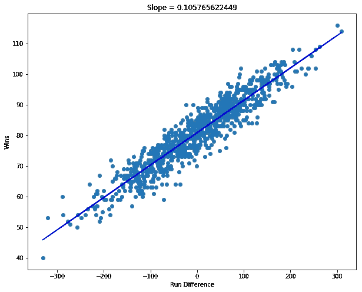
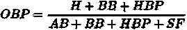
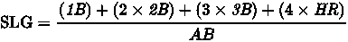
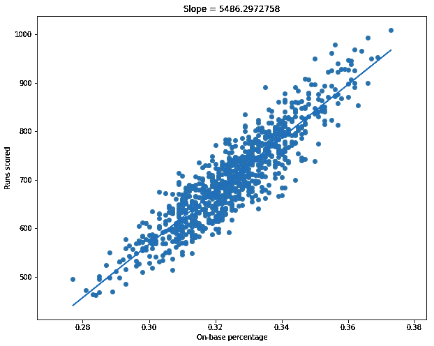
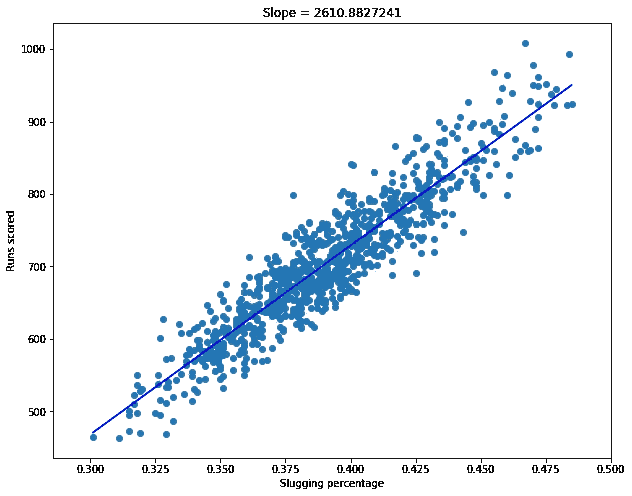
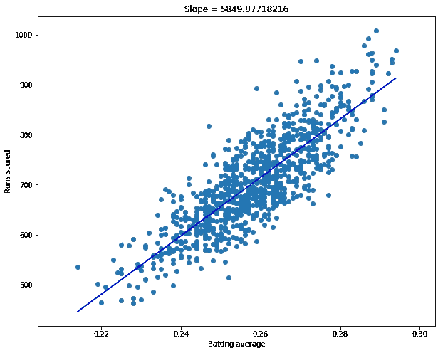
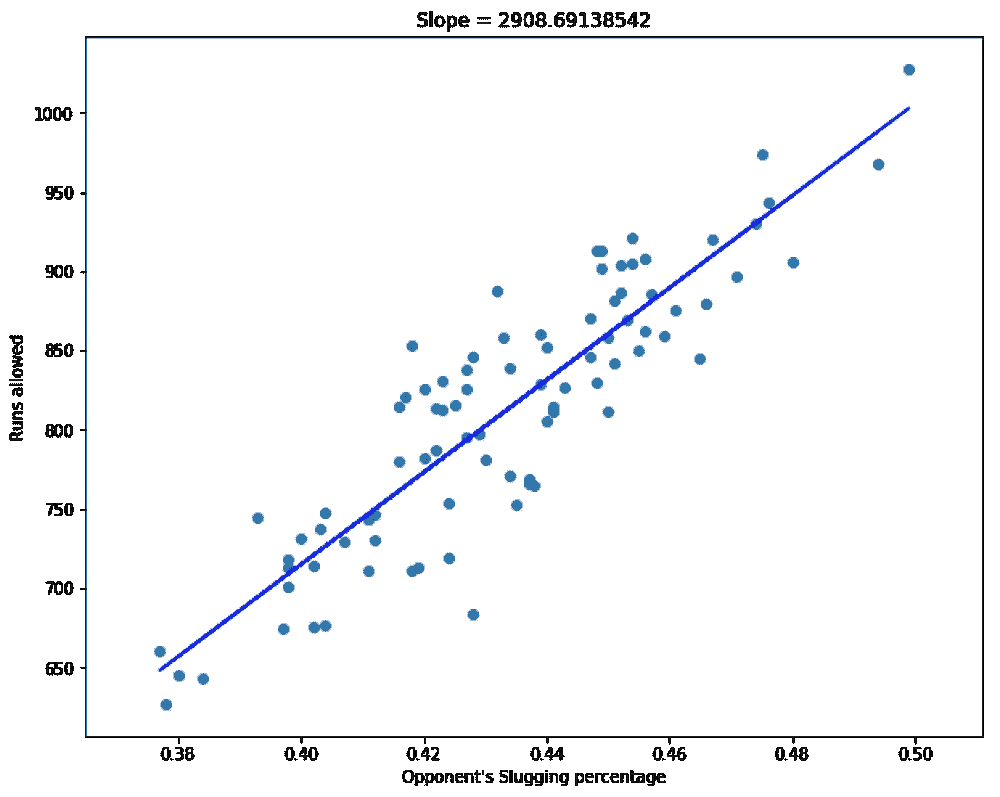
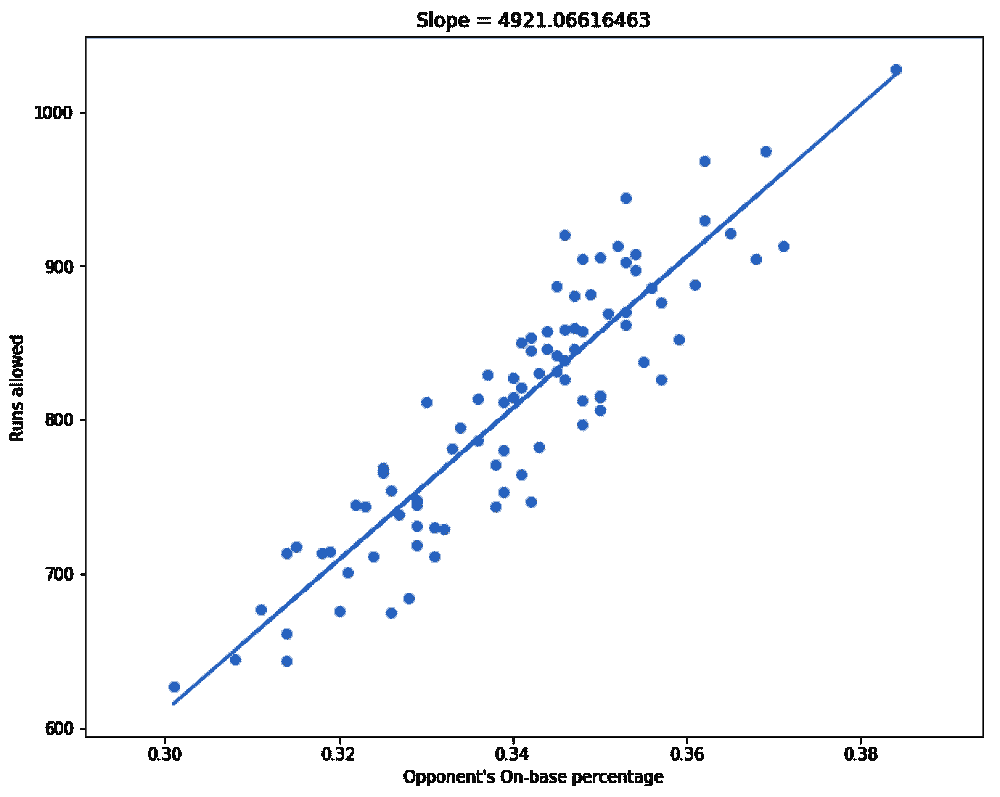

# 线性回归:钱球—第二部分

> 原文：<https://towardsdatascience.com/linear-regression-moneyball-part-2-175a9dc72e89?source=collection_archive---------3----------------------->

## 大众体育故事的统计案例研究


“The macro view of an old baseball on a wood surface” by [Joey Kyber](https://unsplash.com/@jtkyber1?utm_source=medium&utm_medium=referral) on [Unsplash](https://unsplash.com?utm_source=medium&utm_medium=referral)

> 这篇文章是线性回归的续集:金钱球-第一部分。如果你还没有检查，我强烈建议你这样做。

# 概述

在前一篇文章结束时，我们已经建立了 RD(运行差异)和 W(成功)之间的线性关系。



我们还发现，RD 和 w 之间有非常强的正相关，为 0.9385。在本文中，我们将继续研究数值变量之间的关系，并建立一些模型来预测奥克兰运动家队在 2002 年的表现。

# 公式

让我们再看一下数据。

```
df = pd.read_csv("baseball.csv")
df.head()
```


现在，让我们来看看计算一些对大多数人来说似乎晦涩难懂的数字项的公式。

**按基数百分比:**



Formula for calculating On-base Percentage. [Source](https://en.wikipedia.org/wiki/On-base_percentage)

点击量

b:以球(保送)为基础

HBP:投球命中

阿瑟:击球

科幻:牺牲苍蝇

**击发百分比:**



Formula for calculating Slugging percentage. [Source](https://en.wikipedia.org/wiki/Slugging_percentage)

1B，2B，3B:单打，双打，三连冠

HR:全垒打

阿瑟:击球

**击球率:**


Formula for calculating Batting average. [Source](https://en.wikipedia.org/wiki/Batting_average)

点击量

阿瑟:击球

# 探索性数据分析

我们可以看到，前面讨论的所有三个统计数据都以某种方式影响了球队得分的次数。我不会详细解释每个变量。你需要知道的是 OBP，SLG 和 AVG 是特定球队得分的有力指标。

让我们通过绘制这些变量与 RS(得分运行)之间的关系来验证这些假设:



Relationship between OBP, SLG,BA and RS respectively

在每个变量和得分之间有明显的线性关系。

```
**# Correlation between On-base percentage and runs scored.**print(np.corrcoef(moneyball.OBP,moneyball.RS))output:[[ 1\.          0.90490915]
 [ 0.90490915  1\.        ]]**# Correlation between Slugging percentage and runs scored.**print(np.corrcoef(moneyball.SLG,moneyball.RS))output:[[ 1\.          0.92638433]
 [ 0.92638433  1\.        ]]**# Correlation between batting average and runs scored.**print(np.corrcoef(moneyball.BA,moneyball.RS))output:[[ 1\.          0.83162475]
 [ 0.83162475  1\.        ]]
```

根据经验，0.7 以上的相关性被认为是强正相关。我们所有的变量都满足这条规则。

类似地，我们可以假设 OOBP(对手的 OBP)和 OSLG(对手的 SLG)与 RA(允许跑垒)有类似的关系。

在我们看到这些变量和 RA 之间的关系之前，我注意到在 OOBP 和 OSLG 列中有几个**缺失值**。为了画出正确的关系，我们必须去掉这几行观察数据。在以后的文章中，我会解释我们可以“估算”缺失数据的各种方法。

```
moneyballnew = moneyball.dropna()
```

我们将缩减的数据集存储到一个新的变量中。

现在让我们看看这些变量与 RA 之间的关系:



# Model 大楼

我们现在将建立回归模型，以预测得分、允许得分和获胜。

python 中的 [scikit-learn](http://scikit-learn.org/) 库在使用很少几行代码构建各种各样的机器学习模型方面非常强大。我们将利用这个库来建立我们的模型。

我们的第一个模型用于预测“得分”。我们的自变量是上垒率、击球率、击球率。

```
**# Extracting our variables from the dataframe.**
x = moneyball[['OBP','SLG','BA']].values
y = moneyball[['RS']].values**# Calling our model object.**
RS_model = LinearRegression()**# Fitting the model.**
RS_model.fit(x,y) **# Printing model intercept and coefficients.**
print(RS_model.intercept_)
print(RS_model.coef_)Output:[-788.45704708]
[[ 2917.42140821  1637.92766577  -368.96606009]]
```

因此，我们的模型具有以下形式:

*RS =-788.46+2917.42×(OBP)+1637.93×(SLG)-368.97×(巴)*

在这一点上，我们注意到一些奇怪的事情。我们的模型有一个负系数的变量，也就是击球率。这是反直觉的，因为一个击球率高的球队应该有更多的得分。这种情况代表了一种被称为 [**多重共线性**](https://en.wikipedia.org/wiki/Multicollinearity) 的现象，其导致多重线性回归模型中的差异。

为了避免多重共线性，我们必须添加一个 [**交互变量**](https://en.wikipedia.org/wiki/Interaction_(statistics)) 或者删除导致差异的变量。为了简单起见，让我们把 BA 从模型中去掉。

```
**# Extracting our variables from the dataframe.**
x = moneyball[['OBP','SLG']].values
y = moneyball[['RS']].values**# Calling our model object.**
RS_model = LinearRegression()**# Fitting the model.**
RS_model.fit(x,y)**# Printing model intercept and coefficients.**
print(model.intercept_)
print(model.coef_)Output:[-804.62706106]
[[ 2737.76802227  1584.90860546]]
```

我们的改良模型是:

*RS =-804.63+2737.77×(OBP)+1584.91×(SLG)*

类似地，我们使用对手的上垒百分比和对手的击球百分比作为独立变量来建立“允许跑垒”的模型:

```
**# Extracting our variables from the dataframe.**
x = moneyballnew[['OOBP','OSLG']].values
y = moneyballnew[['RA']].values**# Calling our model object.**
RA_model = LinearRegression()**# Fitting the model.**
RA_model.fit(x,y)**# Printing model intercept and coefficients.**
print(RA_model.intercept_)
print(RA_model.coef_)Output:
[-837.37788861]
[[ 2913.59948582  1514.28595842]]
```

允许运行的型号:

*RA =-837.38+2913.60×(OOBP)+1514.29×(OSLG)*

最后，我们从运行差异中预测成功的模型:

```
**# Extracting our variables from the dataframe.**
x = moneyball[['RD']].values
y = moneyball[['W']].values**# Calling our model object.**
W_model = LinearRegression()**# Fitting the model.**
W_model.fit(x,y)**# Printing model intercept and coefficients.**
print(W_model.intercept_)
print(W_model.coef_)Output:[ 80.88137472]
[[ 0.10576562]]
```

成功的模式:

*W = 80.88 + 0.11 ×(RD)*

# 模型预测

以下是奥克兰运动家队 2001 年季后赛前的统计数据。

OBP: 0.339

比重:0.430

OOBP: 0.307

OSLG: 0.373

让我们将这些值代入上述模型以生成预测。

```
**# Prediction for runs scored.**
RS_model.predict([[0.339,0.430]])Output:
array([[ 804.98699884]])**# Predictions for runs allowed.**
RA_model.predict([[0.307,0.373]])Output:
array([[ 621.92581602]])
```

因此，我们的模型预测了以下情况:

805 卢比

RA 约 622

这意味着 RD = 183。

最后，我们将研发纳入我们的 wins 模型:

```
**# Prediction for wins.**
W_model.predict([[183]])Output:
array([[ 100.23648363]])
```

将我们的模型结果与实际结果和 De Podesta 的估计进行比较，我们得到:

很不寻常，不是吗？与现实相比，我们模型的预测实际上相当准确。

# 结论

最后，我们总结了线性回归应用于 Sabermetrics 的案例研究。需要注意的重要一点是，在这个案例研究中，我对我们的回归模型做了很多假设。在以后的帖子中，我将深入讨论回归假设以及如何避免违反它们。

我希望你们都喜欢这篇关于线性回归的分为两部分的博文。如果你喜欢我的内容，我将非常感谢鼓掌和关注。完整的代码可在这里[获得。](https://github.com/Sayar1106/Moneyball/blob/master/Moneyball.ipynb)

我期待着问题，评论，关注。下次见，伙计们。✌🏽

# 参考

1.  [http://www.espn.com/mlb/statistics](http://www.espn.com/mlb/statistics)
2.  [https://www.baseball-reference.com/](https://www.baseball-reference.com/)