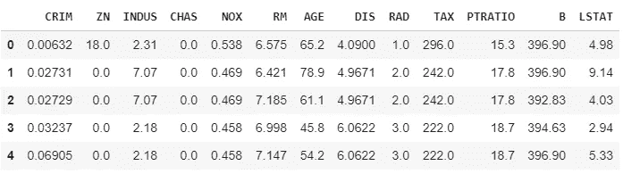
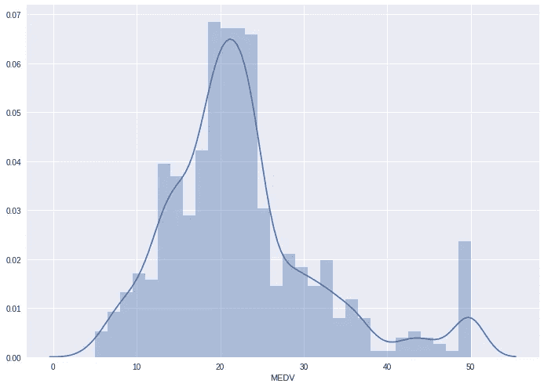
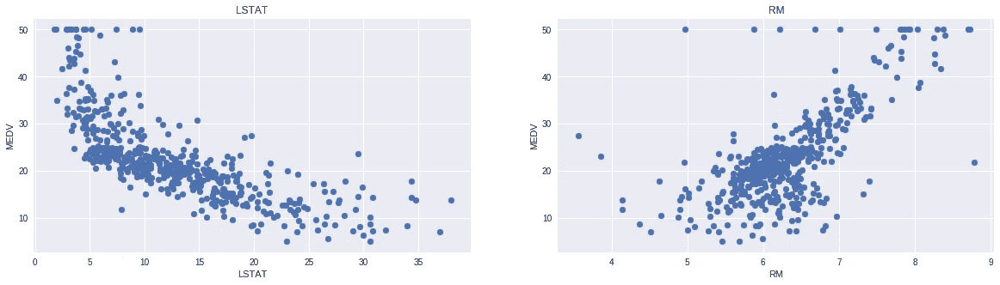

# 波士顿住房数据的线性回归

> 原文：<https://towardsdatascience.com/linear-regression-on-boston-housing-dataset-f409b7e4a155?source=collection_archive---------2----------------------->


Credits: [http://www.wbur.org/radioboston/2013/09/18/bostons-housing-challenge](http://www.wbur.org/radioboston/2013/09/18/bostons-housing-challenge)

在我之前的博客中，我介绍了线性回归和梯度下降的基础知识。为了获得动手操作的线性回归，我们将采用原始数据集并应用我们所学的概念。

我们将获取包含波士顿不同房屋信息的住房数据集。这些数据最初是 UCI 机器学习知识库的一部分，现在已经被删除。我们也可以从 scikit-learn 库中访问这些数据。该数据集中有 506 个样本和 13 个特征变量。目标是使用给定的特征来预测房屋的价格值。

所以让我们开始吧。

首先，我们将导入所需的库。

接下来，我们将从`scikit-learn`库中加载住房数据并理解它。

我们打印出`boston_dataset`的值来理解它包含的内容。`print(boston_dataset.keys())`慨然

```
dict_keys(['data', 'target', 'feature_names', 'DESCR'])
```

*   *数据*:包含各种房屋的信息
*   *目标*:房价
*   *特征名称*:特征的名称
*   *描述*:描述数据集

使用`boston_dataset.DESCR`了解更多功能，所有功能的描述如下:

```
**CRIM**: Per capita crime rate by town
**ZN**: Proportion of residential land zoned for lots over 25,000 sq. ft
**INDUS**: Proportion of non-retail business acres per town
**CHAS**: Charles River dummy variable (= 1 if tract bounds river; 0 otherwise)
**NOX**: Nitric oxide concentration (parts per 10 million)
**RM**: Average number of rooms per dwelling
**AGE**: Proportion of owner-occupied units built prior to 1940
**DIS**: Weighted distances to five Boston employment centers
**RAD**: Index of accessibility to radial highways
**TAX**: Full-value property tax rate per $10,000
**PTRATIO**: Pupil-teacher ratio by town
**B**: 1000(Bk — 0.63)², where Bk is the proportion of [people of African American descent] by town
**LSTAT**: Percentage of lower status of the population
**MEDV**: Median value of owner-occupied homes in $1000s
```

变量`MEDV`表示的房屋价格是我们的*目标变量，剩下的是 ***特征变量*** ，我们将基于这些变量来预测房屋的价值。*

*我们现在将使用`pd.DataFrame`将数据加载到 pandas 数据帧中。然后我们使用`head()`打印前 5 行数据*

**

*我们可以看到数据中缺少目标值`MEDV`。我们创建一个新的目标值列，并将其添加到 dataframe 中。*

## ***数据预处理***

*加载数据后，最好查看数据中是否有任何缺失值。我们使用`isnull()`计算每个特征的缺失值的数量*

*但是，该数据集中没有缺失值，如下所示。*

**

## ***探索性数据分析***

*探索性数据分析是训练模型前非常重要的一步。在本节中，我们将使用一些可视化工具来理解目标变量与其他特征之间的关系。*

*让我们先画出目标变量`MEDV`的分布。我们将使用`seaborn`库中的`distplot`函数。*

**

*我们看到`MEDV`的值呈正态分布，很少有异常值。*

*接下来，我们创建一个相关矩阵来度量变量之间的线性关系。可以通过使用 pandas 数据帧库中的`corr`函数来形成相关矩阵。我们将使用 seaborn 库中的`heatmap`函数来绘制相关矩阵。*

**

*相关系数范围从-1 到 1。如果该值接近 1，则意味着这两个变量之间有很强的正相关性。当它接近-1 时，变量具有很强的负相关性。*

## ***观察:***

*   *为了拟合线性回归模型，我们选择那些与我们的目标变量`MEDV`高度相关的特征。通过查看相关矩阵，我们可以看到`RM`与`MEDV` (0.7)有很强的正相关性，而 as `LSTAT`与`MEDV` (-0.74)有很强的负相关性。*
*   *为线性回归模型选择特征的重要一点是检查多重共线性。特征`RAD`、`TAX`具有 0.91 的相关性。这些特征对彼此之间有很强的相关性。我们不应该同时选择这两个特征来训练模型。查看这个以获得解释。具有-0.75 相关性的特征`DIS`和`AGE`也是如此。*

*基于以上观察我们将`RM`和`LSTAT`作为我们的特征。使用散点图，让我们看看这些特性如何随`MEDV`变化。*

**

## ***观察:***

*   *价格随着 RM 值的线性增加而增加。很少有异常值，数据似乎上限为 50。*
*   *随着物价的上涨，价格有下降的趋势。尽管它看起来并不完全是一条直线。*

## ***准备用于训练模型的数据***

*我们使用 numpy 库提供的`np.c_`来连接`LSTAT`和`RM`列。*

## ***将数据分成训练集和测试集***

*接下来，我们将数据分成训练集和测试集。我们用 80%的样本训练模型，用剩下的 20%进行测试。*我们这样做是为了评估模型在未知数据上的表现*。为了分割数据，我们使用 scikit-learn 库提供的`train_test_split`函数。最后，我们打印出训练集和测试集的大小，以验证拆分是否正确发生。*

```
*(404, 2) 
(102, 2)
(404,)
(102,)*
```

## ***训练和测试模型***

*我们使用 scikit-learn 的`LinearRegression`在训练集和测试集上训练我们的模型。*

## ***模型评估***

*我们将使用 RMSE 和 R2 分数来评估我们的模型。*

```
***The model performance for training set** 
-------------------------------------- 
RMSE is 5.6371293350711955 
R2 score is 0.6300745149331701 **The model performance for testing set** 
-------------------------------------- 
RMSE is 5.137400784702911
R2 score is 0.6628996975186952*
```

*这是一个好的开始。在接下来的博客中，我们将探讨提高模型性能的方法。*

*完整的 Jupyter 笔记本可以在[这里](https://github.com/animesh-agarwal/Machine-Learning-Datasets/blob/master/boston-housing/Linear_Regression.ipynb)找到。*

## ***结论***

*在这个故事中，我们对波士顿住房数据集应用了线性回归的概念。我建议也尝试其他数据集。*

*这里有几个可以查找数据的地方*

*   *[https://www.kaggle.com/datasets](https://www.kaggle.com/datasets)*
*   *[https://toolbox.google.com/datasetsearch](https://toolbox.google.com/datasetsearch)*
*   *[https://archive.ics.uci.edu/ml/datasets.html](https://archive.ics.uci.edu/ml/datasets.html)*

*感谢阅读！！*

*在本系列的下一部分，我们将讨论多项式回归。请继续关注这个空间。*