# 线性回归(第 1 部分):类型，例子，梯度下降的例子

> 原文：<https://towardsdatascience.com/linear-regression-part-1-types-examples-gradient-descent-example-2e8c22b05f61?source=collection_archive---------8----------------------->

5 分钟机器学习实现示例(第 3 部分)。用 python 实现线性回归中的机器学习模型。

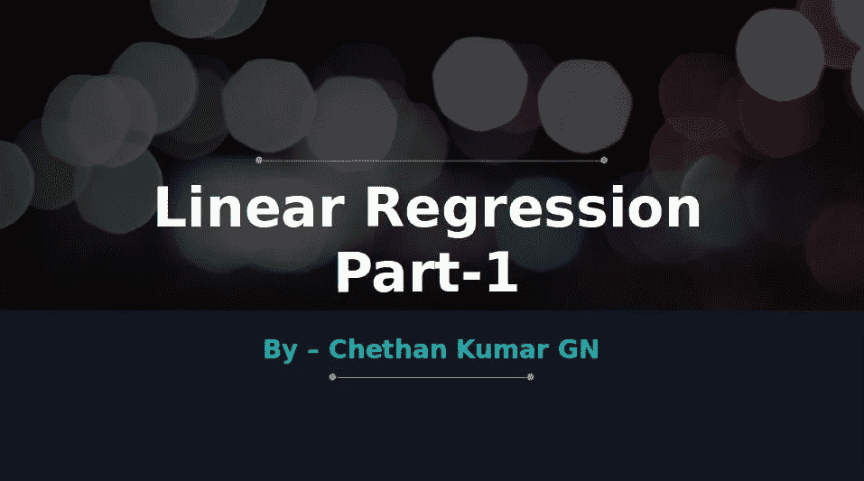

Linear Regression

> **先决条件:** [**机器学习类型及算法列表**](https://medium.com/@chethankumargn/machine-learning-types-and-algorithms-d8b79545a6ec)

***线性回归*** 是统计学和机器学习中最常见、约 200 年历史且最容易理解的一种。如前一篇文章所解释的，它属于预测建模。预测建模是这里的一种建模，对于给定的**输入(X)** 可能的**输出(Y)** 是基于先前的数据或值预测的。

> **类型**

1.  **简单线性回归:**以**一个*自变量*** 为特征。考虑一下 ***房子的价格*** 只基于一个领域，即地块的大小，那么这将是一个简单的线性回归。
2.  **多元线性回归:**以**多个*自变量*** 为特征。如果房子的价格不仅仅取决于地块面积的大小，还取决于经济，那么它就被认为是多元线性回归，这在大多数现实世界中是可行的。

> **方程式:**

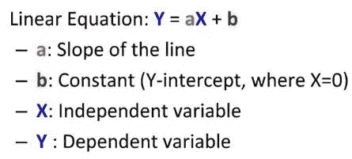

Y = a X+ b

这里的主要目的是找到**最佳拟合线**，该线**最小化误差**(点与线之间距离的平方和)。取点和线 之间的 ***距离，并对它们中的每一个进行 ***平方*** 以去除 ***负值*** ，然后对这些值求和，从而给出需要最小化的误差。***

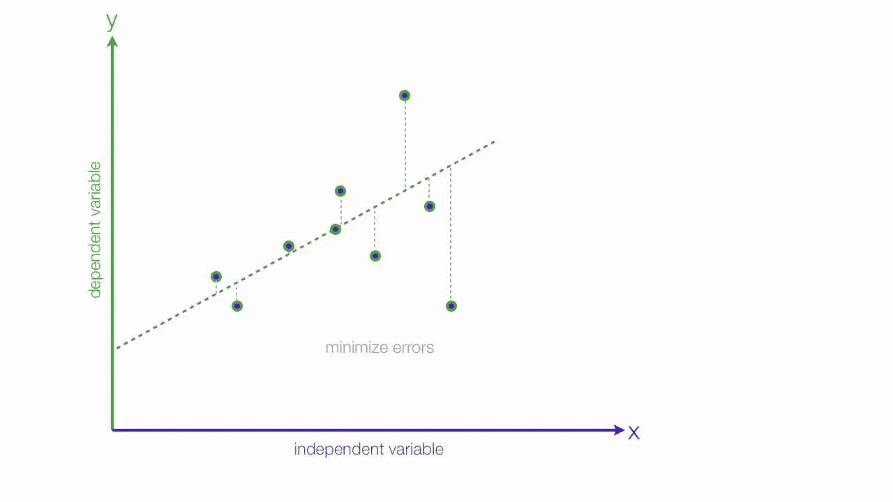

> 如何将误差降至最低？？

考虑下面的例子，其中绘制了三个点。

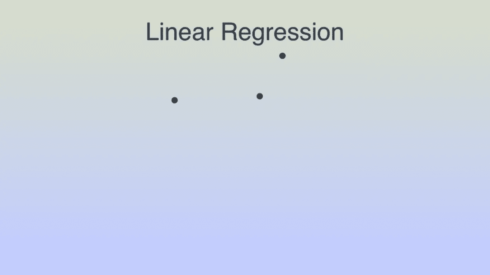

在我们需要最小化线和三个点之间的距离的地方画一条随机线

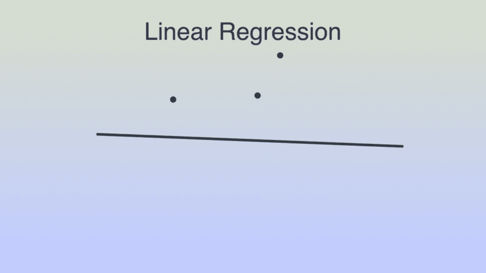

这里的误差是从点到红色线的距离。

错误的 ie。点和线之间的距离被总结并表示如下。

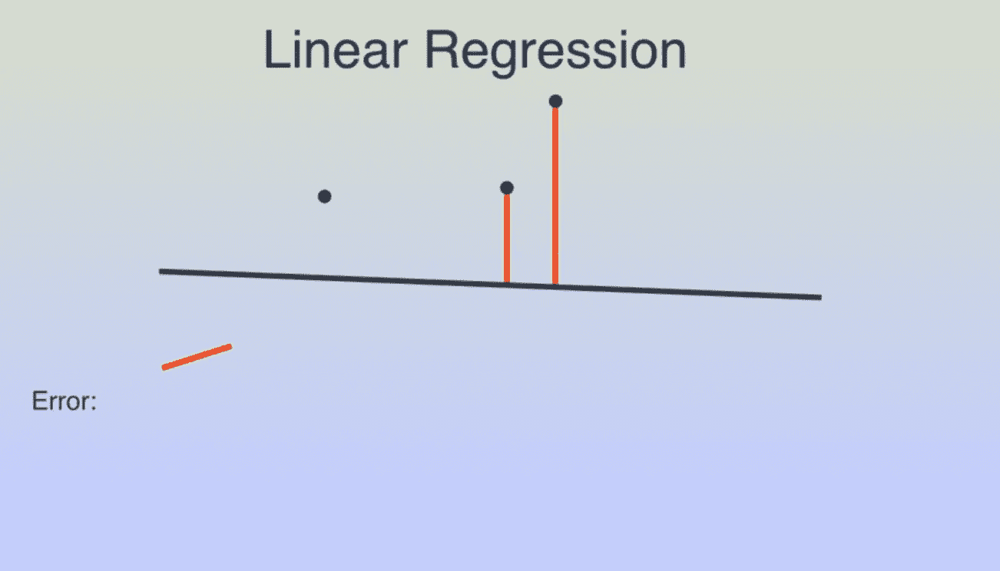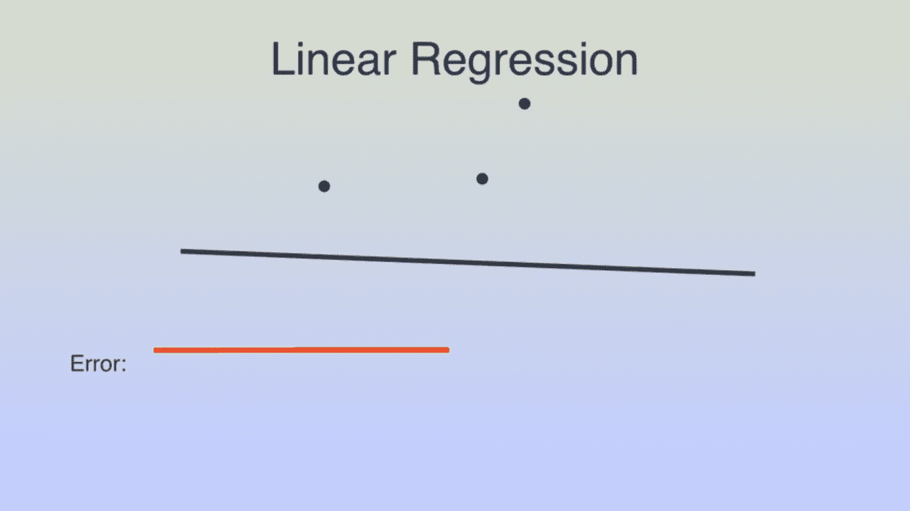

现在让我们把线向任何方向移动，画出误差。

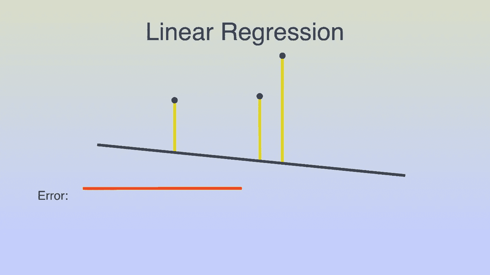

在这里，由于线已经远离点，误差增加，误差被累加，如下所示。

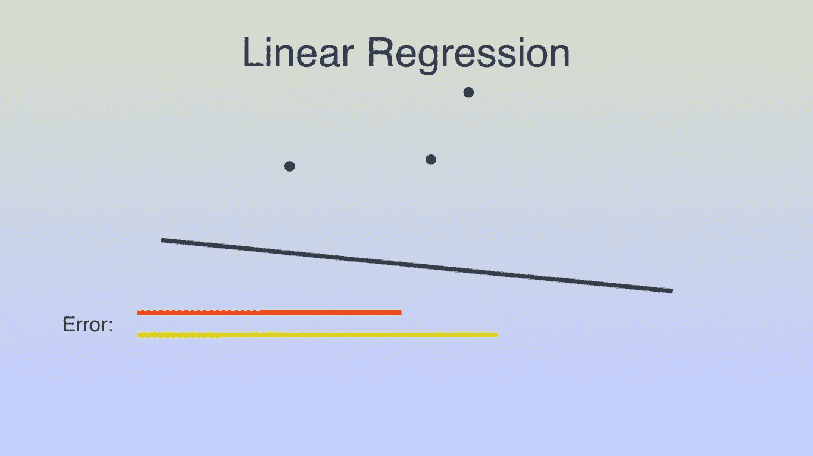

这里，线向相反的方向移动，因为之前误差增加了，结果如下。

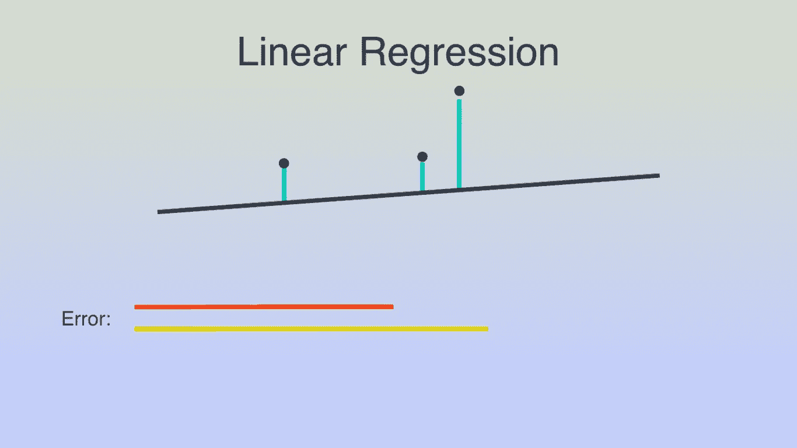

与以前的实例相比，这里的错误被最小化。

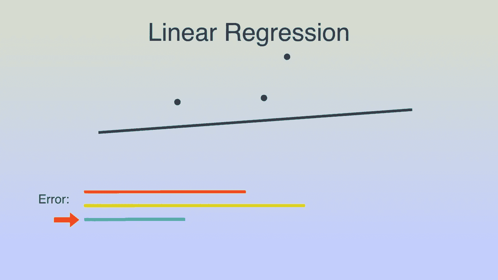

误差仍然可以被最小化，如下所示。

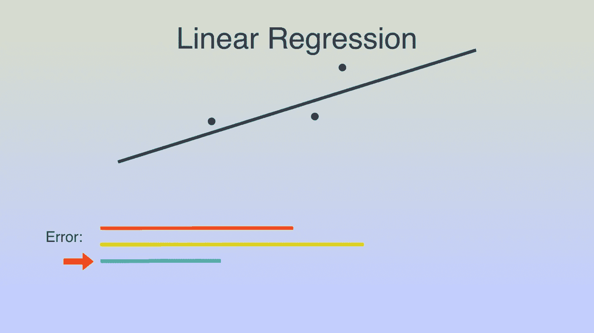

但是由于它导致负值，我们实现梯度下降(最小二乘法),其中误差值被平方，这仅导致可以精确测量误差的正值(这样做是因为距离不能以负值测量)。

> **数学上**

1.  红线误差:3 + 4 + 6 = **10** 平方— — 4 + 9 + 25 = **38**
2.  黄线误差:4 + 5 + 7= **13** 平方— 9 + 16 + 36 = **61**
3.  蓝线误差:1 + 2 + 4 = **7** 平方— — 1 + 4 +16 = **21**
4.  最小误差:1–3+1 =**-1**这是没有意义的，但平方后得到 1 + 9 + 1 = 11

所以这里 61 > 38 > 21 > 11 是有意义的，而不是处理难以想象和处理的负距离。

因此，与其他实例相比，梯度下降(最小二乘法)是找到最小误差的最佳方法。

***在下一篇文章中，我举了一个现实世界的例子，并实现了即将到来的线性回归(机器学习),敬请关注！！！！***

> **更多参考文献:**

1.  [***人工智能是真实存在的还是只是这十年的炒作？？***](https://becominghuman.ai/artificial-intelligence-real-or-is-it-just-an-hype-of-this-decade-fear-what-learn-history-go-game-ac4476badf1b)
2.  [***人工智能:定义、类型、实例、技术***](https://medium.com/@chethankumargn/artificial-intelligence-definition-types-examples-technologies-962ea75c7b9b)
3.  [***人工智能 vs 机器学习***](https://medium.com/@chethankumargn/artificial-intelligence-vs-machine-learning-3c599637ecdd)
4.  [***为什么机器学习能实现人工智能？***](https://medium.com/@chethankumargn/why-machine-learning-for-achieving-artificial-intelligence-the-need-for-machine-learning-c69667b4a51f)
5.  *[***机器学习类型和算法***](https://becominghuman.ai/machine-learning-types-and-algorithms-d8b79545a6ec)*

> *接下来我有 ***线性回归(第二部分)*** 接下来一定要关注我的 [**中**](https://medium.com/@chethankumargn) **，**[**LinkedIn**](http://www.linkedin.com/in/chethankumargn)**，**[**Twitter**](https://twitter.com/chethan1gn)**，**[**insta gram**](https://www.instagram.com/data_science_by_chethan/)**获取更多更新。如果你喜欢这篇文章，请鼓掌并分享它。***

***在这里加入我们的 [**WhatsApp**](https://chat.whatsapp.com/LLwBIyYYcABEV31ZFI7QR3) 社区。***