# 简化线性回归-普通最小二乘法与梯度下降法

> 原文：<https://towardsdatascience.com/linear-regression-simplified-ordinary-least-square-vs-gradient-descent-48145de2cf76?source=collection_archive---------2----------------------->

**什么是线性回归？** 线性回归是一种寻找自变量和因变量之间关系的统计方法。让我们用一个简单的数据集来解释线性回归模型。

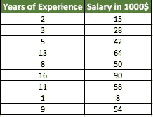

Table 1 : Sample Salary Data

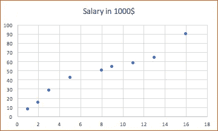

Figure 1: Scatter Plot Diagram

**为什么我们称它们为自变量和因变量？**

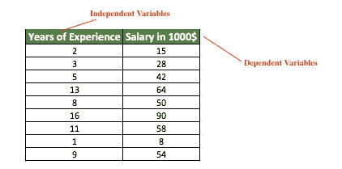

Table 2: Sample dataset with independent & dependent variables hints

如果以我们的示例数据集为例,“工作经验年数”列是自变量,“年薪 1000 美元”列的值是因变量。我们的自变量是独立的，因为我们不能用数学方法确定经验的年限。但是，我们可以根据多年的经验来确定/预测工资列的值(因变量)。如果你看数据，依赖列值(薪水在 1000 美元)是根据多年的经验增加/减少的。

**总平方和(SST):**SST 是一个样本的平均值与该样本中各个值之间所有平方差的总和。它在数学上用公式表示。

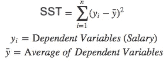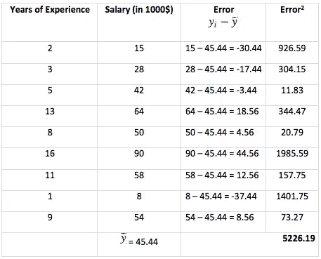

Table: SST Calculation

SST 输出的平方和为 *5226.19* 。为了对线截距进行最佳拟合，我们需要应用线性回归模型来尽可能减小 SSE 值。为了确定斜率截距，我们使用以下等式

**y = m*x*b，**

*   “m”是斜率
*   x’→独立变量
*   b '是截距

我们将使用普通的最小二乘法来寻找最佳线截距(b)斜率(m)

**普通最小二乘法(OLS)方法**

为了使用 OLS 方法，我们应用下面的公式来找到方程

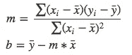

我们需要计算斜率‘m’和线截距‘b’。下面是计算这些值的简单表格。

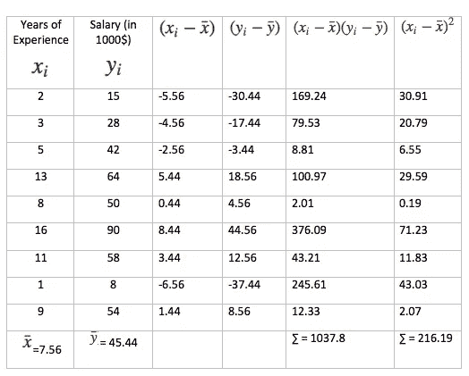

Table 4: OLS method calculations

m = 1037.8/216.19
m = 4.80
b = 45.44-4.80 * 7.56 = 9.15
因此，**y = m*x+b→4.80 x+9.15
y = 4.80 x+9.15***

让我们将 OLS 方法的结果与 MS-Excel 进行比较。是的，我们可以在 Microsoft Excel 中测试我们的线性回归最佳直线拟合。

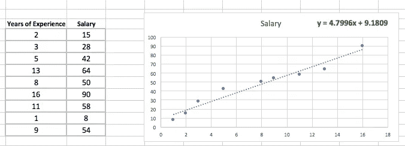

***Figure 2: Linear Regression using MS-Excel***

精彩！我们的 OLS 方法与 MS-Excel 输出的“y”非常相似。

*   我们的 OLS 方法输出→***y = 4.80 x+9.15***
*   MS-Excel 线性调节器。输出***→y = 4.79 x+9.18***

让我们通过使用我们的输出方程再次计算 SSE。

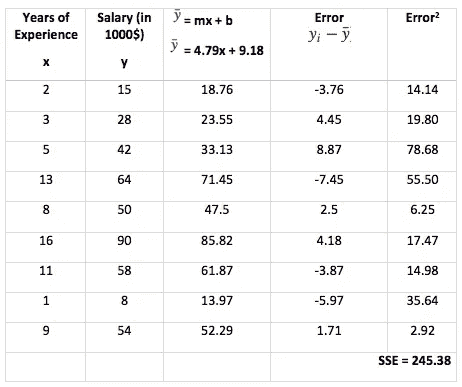

Table 5: SSE calculations again after OLS method implementation

现在，误差平方和从 5226.19 显著降低到 245.38。

普通的最小二乘法看起来简单，计算容易。但是，这种 OLS 方法既适用于单自变量和单因变量的单变量数据集，也适用于多变量数据集。多变量数据集包含单个自变量集和多个因变量集，需要我们使用一种叫做“梯度下降”的机器学习算法。

**梯度下降算法**

梯度下降算法的主要目标是最小化成本函数。这是最大限度减少误差(实际值和预测值的差异)的最佳优化算法之一。

我们来表示假设 h，它是函数或者是一个学习算法。

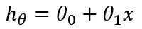

目标类似于上面的操作，我们在斜率“m”中找出截距线“y”的最佳拟合。同样使用梯度下降算法，我们将通过应用θ0 和θ1 的各种参数来计算出最小成本函数，并查看斜率截距，直到它达到收敛。

在一个真实世界的例子中，找到一个最佳方向走下坡路是相似的。

Figure 3: Gradient Descent 3D diagram. Source: [Coursera](https://www.coursera.org/learn/machine-learning/lecture/8SpIM/gradient-descent) — Andrew Ng

我们向趴下的方向迈一步。从每一步开始，你都要再次观察方向，以便更快地下山和更快地下山。在该算法中使用类似的方法来最小化成本函数。

我们可以使用成本函数来衡量假设函数的准确性，公式如下

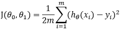

***梯度下降为线性回归***

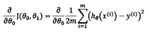

为什么我们在方程中使用偏导数？偏导数表示作为变量变化的函数的变化率。在我们的例子中，我们改变θ0 和θ1 的值，并确定变化率。为了将变化率值应用于θ0 和θ1，下面是用于θ0 和θ1 的等式，以将其应用于每个时期。

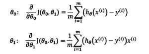

要找到最佳最小值，请重复上述步骤，对θ0 和θ1 应用不同的值。换句话说，重复步骤直到收敛。

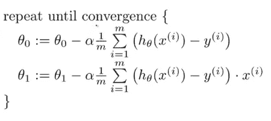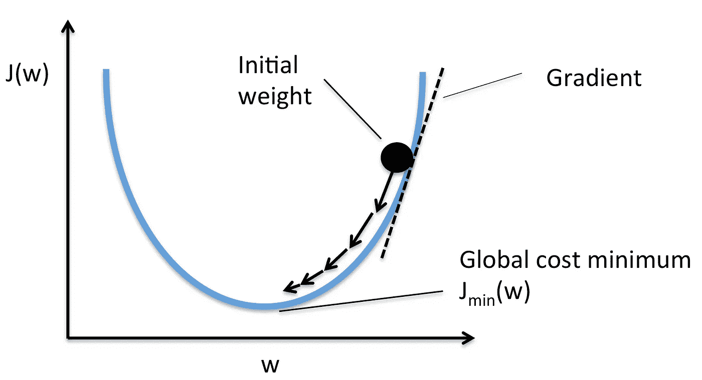

Figure 4: Gradient Descent for linear regression. Source: [http://sebastianraschka.com/](http://sebastianraschka.com/) — Python Machine Learning, 2nd Edition

*   其中，α(a)是学习速率/下坡需要多大的步长。

**梯度下降算法的类型**

有三种梯度下降算法:

1.批次梯度下降
2。随机梯度下降
3。小批量梯度下降

**批量梯度下降**

*   在批量梯度下降中，为了计算成本函数的梯度，我们需要对每个步骤的所有训练样本求和
*   如果我们有 3 百万个样本(m 个训练样本)，那么梯度下降算法应该对每个时期的 3 百万个样本求和。要移动一步，我们要用 300 万次来计算每一步！
*   批量梯度下降不太适合大型数据集
*   下面是批量梯度下降算法的 python 代码实现。

**随机梯度下降(SGD)**

*   在随机梯度下降中，我们在每次迭代中使用一个示例或一个训练样本，而不是使用整个数据集来对每个步骤求和
*   SGD 广泛用于大型数据集训练，计算速度更快，并且可以并行训练
*   在计算之前，需要随机打乱训练样本
*   下面是 SGD 的 Python 代码实现

**小批量梯度下降**

*   它类似于 SGD，它在每次迭代中使用 ***n*** 个样本，而不是 1 个。

**概要:**

在总结中，对以下主题进行了详细解释。

*   线性回归的自变量和因变量
*   普通最小二乘法(OLS)和误差平方和(SSE)详细信息
*   线性回归模型的梯度下降及梯度下降算法的类型。

参考:

*   [https://www . coursera . org/learn/machine-learning/lecture/rktp 3/cost-function](https://www.coursera.org/learn/machine-learning/lecture/rkTp3/cost-function)
*   [https://github . com/rasbt/python-machine-learning-book-2nd-edition](https://github.com/rasbt/python-machine-learning-book-2nd-edition)