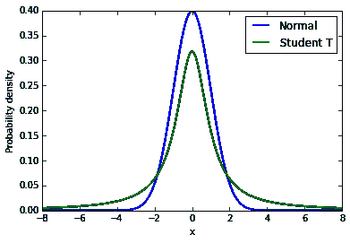

# 线性回归烂透了。

> 原文：<https://towardsdatascience.com/linear-regression-sucks-27a5215e50c0?source=collection_archive---------3----------------------->

线性回归。这是有史以来第一种被深入研究的回归分析，是任何监督学习课程的基础，是…你明白了吧。很糟糕。

在现实世界中，线性回归(GLS)表现不佳有多种原因:

*   **对异常值和质量差的数据很敏感**—在现实世界中，数据经常受到异常值和质量差的数据的污染。如果异常值相对于非异常值数据点的数量多于几个，那么线性回归模型将偏离真正的基本关系。
*   **它要求所有变量都是多元正态的**(单变量高斯到更高维的推广)—使用非线性变换将非正态变量变换为正态变量(例如，通常对数变换可以解决这个问题)可能会引入多重共线性效应。
*   **它假设变量之间没有(或很少)多重共线性**(即变量相互独立)——这使得模型极其不稳定。虽然测试和删除很简单，但这可能会很痛苦。
*   **它假设了 homoscedassity**(希腊语: *homo* “相同” *skedasis* “分散”)——也就是说，误差项的标准差是恒定的。如果线性回归是蓝色的(最佳线性无偏估计量)，它们还必须是不相关的，并且具有零均值
*   **它要求我们的因变量和预测变量之间的关系是线性的**——嗯，这是它的名字(我仍然认为值得一提，尽管这篇文章是关于线性估计量的)。

作为一个典型的经验法则，使用参数方法，如线性回归，当你的数据是高质量的，这样的方法会更有效。非参数方法(不假设数据的某种潜在分布)在交换中使用数据的效率较低，无法消除某种类型的假设。

但是这些非参数线性方法是什么呢？这里有几个我最喜欢的。

**泰尔森估计器**

Theil-Sen 估计量可以有效地计算，并且对异常值不敏感。即使数据是正态分布的并且数据是高质量的(即不存在异常值)，它仍然比最小二乘回归有竞争力。低效率的问题(它以 O(n)运行)，但是使用诸如随机采样或者甚至一些确定性方法的方法，这可以减少到 O(n log n)。此外…这几乎不是一个深度卷积神经网络，你不会用这些简单的方法进行大量的计算。

从概念上讲，这非常简单:计算因变量和自变量之间所有组合的所有斜率值的中值，由此斜率可以通过使用(*yj*-*易*)/(*XJ*-*Xi)*来确定。

**最小修剪正方形**

最小修整平方是一种稳健的回归方法(一种旨在规避某些回归模型的一些缺点的回归形式)，与 Theil-Sen 和即将推出的 MM 估计器一样，它对异常值的影响不敏感。

LTS 不是像标准最小二乘法那样最小化所有 n 个点的残差平方和，而是最小化一个 k

Theil Sen, it’s a fairly inefficient method.

**MM 估计值**

1973 年，Peter J. Huber 引入了一种称为 M-估计(M 代表“最大似然型”)的回归方法，该方法对响应中的异常值稳健，但对解释变量不稳健，由于显而易见的原因，该方法并不理想。然而，它非常有效。

然后是 S-估计(S 代表“比例”)技术，其思想是找到一个平面，使残差比例的稳健估计最小化。它对异常值和杠杆点有很强的抵抗力，但是对于实际应用来说效率太低。

最后，像一个无畏的骑士骑着种马投入战斗一样，MM 估计出现了，它结合了 S 估计的稳健性和 M 估计的效率。它的工作原理是找到一个稳健的 S 估计，使残差标度的 M 估计最小化，它保持不变，同时找到参数的接近 M 估计。

少数几篇论文将 MM 估计量与最小修整平方和 OLS 进行了比较，MM 估计量是其中的首选。

**贝叶斯稳健回归**

Normal vs Student-T distributions

将正态分布替换为具有大约 5 个自由度的重尾 t 分布(但要进行测试和比较)在各种实际情况下都能很好地工作。**贝叶斯稳健回归**依赖于这样的分布。t 分布的尾部有更多的“肉”,这意味着我们在那里采样的概率比在正态分布的相同位置采样的概率更高。异常值对我们的估计影响较小，因为似然函数假设异常值更有可能出现。

其原因是因为高相关性将使设计矩阵(您的数据)与其自身一起转置(计算估计量所需的步骤)奇异，因此无法求逆，因为行列式为零，所以不存在估计量。即使它几乎是奇异的，也很可能是计算不稳定的。

注意，如果你考虑异方差，那么线性回归往往是最好的结果…我猜它实际上并不总是很糟糕。

[http://iacmc.zu.edu.jo/ar/images/stories/IACMC2016/39.pdf](http://iacmc.zu.edu.jo/ar/images/stories/IACMC2016/39.pdf)