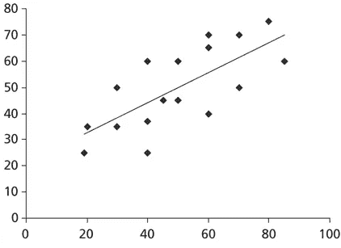
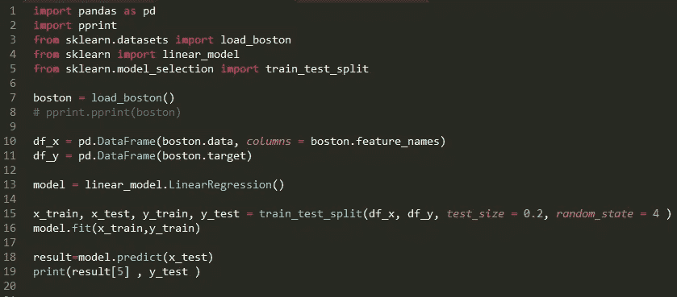
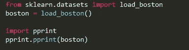
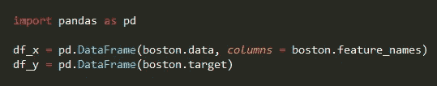
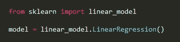
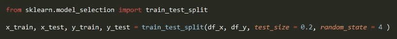
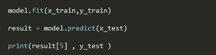
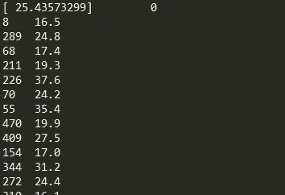

# 线性回归:更简单的方法

> 原文：<https://towardsdatascience.com/linear-regression-the-easier-way-6f941aa471ea?source=collection_archive---------0----------------------->

线性回归是神奇的机器学习世界中最棒的入门途径！也是最简单易学的算法。

我将更多地关注代码，而不是理论，因为代码更有趣:)但只是为了激发你大脑中静止的线性回归神经元。

线性回归:这是一种寻找具有“最佳拟合**线**”的模式的方法(因此，“线性”懂了吗？)在你的数据里。

看起来像这样(对于任何 x 或 y 轴)

**Fig: Linear Regression Example**

在本例中，我们将使用“load_boston”数据集，即 scikit learn 提供的波士顿房价数据集。

完整代码:)

Fig: Linear Regression with sklearn (Boston Housing dataset)

代码洞察:

上述代码分为 5 个步骤..

1.  **加载**和**预先打印**数据集。

Fig: Importing the Dataset

**从** sklearn.datasets **导入** load_boston

**load = load_boston()**

上面的第一行从*数据集*集合中导入 *load_boston* 数据集，该集合存在于 *sklearn* 库中。

第二行只是将 *load_boston* 放入 *load* 变量中以备后用。很简单…

**导入** pprint

***【pprint . pprint(波士顿)***

导入 *preetprint* 库，它用来使我们的输出看起来简洁易懂，然后我们就可以简单地打印它了。

注意:-当我们预测时，没有必要使用最后两行 preety 打印。因为您不需要再次打印数据文件，所以此属性打印仅用于您理解数据集文件的目的。

2.创建**数据帧**。

Fig: Creating two (DataFrame) array of data

在这里，我们将使用*熊猫*库*创建两个*数据帧*。Dataframe* 只是一个用来制作数据集或数组的花哨词。 *df_x* 包含具有*列= boston 的房屋的数据或特征。features_names* 也是出现在数据集中的一个数组，以便更清楚地理解， *df_y* 分别包含目标价格。

3.选择**模型**(即**线性回归**)

Fig: Selecting LinearRegression() model

虽然很简单，但我们从 sklearn 库中导入了 *LinearRegression()* 模型，并将该模型赋予变量 *model* ，以便在代码中进一步使用。

4.分裂**测试**和**用**随机性训练**数据集。**

Fig: Train and Test Splitting

这里，我们使用来自 sklearn 库的 *train_test_split* 。上面代码中的这个函数需要四个参数 *data* DataFrame、 *target* DataFrame、test_size、random_state(只是为了混洗数据)。

注意:在上面的行中，由于 test_size =0.2，train_size 自动给定为 0.8，因此，test_size + train_size = 0.2+0.8 = 1

5.**列车**和**预测**。

Fig: Train and predict the dataset

在上面的代码中， *fit (aka TRAINING )* 函数采用两个参数 *x_train，y_train 并用给定的数据集训练模型。*

接下来，我们将使用选择的*模型*(即 LinearRegression())从 *x_test* 数据集*预测*y _ test，并将预测值数组放入*结果*变量中。然后我们只是打印第五个预测值(即结果[5])和完整的 *y_test* 数据集。你应该从别的地方得到 **5** ,只要记住在列表中从 0 开始计数，而不是从 1 开始计数。

**结果**

Fig: Results

可以看到，第一个***【25.43573299】***是对数组中第五个元素的预测，即 ***70 — — 24.2，*** 相当接近。如果你想知道第一行随机数是什么，嗯…它是相对于随机选择的 y_test 数据集值的**序列号**(在第 4 步中)。

只是一个线性回归的 gif 来理解一下。

完整代码: [Github](https://github.com/Sagarsharma4244/Linear-Regression-Sklearn-Python)

在[中](https://medium.com/@sagarsharma4244)关注我，获取类似帖子。

在[脸书](https://www.facebook.com/profile.php?id=100003188718299)、[推特](https://twitter.com/SagarSharma4244)、[领英](https://www.linkedin.com/in/sagar-sharma-232a06148/)、[谷歌+](https://plus.google.com/u/0/+SAGARSHARMA4244) 上联系我

如果你有任何意见或问题，请写在评论里。

**鼓掌吧！分享一下！跟我来。**

乐意帮忙。荣誉……..

# 你会喜欢的以前的故事:

1.  [交叉验证代码可视化:有点意思](https://medium.com/towards-data-science/cross-validation-code-visualization-kind-of-fun-b9741baea1f8)

2. [DIY Arduino 无线键盘](https://medium.com/towards-data-science/linear-regression-the-easier-way-6f941aa471ea)

3.[激活函数解释:神经网络](https://medium.com/towards-data-science/activation-functions-neural-networks-1cbd9f8d91d6)

4.[感知器是什么鬼？](https://medium.com/towards-data-science/what-the-hell-is-perceptron-626217814f53)

5.[Tensor flow 中的“张量”是什么鬼？](https://hackernoon.com/what-the-hell-is-tensor-in-tensorflow-e40dbf0253ee)