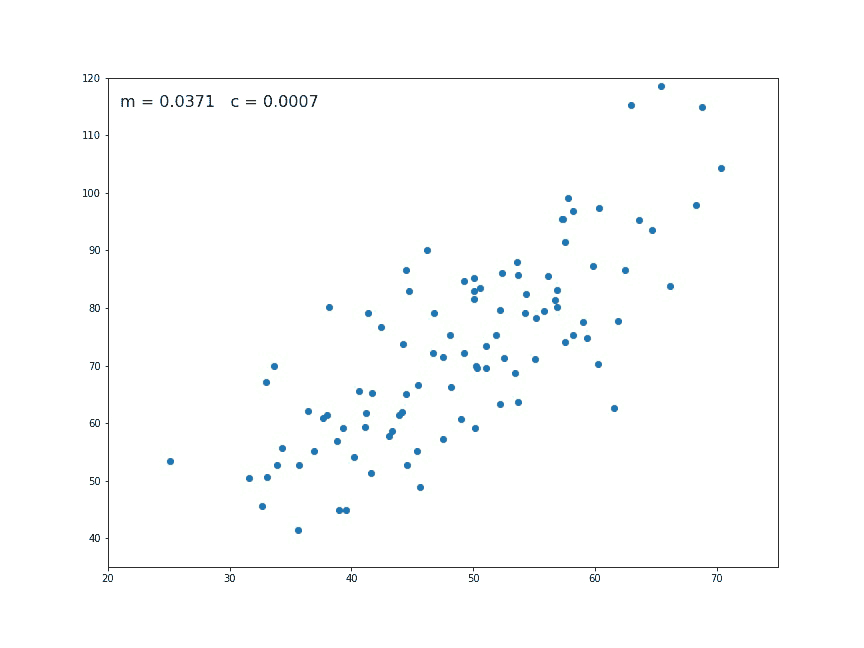
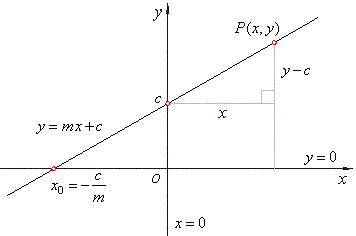
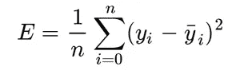
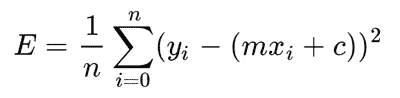
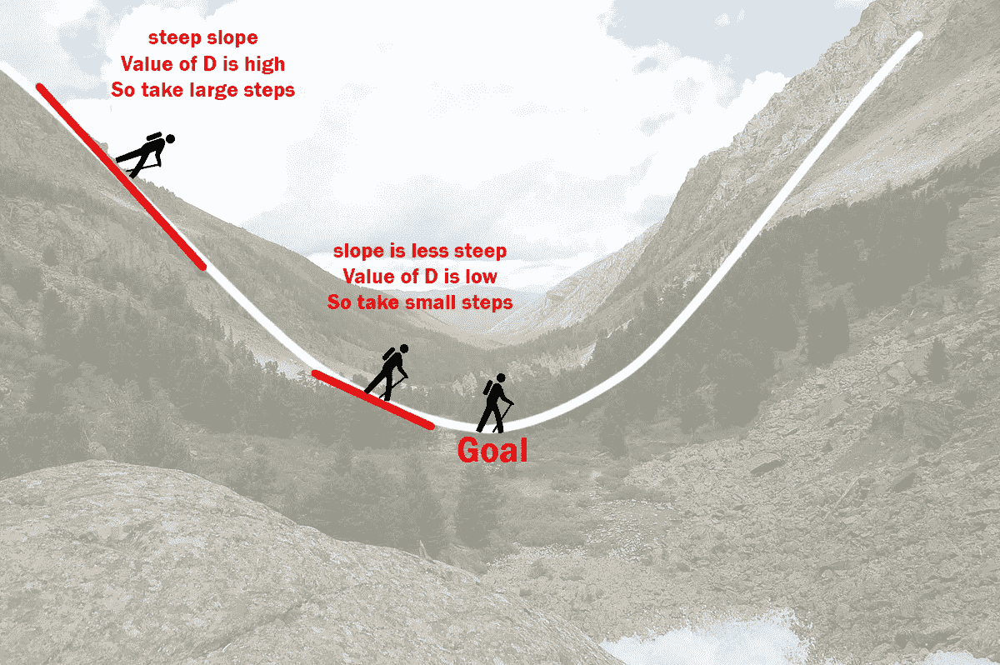
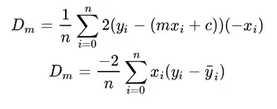
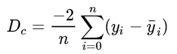
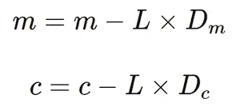
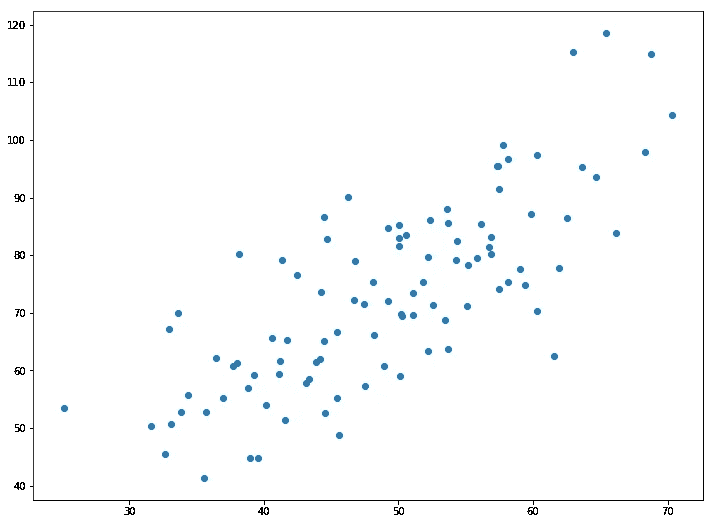
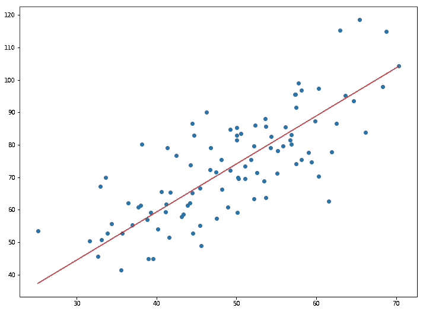

# 使用梯度下降的线性回归

> 原文：<https://towardsdatascience.com/linear-regression-using-gradient-descent-97a6c8700931?source=collection_archive---------0----------------------->

在本教程中，你可以学习梯度下降算法的工作原理，并从头开始用 python 实现它。首先我们看看什么是线性回归，然后我们定义损失函数。我们学习梯度下降算法如何工作，最后我们将在给定的数据集上实现它并进行预测。



The values of m and c are updated at each iteration to get the optimal solution

这是这段视频的书面版本。如果你喜欢，就看着它！

# 线性回归

在统计学中，线性回归是一种对因变量和一个或多个自变量之间的关系进行建模的线性方法。设 **X** 为自变量， **Y** 为因变量。我们将定义这两个变量之间的线性关系如下:



Source: [http://www.nabla.hr/SlopeInterceptLineEqu.gif](http://www.nabla.hr/SlopeInterceptLineEqu.gif)

这是你在高中学过的一条线的方程。 **m** 是直线的斜率，c**是 y 轴截距。今天，我们将使用这个等式用给定的数据集来训练我们的模型，并针对任何给定的 **X** 值来预测 **Y** 的值。我们今天的挑战是确定 **m** 和 **c** 的值，使得对应于这些值的线是最佳拟合线或给出最小误差。**

# 损失函数

损失就是我们预测的 **m** 和 **c** 的误差。我们的目标是最小化这一误差，以获得最准确的 m**和 c**值。
我们将使用均方差函数来计算损失。该功能有三个步骤:

1.  对于给定的 x，求实际 y 值和预测 y 值的差(y = mx + c)。
2.  平方这个差值。
3.  求 x 中每个值的平方的平均值。



Mean Squared Error Equation

这里 yᵢ是实际值，ȳᵢ是预测值。让我们用ȳᵢ:的值来代替



Substituting the value of ȳᵢ

所以我们求误差的平方，然后求平均值。因此得名均方误差。既然我们已经定义了损失函数，让我们进入有趣的部分——最小化它并找到 **m** 和 **c.**

# 梯度下降算法

梯度下降是一种寻找函数最小值的迭代优化算法。这个函数就是我们的损失函数。

**了解梯度下降**



Illustration of how the gradient descent algorithm works

想象一个山谷和一个没有方向感的人想要到达谷底。他走下斜坡，在斜坡陡的时候迈大步，在斜坡不那么陡的时候迈小步。他根据当前位置决定下一个位置，当他到达他的目标山谷底部时停下来。
让我们试着对 **m** 和 **c** 应用梯度下降，一步一步接近它；

1.  最初设 m = 0，c = 0。设 L 为我们的学习率。这控制了 **m** 的值随着每一步变化的程度。l 可以是一个小值，如 0.0001，以获得良好的精度。
2.  计算损失函数关于 m 的偏导数，将 x，y，m，c 的当前值代入其中，得到导数值 **D** 。



Derivative with respect to **m**

Dₘ是关于 **m** 的偏导数的值。类似地，让我们找到关于 **c** ，Dc 的偏导数:



Derivative with respect to **c**

3.现在，我们使用以下等式更新 **m** 和 **c** 的当前值:



4.我们重复这个过程，直到我们的损失函数是一个非常小的值或理想的 0(这意味着 0 误差或 100%的准确性)。我们现在剩下的 **m** 和 **c** 的值将是最佳值。

现在回到我们的类比， **m** 可以被认为是人的当前位置。 **D** 相当于斜坡的陡度 **L** 可以是他移动的速度。现在，我们使用上面的等式计算出的新值 m 将是他的下一个位置，而 L×D 将是他将要走的步数。坡度越陡( **D** 越大)，他的步幅就越大，坡度越缓( **D** 越小)，他的步幅就越小。最后，他到达了谷底，这相当于我们的损失= 0。
现在有了 m**m**和 c**c**的最佳值，我们的模型就可以进行预测了！

# 实施模型

现在让我们把上面的一切都转换成代码，看看我们的模型在运行！



```
1.4796491688889395 0.10148121494753726
```



梯度下降是机器学习中最简单也是最广泛使用的算法之一，主要是因为它可以应用于任何函数来优化它。学习它是掌握机器学习的基础。

*在这里找到数据集和代码:*[https://github . com/chasing infinity/ml-from-scratch/tree/master/02% 20 linear % 20 regression % 20 using % 20 gradient % 20 descending](https://github.com/chasinginfinity/ml-from-scratch/tree/master/02%20Linear%20Regression%20using%20Gradient%20Descent)

> 有问题吗？需要帮助吗？联系我！

【adarsh1021@gmail.com】电子邮件:T4

*领英:*[*https://www.linkedin.com/in/adarsh-menon-739573146/*](https://www.linkedin.com/in/adarsh-menon-739573146/)

*推特:*[*https://twitter.com/adarsh_menon_*](https://twitter.com/adarsh_menon_)

*insta gram:*[【https://www.instagram.com/adarsh_menon_/】T21](https://www.instagram.com/adarsh_menon_/)

*参考文献:*

[](https://machinelearningmastery.com/gradient-descent-for-machine-learning/) [## 机器学习的梯度下降法

### 优化是机器学习的一大部分。几乎每个机器学习算法都有一个优化算法…

machinelearningmastery.com](https://machinelearningmastery.com/gradient-descent-for-machine-learning/) [](/gradient-descent-a-beginners-guide-fa0b5d0a1db8) [## 梯度下降——初学者指南

### 简介:

towardsdatascience.com](/gradient-descent-a-beginners-guide-fa0b5d0a1db8)