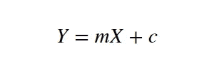
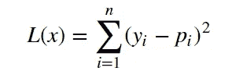
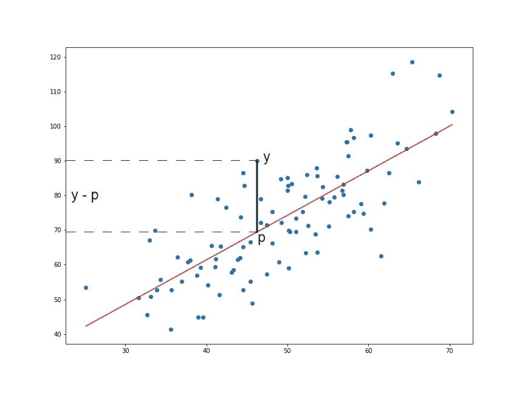
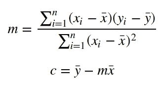
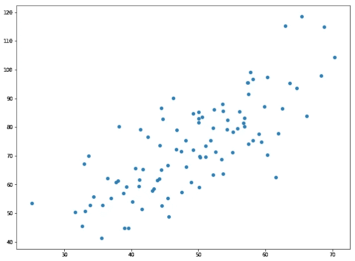
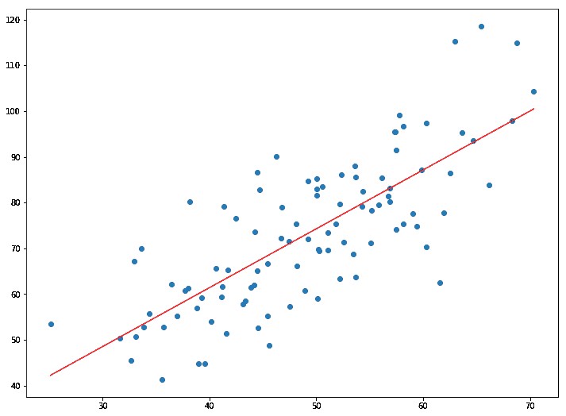

# 使用最小二乘法的线性回归

> 原文：<https://towardsdatascience.com/linear-regression-using-least-squares-a4c3456e8570?source=collection_archive---------0----------------------->

线性回归是最简单的机器学习形式。在这篇文章中，我们将看到线性回归是如何工作的，并从头开始用 Python 实现它。这是上面视频的文字版。如果你喜欢的话，就看着吧。


# 线性回归

在统计学中，线性回归是一种对因变量和一个或多个自变量之间的关系进行建模的线性方法。在一个独立变量的情况下，它被称为简单线性回归。对于一个以上的独立变量，这个过程称为多元线性回归。我们将在本教程中处理简单的线性回归。
设 **X** 为自变量 **Y** 为因变量。我们将定义这两个变量之间的线性关系如下:



这是你在高中学过的一条线的方程。 **m** 是直线的斜率， **c** 是 y 轴截距。今天，我们将使用这个等式用给定的数据集来训练我们的模型，并针对任何给定的 **X** 值来预测 **Y** 的值。

我们今天的挑战是确定 **m** 和 **c** 的值，它给出了给定数据集的最小误差。我们将通过使用**最小二乘法**来实现这一点。

# 查找错误

因此，为了最小化误差，我们首先需要一种计算误差的方法。机器学习中的**损失函数**仅仅是预测值与实际值有多大差异的度量。
今天我们将使用**二次损失函数**来计算我们模型中的损失或误差。它可以定义为:



我们对它求平方是因为，对于回归线**以下的点，y-p**将为负，我们不希望总误差为负值。

# 最小二乘法

现在我们已经确定了损失函数，剩下唯一要做的就是最小化它。这是通过找到 **L** 的偏导数，使其等于 0，然后找到 **m** 和 **c** 的表达式来实现的。在我们完成数学计算后，我们只剩下这些等式:



这里，x̅是输入 **X** 中所有值的平均值，而ȳ是期望输出 **Y** 中所有值的平均值。这是最小二乘法。现在我们将在 python 中实现这个并进行预测。

# 实施模型



```
1.287357370010931 9.908606190326509
```



不会有太多的准确性，因为我们只是简单地取一条直线，并迫使它以最好的方式适应给定的数据。但是你可以用它来做简单的预测或者了解真实值的大小/范围。对于机器学习的初学者来说，这也是很好的第一步。

*在这里找到数据集和代码:*[https://github . com/chasing infinity/ml-from-scratch/tree/master/01% 20 linear % 20 regression % 20 using % 20 lost % 20 squares](https://github.com/chasinginfinity/ml-from-scratch/tree/master/01%20Linear%20Regression%20using%20Least%20Squares)

> 有问题吗？需要帮助吗？联系我！

*电子邮件:adarsh1021@gmail.com*

*领英:*[*https://www.linkedin.com/in/adarsh-menon-739573146/*](https://www.linkedin.com/in/adarsh-menon-739573146/)

*推特:*[*https://twitter.com/adarsh_menon_*](https://twitter.com/adarsh_menon_)

*insta gram:*[*https://www.instagram.com/adarsh_menon_/*](https://www.instagram.com/adarsh_menon_/)