# 使用 Python 进行线性回归

> 原文：<https://towardsdatascience.com/linear-regression-using-python-b136c91bf0a2?source=collection_archive---------3----------------------->

线性回归通常是每个数据科学家遇到的第一个机器学习算法。这是一个简单的模型，但每个人都需要掌握它，因为它为其他机器学习算法奠定了基础。

**线性回归可以用在哪里？** 这是一种非常强大的技术，可以用来了解影响盈利能力的因素。它可以通过分析前几个月的销售数据来预测未来几个月的销售。它还可以用来获得关于客户行为的各种见解。在博客结束时，我们将建立一个类似下图的模型，即确定一条最符合数据的线。

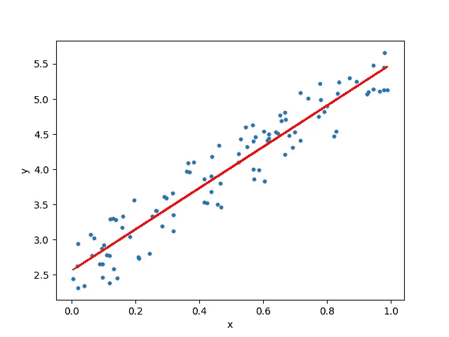

这是我将要讲述的机器学习系列的第一篇博客。人们可能会被网络上大量关于机器学习算法的文章淹没。我写这篇博客的目的有两个。它可以作为进入机器学习领域的人的指南，也可以作为我的参考。

## 目录

1.  什么是线性回归
2.  线性回归假设
3.  训练线性回归模型
4.  评估模型
5.  scikit-learn 实现

## 什么是线性回归

线性回归模型的目标是找到一个或多个特征(自变量)和一个连续目标变量(因变量)之间的关系。当只有一个特征时，称为*单变量*线性回归，如果有多个特征，称为*多元*线性回归。

## **线性回归假设**

线性回归模型可以由下面的等式表示


*   *Y* 是预测值
*   *θ* ₀是偏置项。
*   *θ* ₁,…， *θ* ₙ为模型参数
*   *x* ₁、 *x* ₂,…、 *x* ₙ为特征值。

上述假设也可以表示为


在哪里

*   *θ* 是模型的参数向量，包括偏差项 *θ* ₀
*   *x* 是 *x* ₀ =1 的特征向量

## **数据集**

让我们创建一些随机数据集来训练我们的模型。

使用上述代码生成的数据集的曲线图如下所示:

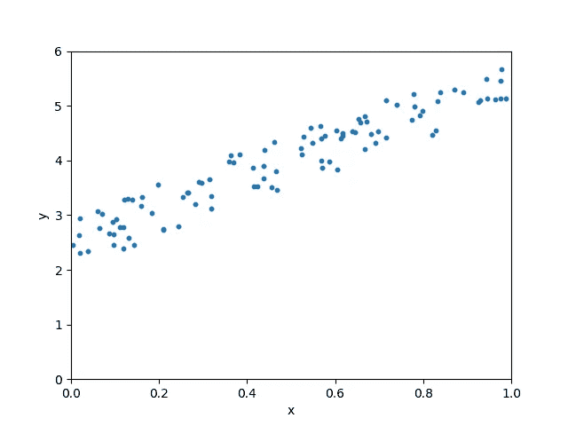

## **训练一个线性回归模型**

在这里，模型的训练意味着找到参数，以使模型最适合数据。

***我们如何确定最佳拟合线？***
预测值与观测值之间的*误差*最小的线称为最佳拟合线或**回归**线。这些误差也被称为 ***残差*** 。残差可以通过从观察数据值到回归线的垂直线来可视化。

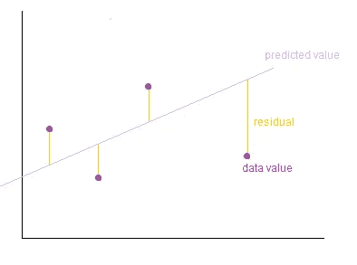

Image Credits: [http://wiki.engageeducation.org.au/further-maths/data-analysis/residuals/](http://wiki.engageeducation.org.au/further-maths/data-analysis/residuals/)

为了定义和测量我们模型的误差，我们将成本函数定义为残差平方和。成本函数表示为

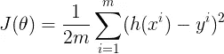

其中假设函数 *h(x)* 表示为


并且 *m* 是我们的数据集中训练样本的总数。

> ***为什么我们取残差的平方而不是残差的绝对值？*** 我们更希望惩罚远离回归线的点，而不是靠近回归线的点。

我们的目标是找到模型参数，使成本函数最小。我们将使用梯度下降来找到这个。

**梯度下降**

梯度下降是许多机器学习算法中使用的通用优化算法。它反复调整模型的参数，以最小化成本函数。梯度下降的步骤概述如下。

1.  我们首先用一些随机值初始化模型参数。这也被称为 ***随机初始化*** 。
2.  现在我们需要测量成本函数如何随着参数的变化而变化。因此，我们计算成本函数 w.r.t 对参数 *θ* ₀、 *θ* ₁、…、 *θ* ₙ的偏导数

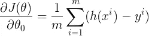

类似地，成本函数 w.r.t 对任何参数的偏导数可以表示为

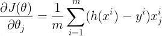

我们可以立刻计算所有参数的偏导数，使用

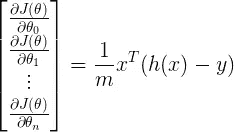

其中 *h(x)* 为


3.计算导数后，我们更新参数如下

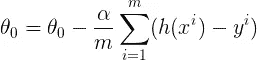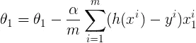

其中 ***α*** 是 ***学习参数*** 。

我们可以一次更新所有参数，

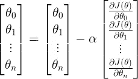

我们重复步骤 2、3，直到成本函数收敛到最小值。如果 *α* 的值太小，代价函数需要更大的时间收敛。如果 *α* 过大，梯度下降可能超过最小值，最终可能无法收敛。


Source: Andrew Ng’s course on Coursera

为了演示梯度下降算法，我们用 0 初始化模型参数。方程变成 *Y = 0。*梯度下降算法现在尝试更新参数的值，以便我们达到最佳拟合线。

当学习速度非常慢时，梯度下降需要更长的时间来找到最佳拟合线。


当学习率正常时

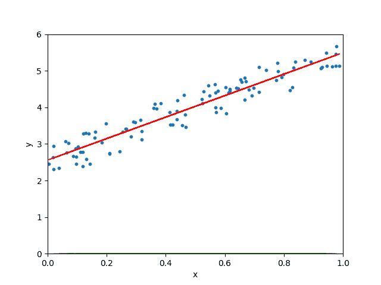

当学习率任意高时，梯度下降算法会超过最佳拟合线，甚至可能找不到最佳拟合线。

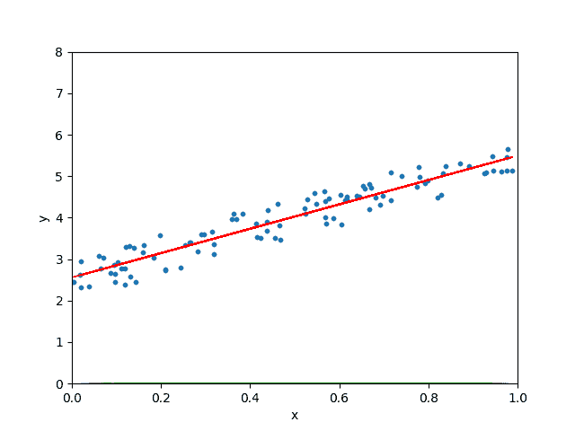

## **从头开始实施线性回归**

下面给出了具有梯度下降的线性回归的完整实现。

模型参数如下所示

```
The coefficient is [2.89114079]
The intercept is [2.58109277]
```

最佳拟合线的绘图

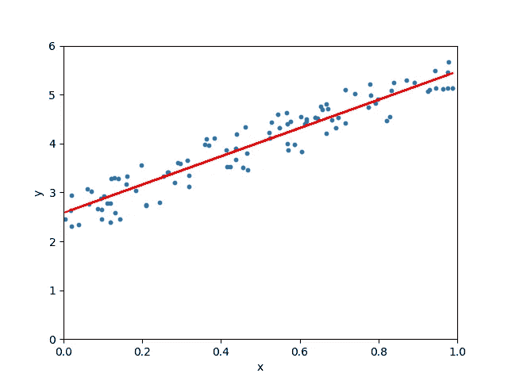

下面给出了成本函数与迭代次数的关系图。我们可以观察到，成本函数最初随着每次迭代而降低，并且在近 100 次迭代之后最终收敛。

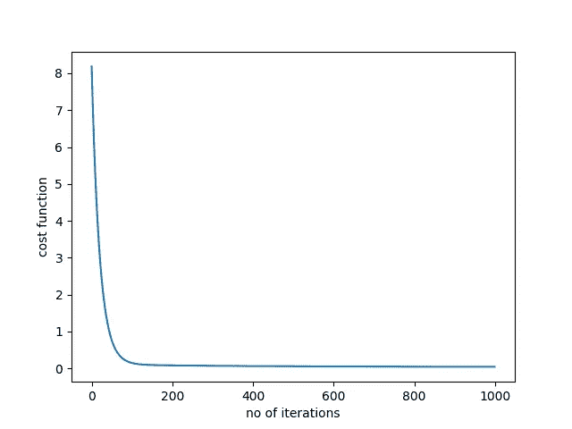

到目前为止，我们已经从头开始实施线性回归，并使用梯度下降来寻找模型参数。但是我们的模型有多好呢？我们需要一些方法来计算我们模型的准确性。让我们看看各种指标来评估我们上面构建的模型。

## **评估模型的性能**

我们将使用均方根误差( **RMSE** )和决定系数( **R** 得分)来评估我们的模型。

**RMSE** 是残差平方和的平均值的平方根。

RMSE 的定义是

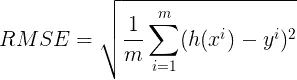

RMSE 的分数是 2.764182038967211。

**R** 得分或**决定系数**解释了通过使用最小二乘回归可以将因变量的总方差减少多少。

***R*** 由

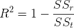

***SSₜ*** 是我们把观测值的平均值作为预测值的误差总和。

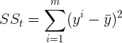

**是残差的平方和**

**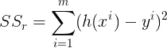**

```
*****SSₜ -*** 69.47588572871659
***SSᵣ -*** 7.64070234454893
**R²** score - 0.8900236785122296**
```

> **如果我们使用观察值的平均值作为预测值，方差是 69.47588572871659，如果我们使用回归，总方差是 7.6407023454893。通过回归分析，我们将预测误差降低了 89%。**

**现在让我们尝试使用流行的 scikit-learn 库来实现线性回归。**

## ****Scikit-learn 实现****

**sckit-learn 是一个非常强大的数据科学库。完整的代码如下所示**

**模型参数和模型的性能指标如下所示:**

```
**The coefficient is [[2.93655106]]
The intercept is [2.55808002]
Root mean squared error of the model is 0.07623324582875013.
R-squared score is 0.9038655568672764.**
```

**这几乎类似于我们从零开始实现线性回归时所获得的结果。**

**这个博客到此为止。完整的代码可以在这个 GitHub [repo](https://github.com/animesh-agarwal/Machine-Learning/tree/master/LinearRegression) 中找到。**

## ****结论****

**我们已经学习了线性回归和梯度下降的概念。我们还使用 scikit-learn 库实现了该模型。**

**在本系列的[下一篇](https://medium.com/@animeshblog/linear-regression-on-boston-housing-dataset-f409b7e4a155)博客中，我们将获取一些原始数据集并构建一个线性回归模型。**