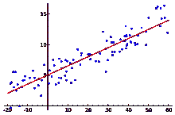
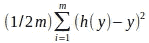
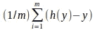
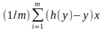
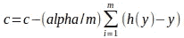
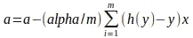

# 示例线性回归

> 原文：<https://towardsdatascience.com/linear-regression-with-example-8daf6205bd49?source=collection_archive---------0----------------------->

# 对于外行来说什么是机器学习和线性回归

机器学习-虚构的故事。从前有一个医生。他会看着人，预测她/他是否缺乏血红蛋白(红细胞)。几乎所有的时候，他的预言都会在检验病人的血液时实现。

他会怎么预测？让我们假设脸色苍白，身体疲劳是低血红蛋白(血红蛋白)的症状。如果这个人的体重较轻，那么出现这种症状的可能性就更大，因为血红蛋白含量低。医生“根据他过去的经验”会在看完病人后“预测”。

如果我们能让计算机也学习这样的东西并做出这样的预测会怎么样。假设我们有量化的变量，比如苍白和疲劳。

**线性回归**

我们在数学课上见过如下方程。y 是我们想要的输出。x 是输入变量。c =常数，a 是直线的斜率。

```
y = c + axc = constant
a = slope
```

输出根据输入线性变化。

*   y 是由输入 x 决定的输出。x 值对 y 的影响程度由“a”决定。在具有轴“x”和“y”的二维图形中，“a”是直线的斜率。
*   c '是常数(x 为零时 y 的值)。

**历史数据**

假设我们有大量的历史数据，其中提供了输入值“x”和输出/结果值“y”。

我们也知道 x 的变化对 y 的影响是线性的。这意味着，如果我们取这些 x 和 y 的值，然后画出图表，我们会得到这样的图表。不完全相同，但有点像这样，其中似乎有一个线性方向的点杂乱。https://en.wikipedia.org/wiki/Linear_regression



**我们想干什么**

我们想看看历史数据，找出' c '和' a '的值。让我们称 c 为常数，a 为重量。如果我们能算出 c 和 a 的值，那么我们就能预测任何新 x 的 y 值。

**怎么办**

正如你从图表中看到的，虽然这些点形成了一条直线，但是它们并不在同一条直线上。所以我们无法知道 c 和 a 的 100%完美值，但是我们可以找到最佳拟合线，如上图红色所示。

这意味着我们的输出将是近似的。可能与实际值略有偏差。但是对于大多数商业应用程序来说，它工作得很好。

**细节如何**

看图表中的点。如果我们算出一条线，它到图中每个点的距离是最优的/最小的。这意味着“最佳拟合线”，如上图中红色所示。我们的目标是在上图中画出红线。

因此，我们在图上为 c 和 a 的某个随机值画一条随机线。假设我们保持 c 和 a 都是 1 (c=1，a=1)，并在图上为每个(至少 2 个)x 画一条线。根据 x 的值，这条线可能会在以下位置之一结束

*   在点的左侧朝向 y 轴。更垂直。
*   在点朝向 x 轴的右侧。更横。
*   介于点之间，但仍不是最佳拟合线。

由于这是一条随机的线，我们需要一种机制将这条线反复缓慢地移动到最适合样本数据的地方(图中的点)。

所以，实际上我们需要

*   找出它的最佳拟合线
*   如果不是最佳拟合线，则将其移向最佳拟合线。这意味着我们必须改变 c 和 a 的值。
*   我们需要改变多少 c 和 a 的值，向哪个方向改变？我们将使用梯度下降和最小二乘法相结合的方法来实现这些目标。这些解释如下。

**数学**

对于样本数据中的每一项(也称为训练集)，从我们的估计线(c=1，a=1)中获取 y 的值。姑且称之为 h(y)吧。

*   同样，我们有 y，它是每个样本数据的真实值。
*   我们将近似的 h(y)和 y 之差表示为 h(y) — y，将该差平方。所以对于一个样本，我们有(h(y)-y)^ 2
*   对所有样品都这样做。假设我们的样本量为“m”，我们得到每个样本量的差的平方，对其求和(从 1 到 m 求和)，得到其平均值(即除以 m)，使其减半(因为差的平方的一半提供更好的结果)。我们现在有了成本函数。我们需要最小化这个成本函数。这意味着我们需要最小化我们的线与样本数据(点)的距离，以获得最佳拟合线。



成本函数的更多解释在—[https://www . coursera . org/learn/machine-learning/lecture/rktp 3/cost-function](https://www.coursera.org/learn/machine-learning/lecture/rkTp3/cost-function)

*   但是我们有两个变量，c 和 a，我们需要不断改变，以得到最佳拟合线。
*   对于 c 和 a 的初始组合，我们需要找到移动多少，然后移动它。一旦我们有了 c 和 a 的新值的新线，然后再次计算每个点的距离，并继续这样做，直到我们发现我们没有移动太多，例如移动得很少。

这基本上意味着我们的线离图上的点还很远。

*   由于我们需要独立地改变 c 和 a，我们将使用偏导数。因此，我们将得到上述成本函数的导数 wrt c，然后是 wrt a。记住，我们有一个样本的 h(y )= c+ax
*   因此，成本函数 wrt 'c '的偏导数的结果将是



*   并且成本函数 wrt‘a’的偏导数的结果将是



*   现在我们决定步长，也就是在每次迭代中我们想要采取多大或多小的步长。让我们称之为阿尔法，我们设置这个值为 0.01。它可以是基于数据的任何合适的值。
*   所以 c 移动的距离是



*   a 移动的距离是



*   上面的 farmulae 不仅会给出我们移动的距离，还会给出方向，例如，如果我们最初绘制的随机像更垂直，必须向下移动以达到最佳拟合，则新值将减少，例如 a 将从 1 变为 0.99。但是，如果我们最初的随机线是水平的，必须向上移动以达到最佳拟合，那么新值将会更多，例如，a 将从 1 变为 1.01。
*   如前所述，当我们意识到我们几乎不动了或者经过一定次数的迭代后，我们就停下来。这意味着我们已经达到了最佳拟合线，即红线。

# 例子

没有例题练习的学习是什么？

让我们以印度的乘用车销售数据为例。为了简单起见，我们假设只有一个变量，即该国的 GDP 对销售有影响。在现实中，有更多的因素，如汽车贷款利率等，但这是下一篇文章。为此，让我们把重点放在印度汽车销售量与 GDP 的线性方程上。

**样本数据**

我查看了过去几年印度乘用车的销售情况。还检查了每年的 GDP。看着这两个数据，我突然意识到“当前年度”GDP 的影响会对“下一年度”的汽车销售产生影响。因此，无论哪一年的国内生产总值减少，下一年的销售就会减少，当国内生产总值增加时，下一年的汽车销售也会增加。因此，他们说为 ML 分析准备数据更重要，这也是最需要花费时间的地方。

让我们用等式 y = c + ax。

y =当年售出的汽车数量

x =上一年的国内生产总值。

我们需要找到 c 和 a。

下面是数据表。我将这些数据保存在一个名为“vehicle_sale_data”的文件中。请注意，售出车辆的数量以 10 万卢比为单位(10 万卢比= 10 万卢比)。

```
year,GDP,4wheeler_passengar_vehicle_sale(in lakhs)
2011,6.2,26.3
2012,6.5,26.65
2013,5.48,25.03
2014,6.54,26.01
2015,7.18,27.9
2016,7.93,30.47
```

第一列=年份，这在下面的代码中没有多大用处

第二栏——上一年的 GDP。这是等式中的 x。

第三列——售出的车辆数量。如果我们知道今年的 GDP，这就是我们想要预测的明年的情况。

# 模型创建

我们将使用 python 来创建模型。下面是步骤。

*   阅读文件。“gdp_sale”字典将有关键字，因为 gdp 和值是销售额。

```
def read_data() :
    data = open("vehicle_sale_data" , "r")
    gdp_sale = collections.OrderedDict()
    for line in data.readlines()[1:] :
        record = line.split(",")
        gdp_sale[float(record[1])] = float(record[2].replace('\n', "")) return gdp_sale
```

*   计算步骤，到达新的“c”和“a”。第一次，我们将传递初始值' c '和' a '。此函数将在移动一步后计算新 c 和新 a 的值。这个函数需要反复调用，直到它稳定下来。

```
def step_cost_function_for(gdp_sale, constant, slope) :
    global stepSize
    diff_sum_constant = 0 *# diff of sum for constant 'c' in "c + ax" equation*
    diff_sum_slope = 0  *# diff of sum for 'a' in "c + ax" equation*
    gdp_for_years = list(gdp_sale.keys()) for year_gdp in gdp_for_years: *# for each year's gdp in the sample data*
        *# get the sale for given 'c' and 'a'by giving the GDP for this sample record*
        trg_data_sale = sale_for_data(constant, slope, year_gdp) *# calculated sale for current 'c' and 'a'*
        a_year_sale = gdp_sale.get(year_gdp) *# real sale for this record*
        diff_sum_slope = diff_sum_slope + ((trg_data_sale - a_year_sale) * year_gdp) *# slope's (h(y) - y) * x*
        diff_sum_constant = diff_sum_constant + (trg_data_sale - a_year_sale) *# consant's (h(y) - y)* step_for_constant = (stepSize / len(gdp_sale)) * diff_sum_constant *# distance to be moved by c*
    step_for_slope = (stepSize / len(gdp_sale)) * diff_sum_slope *# distance to be moved by a*
    new_constant = constant - step_for_constant *# new c*
    new_slope = slope - step_for_slope *# new a* return new_constant, new_slope
```

*   用于获取汽车销售的函数，提供了 c、a 和 x 的值。上述函数用于每个样本数据(gdp)。

```
def sale_for_data(constant, slope, data):
    return constant + slope * data   *# y = c + ax format*
```

*   迭代以获得最佳权重，即 c 和 a 的最佳值。如果 c 和 a 在下一次迭代中的移动不超过 0.01，迭代将停止。

```
def get_weights(gdp_sale) :
    constant = 1
    slope = 1
    accepted_diff = 0.01 while 1 == 1:  *# continue till we reach local minimum*
        new_constant, new_slope = step_cost_function_for(gdp_sale, constant, slope)
        *# if the diff is too less then lets break*
        if (abs(constant - new_constant) <= accepted_diff) and (abs(slope - new_slope) <= accepted_diff):
            print "done. Diff is less than " + str(accepted_diff)
            return new_constant, new_slope
        else:
            constant = new_constant
            slope = new_slope
            print "new values for constant and slope are " + str(new_constant) + ", " + \
                  str(new_slope)
```

*   当然还有主要的功能

```
def main() :
    contant, slope = get_weights(read_data())
    print "constant :" + contant + ", slope:" + slopeif __name__ == '__main__':
    main()
```

我得到的等式是

y(汽车销量)= 1.43 + 3.84 * x

*   x 是 GDP 的值

因此，如果我们今年的 GDP 为 7.5，那么我们明年的乘用车销量将为-1.43 7.5 * 3.84 = 30.23

# 完整的项目

完整的程序如下。它也在 github 的 https://github . com/skhurana 333/ml/blob/master/linearregsinglevariant . py 上

```
*# sales of vehicle as a function of GDP (for India)*import collectionsstepSize = 0.01 def read_data() :
    data = open("vehicle_sale_data" , "r")
    gdp_sale = collections.OrderedDict()
    for line in data.readlines()[1:] :
        record = line.split(",")
        gdp_sale[float(record[1])] = float(record[2].replace('\n', "")) return gdp_sale def sale_for_data(constant, slope, data):
    return constant + slope * data   *# y = c + ax format* def step_cost_function_for(gdp_sale, constant, slope) :
    global stepSize
    diff_sum_constant = 0 *# diff of sum for constant 'c' in "c + ax" equation*
    diff_sum_slope = 0  *# diff of sum for 'a' in "c + ax" equation*
    gdp_for_years = list(gdp_sale.keys()) for year_gdp in gdp_for_years: *# for each year's gdp in the sample data*
        *# get the sale for given 'c' and 'a'by giving the GDP for this sample record*
        trg_data_sale = sale_for_data(constant, slope, year_gdp) *# calculated sale for current 'c' and 'a'*
        a_year_sale = gdp_sale.get(year_gdp) *# real sale for this record*
        diff_sum_slope = diff_sum_slope + ((trg_data_sale - a_year_sale) * year_gdp) *# slope's (h(y) - y) * x*
        diff_sum_constant = diff_sum_constant + (trg_data_sale - a_year_sale) *# consant's (h(y) - y)* step_for_constant = (stepSize / len(gdp_sale)) * diff_sum_constant *# distance to be moved by c*
    step_for_slope = (stepSize / len(gdp_sale)) * diff_sum_slope *# distance to be moved by a*
    new_constant = constant - step_for_constant *# new c*
    new_slope = slope - step_for_slope *# new a* return new_constant, new_slope def get_weights(gdp_sale) :
    constant = 1
    slope = 1
    accepted_diff = 0.01 while 1 == 1:  *# continue till we reach local minimum*
        new_constant, new_slope = step_cost_function_for(gdp_sale, constant, slope)
        *# if the diff is too less then lets break*
        if (abs(constant - new_constant) <= accepted_diff) and (abs(slope - new_slope) <= accepted_diff):
            print "done. Diff is less than " + str(accepted_diff)
            return new_constant, new_slope
        else:
            constant = new_constant
            slope = new_slope
            print "new values for constant and slope are " + str(new_constant) + ", " + \
                  str(new_slope) def main() :
    contant, slope = get_weights(read_data())
    print "constant :" + contant + ", slope:" + slopeif __name__ == '__main__':
    main()
```