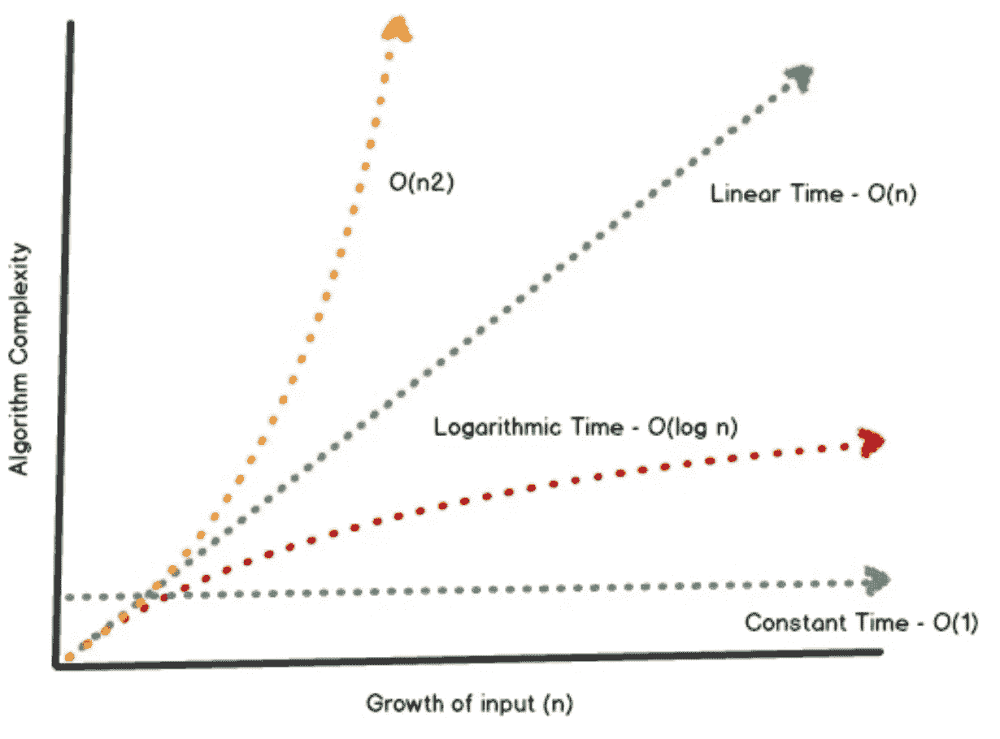

# 线性时间与对数时间——大 O 符号

> 原文：<https://towardsdatascience.com/linear-time-vs-logarithmic-time-big-o-notation-6ef4227051fb?source=collection_archive---------2----------------------->

你好。在两个多月不写/不碰代码之后，我终于回来了。我被所有的婚礼准备和计划所困扰。没有婚礼策划人，很难举办一场海外婚礼。但是这一切都是值得的，因为我们的婚礼是值得的！结婚热已经过去了，现在是时候回忆我的想法，回到编码上来了。

在我开始找工作之前，很难决定先复习什么。我想我应该从经典开始——算法和数据结构，编程的核心。在任何系统中，随着数据的增长，如果使用了正确的算法，性能应该不是问题。

今天，我写了一篇关于两种大 O 符号的博客，线性和对数算法。

先介绍一下大 O 符号的背景。

## 渐近分析

渐近分析是基于数学计算的，基本上是随着输入数据集的增长来衡量算法的效率(感谢维基百科！).根据应用场合的不同，还有其他类型的渐近分析，但在计算机科学中，它通常被格式化为**大 O 符号**。

## 线性与对数

为了容易理解大 O 记数法，我们来比较一下这两种算法:**线性** — O(n)和**对数** — O(log n)。

作为一个例子，我们将尝试在一个排序的数组中寻找一个数字。

```
let numberList = [1, 2, 3, 4, 5, 6, 7, 8, 9, 10]
```

## 线性 O(n) —随着数据的增长，性能变得越来越低效。

在**线性**或“强力”技术中，性能取决于输入大小。对于我们的例子，我们将通读数组中的每一项，并搜索我们需要的数字。很简单！

```
*//Logarithmic Time - O(n)*func linear(key: Int) {
for (index, number) in numberList.enumerated() {
     if number == key { 
        print("Value found in index \(index)")
        break
  }
 }
}
```

当然，这对于我们的小数据集是可行的，但是一旦你有了成千上万甚至数百万的数据，这就不是很有效了。

## **对数 O(log N)-通过重复将数据集减半直到找到目标值来缩小搜索范围。**

使用二分搜索法-这是一种对数算法，查找数组中的中值并将其与目标值进行比较。根据目标值高于、低于或等于中值，算法将向上或向下遍历。

```
func binarySearch(key: Int, iminIndex: Int, imaxIndex: Int) {let midIndex = round(Double(iminIndex + imaxIndex)/2)
let midNumber = numberList[Int(midIndex)]
var result = ""***//using recursion, we can go up or down the array and reduce the*** range
if midNumber > key { ***//target is less than the median so traverse downwards*** binarySearch(key: key, iminIndex: iminIndex, imaxIndex:   Int(midIndex) - 1) } else if midNumber < key { ***//target is greater than the median so traverse upwards*** binarySearch(key: key, iminIndex: Int(midIndex) + 1, imaxIndex: imaxIndex) } else if midNumber == key { ***//Found it!***

 print("Found it at index \(midIndex)")} else { 

  print("Value \(key) not found")
}
}
```

该算法的大部分是在开始，但是随着我们从数组中丢弃不相关的范围并继续减半直到我们找到目标值，它慢慢变平。

通过下面的图表，我们可以很容易地比较大多数算法如何在较小的数据集上具有相似的性能，但随着数据的增长而不断变化。



Excerpt from Swift Algorithms and Data Structures by Wayne Bishop

如你所见，还有其他类型的大 O 符号，我将在接下来的几天里讨论。再见了。

*参考文献:*

*Wayne Bishop 的 Swift 算法和数据结构*

[*大 O 批注入门*](https://rob-bell.net/2009/06/a-beginners-guide-to-big-o-notation/)

维基百科:)