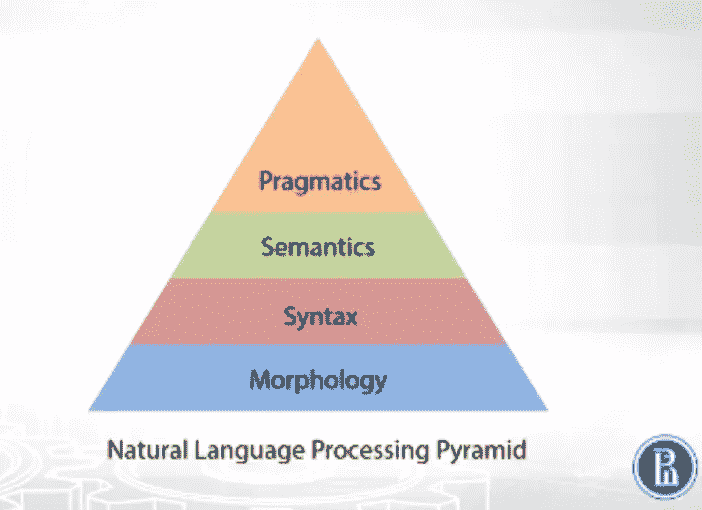
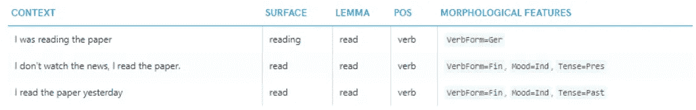
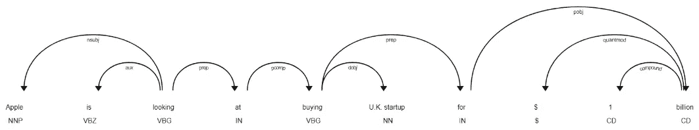
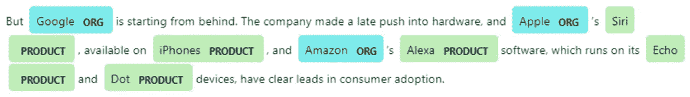

# 自然语言处理中的语言学知识

> 原文：<https://towardsdatascience.com/linguistic-knowledge-in-natural-language-processing-332630f43ce1?source=collection_archive---------1----------------------->

自从进入自然语言处理(NLP)以来，我一直想写一些关于它的高层次介绍，提供一些我理解的结构，并给出该领域的另一个视角——与使用深度学习进行 NLP 的流行形成对比。

# NLP 中的分析阶段

NLP Pyramid — [Coursera Natural Language Processing](https://www.coursera.org/learn/language-processing)

给定一个句子，传统上，以下是如何分析一个句子以获得更深层次见解的不同阶段。

# 1.形态学

在这个阶段，我们关心的是组成句子的单词，它们是如何形成的，以及它们如何根据上下文而变化。其中的一些例子包括:

*   前缀/后缀
*   单一化/多元化
*   性别检测
*   单词变形(修饰单词以表达不同的语法类别，如时态、格、语态等..).其他形式的词形变化包括词形变化(动词的词形变化)和词形变化(名词、形容词、副词等的词形变化)。
*   词汇化(单词的基本形式，或词尾变化的反义词)
*   拼写检查

Morphological analysis of a sentence — [Spacy.io](https://spacy.io/usage/linguistic-features#rule-based-morphology)

# 2.语法(解析)

在这个阶段，我们更关注句子中单词的关系——句子是如何构成的。

> *在某种程度上，语法就是我们通常所说的语法——黑客的 NLP*

为了获得这种理解，句法分析通常是在句子层次上进行的，而词法分析是在单词层次上进行的。当我们建立依存关系树或处理词类时，我们基本上是在分析句子的句法。

Dependency tree of a sentence — [Spacy.io](https://codepen.io/explosion/pen/030d1e4dfa6256cad8fdd59e6aefecbe)

# 3.语义学

一旦我们理解了句法结构，我们就更有准备去理解句子的“含义”(有趣的是，NLP 中的实际含义是什么——点击[这里](https://medium.com/huggingface/learning-meaning-in-natural-language-processing-the-semantics-mega-thread-9c0332dfe28e)进入关于这个主题的 Twitter 讨论)。

此阶段执行任务的一些示例包括:

*   命名实体识别(NER)
*   关系抽取

Named entity recognition of a sentence — [Spacy.io](https://spacy.io/usage/linguistic-features#section-named-entities)

在上面的例子中，以 Spacy 为例；谷歌、苹果和亚马逊已经被标记为一个基于其 NER 注释者的组织。虽然谷歌和亚马逊是一个简单的例子，但苹果却相当不同，因为它可能是一种水果，也可能是一家公司——苹果。在这种情况下，给出的结果是基于基于来自训练数据集的统计分析的预测。

# 4.语用学

在这个层面上，我们试图从整体上理解文本。我们在此阶段试图解决的常见问题有:

1.  主题建模
2.  共指/回指
3.  摘要
4.  问答

# 摘要

自然语言处理作为一个研究领域实际上并不新鲜。如果一个人已经精通深度学习，那么认为传统的 NLP 方法(即将文本分解成更小的结构、解析、注释含义)不再需要。

然而，在标签数据很难获得，并且需要高精度的情况下(例如，当一个人在紧迫的截止日期内时间紧迫，结果确实需要准确，否则产品不会推出)，传统的 NLP 真正发挥了作用。

理解上述主题并不是解决 NLP 相关任务所必需的。对我来说，这更像是一种审视我以前解决的不同问题的方式，以及我可以改进的其他差距或领域。

免责声明:在写这篇文章的时候，我读了很多 Coursera 的 NLP 课程，维基百科，还有我最近最喜欢的 NLP 材料网站——黑客的 NLP。很可能你在这里看到的一些东西是这些来源之间的大杂烩，所以预先警告我可能会忘记在需要的地方正确引用它们的内容。

参考资料:

[1] [自然语言处理| Coursera](https://www.coursera.org/learn/language-processing)

[2] [维基百科，自由百科](https://en.wikipedia.org)

[3] [自然语言处理—简介—面向黑客的自然语言处理](https://nlpforhackers.io/intro-natural-language-processing/)

[4] [语言特点，空间. io](https://spacy.io/usage/linguistic-features)