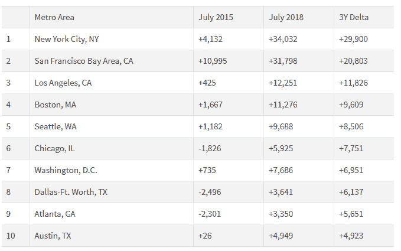

# LinkedIn 劳动力报告:各行各业都非常需要数据科学技能

> 原文：<https://towardsdatascience.com/linkedin-workforce-report-data-science-skills-are-in-high-demand-across-industries-1510b06382a6?source=collection_archive---------11----------------------->

LinkedIn 平台作为一个独特的信息来源，为员工和求职者面临的动态提供了有益的见解，从那些寻求学习新技能的人到那些转向新角色的人。

该平台拥有超过 5 亿名会员。仅在美国，LinkedIn 就拥有超过 1.5 亿会员。因此，它可以提供关于美国劳动力的有价值的趋势。

根据就业导向服务机构 2018 年 8 月的报告,美国各行业对数据科学技能的需求正在上升。

事实上，高需求导致全国缺乏 151，717 名具有数据科学技能的专业人员。

[美国数据科学家 DevZero](https://www.liveedu.tv/dev_zero/RrYjq-python-data-analytics-and-visualization/6pQqV-data-analytics-and-visualization-with-python-10/) 热衷于向人们传授他的技能，他提到“今天的行业非常依赖数据，在很大程度上依赖于它们的战略决策过程，这使得对数据科学家的需求急剧增加。”

# **数据科学技能需求增加**

数据科学涉及使用各种科学工具和流程来创造可用数据的价值。

科学方法、公式和算法通常用于从结构化和非结构化数据中获得全面的见解和提取有用的模式。

以前，数据科学领域不被认为是有利可图的，数据科学家过剩。

例如，2015 年，一家美国雇主想要雇用一名数据科学家，不必费力寻找有技能的人。

当地的人才短缺较少，雇主在雇用候选人时有很多选择。

然而，三年后的今天，情况不再相同:数据科学技能在美国几乎每个大城市都供不应求

事实上，据说这种短缺非常普遍，不仅限于科技和金融领域。

就业相关搜索引擎 Indeed.com 估计，美国数据科学家的平均年收入为 131，651 美元。

# 2018 年 8 月 LinkedIn 劳动力报告

LinkedIn 劳动力报告指出，在未来五年内，数据分析师和科学家将成为最受欢迎的专业人士。

IBM 和世界经济论坛的预测证实了这一点，这些预测认为，到 2020 年，每年对数据开发、数据科学和数据工程相关职位的需求将达到近 70 万个。

下表显示了从 2015 年 7 月到 2018 年 7 月，美国一些主要城市缺乏数据科学技能的加剧情况。技能短缺标有加号(+)而过剩标有减号(-)。

根据 LinkedIn 企业通信团队的说法，与数据科学领域相关的一些关键见解值得注意:

*   将 2018 年 7 月的夏季招聘与前一年相比，2018 年的招聘更加强劲，全国所有行业的总招聘人数增长了 4.6%。
*   2018 年 6 月至 7 月，经季节性调整的全国招聘人数也增长了 0.5%。农业、制造业和运输与物流被指定为 6 月份招聘人数同比增幅最大的行业，分别增长了 26%、12.3%和 12%。
*   数据科学领域的技能缺口是真实存在的。仅在三年前，整个国家的数据科学技能过剩，雇主有一系列专业人员可供选择，几乎不短缺。
*   今天的情况有很大不同，全国各地都经历着严重的短缺。例如，纽约市正面临 34，032 名数据科学家的严重短缺，洛杉矶需要大约 12，251 名数据科学专业人员，旧金山湾区估计短缺 31，798 人。
*   随着人们转向更强的就业市场，如德克萨斯州奥斯汀，移民现象十分猖獗。奥斯汀在美国排名第一。通过吸引更多工人，该市的招聘人数比去年增加了 14.3%。
*   LinkedIn 已经证实，目前在奥斯汀的 10，000 名会员中，有 105 人是在过去 12 个月里迁移到这座城市的。其中，10.5%来自休斯顿，7.6%来自旧金山，4.8%来自纽约市。向奥斯汀的大规模迁移可以归因于它所标榜的蓬勃发展的技术中心，表现为数据存储技术的巨大技能缺口和对开发工具的迫切需求。

# 包扎

鉴于对不同领域和行业的见解，2018 年 8 月 LinkedIn 劳动力报告在帮助员工以最佳方式指导职业生涯方面大有作为。

正如该报告所指出的，数据科学在当今所有行业都非常重要，给自己定位可以帮助你做出人生中最大的职业转变。

由于该领域巨大的技能缺口，你可以[学习数据科学](https://www.liveedu.tv/guides/data-science/)，增加获得工作的机会；数据科学是未来最需要的技能。

那么，你对数据科学领域存在的技能差距有什么看法？

请在下面分享你的评论。