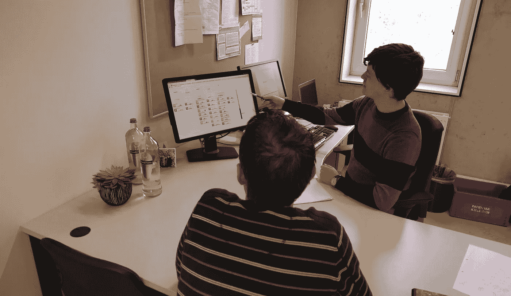
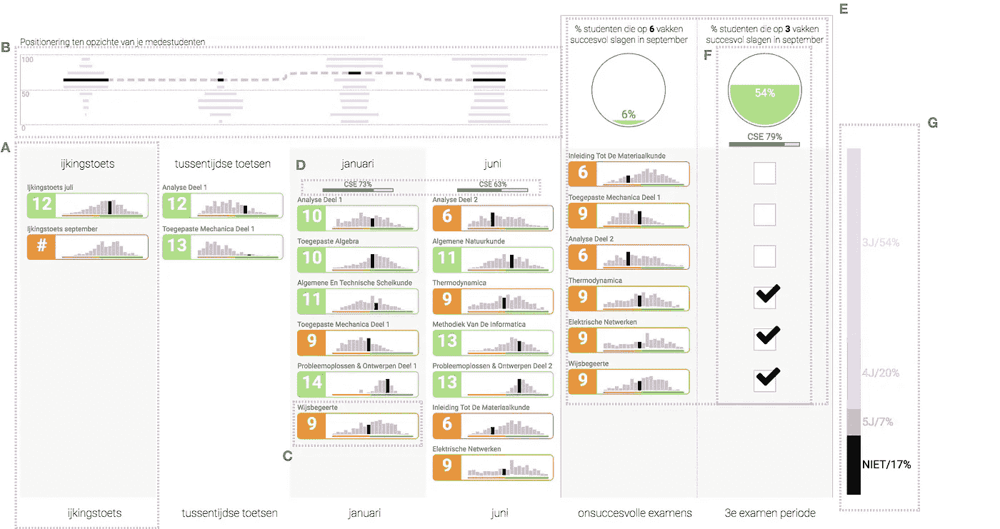

# LISSA:基于现成高等教育数据的面向学生的学习分析仪表板

> 原文：<https://towardsdatascience.com/lissa-a-student-facing-learning-analytics-dashboard-based-on-readily-available-higher-education-ab32bca31ae?source=collection_archive---------5----------------------->

> 不是每个人都喜欢阅读冗长的科学论文，但是仍然有很多有趣的东西。所以我打算试着开始一个新习惯:把我冗长乏味的论文变成更容易消化的博文。如果大多数人都不读这些科学，那这些科学还有什么意义呢？为了让你开心，我会尽量简短，因此我会省略很多细节。但如果你真的渴望了解更多，你可以随时查看原始论文！

*本文基于 2017 年 6 月发表在*[*IEEE Transactions on Learning Technologies*](http://ieeexplore.ieee.org/xpl/RecentIssue.jsp?punumber=4620076)*上的论文“*[*Learning Analytics Dashboards to Support Adviser-Student Dialogue*](http://ieeexplore.ieee.org/abstract/document/7959628/)*”。*

在博士期间，我主要专注于学习仪表板。这些仪表板中的大部分仍然侧重于教师和研究人员作为用户，但我的目标是通过数据可视化让学生了解自己的过程，从而增强他们的能力。我设计并评估了许多仪表盘，但有一个很突出:LISSA，或“在学习期间接受我的指导和 T21 的支持的收入仪表盘”。LISSA 支持学习顾问和学生之间的对话，目前正在鲁汶大学的一系列学位中使用。

Setup of an advising session. LISSA is displayed on a screen visible to both study adviser and student.

在我们的研究中，我们涉及了一群研究顾问(同样，简单的版本:详见论文)。这些学习顾问负责为特定项目的一年级学生提供学习建议和与内容相关的支持。他们是第一年课程内容、当前项目组织和监管方面的专家，既有针对具体项目的，也有针对整个大学的。

研究顾问帮助我们深入了解他们是如何工作的，以及在这些咨询会议中他们的需求是什么。这些会议是在办公室环境中与学生(偶尔与家长)的私人谈话。这些学生通常没有完美的学习生涯:他们学习有困难，会受益于个性化的课程计划，一年中没有获得足够的学分，或者只是希望重新定位于新的课程。

研究顾问有多种工具和网站供他们使用。但是为每个特定的学生组合和解释这些多种渠道的信息需要努力和时间，并且容易出错。此外，数据往往不完整。

# 仪表板

使用以用户为中心的快速原型设计方法，我们从最初设计的[草图](https://www.sketchapp.com/)和 [D3.js](https://d3js.org/) / [流星](https://www.meteor.com/)开始创建我们最终的交互原型。这里有两张最终设计的截图(2017 年年中，今天我们的一个新博士生接手并做了一点重新设计):

From left to right: positioning test results for July and September (ijkingstoets), mid-term tests (tussentijdse toetsen), January and June exams. Above each period: histograms of peer performance for that period and an indicator of the student’s position in relation to grades of peers in the different test periods. Each course result is accompanied with a histogram of peer performance for that specific course. Failed courses can be planned for re-sits. Length of bachelor in years is predicted through historical data.

现在来看一些细节…

## 年度概览

LISSA 按时间顺序概述了每个关键时刻，直到举行咨询会议的时期:定位考试(一种无后果的入学考试)、期中考试、一月考试和六月考试的成绩。顶部显示了学生表现的总体趋势:学生路径由直方图组成，显示了每个关键时刻学生在同龄人中的位置。

每门课程都用它的名字和分数(满分 20 分)来表示。绿色、橙色和红色编码代表成功的考试、可接受的分数(学生可以要求通过有限的 8-9/20 的分数)和失败的课程。该课程附有一个柱状图，显示了同学的表现以及学生在其中的位置(黑色突出显示)。

## 规划

对于六月的课程，计划九月的重考是很重要的。考试太少会导致学分门槛问题，而考试太多很可能会导致失败。失败考试旁边的复选框让指导老师和学生选择几门课程。“重考成功率图表”使用历史数据来提供对过去成功通过所选数量的考试的学生人数的洞察。

## 预言；预测；预告

堆叠预测栏提供了与学生具有相似概况(基于通过或未通过考试的数量)的学生的历史数据:它显示了具有相似九月重考的学士课程持续时间的分布(三-四-五年或辍学/“NIET”)。

## 数据源

为了可视化关键时刻，需要关于学生成绩的数据。这包括本年度所有一年级学生填写课程和课程直方图、学生路径和课程直方图。关于一月、六月和九月期间的所有等级都可以在 KU Leuven 数据仓库中获得。

堆叠的预测条基于往年的一年级学生成绩。这提供了预测三年、四年、五年或更长时间的学士学位所需的数据。

我们使用 Python 脚本创建了一个数据处理管道，将不同的文件和格式转换成一个简单的表示，并导入到 MongoDB 中。

# 吸取的教训

## 学习分析数据的作用

LA 仪表板通常是为具有特定数据要求的特定机构开发的。部署 LISSA 所需的学习分析数据非常基本:学生在关键时刻的成绩和关于学生成功的数据(来自历史成绩数据)。大多数高等教育机构通常都有这种数据，但仅限于工作人员。然而，我们已经表明，将这些数据放在学生建议环境中，可以帮助支持学生，提供对他们进步的见解，并帮助规划他们的未来。

LISSA 是基于事实数据。考试成功率和学士持续时间显示了历史上发生的事实，并没有提供计算估计。这种可靠的数据可视化方式让研究顾问和学生对他们给出和接受的建议感到放心。

关于社会经济地位、父母教育、性别和高中成绩的个人背景数据可以提供进一步的见解，并帮助研究顾问更好地了解学生的情况。然而，这些不可改变的数据并没有给学生提供可操作的见解。因此，研究如何以道德的方式整合这些数据是很重要的。

## 学习顾问的角色

LISSA 有助于多层次的洞察力，但这些洞察力受益于研究顾问的指导。即使数据是客观的，仍然需要领域专家进行批判性和反思性的解释。过于自信的学生可能会把总体的负面结果解释为一个可以克服的问题，而学习顾问可以建议和计划一个更可行的计划，防止学生在错误的选择上浪费时间。LISSA 可能会以负面的方式描述学生，而与学生的讨论可能会揭示容易解决的问题，例如学习方法的改变、新计划或态度的改变。如果没有研究顾问的指导，这些学生可能会选择不继续他们的学士课程。

LISSA 仍然为个人意见和隐性经验留有余地，因为它们仍然在建议会议中发挥重要作用，允许研究顾问强调某些结果，以推动他们走上正确的道路。许多外部因素，如通过讨论收集的信息和以前学习顾问对学生的经验，会影响偏离事实数据或以不同方式解释数据的决定。

## 透明度

在半结构化的访谈和研讨会期间，出现了关于让学生面对数据的伦理问题。

一些学习顾问没有向有大量课程不及格的学生展示 LISSA。虽然一些学生可能会从“大开眼界”中受益，但学习顾问更喜欢将 LISSA 作为一种激励工具。

LISSA 的一个重要作用是能够在同龄人中定位学生。总的来说，直方图的使用被认为是非常有用的，并且定位具有积极的效果，例如当一个坏的分数在同龄人中仍然是好的，或者课程不及格率非常高时，激励学生。一些学习顾问担心会失去动力:一个处于直方图低端的学生可能会认为成功完成这门课程是一个无法实现的目标。

然而，学生们要求在会议之外接触 LISSA。但是研究顾问担心，如果没有他们的指导，可视化的数据可能会被严重误解:害怕失败的学生或过于自信的学生可能会错误地解释数据。父母可以扮演一个消极的角色，要么太努力，要么把平庸的结果解释为不可克服。没有学位的父母对高等教育缺乏了解可能会阻止学生追求一个可实现的学位。这些问题可能会导致关于考试和学习职业规划的错误决策。研究顾问确实看到了提供精简信息的潜力，但这种精简意味着什么，必须进一步讨论和评估。

> 希望你喜欢这个关于 LISSA 和我们发现的简短概述。它目前被部署在比利时最大的大学之一的鲁汶大学的多个校区。如果您想了解更多的经验教训，或者评估过程和结果的更多细节，请查看[原始论文](http://ieeexplore.ieee.org/abstract/document/7959628/)或者给我一个 ping！
> 
> 关于我在 http://svencharleer.com/[的更多信息](http://svencharleer.com)