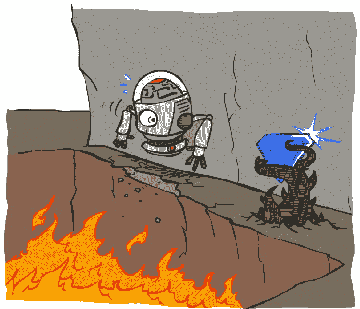
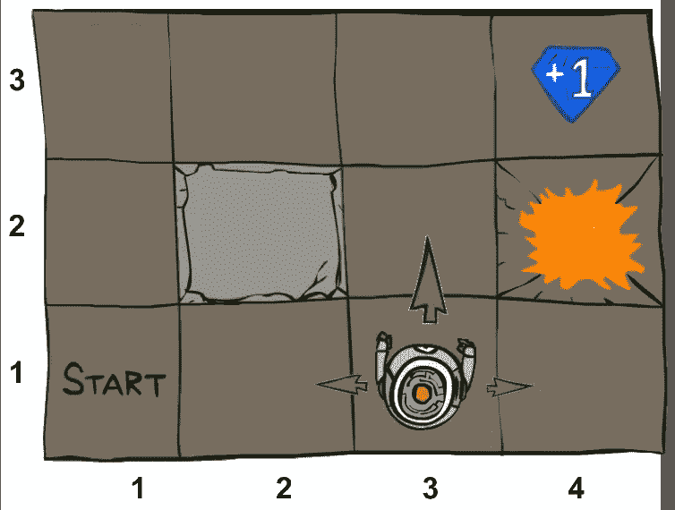
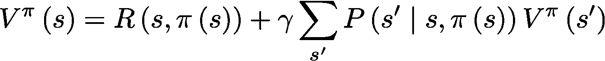
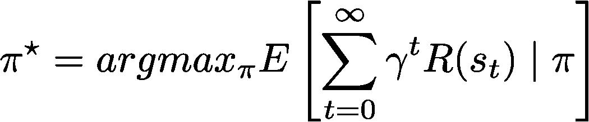
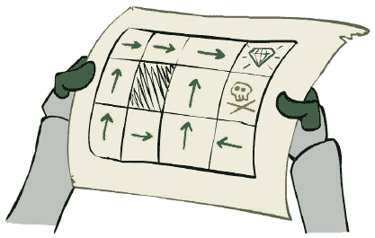
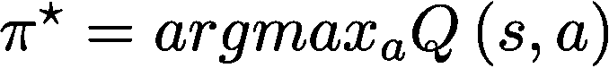
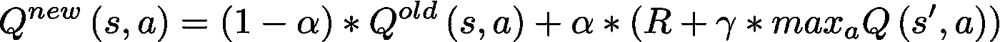

# 强化学习入门🤖

> 原文：<https://towardsdatascience.com/lite-intro-into-reinforcement-learning-857ca5c924d9?source=collection_archive---------7----------------------->

这是对强化学习(RL)的简要介绍，用简单的术语讲述了基础知识。我们从 RL 的简要概述开始，然后进入一些解决 RL 问题的技术的实际例子。最后，你甚至会想到可以应用这些技术的地方。我想我们都同意建立我们自己的人工智能(AI)并让机器人为我们做家务是很酷的。

> *…让我们开始吧！*

# 1)什么是 RL？🧐

> “强化学习是机器学习(人工智能)的一个领域，起源于强化的心理学概念，涉及软件代理的决策，以最大化模型环境中期望的回报概念。”

如今，强化学习已经在人工智能和机器学习(ML)技术中找到了自己的路，然而它的起源来自行为心理学。美国心理学家 E. L .桑代克在 20 世纪中期引入了强化这个术语。然后，另一位名叫 *B.F .斯金纳*的美国心理学家跟进*桑代克*的研究，提出了一种新的学习过程，称为**操作性条件反射** (OC)。也是在那个时候，一位美国应用数学家 R. E. Bellman 开发了动态编程，这有助于用计算机解决 RL 问题。从那时起，RL 已经大量转移到数字世界，这也许要归功于加拿大计算机科学家 R. S .萨顿在 20 世纪末开创了计算强化学习**并出版了他有影响力的 RL 教科书。这让我们可以把机器学习作为最突出的领域来呈现，并投入到大规模实施的决策中。**

## *…行为心理学的强化🐹*

是一种**效应** **当一个有机体暴露在特定的**刺激**下，促使它执行习得的行为时，它会强化未来的行为**。它被用在特定类型的条件作用中，这些条件作用使用刺激来表现作为学习的一部分的反应。在 OC 中，行为由环境中可察觉的变化控制，也称为**环境刺激**，它是影响活动的外部事物。例如，环境刺激是生物体可以检测到的不同表现形式，例如，我们的身体可以检测到触觉、声音、视觉等。为了把它带回到强化，OC 使用强化或惩罚来修改行为的可能性。同样，它也包括自愿行为，可以用下面的动物行为例子来描述。

*   *一只狗可以被训练得在受到狗食奖励时跳得更高，这意味着它的行为被狗食强化以执行特定的动作*

[Klein & Abbeel 2018]

## …机器学习中的强化🤖

是对**软件代理**的后续动作的一种**效果，即在给予**奖励**后探索**模型环境**以强化其未来行为。软件代理被发送到模型环境中，带着实现某些预期目标的意图采取行动。这种代理可以被认为是计算机程序，它们因执行正确的动作而受到奖励，或因执行错误的动作而受到惩罚，并从它们的经验中学习。什么是对什么是错一般取决于环境，但正确的行动通常是通向实现目标的最佳途径(不管是什么)的行动，如下例所示。**

*   *迷宫(环境)中的智能体可以被编程为自主地(通过奖励)找到最快的方式(行动)如何逃离它(目标)*
*   *海洋(环境)中的智能体可以被编程为自主地(通过奖励)寻找最长的方式(行动)如何在水下生存以恢复受损的珊瑚礁(目标)*

> …让我们看看如何通过数学模型来定义这样的理论 RL 示例！

# 2)如何定义 RL 问题？✍

> “RL 任务的公式化可以通过结合**马尔可夫决策过程和‘正确’策略来完成，当**解决**模型环境**时，软件代理可以将它们用于自己的决策。”

马尔可夫决策过程(MDP)提供了一个简洁的数学框架来模拟 RL 中的决策。MDP 用于决策者(软件代理)部分控制结果而其余结果是随机的情况。它为代理配备了关于*状态*、*动作*、*转移*、*概率*、*奖励*和*折扣因子*的知识。这些属性以及其他一些常用术语将在下文中“简略”描述。

maze example — grid world [Klein & Abbeel 2018]

**🐹代理人** - >为你干脏活的家伙！

🗺**环境** - >一个宇宙/空间/世界，一个智能体在其中完成工作，例如，它可以是一个随机(随机生成的)网格世界，描述了上图中的迷宫

🏔**状态** - >环境中代理的特定状态/位置

**💃🕺action (a)** - >可能导致新状态的代理行为

**🤷‍转移概率(P)** - >智能体在环境中如何移动的概率，即智能体在特定状态下的行为将/不会导致其他可能状态的可能性

💵**奖励(R)** - >从字面上看，一些钱作为奖励，或者一些化石燃料作为惩罚，也就是消极的奖励，因为一个代理人的决定进入了一个状态

**⚖️折扣因子****【ɣ】**->帮助代理专注于其工作，不会因收到的奖励大小而分心，例如，它通过计算未来和当前奖励的重要性差异来衡量收到的奖励

**👴🏻体验** - >代理通过进入一个环境并执行一些动作而获得的体验，例如观察新状态、奖励等习得的行为。

🔮**策略****【π】**->告诉代理如何在状态中行动，甚至如何从起点到目标，即它是从状态到选择每个可能行动的概率(转移概率)的映射……策略可以是对环境中每个状态给出一个行动的 MDPs 的解决方案，例如" **π(s) - > a** "

## 这一切都是为了获得长期回报！💰

M DPs 都是关于**长期奖励**，所谓*延迟* *奖励*。这些奖励导致代理在环境中试图解决的任务(目标)的完成。例如，一个代理可以通过进入一个特定的状态获得一个重要的**短期奖励**，即所谓的*即时奖励*。然而，走这条立即获得回报的道路可能不是完成任务的最佳方式。这取决于在一个环境中如何设置奖励。

> ...是时候回答一些问题了！

## …代理如何找到新的状态？👀

它是通过**跃迁**来完成的，即一些跃迁函数 ***T(s，a，r，s’)****。* 它描述了一个过程中智能体如何发现一个新的状态。在一个模型环境中，一个代理处于某个状态(s)，采取一个动作(a)，然后为此获得一个奖励(r)，并通过这个过程找到一个新的状态(s′)。

## …代理商如何知道在美国有多好？👍

在 RL 中，决策是由一个代理人完成的，这个代理人通常需要知道处于一个给定的状态或执行他们给定的动作有多好。例如，一个代理人想知道预期的回报，也就是未来的回报，这取决于他将要采取的行动。许多 RL 算法通过估计状态或状态-动作对的函数，称为**值函数**来解决这种需求。这些功能是用特定的行为方式(策略)来定义的。价值函数用于组织和结构化策略的搜索，这是 RL 的关键思想之一！

Bellman equation — value function calculating values in states for MDPs

O 如何利用价值函数的一种方法是**贝尔曼方程**，它是基本 RL 方程之一，根据问题的不同可以采用多种形式。上面的等式是针对 MDP 的一个示例。它展示了如何获取处于特定状态的值(V)并在该状态下遵循策略(π)。具体来说，它使用该州的奖励和下一个州(sʹ).)的转移概率(P) &值的贴现和

## MDPs 的最终目标是什么？🏒 🥅

MDPs 中的目标通常是找到最优策略。它是**使长期预期报酬**最大化的。正如下面的高级定义所示，最优策略返回在某些环境状态下要采取的特定操作。通过遵循策略(π)并在特定时间(t)经历一系列状态来计算折扣奖励的期望总和。

optimal policy (π*) — finding the right actions in states for MDPs

maze example — map [Klein & Abbeel 2018]

> …现在想象一个代理人有一张如上图所示的迷宫地图，那么它将知道在每种情况下做什么才能得到钻石或不被杀死，因为每个州都有一个特定的行动(绿色箭头)，这就是“有政策”的意思！

## …那么，在这个迷宫示例中，RL 在哪里？‍🕵️‍

It 是有的，但这取决于我们对迷宫(环境)了解多少，以及我们试图完成什么。只有当一个主体采取行动寻找回报的迷宫的所有特征都已知时，它才能用 MDP 来完整地描述。然后，一个**代理知道每个状态**中的所有动作，并且新的状态和奖励这样的动作导致。然而，一个代理仍然需要找出哪一系列的行动能最佳地导致最终的回报/目标，即**找出最佳策略**。这有时被称为**离线规划**，可以通过使用 MDPs 的知识并找到策略来解决，这实际上不是 RL 问题。

然而，在这个“真实”的世界中，存在任意大小的环境，它们可以是巨大的和组合的。例如，一个迷宫可以有许多可能的动作和结果的状态。然后，不一定有任何关于**转换或奖励的知识，直到代理实际尝试一些动作**并弄清楚这一点！这有时被称为**在线学习**，它仍然**假设** **MDPs 并继续寻找策略**，但它更具有“真正的”RL 性质。这意味着代理从数据中学习，这与仅使用静态数据的离线情况形成对比。总之，RL 问题可以用 MDP 来表示，就其主要性质而言，MDP 可能是复杂且不完整的。

> …让我们看看如何利用引入的 MDP 定义来解决 RL 任务！

# 3)如何解决 RL 问题？🎮

> RL 问题可以用动态规划、时间差异学习或策略梯度方法(T21)来解决。然而，通常有必要通过使用深度神经网络&来帮助在更复杂环境中运行的代理找到良好的近似解决方案，这些技术可以解决基本的探索-开发权衡。”

解决 RL 问题的方法因环境的性质而异，比如我们对环境了解多少，或者我们想在环境中解决什么任务。一般来说，RL 应用可以用 **MDPs** 来表示，用某种形式的**动态规划** (DP)方法来解决。DP 是一种优化技术，它将问题分成更小的任务，并递归地解决它们。它们也可以用仅使用 DP 的某些方面的方法来解决，例如在**时间差异** **学习** (TD)方法中。在 TD 方法中，算法通过将蒙特卡罗方法的**采样(估计期望值)与 DP** 的**自举(在其他估计的基础上更新估计)相结合来学习。现代 RL 解决方案之一是**策略梯度** (PG)方法，它可以直接逼近最优策略，而无需使用任何近似值函数。PG 方法通常是通过**深度神经网络**实现的，深度神经网络是多层连接的人工神经网络(ann)。还有许多其他方法来解决 RL 问题，但它们都有一个相似的目的**利用学习过程中的经验**并以某种方式**获得环境的未知属性**，如 MDP 中的概率或奖励。**

## RL 通过表格或近似解求解！🤖 🍽 📐

1.  在 *简单 MDPs* 中，解决方案大多通过**表格解决方案**找到，其中表格(数组)表示近似值函数，因为这里的环境很小或很简单。他们经常可以找到精确的解决方案，例如找到精确的最优政策或最优价值函数[萨顿&巴尔托 2017]。换句话说，它是关于**在完全描述的环境中，在可能无限的时间和数据上找到最优策略或最优价值函数**。算法通过对环境的所有状态的值&策略的**递归来计算这一点。这可以通过前一节中引入的策略和值的等式的**递归**的某种变体来完成，或者也可以通过它们的**迭代**的某种变体来完成，例如进行**值迭代**或**策略迭代**。**
2.  *在复杂的 MDP*中，解决方案大多是通过**近似解**找到的，这些近似解**可以将**以前在不同状态中遇到的情况推广到其他情况，因为这里的环境很大。换句话说，解决问题在很大程度上转变为**寻找一个计算量不大的好的近似解决方案**，因为我们不能指望在这样的环境中找到最优政策或最优价值函数【萨顿&巴尔托 2017】。此外，在这种情况下，通常有必要通过 ann 来帮助代理完成他们的工作。例如，人工神经网络可以通过充当非线性函数逼近器和学习价值函数或最大化预期回报来处理代理人的经验。

> …现在似乎是再次回答一些问题的好时机！

## …那么，代理解决任务的最佳方式是什么？🎢

It 通常是代理在完成环境中的任务时，能够在探索和利用之间找到**正确平衡的一种方法。探索是从数据中学习的能力，而开发是使用你目前所知的能力。这两种能力对一个特工来说都很重要。然而，这在 RL 中实际上是一个困难的任务，因为当试图为一个环境提出策略时，这两者会发生冲突。**

T 这种冲突可以通过寻找“好”策略的两种不同学习方法来处理，即**策略上的学习**和**策略外的学习**。他们都试图通过确保无限频繁地选择所有动作来评估或改进策略，这意味着代理只是继续选择它们。主要区别在于，政策上的学习为用于决策的政策做*，而政策外的学习为不同于用于生成数据的政策做*【萨顿&巴尔托 2017】。它们都可以通过一些**函数逼近**来解决，这在复杂环境中非常有用。然后，通常会有收敛或这种近似解的稳定性的挑战，但我们不会在本介绍材料中谈论这些:)**

## **…算法能区分代理的目标和习惯吗？☯**

**是的，算法可以做得很好，实际上在各个领域都有不同的术语来描述这种行为上的区别。在认知科学中，这是关于**反思** **对** **反思**决策和选择。在 RL 中，如果我们考虑**目标导向**和**习惯性**行为之间的这种心理差异，它是关于**基于模型的** **与** **无模型的**算法。基于模型的方法通过代理环境的模型提前计划来选择动作。无模型算法通过访问存储在策略或行动值函数中的信息来做出决策【萨顿&巴尔托 2017】。**

**让我们回到上一节介绍的 MDP 术语。无模型算法最有可能的工作，比如 **TD 学习**，将是 MDP 中并非所有属性都已知的工作。此外，关于计划的相当通俗的术语，**无模型**算法将解决**在线学习**的情况，而**基于模型的**算法将解决**离线计划**的情况。**

## **…有哪些常见的 RL 算法？🔦**

**It 也许值得一提的是 RL 中的基本算法，它们在某种程度上可用于近似解，因为这就是 RL 实现的全部内容。有两种不同的算法称为 **Q-learning** 和 **SARSA** 属于 TD 方法。他们都需要一些行动价值评估来提出他们的政策，也就是说，他们必须首先了解行动的价值，以选择最佳行动。主要的区别也许是他们的政策学习类型；一个是*非政策*，另一个是*政策*。然后，有两个不同的算法叫做**加强**和**演员评论家**属于 PG 方法。他们可以学习一些参数化的政策，这些政策可以在不咨询价值函数的情况下选择行动(行动-价值估计)[萨顿&巴尔托 2017]。参数化策略是表示为称为参数的一些独立量的函数的策略，例如，参数可以是实现 PG 方法的神经网络的权重。**

**到总结， **TD 算法可以学习行动值**，然后使用它们来确定行动选择，而 **PG 算法可以学习参数化策略**，使行动能够在不咨询行动值估计的情况下采取【萨顿&巴尔托 2017】。换句话说，它是关于用值函数而不是参数来表示策略。**

> **…这听起来可能有点令人困惑，所以让我们在 RL 介绍文本的其余部分只看 Q-learning！**

## **…Q-learning 是如何工作的？🎛**

**Q-learning 是一种*无模型算法*，实现了属于 TD 方法的*偏离策略学习*。它通过状态-动作对将代理的学习建立在**经验的基础上，而没有转移概率的明确说明。字母 Q 代表“质量”处于一种状态，用代表状态-动作对的 **Q 值**来表示。高 Q 值意味着与低 Q 值相比，在那里(在这种状态下)更好。****

**0010Q 学习通常遵循某个*勘探-开采策略*并且**学习与采取最优策略**相关的 Q 值。它存储每个环境状态的 Q 值，并在学习时直接更新它们，即它使用自己的转换(存储的数据)来直接产生方程的解。目标是通过近似如下所示的 Q 函数来推断最优策略(π*)。**

****

**Q-learning — optimal policy**

**0100Q 学习可以通过计算**为环境**中的每个状态产生 Q 值的等式来解决，例如下面的等式。它包含了一个叫做**学习率** (α)的东西，它决定了代理在探索和利用方面如何学习(代理什么都学，什么都不学)。还有**贴现因子** (ɣ)，它通过设立一个即时或延迟满足的代理(又名近视或远视代理)来决定未来奖励的重要性。通俗地说，这个等式产生的新 q 值粗略地证明了当一个代理处于状态(s)并试图做某事(a)时，某事已经发生(sʹ)。**

****

**Q-learning — equation for Q values**

**Q-learning 可以使用一个**表**来存储数据，作为其最简单的实现版本。然而，对于大型问题(有许多状态或动作的环境)，这可能不可行。这就是**神经网络**作为函数逼近器发挥作用的地方，它允许在表格做不到的地方扩大规模。它们为解决方案提供了更多的灵活性，但代价是牺牲了一点稳定性。不考虑具体的 Q-learning 实现，在选择动作的时候也需要有一个游戏计划。在我们下面的编码示例中，我们使用了一个带有**ε贪婪策略**的**多臂强盗**算法，用于**决定关于*勘探-开发*困境的动作**。**

> **…所以让我们直接开始实施我们自己的 RL 示例吧！**

# **4)编码示例:通过 Q 学习解决的迷宫💻**

> **“我们将通过表格和神经网络实现对 Q 学习算法进行编码，尝试用 RL 解决一些众所周知的类似迷宫的环境。”**

## **q-用表格学习🤖 🎛 🍽**

***(*[*)ka ggle 内核版本运行在您的浏览器中*](https://www.kaggle.com/tomtx0/q-learning-with-table) *)***

## **用人工神经网络学习🤖 🎛 ☎️**

***(*[*)ka ggle 内核版本在您的浏览器中运行*](https://www.kaggle.com/tomtx0/q-learning-with-ann) *)***

# **结论**

**我们刚刚学习了学习过程的一些应用，这可能有助于读者开始思考 RL。我们看到，问题可以用 MDP 来定义，并用使代理能够在各种情况下工作的方法来解决。然后，我们编写了自己的 RL 解决方案，解决迷宫般环境中的一些情况。还有许多其他的计算方法来解决 RL 问题，但希望这篇文章只是简单地传达了 RL 的基本思想，并为那些寻找快速起点的人服务。**

****

**现在，我建议你亲自动手制作自己的 RL 应用程序！也许从探索更多强化学习过程的例子开始，但同时尝试用强化学习解决它们。这可能有助于你以后在 ML 空间创建独特的解决方案……这个空间现在充斥着大量可爱的图片🐱&🐶 :)**

# **参考**

*   **R.萨顿和巴尔托:*《强化学习:导论》*，第二版，布拉德福德出版社，2017 年**
*   **D.Klein 和 p . abbe El:*《cs 188 人工智能导论》*，课程笔记，加州大学柏克莱分校，<http://ai.berkeley.edu>，2018(已下载)**