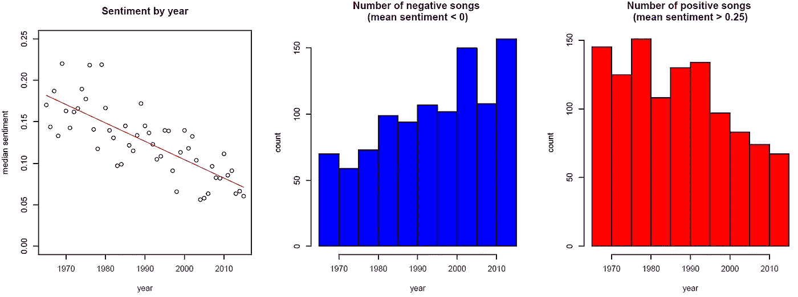
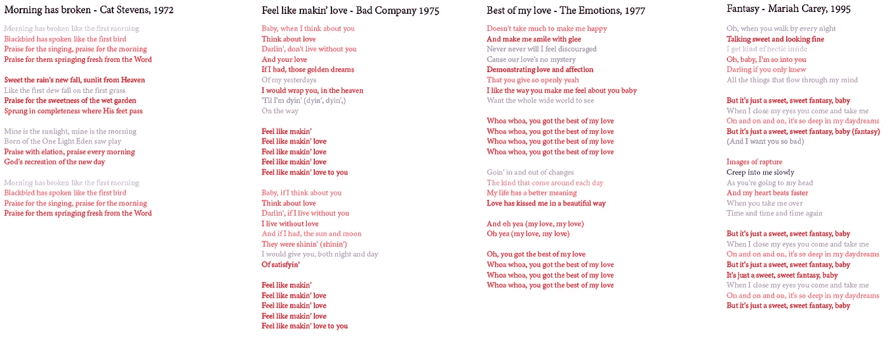
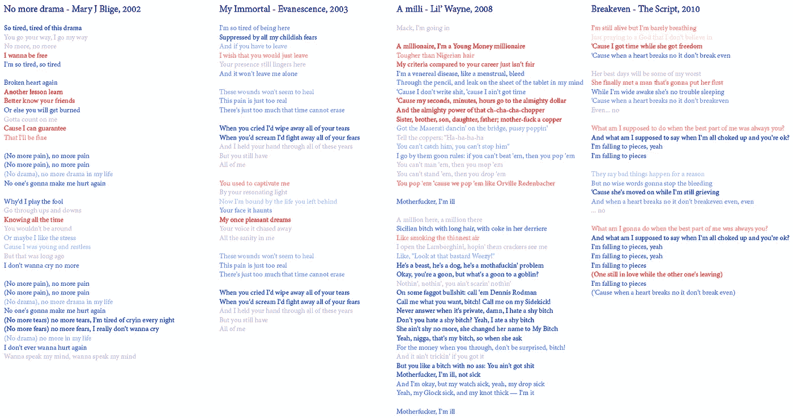
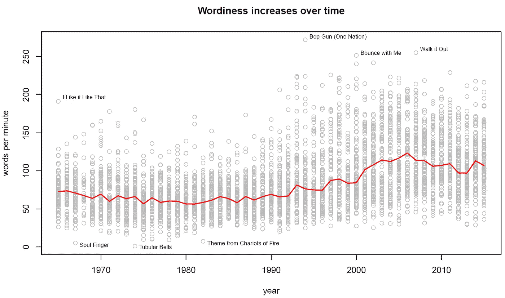
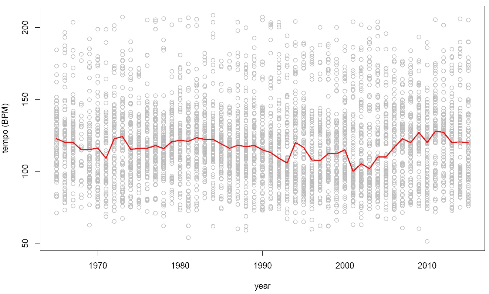
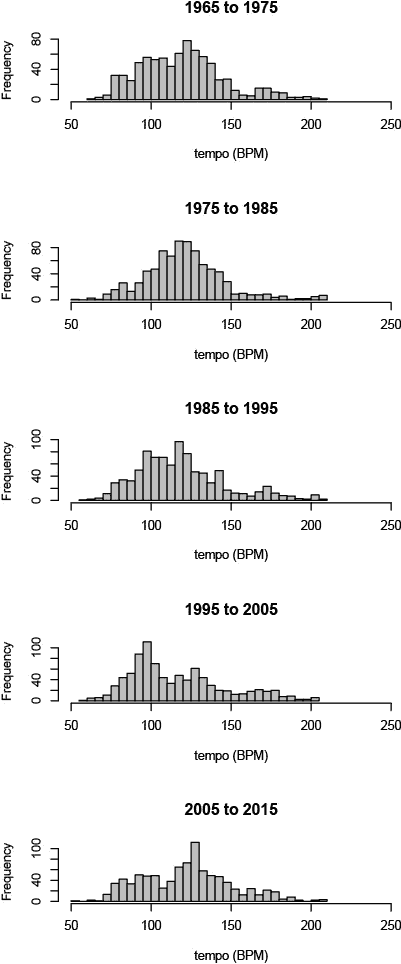
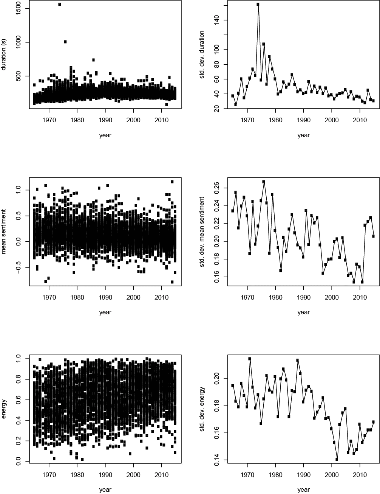
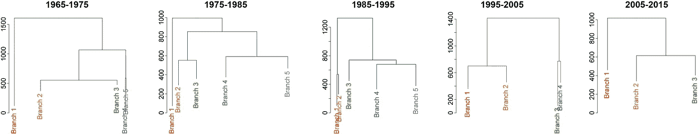

# 收音机上的小盒子:现代流行音乐听起来都一样吗？

> 原文：<https://towardsdatascience.com/little-boxes-on-the-radio-does-modern-pop-music-all-sound-just-the-same-69052c51b709?source=collection_archive---------15----------------------->

1965-2015 年公告牌热门 100 首歌曲分析

我对为我的下一个项目进行一些基本的音乐分析很感兴趣，所以我四处打探有希望的数据集。我最终选择了[这个](https://www.kaggle.com/rakannimer/billboard-lyrics)公告牌年终热门 100 首歌曲的数据阵列，它给出了 50 年间流行音乐的一个很好的快照(至少是在给定年份在电台播放的音乐)以及一个有前途的语言分析。虽然我最初只是打算探索这些数据(尤其是歌词)，看看音乐是如何变化的，但我发现了一些证据，表明歌曲随着时间的推移变得越来越相似。

在检查了一些歌曲后，我发现并非所有的歌词都完全准确(或真实)，所以我用 [geniusR](https://github.com/JosiahParry/geniusR) 从 genius.com 那里搜集歌词，并尽可能多地填补漏洞。此外，我利用了真正优秀的 [spotifyR](https://www.rcharlie.com/spotifyr/index.html) 包，从 Spotify 的海量数据库中获取了关于每首曲目的一些基本音乐参数(速度、音调等等)。

# **随着时间的推移，宋的情绪变得更加“消极”**

对于抒情内容的分析，我选择通过 [syuzhet](https://cran.r-project.org/web/packages/syuzhet/syuzhet.pdf) 包使用逐行情感测量。我最初是一个词一个词地分析歌曲，但因为大多数词都是中性的，所以它没有像看一整行歌词(词与词的总和)那样有洞察力。从那以后，相对简单地考察作为年份函数的宋情绪:

虽然总体情绪仍然大于零，但随着时间的推移，情绪明显(几乎完全线性)下降(线性模型，p <0.0001). Digging a little deeper, I think we can attribute this decrease to multiple factors. First and foremost, curse words (from ‘ass’ and ‘damn’ on up) are all associated with negative sentiment, independent of their context (the sentence “he looked damn fine” is negative overall, even though contextually it could be interpreted as positive). It’s definitely an incredible understatement to say that hip hop has grown in popularity from 1965 to [today](https://www.businessinsider.com/hip-hop-passes-rock-most-popular-music-genre-nielsen-2018-1) )，所以我认为有理由将“负面情绪”的增加至少部分归因于热门 100 强中嘻哈和说唱歌曲数量的增加。此外，虽然，我想说的是，歌曲在其他流派中也多少有些消极/不太积极，与歌词的粗俗无关。例如，比较这四首几十年前的“积极”歌曲

对于这些更现代、总体上“消极”的歌曲(在这两种情况下，更积极的情绪→更红的文本和更消极的情绪→更蓝的文本):

我认为现在的乐观、快乐摇滚、流行和灵魂乐歌曲比过去少了(谢天谢地，这也意味着像“美味美味/我肚子里有爱”这样的歌词也少了)。如今，你也不太可能在流行电台上听到像凯特·斯蒂文斯这样的民谣诗人，或者像杰克逊五兄弟这样的放克/舞蹈/摩城乐队；这并不是说当前的音乐艺术家不再存在于这种类型的音乐中，这可能只是因为这种类型的音乐不再受欢迎/有利可图，以至于无法获得主流电台时间的很大一部分。

# 随着时间的推移，歌曲变得越来越罗嗦

进一步分析歌词，还有另一个明显的效果:现代歌曲比 20 世纪 60 年代的歌曲有更多的词。为了控制歌曲变得越来越长的事实([也许部分是由于技术的进步](https://www.vox.com/2014/8/18/6003271/why-are-songs-3-minutes-long))，我决定可视化这种效果的最好方法是每分钟字数(WPM)。

Words per minute (WPM) for each song. Red line represents the median WPM for each year. The most notable outlier from the oldies, ‘I Like it Like That’ by the Dave Clark Five (1965) squeezes nearly 300 words into a 90 second song (annotated at far left). Even so, it’s still in a completely different league from rap songs like Ice Cube’s ‘Bop Gun (One Nation)’ .

从 1990 年左右开始并持续到现在，WPM 值的增加是显而易见的。再说一次，考虑到嘻哈音乐流行的时间线，我并不觉得这有什么特别令人惊讶的(不管怎样，“冰冰宝贝”(1990 年)是第一首在公告牌排行榜上排名第一的说唱单曲[。如图所示，数据集中 WPM 值最高的都是 hip hop 曲目，而且都是 1990 年以后发行的。将 WPM 可视化为十年长度的直方图(左)也清楚地表明了这一点:从 90 年代中期开始，一直持续到现在，很大一部分歌曲的 WPM 值远远高于前几十年观察到的 WPM 值。](https://en.wikipedia.org/wiki/Ice_Ice_Baby#Charts_and_sales)

此外，最近几十年来，进入 Billboard 100 的歌词稀疏的歌曲比例越来越小。与 1965-1995 年相比，当时大约 1/4 到 1/3 的歌曲每分钟不到 50 WPM，很少有 1995-2015 年的 Billboard 歌曲如此稀疏。如前图所示，WPM 值最低的三首歌都是在 1985 年之前发行的，基本上没有任何歌词(除了“灵魂手指”，它有不朽的歌词:“灵魂手指！灵魂手指！灵魂手指”[被邻居小孩喊](https://en.wikipedia.org/wiki/Soul_Finger)。

# 速度随时间变化

从抒情内容和情感分析继续，我接下来深入研究了 Spotify 为每首歌曲计算的[音乐特征](https://developer.spotify.com/documentation/web-api/reference/tracks/get-audio-features/)的选择。首先，我检查了节奏，用每分钟节拍数(BPM)来衡量。

虽然我们肯定没有看到像抒情或 WPM 那样戏剧性的变化，但歌曲节奏随着时间的推移有一些变化。

用每十年的直方图可视化 BPM(左图)会使其中一些趋势更加清晰。最突出的是，现代歌曲中似乎有三组相对不同的节奏:~90 BPM、~ 120 BPM 和~170 BPM。这与 1995 年以前的歌曲有些不同，1995 年以前的歌曲在 120 BPM 左右形成了一个大的、相对连续的分布。其他研究表明，大多数嘻哈歌曲都在 90 BPM 左右，而 120-130 BPM 是最受欢迎的节奏。另一方面，150-200 BPM 的歌曲可能只是被 Spotify 的算法误认为实际 BPM 两倍的歌曲(阿黛尔的《你好》、埃利·古尔丁的《像你一样爱我》、Fall Out Boy 的《世纪》都被错误地识别为> 150 BPM)。因此，相对于老歌来说，现代流行歌曲可以更清楚地分为两个相对不同的群体(慢节奏和“理想”节奏)。

# 现代歌曲更加同质化(在某些方面)

最后，我看了看其他音乐特征，看看关于流行音乐的的【T2 常见的 [抱怨](https://www.theguardian.com/music/2012/jul/27/pop-music-sounds-same-survey-reveals) [是否属实，歌曲现在真的彼此更相似了。我发现三个音乐特征似乎可以佐证这一理论:歌曲时长、音乐情绪和能量。](https://qz.com/767812/millennial-whoop/)

(Left) Billboard Hot 100 songs plotted by their duration (top), mean overall linguistic sentiment (middle), and overall energy (bottom). (Right) The standard deviations for each of these three measures has steadily decreased over time.

这三个指标中的每一个都显示出它们的方差随着时间的推移而显著下降，粗略地说，这意味着现代歌曲比过去更加相似(至少在持续时间、情感和能量方面)。这种相似性的增加也可以通过按十年创建歌曲的树状图来可视化，根据音乐特征进行聚类，并以 500 的距离进行切割。在这里，我们再次看到现代音乐比过去的歌曲有更大程度的相似性(树中的组更少)。

在某种程度上，这也很容易解释:随着时间的推移，音乐制作人已经知道什么样的歌曲最有可能流行，并将其资源用于制作尽可能多的这类歌曲。根据你的观点，这要么意味着音乐整体在走下坡路(不太可能)，要么只是收音机现在没有以前有趣了(更有可能)。我当然很难想象像“管状钟”这样 20 多分钟的乐器怪物会再次成为今年 100 首最受欢迎的歌曲之一。这是否是一件好事是一个解释的问题。