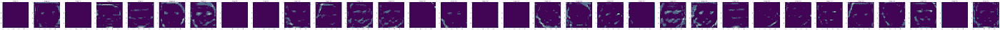
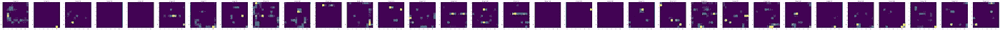
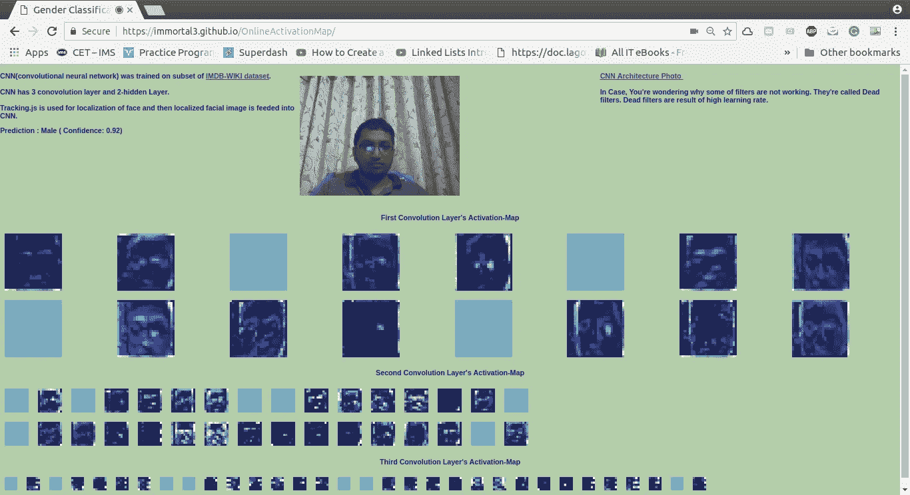

# CNN 活动地图的实时可视化(使用 Tensorflow.js)

> 原文：<https://towardsdatascience.com/live-visualisations-of-cnns-activation-maps-using-tensorflow-js-27353cfffb43?source=collection_archive---------7----------------------->

**CNN 中有哪些激活图？**

简单地说，激活图是特定卷积层的输出。我们可以使用激活图来可视化 CNN。

(这里，卷积层被称为卷积层，后跟最大池。)

**激活地图有帮助吗？**

是的，它们对 CNN 的可视化很有用，我们也可以部分地回答这样的问题:“CNN 是如何做决策的？”，“CNN 学哪些东西？”

**剩余博文分为以下主题。**

1.  CNN 详情
2.  将 Keras 模型转换为 Tensorflow.js 模型
3.  运行推理并保存激活图
4.  显示激活图

# CNN 的细节

对于实时可视化，我们需要更小的 CNN，它甚至可以在 CPU 上实时输出预测。所以，任何卷积层数少的 CNN 都可以。作为机器学习课程的一部分，我训练了紧凑型 CNN (3 Conv。层+ 2 FC 层)用于使用面部图像的二元性别分类。CNN 在包含 40k 张面部图像的 IMDB-WIKI 面部数据集【1】的子集上接受训练。受过训练的 CNN 有 0.94 F1 分。

CNN 架构的更多细节可以在[这里](https://raw.githubusercontent.com/immortal3/OnlineActivationMap/gh-pages/res/pics/model.png)找到。


**Activation Map of First Layer**



**Activation Map of Second Layer**



**Activation Map of Third Layer**

# 将 Keras 模型转换为 Tensorflow.js 模型

CNN 在 Keras 中实现，保存为 Keras 模型。有一种简单的方法可以将 keras 模型转换为 Tensorflow.js 兼容模型。

转换模型的步骤如下。官方文件可以在[这里](https://js.tensorflow.org/tutorials/import-keras.html)找到。

```
# install dependency 
$ pip install tensorflowjs# Converting Model
$ tensorflowjs_converter --input_format keras \
                       path/to/my_model.h5 \
                       path/to/tfjs_target_dir
```

输出填充将如下所示:

```
$ ls tfjs_traget_dir
model.json
group1-shard1of1 
group2-shard1of1
...
...
group6-shard1of1
```

# 运行推理并保存激活图

现在，是时候用 CNN 模型预测性别了。为简单起见，我们假设我们的面部图像来自现场直播。

您可以查看[完整代码](https://github.com/immortal3/OnlineActivationMap)，其中包含使用 [tracking.js](https://trackingjs.com/examples/face_camera.html) 提取面部图像，然后调整为固定大小(50x50)的实现。

```
# loading Model 
genderAI = await tf.loadModel('[https://immortal3.github.io/OnlineActivationMap/res/model/model.json'](https://immortal3.github.io/OnlineActivationMap/res/model/model.json'));
```

我们可以直接使用推论，但那样我们就只有最终结果了。我们希望在前进过程中保存激活图以便可视化。

```
# Final Prediction
const genderprediction = model.predict(face_image);
```

在前进过程中保存激活地图。

```
# list containing input for every layer
var input = []# First Layer;s Input is Facial Image
input.push(tf.tidy(() => { return tf.expandDims(facialImage,0).asType('float32').div(255.0)}));

# passing Input to every layer and saving output as input for next layer    
for (var i = 1; i <= 12; i++) {
   input.push(genderAI.layers[i].apply(input[i-1]));
}

# Saving activationmaps (note that we are displaying activation map after applying max pool)     
const firstconvactivationmap = input[2];
const secondconvactivationmap = input[4];
const thirdconvactivationmap = input[6];
```

**显示激活地图**

为了可视化，我们可以使用 ploty.js 中的[热图。您可以查看包含实现的完整代码。](https://plot.ly/javascript/heatmaps/)



现场演示:[https://immortal3.github.io/OnlineActivationMap/](https://immortal3.github.io/OnlineActivationMap/)

完整代码:【https://github.com/immortal3/OnlineActivationMap /

关于我:【https://immortal3.github.io/about/】T4

(注意:对于 Mac 用户来说，tensorflow.js 存在一些问题，因此，它可能会工作，也可能不会工作。)