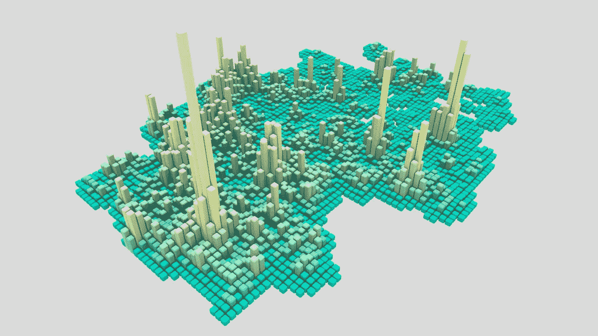
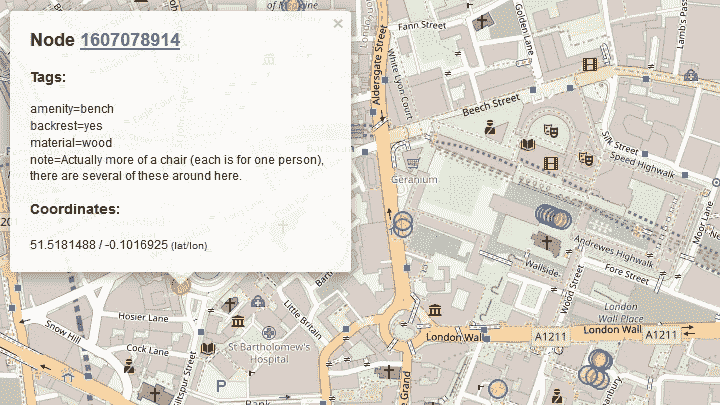
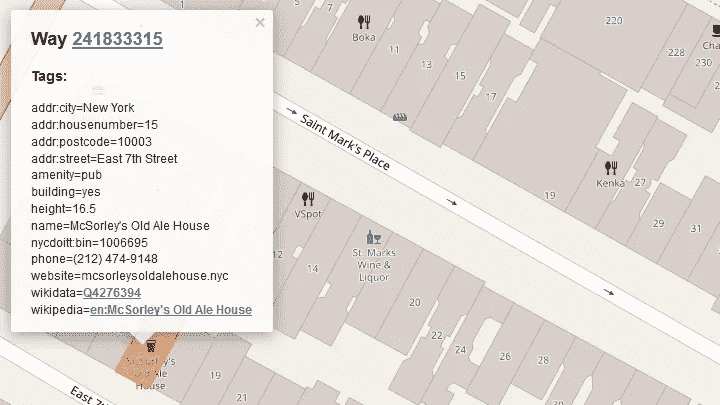
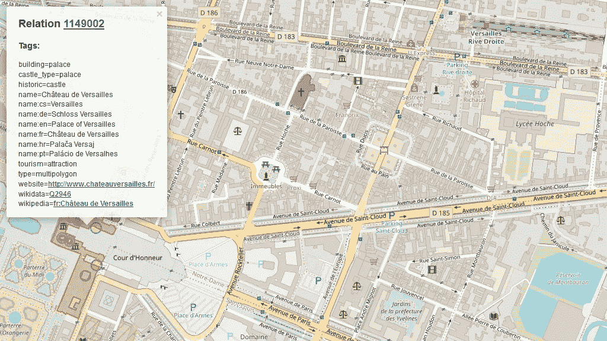
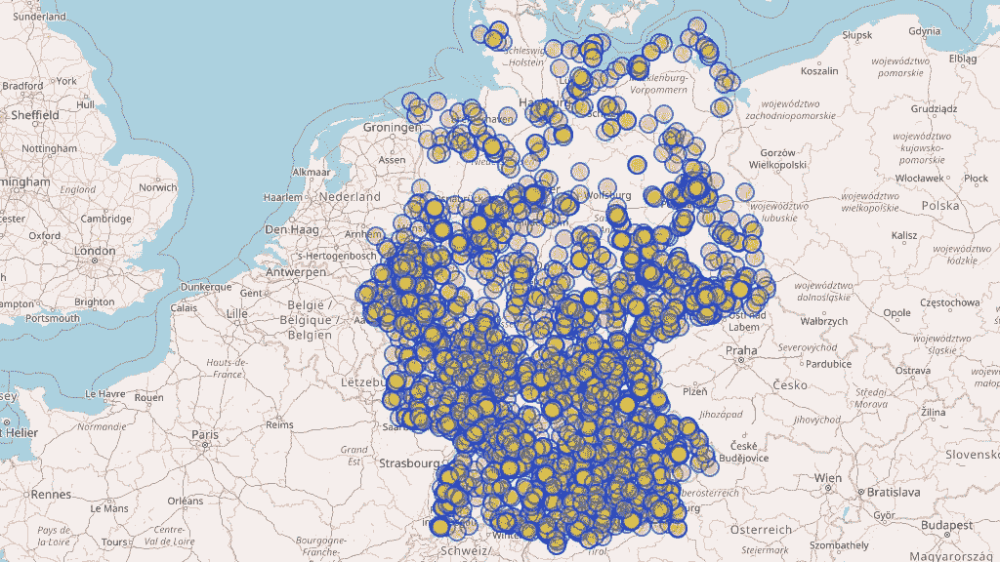
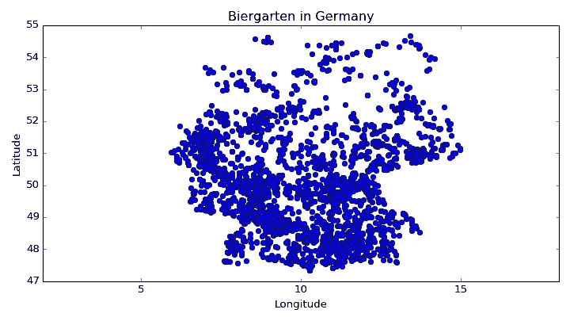
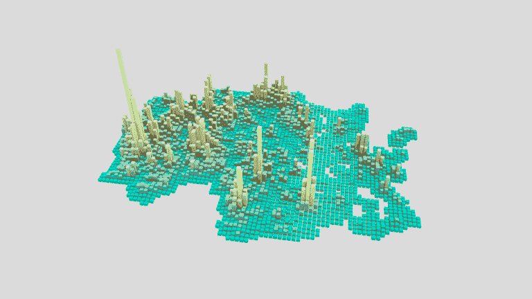

# 使用 Python 和天桥 API 从 OpenStreetMap 加载数据

> 原文：<https://towardsdatascience.com/loading-data-from-openstreetmap-with-python-and-the-overpass-api-513882a27fd0?source=collection_archive---------1----------------------->

你有没有想过德国大部分 Biergarten 在哪里，或者瑞士隐藏着多少家银行？ [OpenStreetMap](https://www.openstreetmap.org/) 是一个伟大的开源世界地图，它可以让我们对这些和类似的问题有所了解。隐藏了大量的数据，充满了有用的标签和地理信息，但是我们如何得到这些数据呢？



Biergarten in Germany, can you guess the big peak?

从 OpenStreetMap (OSM)下载地图数据有多种方式，如他们的 [wiki](https://wiki.openstreetmap.org/wiki/Downloading_data) 所示。当然，你可以下载整个 [Planet.osm](https://wiki.openstreetmap.org/wiki/Planet.osm) 文件，但是在本文发表时，你需要释放超过 800 GB 的空间，才能将整个数据集放在你的计算机上等待分析。如果你只需要处理某个区域，你可以使用各种格式的[提取](https://wiki.openstreetmap.org/wiki/Planet.osm#Country_and_area_extracts)，比如原生`[.OSM](https://wiki.openstreetmap.org/wiki/OSM_XML)`(存储为 XML)、`[.PBF](https://wiki.openstreetmap.org/wiki/PBF_Format)`(T2 的压缩版本)、 [Shapefile](https://en.wikipedia.org/wiki/Shapefile) 或 [GeoJSON](https://en.wikipedia.org/wiki/GeoJSON) 。也可能有不同的 API，如本地 [OSM API](https://wiki.openstreetmap.org/wiki/API) 或[命名 API](https://wiki.openstreetmap.org/wiki/Nominatim) 。在本文中，我们将只关注[override API](http://overpass-api.de/)，它允许我们从 OSM 数据集中查询特定的数据。

# 快速浏览一下 OSM 数据模型

在我们开始之前，我们必须看看 OSM 是如何构成的。在 OSM 数据模型中，我们有三个基本组件，分别是[节点](https://wiki.openstreetmap.org/wiki/Node)、[方式](https://wiki.openstreetmap.org/wiki/Way)和[关系](https://wiki.openstreetmap.org/wiki/Relation)，它们都有一个 id。许多元素都带有[标签](https://wiki.openstreetmap.org/wiki/Tags)，这些标签描述了被表示为键值对的特定特性。简单来说，**节点**是地图上的点(以纬度和经度表示)，如下图所示，这是一张在伦敦的[长凳](https://www.openstreetmap.org/node/1607078914)的图片。



另一方面，**方式**是节点的有序列表，它可以对应于一条街道或一所房子的轮廓。这里有一个麦克索利在纽约的旧啤酒馆的例子，在 OSM 也可以找到。



最后一个数据元素是一个**关系**，它也是一个有序列表，包含节点、路径甚至其他关系。它用于建模对象之间的逻辑或地理关系。例如，这可用于大型结构，如凡尔赛宫[中的](https://www.openstreetmap.org/relation/1149002)包含多个多边形来描述建筑。



# 使用天桥 API

现在我们来看看如何从 OSM 加载数据。天桥 API 使用定制的查询语言来定义查询。这需要一些时间来适应，但幸运的是有 [Martin Raifer](https://github.com/tyrasd) 的[over Turbo](http://overpass-turbo.eu/)，它可以方便地直接在浏览器中交互评估我们的查询。假设您想要查询咖啡馆的节点，那么您的查询如下所示

```
node["amenity"="cafe"]({{bbox}}); out;
```

其中查询源代码中的每条语句都以分号结束。该查询首先指定我们想要查询的组件，在本例中是一个节点。我们在查询中应用了一个按标签过滤的方法，寻找所有键值对为`"amenity"="cafe"`的节点。在[文档](https://wiki.openstreetmap.org/wiki/Overpass_API/Overpass_QL#By_tag_.28has-kv.29)中可以找到不同的标签过滤选项。有各种各样的标签可供选择，一个常见的关键字是 [amenity](https://wiki.openstreetmap.org/wiki/Key:amenity) ，它涵盖了各种社区设施，如咖啡馆、餐厅或只是一张长椅。为了对 OSM 其他可能的标签有一个大概的了解，看看 [OSM 地图功能](https://wiki.openstreetmap.org/wiki/Map_Features)或 [taginfo](https://taginfo.openstreetmap.org/) 。

另一个过滤器是边界框过滤器，其中`{{bbox}}`对应于我们要在其中搜索的边界框，并且只在天桥 Turbo 中工作。否则，您可以通过经纬度中的`(south, west, north, east)`指定一个边界框，如下所示

```
node["amenity"="pub"]
  (53.2987342,-6.3870259,53.4105416,-6.1148829); 
out;
```

你可以试试天桥涡轮。正如我们之前在 OSM 数据模型中看到的，也有可能拥有相同属性的方法和关系。我们也可以通过使用一个 [union](https://wiki.openstreetmap.org/wiki/Overpass_API/Overpass_QL#Union) block 语句来获得这些结果，该语句收集一对括号内的语句序列的所有输出，如

```
( node["amenity"="cafe"]({{bbox}});
  way["amenity"="cafe"]({{bbox}});
  relation["amenity"="cafe"]({{bbox}});
);
out;
```

下一种过滤查询的方法是通过元素 id 过滤[。下面是查询`node(1); out;`的例子，它给出了经度接近于零的世界](https://wiki.openstreetmap.org/wiki/Overpass_API/Overpass_QL#By_element_id)的[本初子午线。](https://www.openstreetmap.org/node/1)


另一种过滤查询的方法是按地区指定[，可以像指定`area["ISO3166-1"="GB"][admin_level=2];`一样指定，这样我们就可以得到英国的地区。我们现在可以使用它作为查询的过滤器，方法是将`(area)`添加到我们的语句中，如](https://wiki.openstreetmap.org/wiki/Overpass_API/Overpass_QL#By_area_.28area.29)

```
area["ISO3166-1"="GB"][admin_level=2];
node["place"="city"](area);
out;
```

该查询返回英国的所有城市。也可以使用关系或方式作为区域。在这种情况下，区域 id 需要通过将`2400000000`添加到其 OSM id 中，或者在有关系的情况下，通过添加`3600000000`从现有的 OSM 方式中导出。请注意，并不是所有的路/关系都有一个区域对应物(即那些标有`area=no`的路/关系，以及大多数没有定义`name=*`的多多边形将不属于区域)。如果我们将[英国](https://www.openstreetmap.org/relation/62149)的关系应用到前面的例子中，我们就会得到

```
area(3600062149);
node["place"="city"](area);
out;
```

最后我们可以指定查询数据的输出，这由 [out 动作](https://wiki.openstreetmap.org/wiki/Overpass_API/Overpass_QL#Print_.28out.29)配置。到目前为止，我们将输出指定为`out;`，但是还有各种可以追加的附加值。第一组值可以控制输出信息的详细程度或详细程度，如[文档](https://wiki.openstreetmap.org/wiki/Overpass_API/Overpass_QL#Print_.28out.29)中描述的`ids`、`skel`、`body`(默认值)、`tags`、`meta`和`count`。

此外，我们可以添加地理编码信息的修改。`geom`为每个对象添加完整的几何图形。当返回没有关联坐标的关系或路径，并且您想要获得它们的节点和路径的坐标时，这很重要。例如，查询`rel["ISO3166-1"="GB"][admin_level=2]; out geom;`不会返回任何坐标。值`bb`仅将边界框添加到每个路径和关系，而`center`仅添加同一边界框的中心(不是几何图形的中心)。

排序顺序可通过`asc`和`qt`进行配置，分别按对象 id 或四块索引排序，后者明显更快。最后，通过添加一个整数值，您可以设置要返回的最大元素数。

结合我们目前所学的知识，我们最终可以查询德国所有比尔加滕的位置

```
area["ISO3166-1"="DE"][admin_level=2];( node["amenity"="biergarten"](area);
  way["amenity"="biergarten"](area);
  rel["amenity"="biergarten"](area);
);
out center;
```



# Python 和天桥 API

现在，我们应该已经很好地掌握了如何使用 transition API 查询 OSM 数据，但是我们现在如何使用这些数据呢？下载数据的一种方法是使用命令行工具 [curl](https://curl.haxx.se/) 或 [wget](https://www.gnu.org/software/wget/) 。为了做到这一点，我们需要访问其中一个[over API 端点](http://overpass-api.de/)，在这里我们将按照格式`http://overpass-api.de/api/interpreter?data=query`查看。当使用 curl 时，我们可以通过运行以下命令下载查询的 [OSM XML](https://wiki.openstreetmap.org/wiki/OSM_XML)

```
curl --globoff -o output.xml [http://overpass-api.de/api/interpreter?data=node(1);out;](http://overpass-api.de/api/interpreter?data=node(1);out;)
```

其中先前精心制作的查询出现在`data=`之后，并且该查询需要被 [urlencoded](https://en.wikipedia.org/wiki/Percent-encoding) 。为了使用方括号和花括号而不被 curl 解释，`--globoff`很重要。该查询返回以下 XML 结果

```
<?xml version="1.0" encoding="UTF-8"?>
<osm version="0.6" generator="Overpass API 0.7.54.13 ff15392f">
<note>The data included in this document is from www.openstreetmap.org. 
      The data is made available under ODbL.</note>
<meta osm_base="2018-02-24T21:09:02Z"/> <node id="1" lat="51.4779481" lon="-0.0014863">
    <tag k="historic" v="memorial"/>
    <tag k="memorial" v="stone"/>
    <tag k="name" v="Prime Meridian of the World"/>
  </node></osm>
```

在[文档](http://overpass-api.de/output_formats.html)中有多种输出格式可供选择。为了下载 JSON 格式的查询结果，我们需要在查询的开头添加`[out:json];`,如

```
curl --globoff - o output.json [http://overpass-api.de/api/interpreter?data=[out:json];node(1);out;](http://overpass-api.de/api/interpreter?data=[out:json];node(1);out;)
```

给我们之前的 JSON 格式的 XML 结果。您也可以通过访问[http://overpass-api.de/api/interpreter?在浏览器中测试查询 data =[out:JSON]；节点(1)；出；](http://overpass-api.de/api/interpreter?data=[out:json];node(1);out;)。

但是我已经承诺使用 Python 来获得结果查询。我们现在可以用 Python 运行我们众所周知的 Biergarten 查询，方法是使用 [requests](http://docs.python-requests.org/en/master/) 包来访问天桥 API 和 [json](https://docs.python.org/3/library/json.html) 包，以从查询中读取结果 json。

```
import requests
import jsonoverpass_url = "http://overpass-api.de/api/interpreter"
overpass_query = """
[out:json];
area["ISO3166-1"="DE"][admin_level=2];
(node["amenity"="biergarten"](area);
 way["amenity"="biergarten"](area);
 rel["amenity"="biergarten"](area);
);
out center;
"""
response = requests.get(overpass_url, 
                        params={'data': overpass_query})
data = response.json()
```

在这种情况下，我们不必为我们的查询使用 urlencoding，因为这由`requests.get`负责，现在我们可以存储数据或直接进一步使用数据。我们关心的数据存储在`elements`键下。那里的每个元素都包含一个`type`键和一个`id`键，前者指定它是节点、路还是关系。因为我们在查询中使用了`out center;`语句，所以我们为每条道路和关系获取了一个存储在`center`键下的中心坐标。在节点元素的情况下，坐标就在`lat, lon`键下面。

```
import numpy as np
import matplotlib.pyplot as plt# Collect coords into list
coords = []
for element in data['elements']:
  if element['type'] == 'node':
    lon = element['lon']
    lat = element['lat']
    coords.append((lon, lat))
  elif 'center' in element:
    lon = element['center']['lon']
    lat = element['center']['lat']
    coords.append((lon, lat))# Convert coordinates into numpy array
X = np.array(coords)plt.plot(X[:, 0], X[:, 1], 'o')
plt.title('Biergarten in Germany')
plt.xlabel('Longitude')
plt.ylabel('Latitude')
plt.axis('equal')
plt.show()
```



另一种用 Python 访问 over float API 的方法是使用 [overpy](https://github.com/DinoTools/python-overpy) 包作为包装器。在这里你可以看到我们如何用 overpy 包来翻译前面的例子

```
import overpyapi = overpy.Overpass()
r = api.query("""
area["ISO3166-1"="DE"][admin_level=2];
(node["amenity"="biergarten"](area);
 way["amenity"="biergarten"](area);
 rel["amenity"="biergarten"](area);
);
out center;
""")coords  = []
coords += [(float(node.lon), float(node.lat)) 
           for node in r.nodes]
coords += [(float(way.center_lon), float(way.center_lat)) 
           for way in r.ways]
coords += [(float(rel.center_lon), float(rel.center_lat)) 
           for rel in r.relations]
```

overpy 的一个优点是它从响应中检测内容类型(即 XML、JSON)。如需更多信息，请查看他们的[文档](https://python-overpy.readthedocs.io/en/latest/)。你可以将这些收集到的数据用于其他目的，或者像在 [openstreetmap-heatmap](https://github.com/njanakiev/openstreetmap-heatmap) 项目中一样，用 Blender 将其可视化。这就把我们带回了标题图片，正如你可能已经猜到的，它显示了德国比尔加藤的分布。



Image from [openstreetmap-heatmap](https://github.com/njanakiev/openstreetmap-heatmap)

# 结论

从获取特定区域内的建筑的需求开始，我发现在 OSM 有多少不同的东西可以发现，我迷失在地理空间兔子洞。看到 OSM 还有多少有趣的数据有待探索是令人兴奋的，甚至包括在 OSM 找到建筑物的 3D 数据的可能性。由于 OSM 是基于贡献的，你也可以探索 OSM 是如何随着时间的推移而增长的，以及有多少用户加入了本文[中的](http://oslandia.com/en/2017/07/03/openstreetmap-data-analysis-how-to-parse-the-data-with-python/)文章，该文章使用 [pyosmium](http://osmcode.org/pyosmium/) 检索某些地区的 OSM 用户统计数据。我希望我启发了你，让你带着新装备的工具去 OSM 深处发现新奇和有趣的发现。

*感谢阅读！如果你喜欢这篇文章，请继续展示你的爱，并关注我更多的文章。还有，在* [*LinkedIn*](https://www.linkedin.com/in/nikolai-janakiev/) *或者*[*Twitter*](https://twitter.com/njanakiev/)*上随时联系我。*

*本文原载于*[*janakiev.com*](https://janakiev.com/)*。*