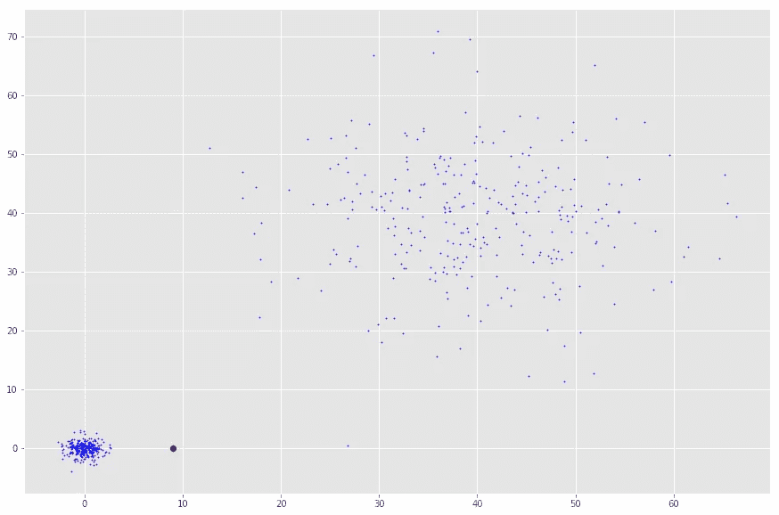
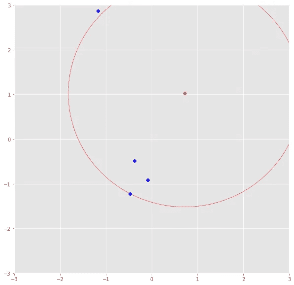
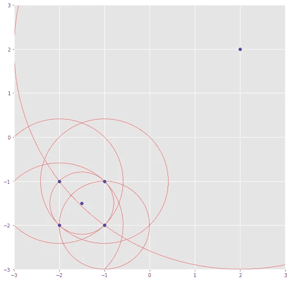

# 用于异常检测的局部异常因子

> 原文：<https://towardsdatascience.com/local-outlier-factor-for-anomaly-detection-cc0c770d2ebe?source=collection_archive---------2----------------------->

## 关于局部异常因子的简短综述

局部异常值因子(LOF)是一个分数，表示某个数据点是异常值/异常值的可能性。

> LOF ≈1 没有异常值
> 
> ≫1 之外

首先，我引入一个参数 *k* ，它是 LOF 计算要考虑的邻居数量。LOF 是一种计算方法，通过查看某一点的相邻点来找出其密度，并在稍后将其与其他点的密度进行比较。使用正确的数字 *k* 并不简单。虽然小的 *k* 具有更局部的焦点，即仅查看附近的点，但是当数据中有很多噪声时，它更容易出错。然而，大的 k 可能会遗漏局部异常值。

The density of the red point to its nearest neighbors is not different from the density to the cloud in the upper right corner. However, it is probably an outlier compared to the nearest neighbors’ density.

## k 距离

定义了这个 *k* 之后，我们可以引入 *k-distance* ，它是一个点到其邻居*k*的距离。如果 *k* 为 3，则 *k 距离*将是一个点到第三个最近点的距离。

The red point’s k-distance is illustrated by the red line if k=3.

## 可达性距离

*k 距离*现在用于计算可达性距离。这个距离度量就是两点之间的最大距离和第二点的 k 距离。

> reach-dist(a，b) = max{k-distance(b)，dist(a，b)}

基本上，如果点 *a* 在点 *b* 的 *k* 邻域内， *reach-dist(a，b)* 将是 *b* 的 *k-distance* 。否则就是 *a* 和 *b 的真实距离*这只是一个“平滑因子”。为简单起见，将这视为两点之间的通常距离。

## 局部可达性密度

*reach-dist* 然后用于计算另一个概念——局部可达性密度(lrd)。为了获得点 *a* 的 lrd，我们将首先计算 *a* 到其所有 *k* 最近邻居的可达性距离，并取该数字的平均值。lrd 就是平均值的倒数。请记住，我们讨论的是密度，因此，到下一个邻居的距离越长，相应点所在的区域就越稀疏。因此，密度越低——反之亦然。

> lrd(a) = 1/(总和(reach-dist(a，n))/k)

凭直觉，局部可达性密度告诉我们从我们的点到下一个点或点群要走多远。它越低，密度越小，我们要走的路就越长。

The lrd of the upper right point is the average reachability distance to its nearest neighbors which are points (-1, -1), (-1.5, -1.5) and (-1, -2). These neighbors, however, have other lrds as their nearest neighbors don’t include the upper right point.

## 力线

然后将每个点的 lrd 与它们的 *k* 邻居的 lrd 进行比较。更具体地说，将计算并平均每个点与其相邻点的 lrd 的 *k* 比率。LOF 基本上是 *a* 的邻居的 lrd 与 *a* 的 lrd 的平均比值。如果该比率大于 *1* ，则点 *a* 的密度平均小于其相邻点的密度，因此，从点 *a* 开始，我们必须比从 *a* 的相邻点到其下一个相邻点行进更长的距离才能到达下一个点或点群。请记住，点 *a* 的邻居可能不认为 *a* 是邻居，因为他们的可及范围内有更近的点。

总之，一个点的 LOF 表示该点相对于其相邻点的密度。如果一个点的密度远小于其相邻点(≫1 附近)的密度，则该点远离密集区域，因此是异常值。

# 参考

布鲁尼格、M. M .、克里格尔、H. P .、Ng、R. T .、桑德、J. (2000 年 5 月)。LOF:识别基于密度的局部异常值。在 *ACM sigmod 记录*(第 29 卷，№2，第 93–104 页)。ACM。