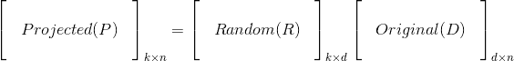
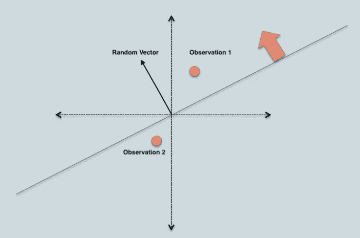
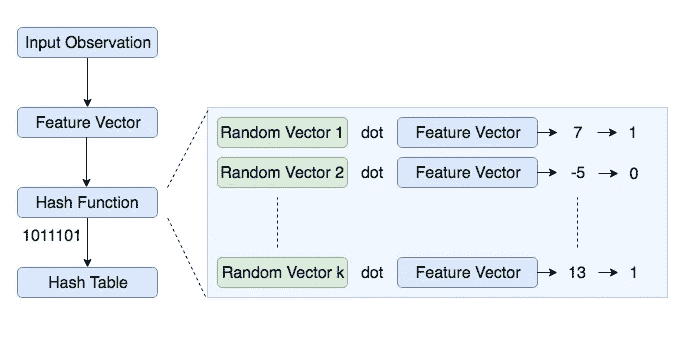
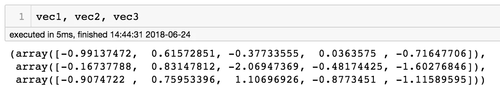
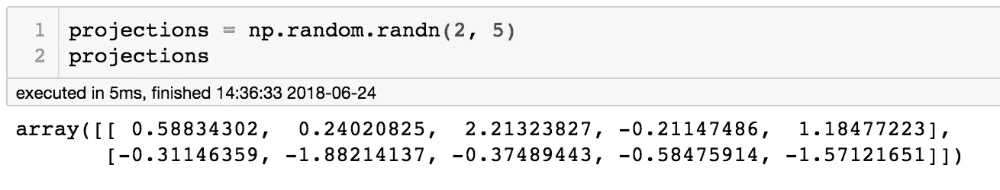
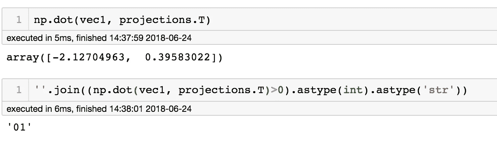
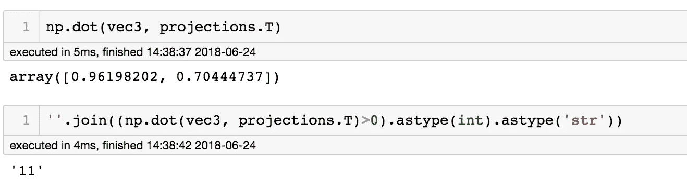
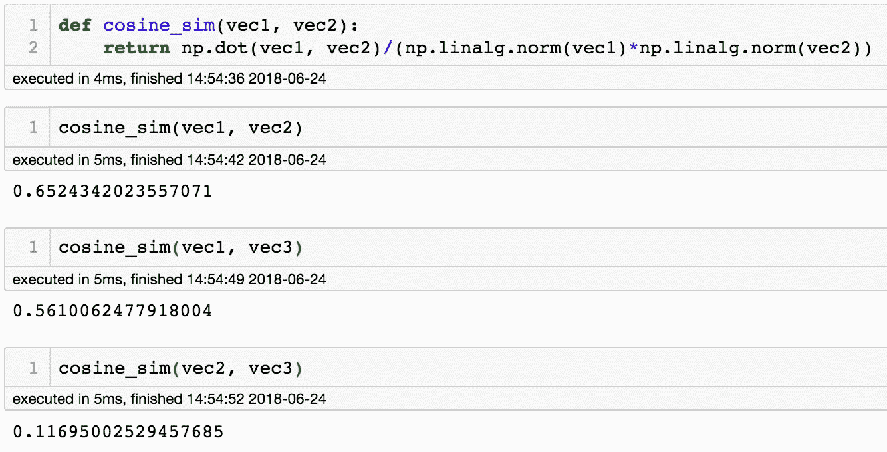

# 用于相似项目搜索的位置敏感散列

> 原文：<https://towardsdatascience.com/locality-sensitive-hashing-for-music-search-f2f1940ace23?source=collection_archive---------0----------------------->

一种识别近似最近邻的有效方法。

Source: [Unsplash](https://unsplash.com/photos/V6T99SnUCyA)

# 动机

每个人都知道 [**Shazam**](https://www.shazam.com/) ，这款应用可以让你在几秒钟内识别出任何一首歌曲。它识别歌曲的速度不仅让我惊讶，也让我想知道他们是如何用一个巨大的歌曲数据库(大约 1000 万)做到这一点的。我意识到这可以通过使用音频指纹和敏感灰化来实现(我很确定 Shazam 使用了一些先进的技术)。本文试图解释实现一个程序来执行音乐搜索(通常是类似的项目搜索)的步骤和概念。

音频指纹识别是从固定持续时间的音频流中识别独特特征的过程。可以为所有现有的歌曲识别这种独特的特征，并将其存储在数据库中。当我们听到一首新歌时，我们可以从录制的音频中提取相似的特征，并与数据库进行比较，以识别这首歌。然而，在实践中，这种方法将面临两个挑战:

1.  识别歌曲所需的独特特征/特征向量的高维度
2.  将记录的音频特征与数据库中所有歌曲的特征进行比较在时间和存储器方面是昂贵的

第一个挑战可以使用 PCA 等降维技术来解决，第二个挑战可以使用聚类和最近邻搜索的组合来解决。位置敏感哈希(以下简称 LSH)可以通过以下方式解决这两个问题

1.  将高维特征减少到更小的维度，同时保持可区分性
2.  以高概率将相似的对象(在这种情况下是歌曲)分组到相同的桶中

# LSH 的应用

在开始了解 LSH 之前，值得注意的应用领域包括

*   推荐系统
*   近似重复检测(文档、在线新闻文章等。)
*   分层聚类
*   全基因组关联研究
*   图像相似性识别(VisualRank)
*   音频相似性识别
*   数字视频指纹

**优步**利用 LSH 检测 [**平台滥用**](https://eng.uber.com/lsh/) (假账、支付欺诈等。).使用 LSH 可以构建一个 Shazam 风格的应用程序或 Youtube 大小的推荐系统。

# 什么是 LSH？

LSH 是一种基于哈希的算法，用于识别近似最近邻。在正常最近邻问题中，空间中有一堆点(我们称之为训练集)并且给定一个新点，目标是识别训练集中最接近给定点的点。这种过程的复杂性是线性的[对于那些熟悉 Big-O 符号的人来说，O(N)，其中 N 是训练集的大小]。近似最近邻算法试图将这种复杂度降低到亚线性(小于线性，但是可以是任何值)。亚线性复杂度是通过减少查找相似项目所需的比较次数来实现的。

LSH 的工作原理是，如果特征空间中有两个彼此靠近的点，它们很可能具有相同的散列(数据的简化表示)。LSH 主要不同于传统的散列法(又名加密)，因为加密散列法试图避免冲突，而 LSH 的目标是最大化相似点的冲突。在加密散列法中，对输入的微小扰动会显著改变散列，但是在 LSH 中，微小的失真会被忽略，从而可以容易地识别主要内容。哈希冲突使得相似的项目很有可能具有相同的哈希值。

> 位置敏感哈希(Locality Sensitive Hashing，LSH)是一种通用的哈希技术，顾名思义，它旨在保留数据的本地关系，同时显著降低数据集的维度。

既然我们已经建立了 LSH 是一个哈希函数，其目的是最大化相似项目的冲突，让我们正式定义:

> 如果对于高维特征空间中给定的两个点 a，b，1，则散列函数 h 是局部敏感的。如果 a 和 b 接近 2，Pr(h(a) == h(b))为高。如果 a 和 b 相差 3，Pr(h(a) == h(b))为低。识别接近物体的时间复杂度是亚线性的。

# LSH 的实施

了解了什么是 LSH，是时候了解如何实现它了。实现 LSH 需要理解如何生成哈希值。构建 LSH 的一些流行方法有

*   [最小独立排列](https://medium.com/engineering-brainly/locality-sensitive-hashing-explained-304eb39291e4)
*   [Nilsimsa 哈希(专注于反垃圾邮件)](https://wikivisually.com/wiki/Nilsimsa_Hash)
*   [TLSH](https://github.com/trendmicro/tlsh/blob/master/TLSH_CTC_final.pdf) (用于安全和数字取证应用)
*   随机投影又名 SimHash

在本文中，我将给出一个使用随机投影方法实现 LSH 的演练。好奇的读者可以从链接的 URL 中了解其他方法。

## 迂回随机投影法

随机投影是一种在低维特征空间中表示高维数据的技术(降维)。它因其在低维空间中近似保持关系(成对距离或余弦相似性)的能力而受到关注，同时计算成本较低。

> 随机投影背后的核心思想是，如果向量空间中的点具有足够高的维数，那么它们可以以近似保持点之间距离的方式被投影到合适的低维空间中。

以上陈述是对 [**约翰逊-林登施特劳斯引理**](https://en.wikipedia.org/wiki/Random_projection) **的解释。**

考虑一个用矩阵 **D** 表示的高维数据，有`n`个观察值(矩阵的列)和`d`个特征(矩阵的行)。可以用随机投影矩阵 **R** 将其投影到 k 维的低维空间，其中`k<<d`。从数学上讲，较低维度的表示 **P** 可由下式获得

随机投影矩阵 **R** 的列被称为随机向量，这些随机向量的元素独立于高斯分布(零均值，单位方差)提取。

## 使用随机投影方法的 LSH

在这个 LSH 实现中，我们构建了一个所有可能箱的表，其中每个箱由相似的项目组成。每个 bin 将由一个按位哈希值表示，该哈希值是由一系列 1 和 0 组成的数字(例如:110110，111001)。在这种表示中，具有相同按位哈希值的两个观察值比具有不同哈希值的观察值更可能相似。生成按位哈希表的基本算法是

Dot product of random vector and observation 1 > 0, which gives a bit value of 1\. Similarly, dot product of random vector and observation 2 < 0 and the resulting bit value will be 0.

1.  创建长度为`d`的`k`个随机向量，其中`k`是按位散列值的大小，`d`是特征向量的维数。
2.  对于每个随机向量，计算随机向量和观察值的点积。如果点积的结果为正，则将位值指定为 1，否则为 0
3.  连接为`k`点积计算的所有位值
4.  对所有观察重复上述两个步骤，以计算所有观察的哈希值
5.  将具有相同哈希值的观察值分组在一起以创建 LSH 表

下面是构建这种哈希表的代码片段:

**考虑以下示例，其中我们的目标是通过为三个 5 维输入向量创建 2 位哈希值来找到相似的向量。**

随机投影向量可以从高斯分布(零均值和单位方差)生成。

使用投影矩阵进行点积，并计算三个向量的哈希值，如下图所示。

我们可以从上面的例子中推断出，与 vec1 和 vec3 或者 vec2 和 vec3 相比，vec1 和 vec2 更有可能是相似的(相同的哈希值)。我们可以观察到，与其他两种组合相比，vec1 和 vec2 的余弦相似性最大，这证实了随机投影方法的输出。

这种想法背后的直觉是，如果两个点完全对齐，即，从原点具有完美的相关性，则它们将在相同的散列容器中。类似地，相隔 180 度的两个点将在不同的仓中，而相隔 90 度的两个点有 50%的概率在相同的仓中。

此外，由于随机性，不可能将所有相似的项目正确分组。为了克服这个限制，通常的做法是创建多个散列表，并且如果它们在至少一个表中的同一个 bin 中，则认为观察值`a`类似于`b`。还值得注意的是，多个表更好地概括了高维空间，并分摊了不良随机向量的贡献。

在实践中，哈希表的数量和哈希值(k)的大小被调整以调整召回率和精确度之间的折衷。

下面是构建多个哈希表的代码片段:

# 回到音乐识别

回到音乐识别的问题，一般的算法是:

1.  为数据库中的所有歌曲构建特征向量
2.  使用上面定义的类构造 LSH 哈希表，并适当选择表的数量和哈希大小。
3.  对于新录制的音频，构建特征向量并查询 LSH 表
4.  将录制音频的特征向量与步骤 3 中返回的匹配进行比较。根据特征向量的元素，用于比较的度量可以是 L2 距离、余弦相似性或雅克卡相似性。
5.  返回具有最低/最高指标值(取决于所选指标)的结果作为匹配项

在步骤 4 中，对数据子集(比整个数据库小得多)执行相似歌曲标识的比较。这是快速计算的主要原因。此外，没有一个哈希表存储高维特征向量，节省了大量内存。最后，可以修改步骤 5，使其成为一个推荐系统。

这种音乐搜索算法的实现可以在[这里](https://musicinformationretrieval.com/lsh_fingerprinting.html)找到。

# 结论

我希望您已经了解了什么是 LSH，以及它是如何实现内存效率和计算量的。

你能抽出时间来读这篇文章真是太棒了！如果你觉得这有帮助，请考虑分享。

# 关于我

我最近从旧金山大学的数据科学硕士项目毕业，正在寻找机器学习方面的职业机会。你可以访问我的 [**网站**](https://santhoshhari.github.io/) 或者 [**LinkedIn**](https://www.linkedin.com/in/santhoshhari/) 了解更多关于我的背景和我做过的项目。

# 附加参考流程

*   [LSH 解释道](https://medium.com/engineering-brainly/locality-sensitive-hashing-explained-304eb39291e4)
*   [用于降维的 LSH](/understanding-locality-sensitive-hashing-49f6d1f6134)
*   [随机投影](https://nbviewer.jupyter.org/github/lindarliu/blog/blob/master/Random%20Projection%20and%20its%20application.ipynb)
*   [LSH 应用于音乐信息检索](https://www.youtube.com/watch?v=SghMq1xBJPI)
*   [LSH 应用于文档相似性检测](http://joyceho.github.io/cs584_s16/slides/lsh-11.pdf)
*   [使用 LSH 进行音乐搜索](https://github.com/stevetjoa/musicsearch)