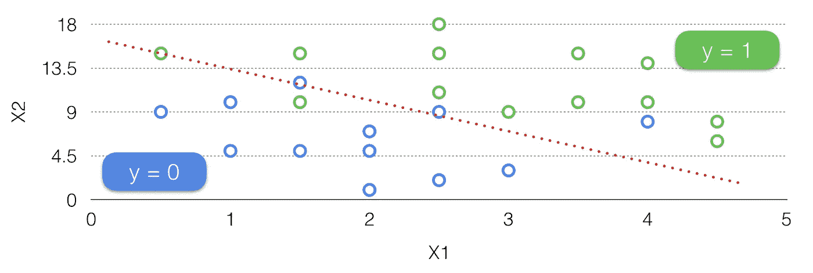
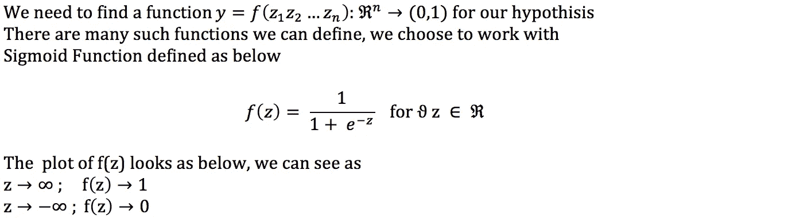
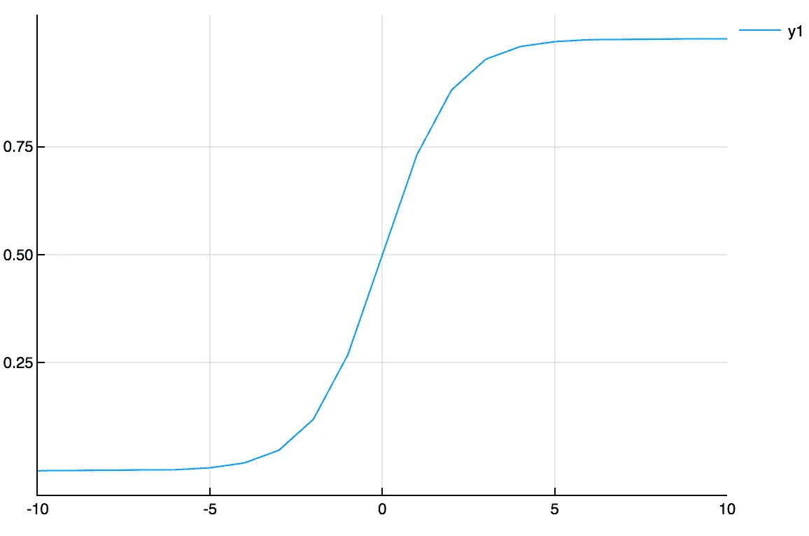
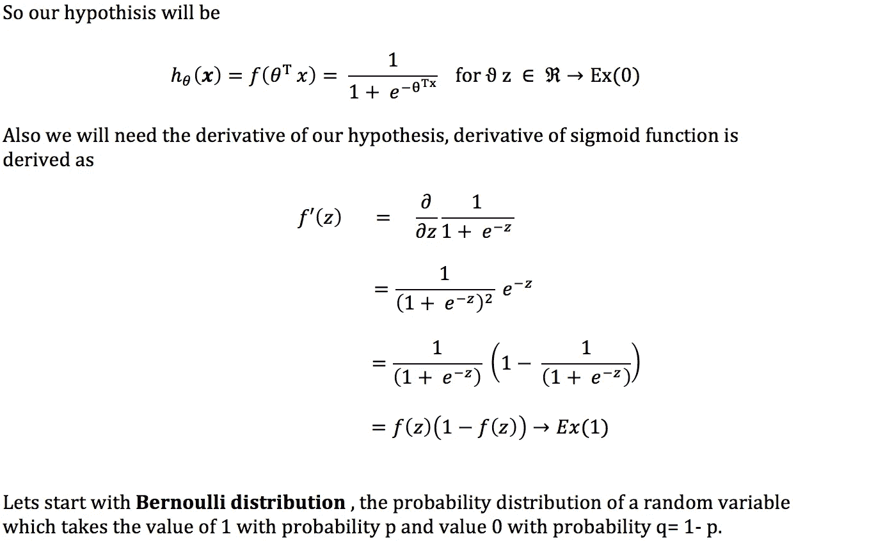
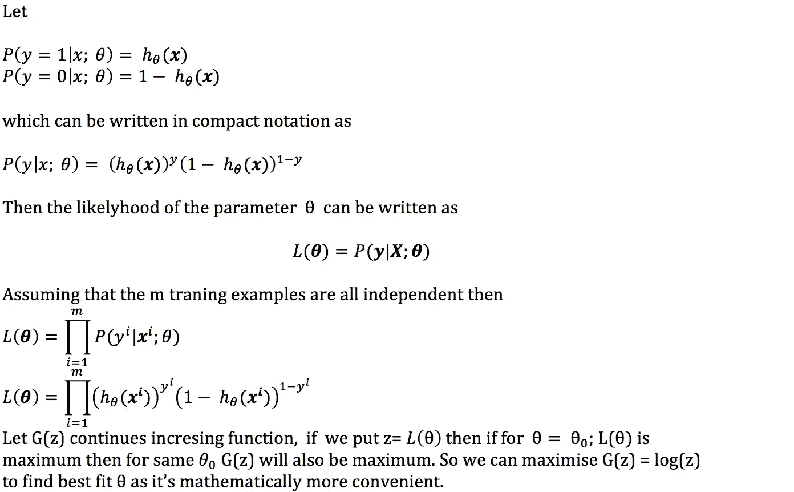
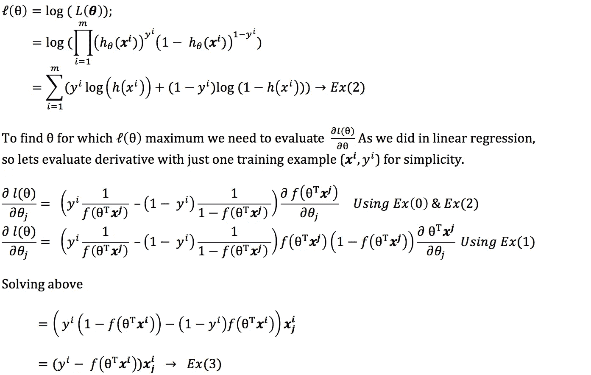
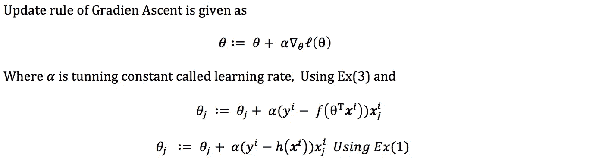
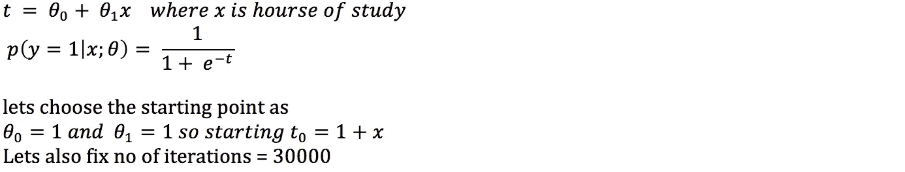
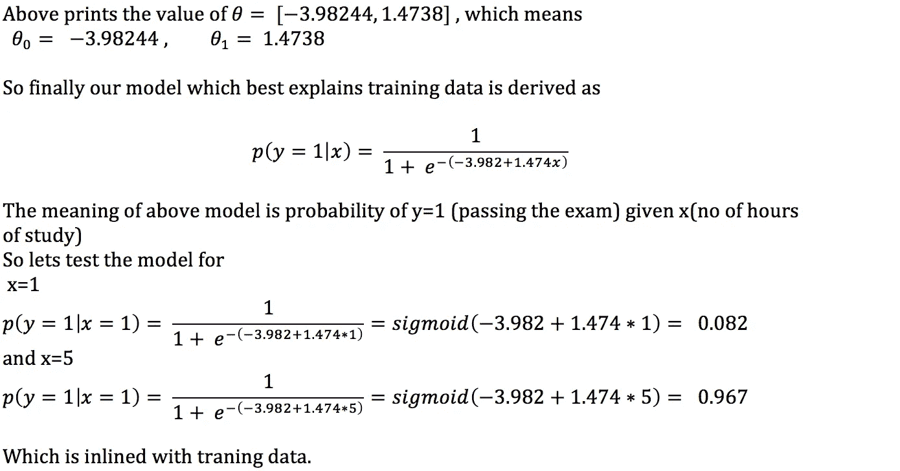

# 逻辑回归

> 原文：<https://towardsdatascience.com/logistic-regression-2b555e5f80e6?source=collection_archive---------1----------------------->

“方程中的美比让它们适合实验更重要……”—保罗·狄拉克

这也就是所谓的分类*。这在很多情况下会用到，我们希望将输入分类到预定义的类中。为了前任。将电子邮件标记为垃圾邮件/非垃圾邮件，根据商业门户的数据预测客户的年龄组等。
在 [***线性回归***](https://medium.com/@paragradke/simple-linear-regression-2421076a5892) 中，输出域是一个连续的值域，即它是一个无限集合，而在逻辑回归中，我们要预测的输出*只需要很少的离散值。即它是有限集。为简单起见，让我们考虑一个二元分类，其中 y 只能取两个值，1(正)和 0(负)。就像线性回归一样，我们需要从一个假设开始。由于输出域是有界的(0，1 ),因此产生超出此范围的值的假设没有意义。**

********

**plot of f(x) for x belongs to (-10, 10)**

****

**给定上述一组逻辑回归模型(为什么设置？因为θ是可变的)我们需要找到最佳拟合模型的系数θ，其最好地解释了训练集。为此，我们需要从一组由θ参数化的概率假设开始，然后通过**最大似然**找到θ。
让我们从**伯努利分布**开始，它是一个随机变量的概率分布，取值为 1 的概率为 p，取值为 0 的概率为 q= 1-p。**

********

**在 [***线性回归***](https://medium.com/@paragradke/simple-linear-regression-2421076a5892)**中我们* 通过将对数似然的导数等于零来求系数。我们像以前一样评估了可能性的导数，但是得到的 Ex(3)不是我们可以解决的数学上封闭的方程。(记住 x 和 theta 都是 eq 中的向量，h 是非线性函数)
我们仍然可以通过使用称为 ***梯度上升的强力算法来找到系数。*** 我们从某个系数开始，然后不断迭代更新θ，直到似然函数收敛。***

****

****例子** 让我们以[维基百科例子](https://en.wikipedia.org/wiki/Logistic_regression#Example:_Probability_of_passing_an_exam_versus_hours_of_study)
假设我们希望回答以下问题:**

> **一个由 20 名学生组成的小组花 0 到 6 个小时准备考试。学习时间的长短如何影响学生通过考试的概率？**

****************

**Plot of derived model for the range (0,6)**