# 逻辑回归:使用 Python 的简化方法

> 原文：<https://towardsdatascience.com/logistic-regression-a-simplified-approach-using-python-c4bc81a87c31?source=collection_archive---------3----------------------->

## 逻辑回归的目的是什么？

在逻辑回归中，我们希望用一个或多个自变量(X)来模拟因变量(Y)。是**分类**的方法。该算法用于**分类**的因变量。使用一个函数对 y 进行建模，该函数为 x 的所有值提供介于 0 和 1 之间的输出。在逻辑回归中，使用了 **Sigmoid** (也称为逻辑)函数。


The Sigmoid Function

## 使用混淆矩阵的模型评估

在我们对一些训练数据训练了逻辑回归模型之后，我们将评估模型对一些测试数据的性能。为此，我们使用**混淆矩阵**。混淆矩阵是一个表格，通常用于描述分类模型对一组真实值已知的测试数据的性能。下面给出了一个混淆矩阵。

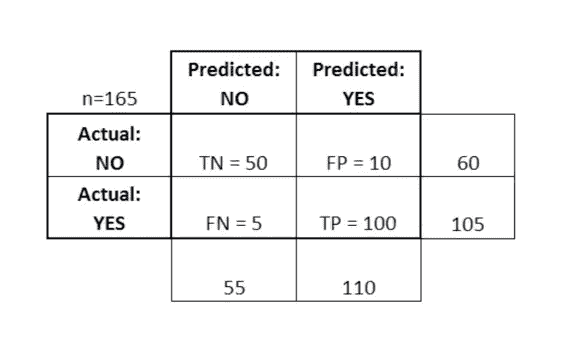

在这里，TP 代表真正值，这是我们预测为是，而实际值为真的情况。TN 代表 True Negative，这是我们预测为 no 而实际值为 false 的情况。FP 代表假阳性，即我们预测为是而实际值为假的情况。FN 代表假阴性，即我们预测为否而实际值为真的情况。

## 我们从混淆矩阵中推断出什么？

混淆矩阵帮助我们确定模型预测正确的频率，或者换句话说，模型的准确性。根据上表，它由下式给出:

(TP + TN ) /总计= 100 + 50 / 165 = 0.91

这意味着该模型 91%是正确的。混淆矩阵也用于测量误差率，误差率由下式给出:

(FP + FN ) /总计= 15 /165 = 0.09

模型有 9%的误差。

在本文中，我们将处理 python 中建模逻辑回归的非常简单的步骤。

## 带详细解释的 Python 代码

我们将观察数据、分析数据、可视化数据、清理数据、构建逻辑回归模型、拆分成训练和测试数据、进行预测并最终对其进行评估。这些都会一步一步来。我们将要处理的数据是在 kaggle.com[可用的‘泰坦尼克号数据集’。这是一个非常著名的数据集，通常是学生学习基于分类的机器学习的第一步。我们试图预测分类:生存或死亡](http://kaggle.com)

首先，我们将导入 numpy 和 pandas 库:

```
import numpy as np
import pandas as pd
```

让我们进行可视化导入:

```
import matplotlib.pyplot as plt
import seaborn as sns
%matplotlib inline
```

我们将继续把泰坦尼克号的数据集导入熊猫的数据框架。之后，我们将检查数据帧的头部，以便清楚地了解数据帧中的所有列。

```
train=pd.read_csv('titanic_train.csv')
train.head()
```

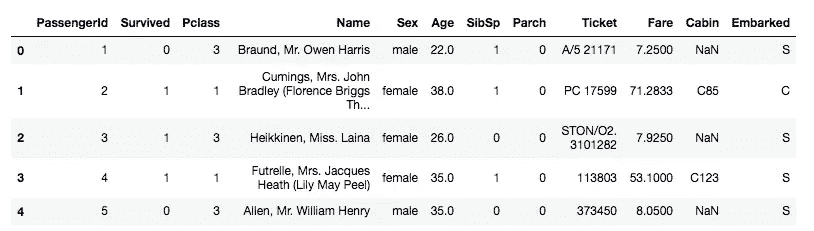

我们遇到的大多数数据都有缺失数据。我们将检查丢失的数据，也将它们可视化以获得更好的想法并删除它们。

```
train.isnull()
```

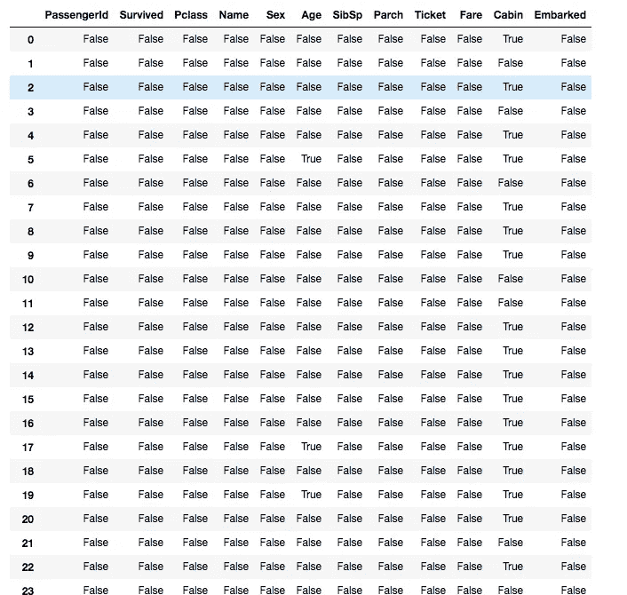

在这里，我们找到了布尔值。True 表示值为 null，False 表示值为 False，反之亦然。由于有大量的数据，我们使用 seaborn 库来可视化空值。那样的话，我们的任务就容易多了。

```
sns.heatmap(train.isnull())
```

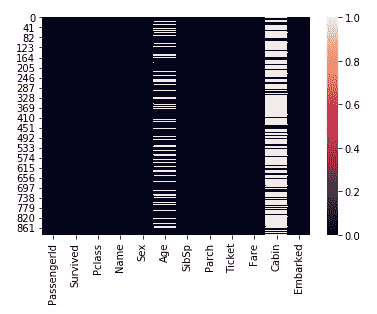

年龄和客舱列具有空值。我在之前的[博客](https://code.likeagirl.io/how-to-deal-with-na-values-in-a-dataframe-using-python-afb96d19936b)中已经处理过 NA 值的处理问题。请看看它。

摆弄数据并充分利用可视化库来享受数据带来的乐趣总是一个好习惯。

```
sns.countplot(x='Survived',data=train)
```

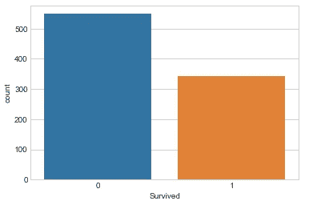

这是一个计数图，显示了幸存的人数，这是我们的目标变量。此外，我们可以根据性别和乘客等级绘制计数图。

```
sns.countplot(x='Survived',hue='Sex',data=train)
```

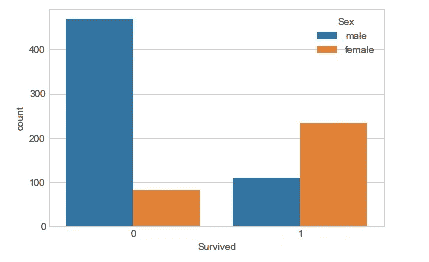

在这里，我们看到一种趋势，即女性比男性存活的更多。

```
sns.countplot(x='Survived',hue='Pclass',data=train)
```

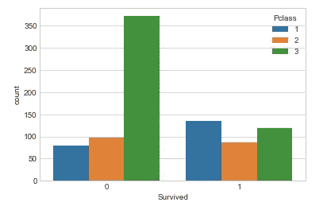

从上面的情节可以推断，属于 3 班的乘客死的最多。

我们可以用更多的方式来可视化数据。然而，我不在这里讨论它们，因为我们需要到达模型构建的步骤。

## 数据清理

我们希望填充缺失的年龄数据，而不是仅仅删除缺失的年龄数据行。一种方法是填写所有乘客的平均年龄(插补)。然而，我们可以更聪明地处理这个问题，按乘客级别检查平均年龄。例如:

```
plt.figure(figsize=(12, 7))
sns.boxplot(x='Pclass',y='Age',data=train,palette='winter')
```

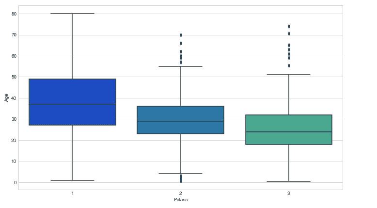

我们可以看到，在较高的阶层中，较富裕的乘客往往年龄较大，这是有道理的。我们将根据年龄的 Pclass 使用这些平均年龄值进行估算。

```
def impute_age(cols):
    Age = cols[0]
    Pclass = cols[1]

    if pd.isnull(Age):if Pclass == 1:
            return 37elif Pclass == 2:
            return 29else:
            return 24else:
        return Age
```

现在应用那个函数！

```
train['Age'] = train[['Age','Pclass']].apply(impute_age,axis=1)
```

现在让我们再检查一下热图。

```
sns.heatmap(train.isnull(),yticklabels=False,cbar=False)
```

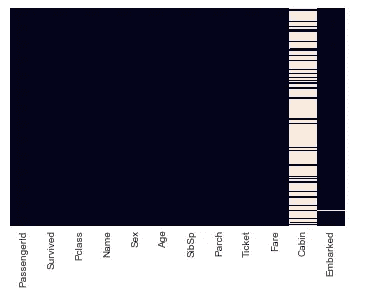

太好了！让我们继续下去，并放弃机舱柱。

```
train.drop('Cabin',axis=1,inplace=True)
```

## 转换分类特征

我们需要使用 pandas 将分类特征转换为虚拟变量！否则，我们的机器学习算法将无法直接将这些特征作为输入。

```
train.info()
```

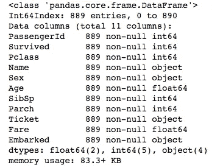

```
sex = pd.get_dummies(train['Sex'],drop_first=True)
embark = pd.get_dummies(train['Embarked'],drop_first=True)
```

在这里，我们正在模拟性别和登上专栏。在虚拟化之后，我们将删除剩余的不需要的列。

```
train.drop(['Sex','Embarked','Name','Ticket'],axis=1,inplace=True)
```

我们将把新的 sex 和 apolloed 列连接到 dataframe。

```
train = pd.concat([train,sex,embark],axis=1)
```

现在，数据帧看起来像这样:

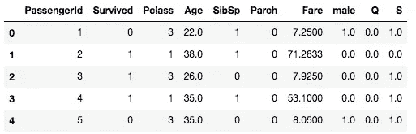

## 测试列车分离

```
from sklearn.model_selection import train_test_splitX_train, X_test, y_train, y_test = train_test_split(train.drop('Survived',axis=1), 
                                                    train['Survived'], test_size=0.30, 
                                                    random_state=101)
```

## 训练和预测

```
from sklearn.linear_model import LogisticRegression
logmodel = LogisticRegression()
logmodel.fit(X_train,y_train)
predictions = logmodel.predict(X_test)
```

## 估价

我们可以使用分类报告来检查精确度、召回率、f1 分数

```
from sklearn.metrics import classification_report
print(classification_report(y_test,predictions))
```

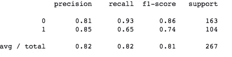

The Classification Report