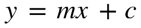
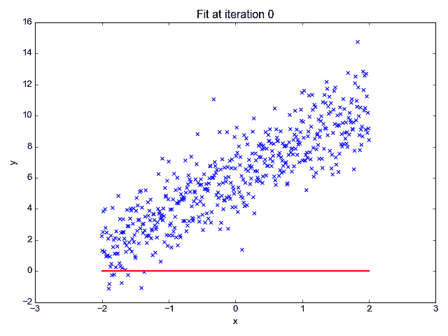
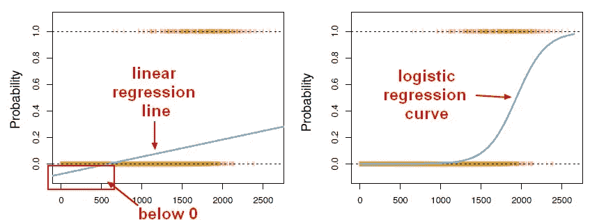
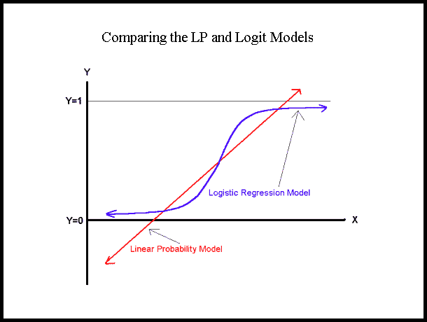
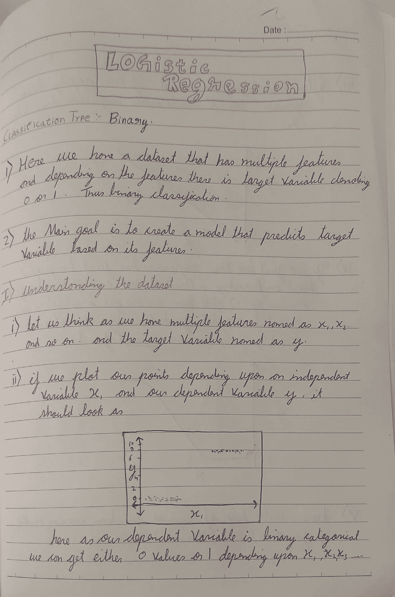
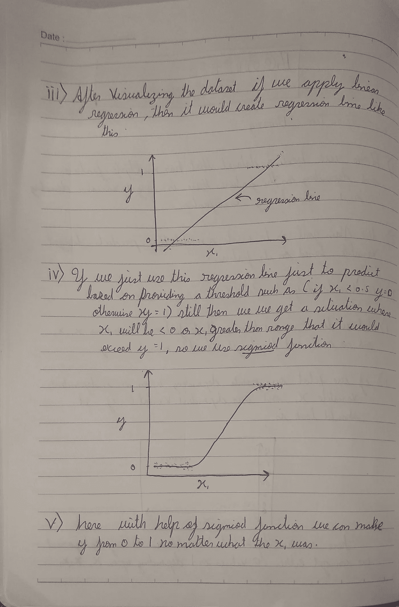
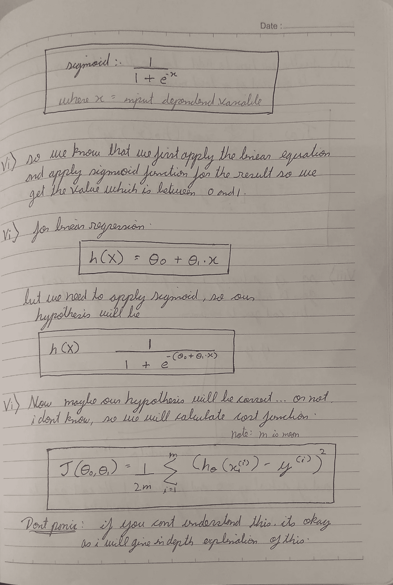
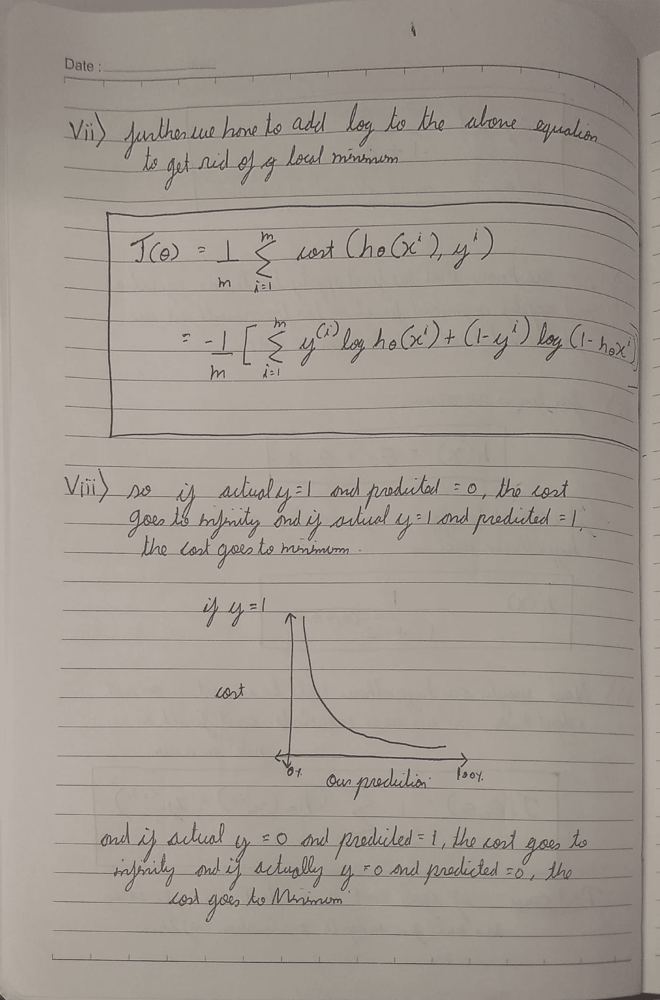
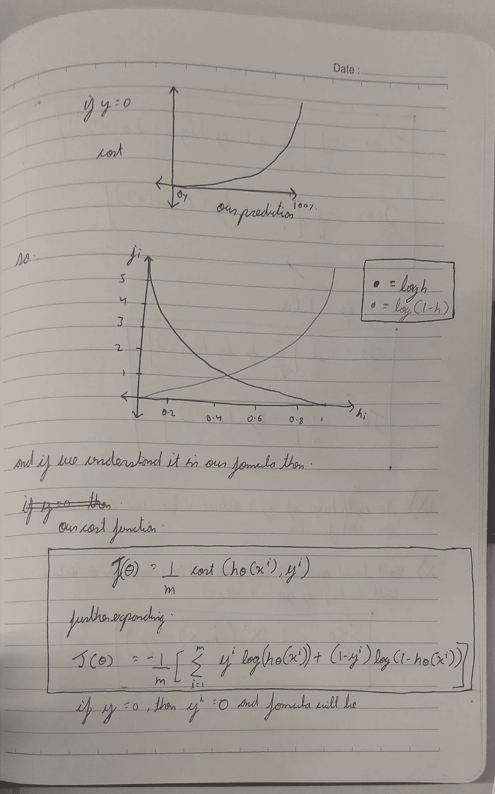
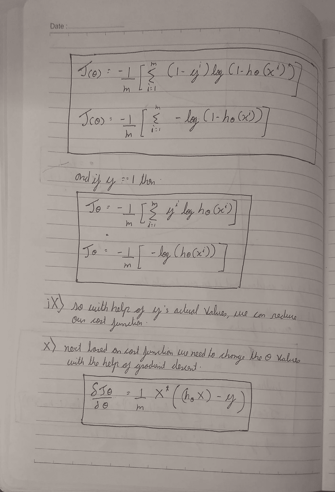

# 关于逻辑回归的所有内容都在一篇文章中

> 原文：<https://towardsdatascience.com/logistic-regression-b0af09cdb8ad?source=collection_archive---------4----------------------->

> 每个伟大的领袖背后都有一个更伟大的后勤专家。

与其他算法不同，逻辑回归很容易被年轻的开发人员误导。可能是因为人们还认为它是一个回归机器学习算法。

逻辑回归是一种统计机器学习算法，它通过考虑极端情况下的结果变量来对数据进行分类，并尝试制作一条对数线来区分它们。

# 像我五岁一样解释

逻辑回归是线性回归的兄弟，但与其名称不同，逻辑回归是一种分类算法。

让我们复习一下第一个线性回归:

**公式:**

在哪里，

*   y =必须预测的值
*   m =直线的斜率
*   x =输入数据
*   c = y 截距

有了这些值，我们可以预测 y 值，例如。

*   这里的蓝点是 x 值(输入数据)。
*   现在使用输入数据，我们可以计算斜率和 y 坐标，这样我们的预测线(红线)应该覆盖大部分的点。
*   现在使用这条线，我们可以预测给定 x 值的 y 的任何值。

现在，线性回归需要注意的一点是，它适用于连续数据，但如果我们的分类算法需要线性回归，我们需要进一步调整我们的算法。

首先，我们需要定义一个阈值，如果我们的预测值低于阈值，那么它属于第 1 类，否则属于第 2 类。

现在，如果你在想“哦，这很简单，我们必须用阈值和 vola 来定义线性回归，它变成了分类算法，这里面有一个技巧。我们必须自己定义阈值，对于大型数据集，我们将无法计算阈值。此外，一旦定义了阈值，即使我们的预测值发生变化，阈值也是相同的。

更多参考请点击[这里](https://stats.stackexchange.com/questions/22381/why-not-approach-classification-through-regression)。

另一方面，逻辑回归产生逻辑曲线，该曲线的值限于 0 和 1 之间。

逻辑回归类似于线性回归，但曲线是使用目标变量“几率”的自然对数而不是概率构建的。此外，预测值不必呈正态分布或在每组中具有相等的方差。

如果你还是不明白，那么我推荐你看下面的视频，它用简单的方式解释了逻辑回归。

# 公式

为了解释逻辑回归，我需要一些物理媒介来表达我在这个数字媒介中的知识。

所以我在笔记本上写了逻辑回归公式，然后拍了照片贴在这里。

如果你想要 pdf 版本，[点击这里](https://drive.google.com/file/d/11Lsg-zF3yTZOp3KHBi0bYAeY4F1ayt1r/view?usp=sharing)。

page 1 of 7

page 2 of 7

page 3 of 7

page 4 of 7

page 5 of 7

page 6 of 7

page 7 of 7

# 用 python 实现

*   用 python 从头开始实现逻辑回归算法**，并在每个步骤中进行解释，上传到我的 Github 库。**
*   **在 Scikit learn 的**帮助下实现逻辑回归也被添加到我的 Github 存储库中。****

** [## 2796 gaur av/逻辑回归-已解释

### 简单而详细的解释逻辑回归用于机器学习问题。…

github.com](https://github.com/2796gaurav/Logistic-regression-explained)** 

# **优势**

*   **最简单的机器学习算法之一，但效率极高。**
*   **方差很低。**
*   **它也可以用于特征提取**
*   **使用随机梯度下降，逻辑模型可以很容易地用新数据更新。**

# **不足之处**

*   **不能很好地处理大量的分类变量。**
*   **它需要非线性特征的变换。**
*   **它们不够灵活，无法自然地捕捉更复杂的关系。**

# **应用程序**

*   **图像分割和分类**
*   **地理图像处理**
*   **手写识别**
*   **垃圾邮件检测**

# **何时使用**

*   **当我们需要调整比值比时，我们知道一个以上的风险因素。**
*   **当卡方检验不显著时。**

**此外，我将添加其他机器学习算法。这篇文章的主旨是深入了解逻辑回归，不使用任何硬词，从头开始解释。此外，如果您想实现逻辑回归，从这些数据集开始，您可以在注释部分用代码注释您的预测得分。**

*   **[虹膜数据集](https://archive.ics.uci.edu/ml/datasets/iris)**
*   **[葡萄酒数据集](https://archive.ics.uci.edu/ml/datasets/Wine)**
*   **[成人数据集](https://archive.ics.uci.edu/ml/datasets/Adult)**

**如果你想学习更多的机器学习算法，请跟随我，因为我将添加我所知道的所有机器学习算法。**

**先前我已经以一种非常基本的信息方式添加了朴素贝叶斯解释。**

** [## 关于朴素贝叶斯的一切

### 一个简单而深入的学习经验，在例子的帮助下从零开始学习一个机器学习算法。

towardsdatascience.com](/all-about-naive-bayes-8e13cef044cf) 

在那之前，

## 快乐编码:)

别忘了拍手拍手拍手…

**