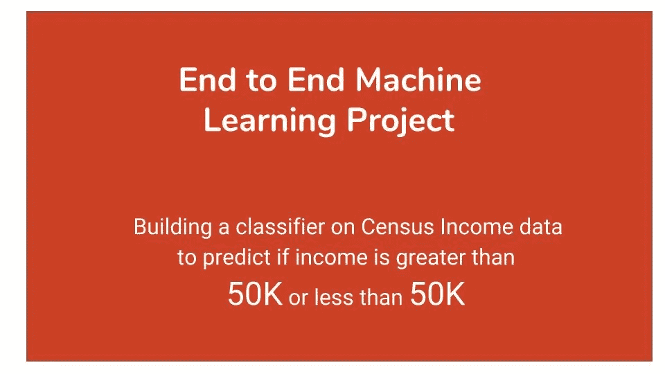
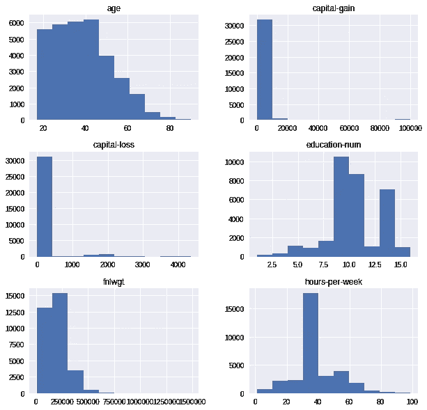
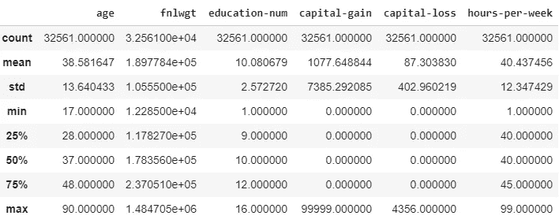
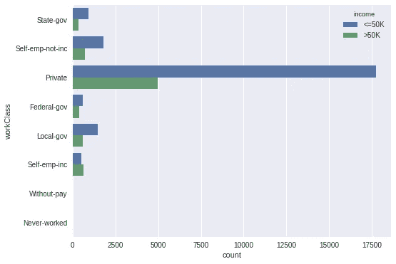
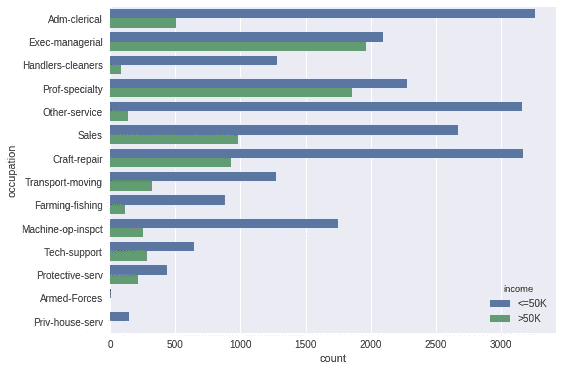
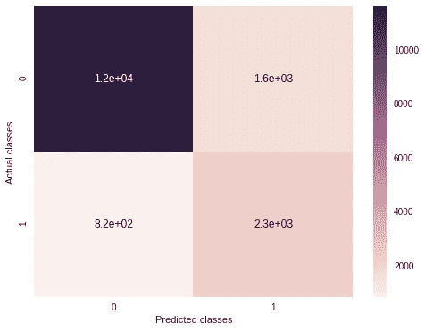

# 人口普查收入数据的逻辑回归分类器

> 原文：<https://towardsdatascience.com/logistic-regression-classifier-on-census-income-data-e1dbef0b5738?source=collection_archive---------5----------------------->



在这篇博客中，我们将分析来自 UCI 机器学习知识库的[人口普查数据集](https://archive.ics.uci.edu/ml/datasets/census+income)。

数据集包含三个文件:

*   [成人数据](https://archive.ics.uci.edu/ml/machine-learning-databases/adult/adult.data):训练数据集
*   [成人姓名](https://archive.ics.uci.edu/ml/machine-learning-databases/adult/adult.names):数据集描述
*   [成人测试](https://archive.ics.uci.edu/ml/machine-learning-databases/adult/adult.test):测试数据集

我们将使用**逻辑回归**来构建分类器。如果你不知道逻辑回归，你可以看看我之前的博客。

我们将看到如何建立一个实用的机器学习项目。一般来说，任何机器学习项目都需要以下步骤:

*   定义问题陈述
*   探索性数据分析
*   训练模型
*   微调模型
*   保存模型

所以让我们开始吧。

# **定义问题陈述**

数据包含匿名信息，如年龄、职业、教育、工人阶级等。*目标是训练一个二元分类器来预测收入，它有两个可能的值'> 50K '和'< 50K '。*数据集中有 48842 个实例和 14 个属性。数据很好地融合了分类值、数值值和缺失值。

首先，我们将导入所需的库

```
import numpy as np
import pandas as pd
import io
import requests
import seaborn as sns
from matplotlib import pyplot as plt
import pickle
import os
from pandas.api.types import CategoricalDtypefrom sklearn.base import BaseEstimator, TransformerMixin
from sklearn.pipeline import Pipeline
from sklearn.metrics import accuracy_score
from sklearn.linear_model import LogisticRegression
from sklearn.model_selection import GridSearchCV
from sklearn.metrics import classification_report
from sklearn.metrics import confusion_matrix
from sklearn.preprocessing import StandardScaler
from sklearn.pipeline import FeatureUnion
from sklearn.model_selection import cross_val_score%matplotlib inline
```

**下载数据**

我们将编写一个小脚本来下载 URL 列表的内容，并将它们保存在一个文件夹中，而不是手动下载数据集。以后我们可以直接使用下载的数据，而不是每次都打网络。您也可以将此代码用于任何机器学习项目。

```
def load_dataset(path, urls):
    if not os.path.exists(path):
        os.mkdir(path)

    for url in urls:
        data = requests.get(url).content
        filename = os.path.join(path, os.path.basename(url))
        with open(filename, "wb") as file:
            file.write(data)
```

我们将在当前工作目录中创建一个`data`文件夹，并存储 URL 的内容。

```
urls = ["http://archive.ics.uci.edu/ml/machine-learning-  databases/adult/adult.data",
        "https://archive.ics.uci.edu/ml/machine-learning-databases/adult/adult.names",
        "https://archive.ics.uci.edu/ml/machine-learning-databases/adult/adult.test"]load_dataset('data', urls)
```

接下来，我们使用`read_csv`函数将数据加载到一个`pandas`数据帧中。

```
columns = ["age", "workClass", "fnlwgt", "education", "education-
           num","marital-status", "occupation", "relationship",
          "race", "sex", "capital-gain", "capital-loss", "hours-per-
           week", "native-country", "income"]train_data = pd.read_csv('data/adult.data', names=columns, 
             sep=' *, *', na_values='?')
test_data  = pd.read_csv('data/adult.test', names=columns, 
             sep=' *, *', skiprows=1, na_values='?')
```

数据值前后有一些空格。为了修剪所有的空白，我们使用分隔符`‘ *, *’`。测试数据集有一个奇怪的第一行，因此我们使用`skiprows=1`跳过这一行。数据集中缺失的值用`?`表示

接下来，我们将探索数据。这是构建模型之前的重要一步。

# 探索性数据分析

让我们使用`train_data.info()`获得更多关于训练数据的信息

```
RangeIndex: 32561 entries, 0 to 32560 
Data columns (total 15 columns): 
age               32561 non-null int64 
workClass         30725 non-null object 
fnlwgt            32561 non-null int64 
education         32561 non-null object 
education-num     32561 non-null int64 
marital-status    32561 non-null object 
occupation        30718 non-null object 
relationship      32561 non-null object 
race              32561 non-null object 
sex               32561 non-null object 
capital-gain      32561 non-null int64 
capital-loss      32561 non-null int64 
hours-per-week    32561 non-null int64 
native-country    31978 non-null object 
income            32561 non-null object
```

**观察结果**

*   训练数据集中有 **32561** 个样本
*   数据集中既有分类列也有数值列
*   列**工作类别**、**职业**、**本国**有缺失值

类似地，对于测试数据集

*   有 **16281** 个样品
*   没有**没有**丢失的值

让我们借助一些可视化工具来看看数字和分类数据。

## **处理数值列**

我们使用`select_dtypes`函数选择数字列。

```
num_attributes = train_data.select_dtypes(include=['int'])
print(num_attributes.columns)['age', 'fnlwgt', 'education-num', 'capital-gain', 'capital-loss',        'hours-per-week']
```

变量**年龄**、**每周工作时间**不言自明。

*   **fnlwgt** :取样重量
*   **education-num** :受教育的总年限
*   **资本收益/资本损失**:工资以外的投资收入

**fnlwgt** 与目标变量**收入**无关，在建立模型之前将被移除

**数据可视化**

```
num_attributes.hist(figsize=(10,10))
```



使用`train_data.describe()`可以收集更多关于数据的信息



**观察结果**

*   数字属性都没有缺失值
*   这些值在不同的范围内。许多机器学习模型要求值在相同的范围内。我们将使用 sklearn 库中的 [StandardScaler](http://scikit-learn.org/stable/modules/generated/sklearn.preprocessing.StandardScaler.html) 来缩放特性。

## 处理分类列

```
cat_attributes = train_data.select_dtypes(include=['object'])
print(cat_attributes.columns)['workClass', 'education', 'marital-status', 'occupation',        'relationship', 'race', 'sex', 'native-country', 'income']
```

**数据可视化**

我们将使用 seaborn 包中的`countplot`。

```
sns.countplot(y='workClass', hue='income', data = cat_attributes)
```



```
sns.countplot(y='occupation', hue='income', data = cat_attributes)
```



**观察结果**

*   列 **education** 只是列 **education-num** 的字符串表示。我们将删除**教育**栏目。
*   变量**工作类别**、**职业**、**母国**有缺失值。我们将用该列中**出现频率最高的**值替换每列中缺失的值。

我们需要不同地处理数字和分类属性。数字属性需要缩放，而对于分类列，我们需要填充缺失的值，然后将分类值编码成数字值。为了应用这些转换序列，我们将使用 sklearn 的[管道](http://scikit-learn.org/stable/modules/generated/sklearn.pipeline.Pipeline.html)类。我们还将构建可直接用于管道的定制变压器。

# 创建管道

sklearn 内置了很多变形金刚。然而，如果内置的转换器不能为您完成工作，您可以构建一个定制的转换器。你需要做的就是继承 [BaseEstimator](http://scikit-learn.org/stable/modules/generated/sklearn.base.BaseEstimator.html) 和 [TransformerMixin](http://scikit-learn.org/stable/modules/generated/sklearn.base.TransformerMixin.html) 类。您还需要实现 **fit** 和 **transform** 方法。

*   **fit:** 应该返回 self 的一个实例
*   **转换:**转换逻辑可在此添加

**列选择器管道**

sklearn 没有提供库来直接操作 pandas 数据帧。我们将编写自己的自定义转换器，它将选择相应的属性(数字或分类)

```
class ColumnsSelector(BaseEstimator, TransformerMixin):

  def __init__(self, type):
    self.type = type

  def fit(self, X, y=None):
    return self

  def transform(self,X):
    return X.select_dtypes(include=[self.type])
```

**数字数据管道**

我们使用上面定义的**列选择器**转换器选择数字属性，然后使用标准缩放器缩放数值。

```
num_pipeline = Pipeline(steps=[
    ("num_attr_selector", ColumnsSelector(type='int')),
    ("scaler", StandardScaler())
])
```

如果我们调用`num_pipeline`的`fit`和`transform`方法，它会在内部调用管道中定义的所有转换器的`fit`和`transform`方法。在这种情况下，列选择器和标准缩放器转换器。

**分类数据管道**

我们需要替换分类列中缺失的值。我们将用每列中出现频率最高的值替换缺失的值。sklearn 带有[估算器](http://scikit-learn.org/stable/modules/generated/sklearn.preprocessing.Imputer.html#)来处理缺失值。然而，**输入器**仅适用于数值。我们将编写一个定制的转换器，它将接受我们需要替换缺失值的列的列表，以及用于填充缺失值的策略

```
class CategoricalImputer(BaseEstimator, TransformerMixin):

  def __init__(self, columns = None, strategy='most_frequent'):
    self.columns = columns
    self.strategy = strategy

  def fit(self,X, y=None):
    if self.columns is None:
      self.columns = X.columns

    if self.strategy is 'most_frequent':
      self.fill = {column: X[column].value_counts().index[0] for 
        column in self.columns}
    else:
      self.fill ={column: '0' for column in self.columns}

    return self

  def transform(self,X):
    X_copy = X.copy()
    for column in self.columns:
      X_copy[column] = X_copy[column].fillna(self.fill[column])
    return X_copy
```

所有的机器学习模型都需要数值。我们将使用 [pd.get_dummies](https://pandas.pydata.org/pandas-docs/stable/generated/pandas.get_dummies.html) 将分类值转换成数值。这类似于使用 [OneHotEncoder](http://scikit-learn.org/stable/modules/generated/sklearn.preprocessing.OneHotEncoder.html) ，只是 OneHotEncoder 需要数字列。

我们需要在使用 pd.get_dummies 之前合并训练和测试数据集，因为测试数据集中可能存在训练数据集中不存在的类。为此，在`fit`方法中，我们将连接训练和测试数据集，并找出一列的所有可能值。在`transform`方法中，我们将把每一列转换成[分类](https://pandas.pydata.org/pandas-docs/stable/generated/pandas.api.types.CategoricalDtype.html)类型，并指定该列可以接受的类别列表。get_dummies 将为该列的类别列表中不存在的类别创建一个全零的列。

转换器还接受一个参数`dropFirst`,它指示我们是否应该在使用 pd.get_dummies 创建虚拟列之后删除第一列。我们应该删除第一列以避免多重共线性。默认情况下，该值设置为`True`

```
class CategoricalEncoder(BaseEstimator, TransformerMixin):

  def __init__(self, dropFirst=True):
    self.categories=dict()
    self.dropFirst=dropFirst

  def fit(self, X, y=None):
    join_df = pd.concat([train_data, test_data])
    join_df = join_df.select_dtypes(include=['object'])
    for column in join_df.columns:
      self.categories[column] = 
          join_df[column].value_counts().index.tolist()
    return self

  def transform(self, X):
    X_copy = X.copy()
    X_copy = X_copy.select_dtypes(include=['object'])
    for column in X_copy.columns:
      X_copy[column] = X_copy[column].astype({column:
                CategoricalDtype(self.categories[column])})
    return pd.get_dummies(X_copy, drop_first=self.dropFirst)
```

**完整的分类管道**

```
cat_pipeline = Pipeline(steps=[
    ("cat_attr_selector", ColumnsSelector(type='object')),
    ("cat_imputer", CategoricalImputer(columns=
          ['workClass','occupation', 'native-country'])),
    ("encoder", CategoricalEncoder(dropFirst=True))
])
```

**完成管道**

我们有两条变压器管道，即 **num_pipeline** 和 **cat_pipeline** 。我们可以使用[功能联合](http://scikit-learn.org/stable/modules/generated/sklearn.pipeline.FeatureUnion.html)来合并它们

```
full_pipeline = FeatureUnion([("num_pipe", num_pipeline), 
                ("cat_pipeline", cat_pipeline)])
```

现在我们有了构建模型的所有管道，让我们为模型准备数据并构建它。

我们将删除不需要的列

```
train_data.drop(['fnlwgt', 'education'], axis=1, inplace=True)
test_data.drop(['fnlwgt', 'education'], axis=1, inplace=True)
```

# 训练模型

我们将创建训练数据集的副本，并分离特征向量和目标值。

```
train_copy = train_data.copy()
train_copy["income"] = train_copy["income"].apply(lambda x:0 if 
                        x=='<=50K' else 1)X_train = train_copy.drop('income', axis =1)
Y_train = train_copy['income']
```

接下来，我们将`X_train`传递给我们构建的`full_pipeline`。

```
X_train_processed=full_pipeline.fit_transform(X_train)model = LogisticRegression(random_state=0)
model.fit(X_train_processed, Y_train)
```

## 测试模型

```
test_copy = test_data.copy()
test_copy["income"] = test_copy["income"].apply(lambda x:0 if 
                      x=='<=50K.' else 1)X_test = test_copy.drop('income', axis =1)
Y_test = test_copy['income']
```

我们将应用于训练数据集的相同变换应用于测试数据集。

```
X_test_processed = full_pipeline.fit_transform(X_test)predicted_classes = model.predict(X_test_processed)
```

# 模型评估

我们将使用来自 sklearn 的 [accuracy_score](http://scikit-learn.org/stable/modules/generated/sklearn.metrics.accuracy_score.html) 来确定模型的准确性

```
accuracy_score(predicted_classes, Y_test.values)
```

准确率为 85.2%

让我们画出[混淆矩阵](http://scikit-learn.org/stable/modules/generated/sklearn.metrics.confusion_matrix.html)。

```
cfm = confusion_matrix(predicted_classes, Y_test.values)
sns.heatmap(cfm, annot=True)
plt.xlabel('Predicted classes')
plt.ylabel('Actual classes')
```



X 轴代表预测类，Y 轴代表实际类。我们如何解读混淆矩阵？`1.2e+04`当实际类别为 0 时，模型正确预测类别为 0 的次数。同样，对于其余的情况也可以得出结论。

# 交叉验证

我们将使用[stratified fold](http://scikit-learn.org/stable/modules/generated/sklearn.model_selection.StratifiedKFold.html)将我们的数据集分成 k 个文件夹。在每次迭代中，`k-1`个折叠被用作训练集，剩余的折叠被用作验证。我们使用 StratifiedKFold，因为它保留了每个类中样本的百分比。

如果我们使用 [KFold](http://scikit-learn.org/stable/modules/generated/sklearn.model_selection.KFold.html) ，我们可能会面临引入采样偏差的风险，即训练集可能包含大量收入大于 50K 的样本，而测试集包含更多收入小于 50K 的样本。在这种情况下，从训练数据构建的模型将不能很好地适用于测试数据集。而 StratifiedKFold 将确保在训练和测试数据集中每个类都有足够的样本。

我们将使用 [cross_val_score](http://scikit-learn.org/stable/modules/generated/sklearn.model_selection.cross_val_score.html) 进行交叉验证。参数`cv`决定交叉验证策略。如果整数值被传递给`cv`，则使用 StatifiedKFold

```
cross_val_model = LogisticRegression(random_state=0)
scores = cross_val_score(cross_val_model, X_train_processed, 
         Y_train, cv=5)
print(np.mean(scores))
```

我们将每次迭代中获得的所有得分的平均值作为我们模型的最终得分。

交叉验证的准确率为 85.0%。

# 微调模型

我们可以通过调整参数来微调我们的模型。sklearn 附带了 [GridSearchCV](http://scikit-learn.org/stable/modules/generated/sklearn.model_selection.GridSearchCV.html) 来对估计器的指定参数值进行彻底搜索。

```
# penalty specifies the norm in the penalization
penalty = ['l1', 'l2']# C is the inverese of regularization parameter
C = np.logspace(0, 4, 10)random_state=[0]# creating a dictionary of hyperparameters
hyperparameters = dict(C=C, penalty=penalty, 
                  random_state=random_state)
```

使用 GridSearchCV 寻找最佳参数

```
clf = GridSearchCV(estimator = model, param_grid = hyperparameters, 
                   cv=5)
best_model = clf.fit(X_train_processed, Y_train)
print('Best Penalty:', best_model.best_estimator_.get_params() ['penalty'])
print('Best C:', best_model.best_estimator_.get_params()['C'])
```

最佳参数是

```
Best Penalty: l1 
Best C: 1.0
```

使用最佳模型进行预测

```
best_predicted_values = best_model.predict(X_test_processed)
accuracy_score(best_predicted_values, Y_test.values)
```

最佳参数模型的准确率为 85.2%

# 保存模型

我们已经完成了创建和测试模型的所有艰苦工作。如果我们可以保存模型以备将来使用，而不是重新训练它，那就太好了。我们将把我们的模型保存在 [pickle](https://docs.python.org/2/library/pickle.html) 中。

```
filename = 'final_model.sav'
pickle.dump(model, open(filename, 'wb'))
```

从 pickle 加载模型

```
saved_model = pickle.load(open(filename, 'rb')) 
```

现在我们可以使用该模型进行预测。

这个博客到此为止。完整的 Jupyter 笔记本可以在这里找到。

# 结束语

我们已经学会了建立一个完整的机器学习项目。在这个过程中，我们构建了可以与 sklearn 的管道类一起使用的自定义转换器。我们还学会了微调我们的模型，并保存它以备将来使用。

如果有什么地方我可以做得更好，请告诉我。

感谢阅读！！