# 逻辑回归—详细概述

> 原文：<https://towardsdatascience.com/logistic-regression-detailed-overview-46c4da4303bc?source=collection_archive---------1----------------------->

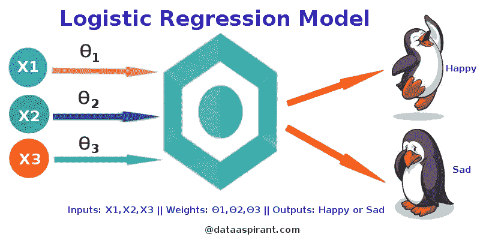

Figure 1: Logistic Regression Model (Source:[http://dataaspirant.com/2017/03/02/how-logistic-regression-model-works/](http://dataaspirant.com/2017/03/02/how-logistic-regression-model-works/))

逻辑回归在二十世纪早期被用于生物科学。后来，它被用于许多社会科学应用中。当因变量(目标)是分类变量时，使用逻辑回归。

举个例子，

*   要预测电子邮件是垃圾邮件(1)还是(0)
*   肿瘤是恶性的(1)还是非恶性的(0)

考虑一个场景，我们需要对一封电子邮件是否是垃圾邮件进行分类。如果我们对这个问题使用线性回归，就需要设置一个阈值，根据这个阈值可以进行分类。比方说，如果实际类别是恶性的，预测连续值为 0.4，阈值为 0.5，则数据点将被分类为非恶性的，这会导致实时的严重后果。

从这个例子可以推断，线性回归不适合分类问题。线性回归是无限的，这就带来了逻辑回归。它们的值严格地在 0 到 1 之间。

**简单逻辑回归**

(完整源代码:[https://github . com/SSaishruthi/LogisticRegression _ Vectorized _ Implementation/blob/master/Logistic _ regression . ipynb](https://github.com/SSaishruthi/LogisticRegression_Vectorized_Implementation/blob/master/Logistic_Regression.ipynb))

***型号***

输出= 0 或 1

假设=> Z = WX + B

hθ(x)= sigmoid(Z)

***乙状结肠功能***

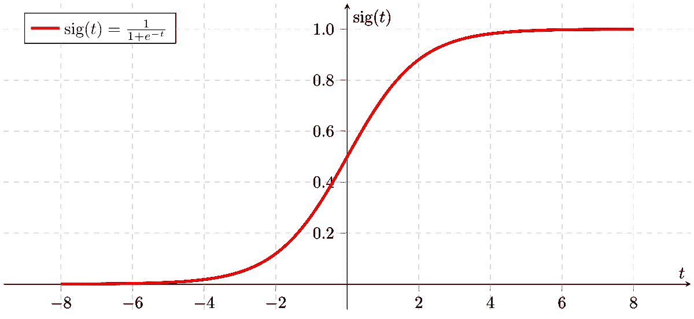

Figure 2: Sigmoid Activation Function

如果‘Z’趋于无穷大，Y(预测)将变为 1，如果‘Z’趋于负无穷大，Y(预测)将变为 0。

***分析假设***

假设的输出是估计的概率。这用于推断给定输入 x 时，预测值与实际值的可信度。考虑以下示例，

X = [x0 x1] = [1 个 IP 地址]

基于 x1 值，假设我们获得的估计概率为 0.8。这表明一封电子邮件有 80%的可能是垃圾邮件。

从数学上讲，这可以写成:

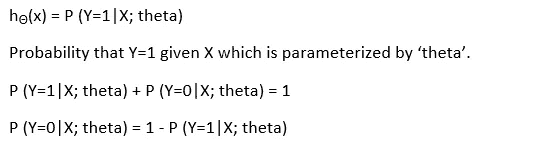

Figure 3: Mathematical Representation

这证明了“逻辑回归”这个名称的合理性。将数据拟合到线性回归模型中，然后由预测目标分类因变量的逻辑函数对其进行操作。

***逻辑回归的类型***

1.二元逻辑回归

分类回答只有两种可能的结果。示例:垃圾邮件与否

2.多项式逻辑回归

三个或更多类别，无需排序。示例:预测哪种食物更受欢迎(素食、非素食、纯素食)

3.有序逻辑回归

三个或三个以上的分类与排序。示例:电影等级从 1 到 5

***决定边界***

为了预测数据属于哪一类，可以设置一个阈值。基于该阈值，将所获得的估计概率分类。

比如说，如果 predicted_value ≥ 0.5，那么将邮件归类为垃圾邮件，否则归类为非垃圾邮件。

决策边界可以是线性或非线性的。多项式阶可以增加，以获得复杂的决策边界。

***成本函数***

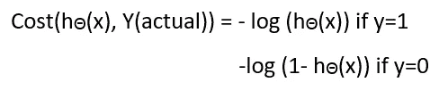

Figure 4: Cost Function of Logistic Regression

为什么用于线性的成本函数不能用于逻辑？

线性回归使用均方误差作为其成本函数。如果这用于逻辑回归，那么它将是参数(θ)的非凸函数。梯度下降只有在函数是凸的情况下才会收敛到全局极小值。

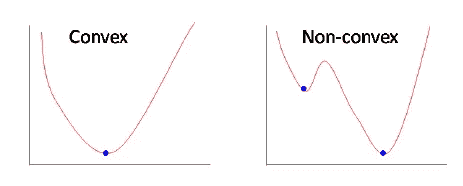

Figure 5: Convex and non-convex cost function

***成本函数解释***

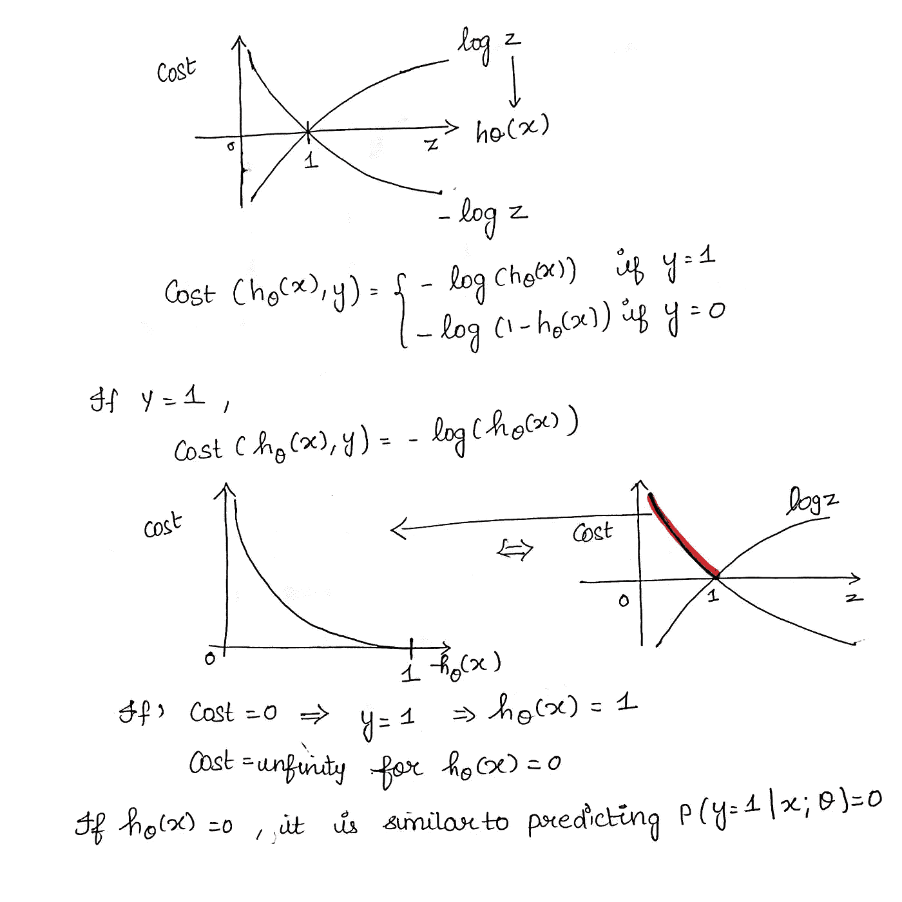

Figure 6: Cost Function part 1

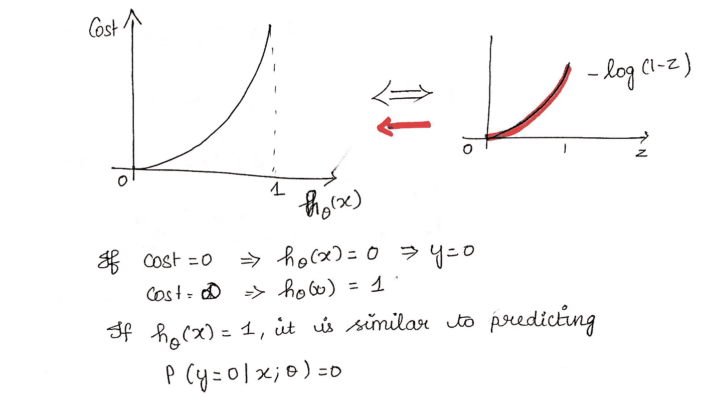

Figure 7: Cost Function part 2

***简化成本函数***

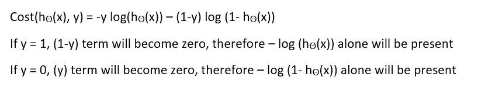

Figure 8: Simplified Cost Function

***为什么这个成本函数？***

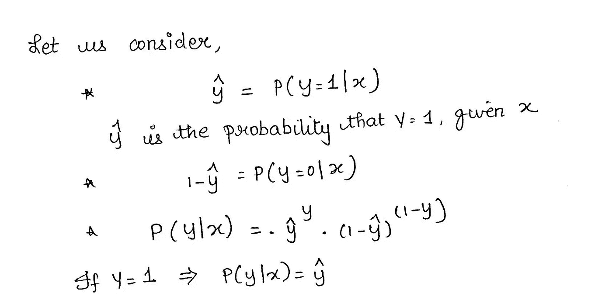

Figure 9: Maximum Likelihood Explanation part-1

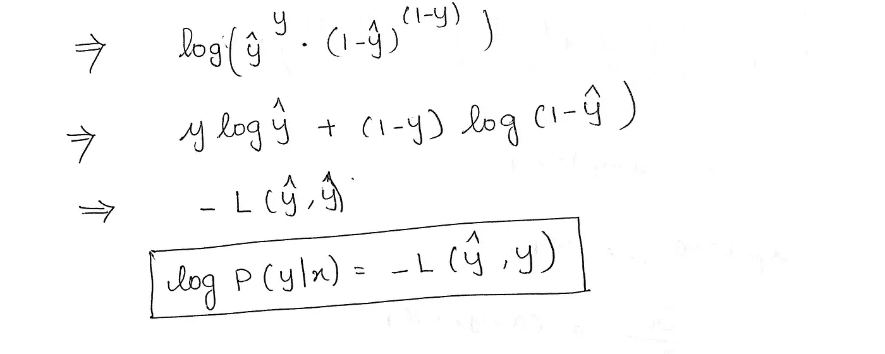

Figure 10: Maximum Likelihood Explanation part-2

这个负函数是因为我们在训练的时候，需要通过最小化损失函数来最大化概率。假设样本是从完全独立的分布中抽取的，降低成本将增加最大可能性。

***推导梯度下降算法的公式***

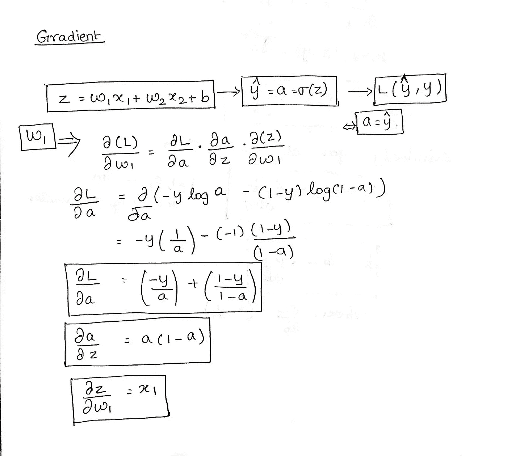

Figure 11: Gradient Descent Algorithm part 1

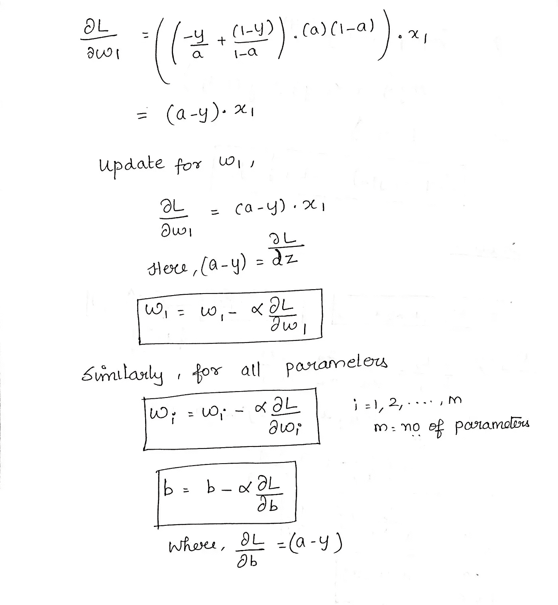

Figure 12: Gradient Descent part 2

***Python 实现***

```
def weightInitialization(n_features):
    w = np.zeros((1,n_features))
    b = 0
    return w,bdef sigmoid_activation(result):
    final_result = 1/(1+np.exp(-result))
    return final_result def model_optimize(w, b, X, Y):
    m = X.shape[0]

    #Prediction
    final_result = sigmoid_activation(np.dot(w,X.T)+b)
    Y_T = Y.T
    cost = (-1/m)*(np.sum((Y_T*np.log(final_result)) + ((1-Y_T)*(np.log(1-final_result)))))
    #

    #Gradient calculation
    dw = (1/m)*(np.dot(X.T, (final_result-Y.T).T))
    db = (1/m)*(np.sum(final_result-Y.T))

    grads = {"dw": dw, "db": db}

    return grads, costdef model_predict(w, b, X, Y, learning_rate, no_iterations):
    costs = []
    for i in range(no_iterations):
        #
        grads, cost = model_optimize(w,b,X,Y)
        #
        dw = grads["dw"]
        db = grads["db"]
        #weight update
        w = w - (learning_rate * (dw.T))
        b = b - (learning_rate * db)
        #

        if (i % 100 == 0):
            costs.append(cost)
            #print("Cost after %i iteration is %f" %(i, cost))

    #final parameters
    coeff = {"w": w, "b": b}
    gradient = {"dw": dw, "db": db}

    return coeff, gradient, costsdef predict(final_pred, m):
    y_pred = np.zeros((1,m))
    for i in range(final_pred.shape[1]):
        if final_pred[0][i] > 0.5:
            y_pred[0][i] = 1
    return y_pred
```

成本与迭代次数

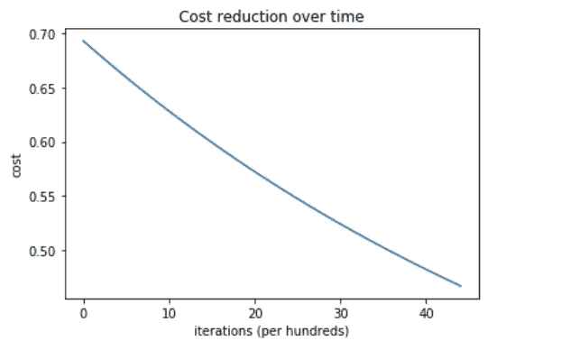

Figure 13: Cost Reduction

系统的训练和测试准确率为 100 %

该实现用于二元逻辑回归。对于超过 2 类的数据，必须使用 softmax 回归。

这是一个教育性的帖子，灵感来自吴恩达教授的深度学习课程。

完整代码:[https://github . com/SSaishruthi/LogisticRegression _ Vectorized _ Implementation/blob/master/Logistic _ regression . ipynb](https://github.com/SSaishruthi/LogisticRegression_Vectorized_Implementation/blob/master/Logistic_Regression.ipynb)