# 用于面部识别的逻辑回归

> 原文：<https://towardsdatascience.com/logistic-regression-for-facial-recognition-ab051acf6e4?source=collection_archive---------14----------------------->

## 使用 sklearn 的混淆矩阵和 ROC-AUC 曲线

# ****注意* *:此帖子不再是最新的，可能包含错误。它是为了透明而保留的。更新版本可以在这里找到******。****

**面部识别算法一直令我着迷，为了在一些数据上展示我新发现的逻辑回归技能，我基于一个名为“皮肤分割”的数据集创建了一个模型。**

**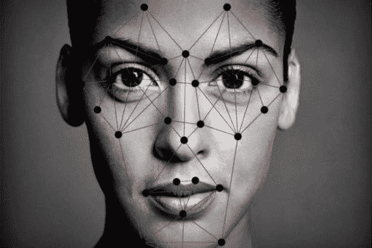**

**正如其[描述](https://archive.ics.uci.edu/ml/datasets/Skin+Segmentation)中所指出的，皮肤分割中的数据是“通过从各种年龄组(青年、中年和老年)、种族组(白人、黑人和亚洲人)以及从 [FERET](https://www.nist.gov/itl/iad/image-group/color-feret-database) 数据库和 PAL 数据库获得的性别的面部图像中随机采样 B、G、R 值来收集的。”数据集具有 245，057 行和 4 列(B、G、R 和指示图像被分类为包含皮肤还是不包含皮肤的二进制列)。后者，二元列使这个数据集适合逻辑回归。**

**(如果你想阅读使用该数据集的两篇(付费)学术文章，请参见此处的[和此处的](https://ieeexplore.ieee.org/abstract/document/5409447)和。)**

# **回归**

**我的专长是 Python，我特别想测试一下 [scikit-learn](https://scikit-learn.org/stable/index.html) 库，因为它是回归等科学任务的行业标准。我还选择使用 Juypter Notebook 作为我的 IDE，而不是 Atom 这样的文本编辑器，因为它的入门门槛较低；凭借其叙事结构，Jupyter 让大多数人都能感受到代码是如何工作的。**

**要自己运行这段代码，您需要在您的机器上/虚拟环境中安装/导入 Python 3、scikit-learn、Pandas、NumPy、matplotlib、Seaborn、Itertools 和 imb learn(requirements . txt 文件即将发布！).**

**你可以在这里找到这个项目[的回购。在那里，你可以找到一个深入的 Jupyter 笔记本，概述了这篇文章中总结的所有步骤。](https://github.com/aulorbe/skin-noskin)**

## **芒格**

**我必须对这个数据集进行的数据管理相当简单。在通过 URL 读入文本文件并保存到 Pandas dataframe 后，您可以看到它唯一真正的问题是缺少列标题。**

**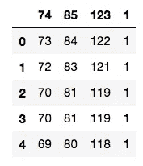**

**Original dataframe**

**在将第一行下推到数据框中并重命名列标题后，我能够得到这样的结果:**

**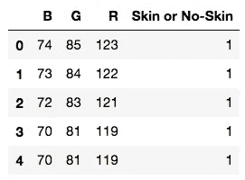**

**Munged dataframe**

**在这个数据集中，1 表示没有皮肤的像素，2 表示有皮肤的像素。**

**正如您所预料的，1 和 2 确实很有帮助，但是我们真的希望 1 和 0 用于逻辑回归。所以，我为皮肤或无皮肤专栏制作了假人。(我还将数据类型强制为 int64，以便与数据帧中的其他列保持一致。)**

**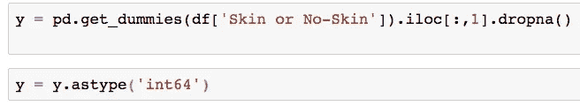**

**Making dummies and coercing datatype.**

**正如你所看到的，我把这个皮肤或者无皮肤列变成了我的 y 变量(我的因变量)。其他列我变成了一个矩阵(X)。**

**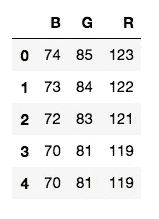**

**X matrix**

**在我的 X 矩阵中，我还想让我的所有变量都在同一标度上，所以我让它们通过一个最小-最大归一化器，并让它们都在 0-1 标度上。**

**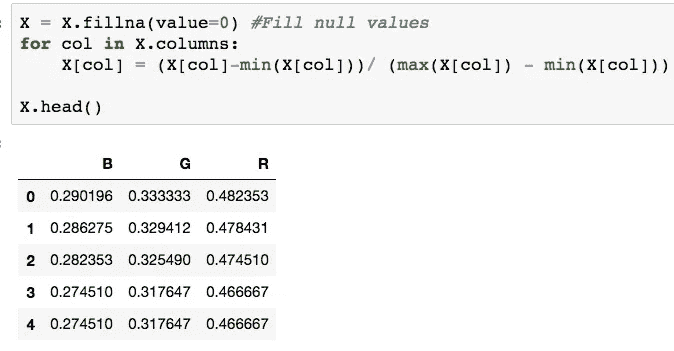**

**Normalizing X values**

## **训练-测试-分割和建立模型**

**在使我的数据进入可工作状态后，我使用 sklearn 将它分成测试集和训练集。我还创建了我的模型，使其适合我的训练数据，然后在我的训练和测试数据上运行我的模型，以查看它的性能如何。**

**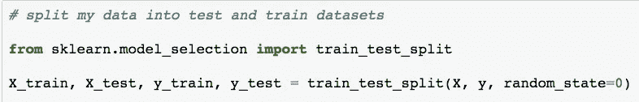**

**Train-test-split**

**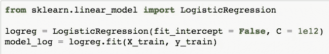**

**Creating and fitting my model**

**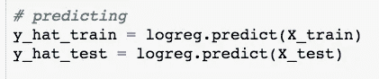**

**Running the model on my training and test data**

## **评估性能，第 1 部分:简单的读数**

**我查看了我的预测值(y_hat_train 和 y_hat_test)与我的原始 y_train 和 y_test 值之间的差异，以评估我的模型的准确性。**

**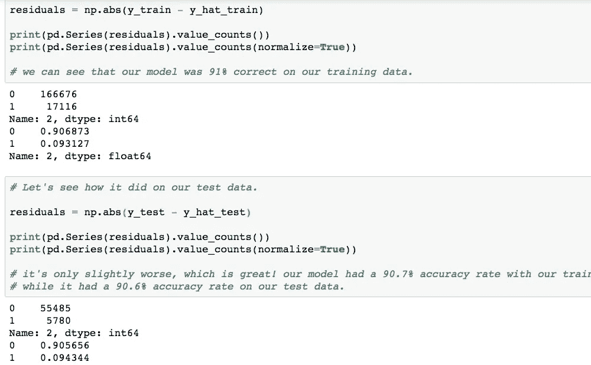**

**Evaluating initial performance**

**在读数中，与真实值相比，0 的数量是正确预测的数量，1 的数量是错误预测的数量。normalize = True 只是将读数的第一部分从预测数转换为百分比。**

**您可以看到，根据我们的训练数据，我们的模型在 90.7%的时间内是准确的，而根据我们的测试数据，它在 90.6%的时间内是准确的。相当不错！**

## **评估性能，第 2 部分:混淆矩阵**

**我还想看看我的模型在混淆矩阵方面表现如何。(关于混淆矩阵的精彩阅读，见[这里](/understanding-confusion-matrix-a9ad42dcfd62)。)**

**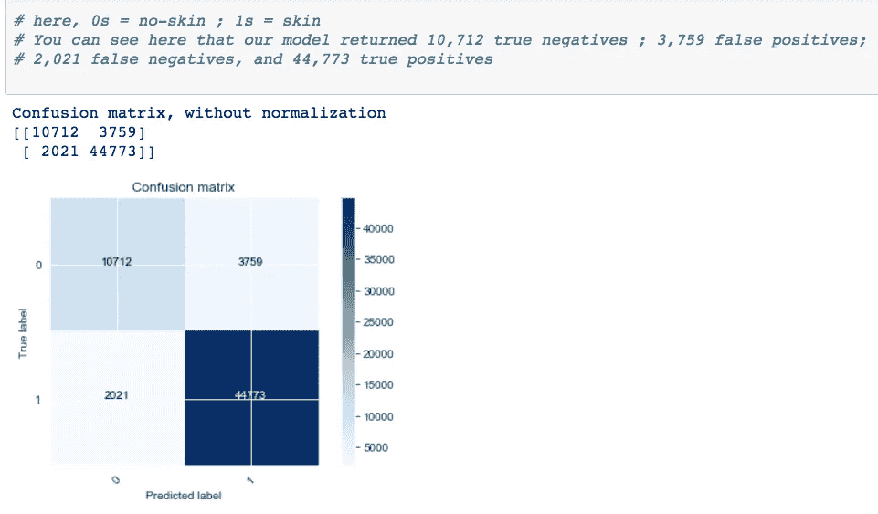**

**Confusion matrix for initial model**

**正如你在评论中看到的，这里 0 是被分类为没有皮肤的像素，1 是被分类为有皮肤的像素。**

**为了让我的混淆矩阵的值更容易理解，我运行了一个分类报告，以获得一些常见的指标，如精确度、召回率和 f1 分数。**

**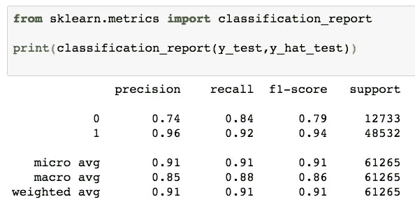**

**Classification Report from sklearn.metrics**

**您可以在这里看到，我们的模型的准确率为 96%，召回率为 92%，f1 值为 94%。我还想知道我的准确率，所以我简单地手动计算了一下，得到了 91%(与我们在上面的简单读数部分的测试数据中得到的数字相同)。**

**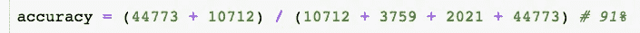**

**为了更好地展示每个分数的含义，请参见下图。**

**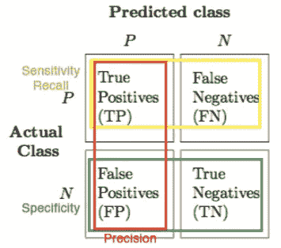**

**Recall and precision mapped onto a confusion matrix**

## **评估绩效，第 3 部分:ROC-AUC 曲线**

**ROC-AUC 曲线是一个有用的指标，因为它们衡量的是真阳性率和假阳性率。**

**我为我的训练和测试数据生成了 ROC-AUC 曲线，但是它们看起来基本相同，所以我在这里只显示训练图像。(训练数据的 AUC 为 93.4%，而测试数据的 AUC 为 93.2%。)**

**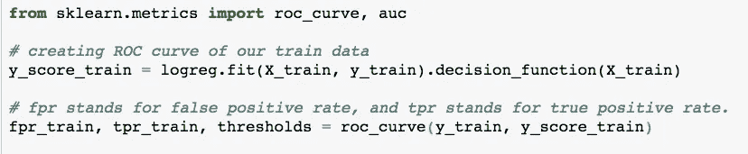**

**Creating my ROC curve**

**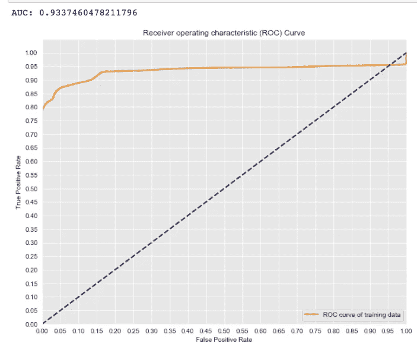**

**ROC-AUC curve for testing data.**

**更多关于 ROC-AUC 曲线及其目的可以在[这里](https://www.theanalysisfactor.com/what-is-an-roc-curve/)和[这里](/understanding-auc-roc-curve-68b2303cc9c5)找到。**

**如你所见，我们的 ROC 曲线紧挨着图表的左上角，这正是我们想要的。**

## **倒回一点:ROC-AUC 曲线和类别不平衡**

**ROC-AUC 曲线最有用的一点是，即使原始数据集中存在类别不平衡，它们也允许我们评估模型。**

**类别不平衡是指在您的数据中，一种类别明显多于另一种类别。这有能力真正搞乱你的分析。举个例子，一个罕见疾病的数据集是有偏差的(即存在类别不平衡问题)。我们假设 1000 个案例中只有 2 个是阳性的。即使你做了一个蹩脚的模型，把一切都归类为负面，你仍然会达到 99.8%的准确率(即 998 / 1000 的分类是正确的)。因此，当模型在不平衡的数据集上运行时，您需要更多的上下文来真正评估您的模型。**

**所以，让我们倒回去一点，看看我们的数据是否不平衡。也许我们可以让我们的模型变得更好。**

**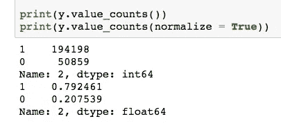**

**Class balance for original data**

**我们可以看到，我们的数据有点奇怪——大约 79%被归类为 1(即包含皮肤的像素)，只有大约 21%被归类为 0(即不包含皮肤的像素)。**

**所以，在我们今天结束之前，让我们运行一个叫做 SMOTE(合成少数过采样)的东西。SMOTE 创建合成数据来为我们的少数类填充更多的值(在我们的例子中，这意味着它将为我们提供更多的 0 数据点)。尽管创建合成数据看起来像是作弊，但这在数据科学世界中是非常常见的做法，因为数据集通常并不均衡。**

**对我们的原始数据运行 SMOTE 并重新生成我们的混淆矩阵和分类报告，我们得到以下结果。**

**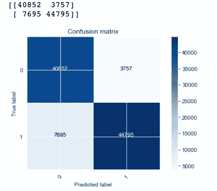**

**SMOTE confusion matrix**

**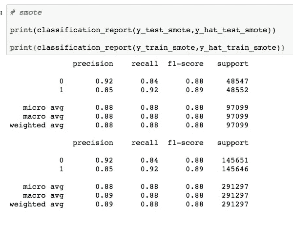**

**Classification Report for SMOTE-ized data, showing both training and test readouts**

**我们可以看到这些数字与我们最初的数字有很大的不同。回想一下，第一次我们的准确率为 96%，召回率为 92%，f1 得分为 94%。通过 SMOTE 运行我们的数据后，我们的准确率为 85%，召回率为 92%，f1 得分为 89%。**所以，我们的模型在试图补偿阶级不平衡后实际上变得*更差*。****

**作为数据科学家，何时对我们的数据运行 SMOTE 之类的操作，或者让我们的数据保持原样，这取决于我们。在这种情况下，我们可以看到，让我们的数据保持原样是正确的做法。**

# **那么，这一切意味着什么呢？**

**除了是一个很好的学习机会，我们真的创造了一个很好的模式。我们知道，在这种情况下，对我们的数据做其他事情，例如试图补偿阶级不平衡，肯定不是我们应该做的。我们的原始模型是我们表现最好的，在 94%的时间里正确预测了有皮肤的图像(使用我们的 f1 分数)。**

**虽然这听起来可能是一个不错的分类率，但创建用于面部识别的算法会带来无数的伦理问题。如果我们的模型被用来在人群中识别被通缉的恐怖分子呢？这当然不同于在 Snapchat 中为滤镜识别人脸。**

****

**From [Christoph Auer-Welsbach](https://medium.com/@AWChristoph)’s post “[The Ethics of AI: Building technology that benefits people and society](https://medium.com/cityai/the-ethics-of-ai-building-technology-that-benefits-people-and-society-ea6b10c5ff3)”**

**这是我们作为数据科学家在创建算法时需要尽可能多的信息的地方。如果我们的模型用于 Snapchat 过滤器，我们可能会希望优化以提高我们的回忆分数——表面上看，当事物不是人脸时，我们错误地将它们识别为人脸比有时只识别真实人脸要好。**

**另一方面，如果我们的模型用于在人群中发现通缉犯，我们可能仍然希望优化回忆，但结果将会大不相同。如果这意味着你几乎 100%的时间都能抓到被通缉的罪犯，那么把无辜的人带进来审问并潜在地侵犯他们的权利值得吗？或许不会。**

**当我们在人工智能的世界里玩耍时，我们需要仔细思考这些问题。正如凯茜·奥尼尔在*数学毁灭武器*中所写的，构建算法需要“道德想象力，而这只有人类才能提供。”**