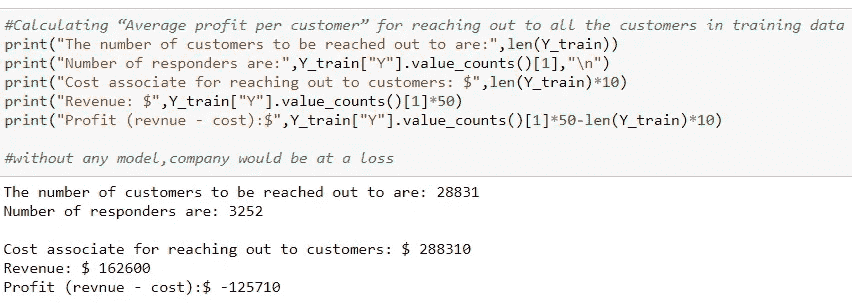
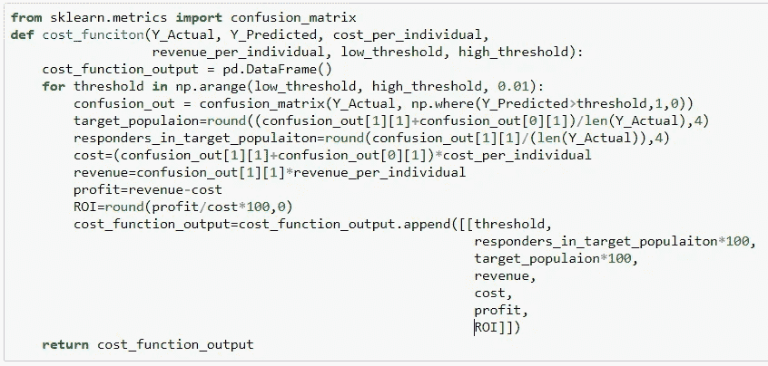
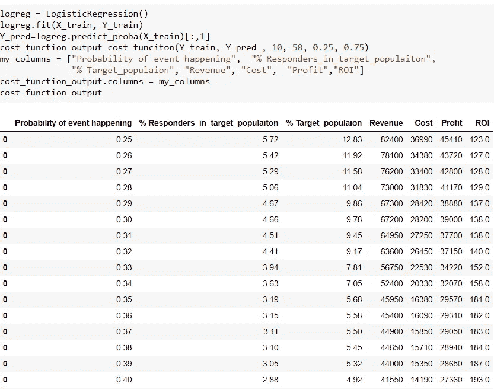
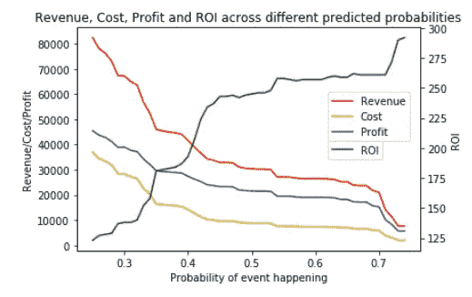
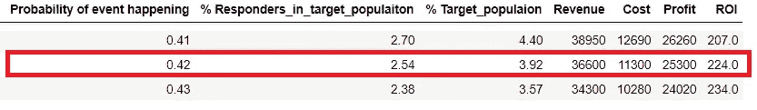
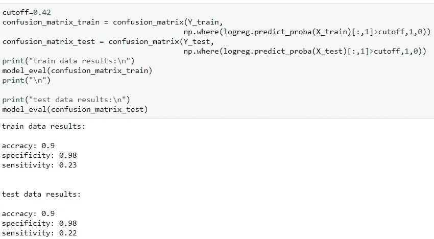

# Python 中的逻辑回归在销售营销系统盈利能力评估中的应用

> 原文：<https://towardsdatascience.com/logistic-regression-in-python-to-evaluate-profitability-of-sales-marketing-system-fe2261964fa4?source=collection_archive---------2----------------------->


任何企业的销售和营销领域都负责寻找客户、进行销售和创造收入。销售代表通过多种沟通方式联系现有客户和潜在客户，但由于相关的时间和成本，无法联系到所有人。在本文中，逻辑回归作为一种机器学习技术将被用来识别具有较高转换概率的目标人群，并估计锁定所识别群体的盈利能力。

我的 GitHub 上的 Python 代码和数据:

[](https://github.com/saivishnuk/Data-Science/tree/master/Logistic-Regression-to-evaluate-profitability-of-Sales-Marketing-System) [## saivishnuk/数据科学

### 在 GitHub 上创建一个帐户，为数据科学的发展做出贡献。

github.com](https://github.com/saivishnuk/Data-Science/tree/master/Logistic-Regression-to-evaluate-profitability-of-Sales-Marketing-System) 

更多我的博客，请查看我的 [**中**](https://medium.com/@saivishnu_k) 和我的 [**GitHub**](https://github.com/saivishnuk/) **。**

**文章大纲:**

*   从总体上理解销售-营销系统，并给出一个将在本文中使用的例子
*   理解逻辑回归作为一种技术，以及它在这种情况下如何有用
*   评估盈利能力的方法、代码和结果

**从总体上理解销售-营销系统，并给出一个将在本文中使用的示例**

大多数系统使用现场销售代理通过个人拜访或移动电话联系客户。产生潜在客户和将潜在客户转化为客户需要一定的成本，接触所有客户是一项既费时又费钱的任务。

例如，一家公司推出了一款新产品，希望接触到可能对该产品感兴趣的现有客户。公司现有客户数量为 41，188，公司估计接触客户的平均成本为 10 美元，如果客户购买了产品，则客户的平均收入为 50 美元。只看数字，成本收入比为 1: 5，这项工作将产生大量利润。意识到之前营销活动对类似产品的转换率(约 11.5%)，经理明白瞄准每一个客户将是一个巨大的损失。因此，经理决定首先确定目标受众，然后决定预算。他希望团队中的数据科学家回答 3 个问题:

*   实现最高投资回报率的成本是多少？
*   实现最高利润的成本是多少？
*   利润-投资回报率均衡点的成本是多少？

**理解逻辑回归作为一种技术，以及它在这种情况下如何有用**

**二项式逻辑回归**，根据一个或多个连续或分类的独立变量，预测观察值落入两类二分因变量之一的概率。在销售-营销系统中，先前营销活动的结果是因变量，自变量是先前活动的度量，如“过去联系客户的次数”、“自上次购买以来的天数”，..和顾客的一些人口统计特征。在本文中，我们假设数据已按 70/30 的比例分为训练数据集和测试数据集，重点只放在衡量盈利能力的方法上。

**评估盈利能力的方法、代码和结果**

1.  在培训和测试数据集中，结果变量(因变量)为“1”(购买了产品)的客户比例约为 11.2%
2.  通过接触训练数据中的所有客户来计算“每个客户的平均利润”。



这表明，通过接触转换率约为 11.2%的所有客户，将导致 1，25710 美元的损失。这保证了目标受众的选择具有较高的转换几率。

3.对训练数据执行逻辑回归，并使用事件发生的预测概率来计算间隔为 0.01 的每个概率值的成本、收入、利润和投资回报(ROI)。

```
ROI= (Profit/Cost)*100
```



上述函数将“实际结果”、“事件发生的预测概率”、“每个人的成本”、“每个人的收入”、“要检查的概率范围”作为输入。下面的代码片段是对上述函数的调用，使用培训数据作为输入，并使用经理确定的每个人的估计成本和收入。



在这里,“事件发生的概率”被认为是区分顾客是否会购买产品的临界值。我们可以观察到，随着“事件发生的概率”增加，“目标人群百分比”减少，这意味着考虑更高的概率作为截止点会导致分离更少数量的客户作为目标人群。但有趣的事实是，随着“事件发生的概率”增加，“投资回报率”也增加，这意味着尽管我们针对的人口较少，但与针对更多人口相比，我们得到了良好的结果，这也可以在下图中看到。

**不同事件发生预测概率的收入、成本和利润图表:**



该图显示，随着“事件发生的概率”增加，成本、收入、利润等指标下降，而 ROI 增加。根据当时的需要，如“预算限制”、“高投资回报率”，可以选择特定的概率作为临界值，但也有必要确保使用测试数据可以复制相同的结果。

**不同成本下的投资回报和利润图**


从前面的结果可以看出，该图还显示成本类似于利润，投资回报率随着成本的增加而降低。这个图表可以用来回答经理提出的三个问题。

**经理的三个问题**

*   **实现最高投资回报率的成本是多少？**花费更少会带来更高的投资回报率，但与花费更多相比，相关的利润会更少
*   **实现最高利润的成本是多少？花费更多会带来更高的利润，但与花费更少相比，投资回报率会更低**
*   **利润-投资回报率均衡点涉及的成本是多少？花费 11，300 美元将产生 25，300 美元的利润，该支出的投资回报率为 224，即削减 0.42。**



我们还需要确保将截止概率取为 0.42 不会导致任何过拟合或欠拟合，并且测试数据的结果大致接近训练数据。



在上面的代码中，model_eval 是一个用户定义的函数，结果显示训练和测试结果的模型评估指标几乎相同。因此，0.42 可以被认为是临界值，并且所有估计概率高于 0.42 的客户可以被认为是目标人群。

## 谢谢你的阅读。如果你喜欢这篇文章，给它一些掌声👏。希望你有一个伟大的一天！