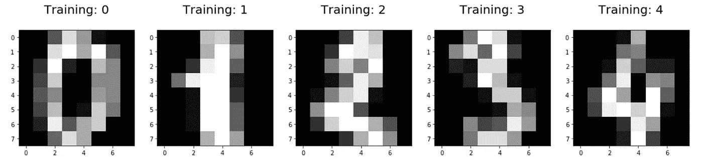
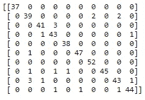
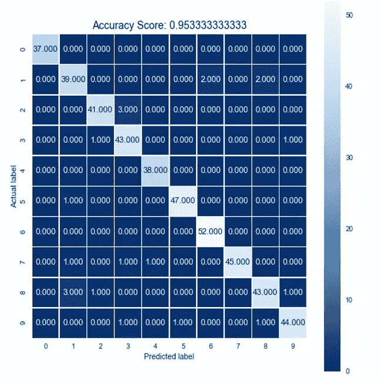
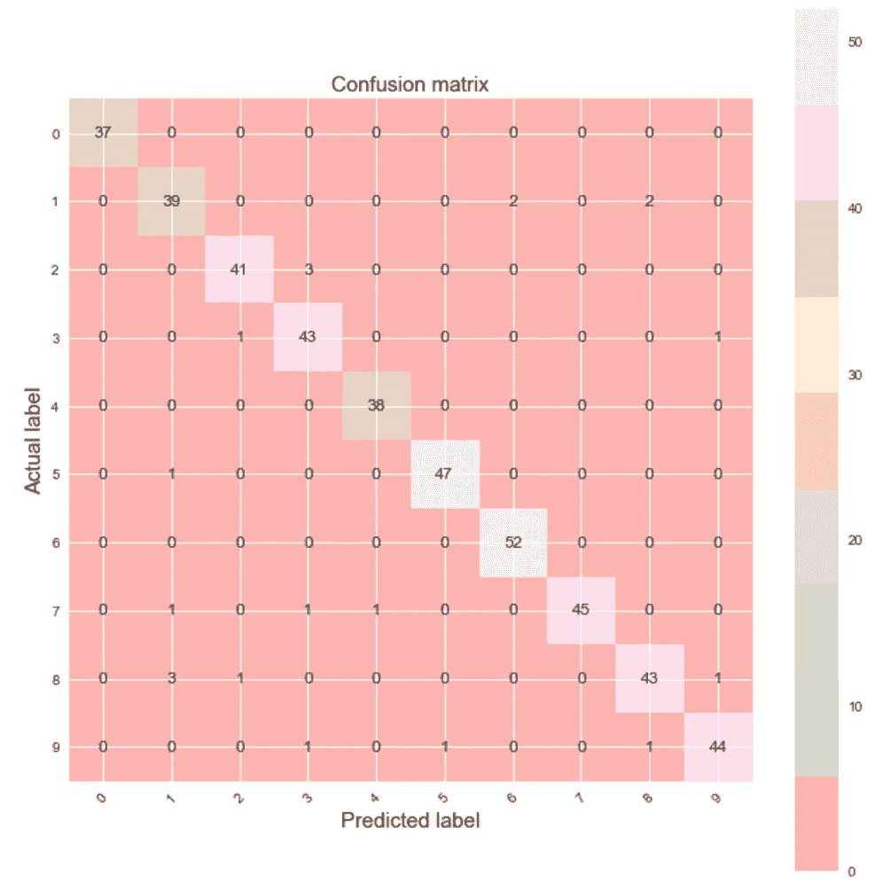
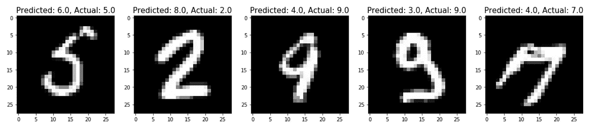

# 使用 Python 进行逻辑回归(scikit-learn)

> 原文：<https://towardsdatascience.com/logistic-regression-using-python-sklearn-numpy-mnist-handwriting-recognition-matplotlib-a6b31e2b166a?source=collection_archive---------0----------------------->


*Visualizing the Images and Labels in the MNIST Dataset*

Python 的 scikit-learn 库最令人惊讶的一点是，它有一个 4 步建模模式，使编写机器学习分类器变得很容易。虽然本教程使用了一个称为逻辑回归的分类器，但本教程中的编码过程也适用于 sklearn 中的其他分类器(决策树、K-最近邻等)。在本教程中，我们使用逻辑回归来预测基于图像的数字标签。上图显示了一组来自 MNIST 数据集的训练数字(观察值)，其类别成员是已知的(标签 0-9)。使用逻辑回归训练模型后，它可用于预测给定图像的图像标签(标签 0-9)。

Logistic Regression using Python Video

这篇教程文章的第一部分介绍了一个玩具数据集(digits dataset ),快速展示了 scikit-learn 的 4 步建模模式，并展示了逻辑回归算法的行为。本教程的第二部分介绍了一个更真实的数据集(MNIST 数据集)，以简要说明更改模型的默认参数如何影响性能(包括模型的计时和精度)。就这样，让我们开始吧。如果你迷路了，我建议在一个单独的标签中打开上面的[视频](https://www.youtube.com/watch?v=71iXeuKFcQM)。本教程中使用的代码如下

[数字逻辑回归](https://github.com/mGalarnyk/Python_Tutorials/blob/master/Sklearn/Logistic_Regression/LogisticRegression_toy_digits_Codementor.ipynb)(教程代码的第一部分)

[MNIST 逻辑回归](https://github.com/mGalarnyk/Python_Tutorials/blob/master/Sklearn/Logistic_Regression/LogisticRegression_MNIST_Codementor.ipynb)(教程代码的第二部分)

## 入门(先决条件)

如果您已经安装了 anaconda，请跳到下一节。我建议安装 anaconda(Python 2 或 3 对本教程来说都很好)，这样在导入库时就不会有任何问题。

您可以从官方网站下载 anaconda 并自行安装，也可以按照下面的 anaconda 安装教程在您的操作系统上安装 anaconda。

在 Windows 上安装 Anaconda:[链接](https://medium.com/@GalarnykMichael/install-python-anaconda-on-windows-2020-f8e188f9a63d)

在 Mac 上安装 Anaconda:[链接](https://medium.com/@GalarnykMichael/install-python-on-mac-anaconda-ccd9f2014072)

在 Ubuntu 上安装 Anaconda(Linux):[链接](https://medium.com/@GalarnykMichael/install-python-on-ubuntu-anaconda-65623042cb5a)

# 数字数据集上的逻辑回归

## 加载数据(数字数据集)

digits 数据集是 scikit-learn 附带的数据集之一，不需要从外部网站下载任何文件。下面的代码将加载数字数据集。

```
from sklearn.datasets import load_digits
digits = load_digits()
```

现在您已经加载了数据集，您可以使用下面的命令

```
# Print to show there are 1797 images (8 by 8 images for a dimensionality of 64)
print(“Image Data Shape” , digits.data.shape)# Print to show there are 1797 labels (integers from 0–9)
print("Label Data Shape", digits.target.shape)
```

要查看数据集中有 1797 个图像和 1797 个标签

## 显示图像和标签(数字数据集)

这一部分实际上只是展示图像和标签的样子。可视化数据通常有助于了解您正在处理的内容。

```
import numpy as np 
import matplotlib.pyplot as pltplt.figure(figsize=(20,4))
for index, (image, label) in enumerate(zip(digits.data[0:5], digits.target[0:5])):
 plt.subplot(1, 5, index + 1)
 plt.imshow(np.reshape(image, (8,8)), cmap=plt.cm.gray)
 plt.title('Training: %i\n' % label, fontsize = 20)
```



Visualizing the Images and Labels in our Dataset

## 将数据分为训练集和测试集(数字数据集)

下面的代码执行[训练测试分割](/understanding-train-test-split-scikit-learn-python-ea676d5e3d1)，将 75%的数据放入训练集，25%的数据放入测试集。这是为了确保我们的分类算法能够很好地推广到新数据。

```
from sklearn.model_selection import train_test_split
x_train, x_test, y_train, y_test = train_test_split(digits.data, digits.target, test_size=0.25, random_state=0)
```

## sci kit-学习 4 步建模模式(数字数据集)

第一步。导入您想要使用的模型

在 sklearn 中，所有的机器学习模型都是作为 Python 类实现的

```
from sklearn.linear_model import LogisticRegression
```

第二步。制作模型的一个实例

```
# all parameters not specified are set to their defaults
logisticRegr = LogisticRegression()
```

第三步。根据数据训练模型，存储从数据中学习到的信息

模型正在学习数字(x_train)和标签(y_train)之间的关系

```
logisticRegr.fit(x_train, y_train)
```

第四步。预测新数据(新图像)的标签

使用模型在模型训练过程中学习到的信息

```
# Returns a NumPy Array
# Predict for One Observation (image)
logisticRegr.predict(x_test[0].reshape(1,-1))
```

一次预测多个观察结果(图像)

```
logisticRegr.predict(x_test[0:10])
```

对整个测试数据进行预测

```
predictions = logisticRegr.predict(x_test)
```

## 衡量模型性能(数字数据集)

虽然有其他方法来衡量模型性能(精确度、召回率、F1 分数、 [ROC 曲线](/receiver-operating-characteristic-curves-demystified-in-python-bd531a4364d0)等)，但我们将保持简单，使用精确度作为我们的衡量标准。
要做到这一点，我们要看看模型在新数据(测试集)上的表现

精确度定义为:

(正确预测的分数):正确预测/数据点总数

```
# Use score method to get accuracy of model
score = logisticRegr.score(x_test, y_test)
print(score)
```

我们的准确率是 95.3%。

## 混淆矩阵(数字数据集)

混淆矩阵是一个表格，通常用于描述一个分类模型(或“分类器”)对一组真实值已知的测试数据的性能。在这一节中，我将展示两个 python 包(Seaborn 和 Matplotlib ),它们使混淆矩阵更容易理解，在视觉上更有吸引力。

```
import matplotlib.pyplot as plt
import seaborn as sns
from sklearn import metrics
```

下面的混淆矩阵在视觉上并不丰富，也不吸引人。

```
cm = metrics.confusion_matrix(y_test, predictions)
print(cm)
```



Not a visually appealing way to view a confusion matrix

**方法 1(海上分娩)**

正如你在下面看到的，这个方法使用 seaborn 产生了一个更容易理解和视觉可读的混淆矩阵。

```
plt.figure(figsize=(9,9))
sns.heatmap(cm, annot=True, fmt=".3f", linewidths=.5, square = True, cmap = 'Blues_r');
plt.ylabel('Actual label');
plt.xlabel('Predicted label');
all_sample_title = 'Accuracy Score: {0}'.format(score)
plt.title(all_sample_title, size = 15);
```



*Confusion Matrix using Seaborn*

**方法 2 (Matplotlib)**
这个方法显然多了很多代码。我只是想向人们展示如何在 matplotlib 中也这样做。

```
plt.figure(figsize=(9,9))
plt.imshow(cm, interpolation='nearest', cmap='Pastel1')
plt.title('Confusion matrix', size = 15)
plt.colorbar()
tick_marks = np.arange(10)
plt.xticks(tick_marks, ["0", "1", "2", "3", "4", "5", "6", "7", "8", "9"], rotation=45, size = 10)
plt.yticks(tick_marks, ["0", "1", "2", "3", "4", "5", "6", "7", "8", "9"], size = 10)
plt.tight_layout()
plt.ylabel('Actual label', size = 15)
plt.xlabel('Predicted label', size = 15)
width, height = cm.shapefor x in xrange(width):
 for y in xrange(height):
  plt.annotate(str(cm[x][y]), xy=(y, x), 
  horizontalalignment='center',
  verticalalignment='center')
```



Confusion Matrix using Matplotlib

# 逻辑回归(MNIST)

需要强调的一点是，sklearn 中包含的数字数据集太小，不能代表真实世界的机器学习任务。
我们将使用 MNIST 数据集，因为它是为那些希望在真实世界数据上尝试学习技术和模式识别方法，同时在预处理和格式化方面花费最少精力的人准备的。我们将注意到的一件事是，参数调整可以大大加快机器学习算法的训练时间。

## 下载数据(MNIST)

MNIST 数据集并非来自 scikit-learn 内部

```
from sklearn.datasets import fetch_mldata
mnist = fetch_mldata('MNIST original')
```

现在您已经加载了数据集，您可以使用下面的命令

```
# These are the images
# There are 70,000 images (28 by 28 images for a dimensionality of 784)
print(mnist.data.shape)# These are the labels
print(mnist.target.shape)
```

要查看数据集中有 70000 张图像和 70000 个标签

## 将数据分成训练集和测试集(MNIST)

下面的代码执行了一次[列车测试分割](/understanding-train-test-split-scikit-learn-python-ea676d5e3d1)。`test_size=1/7.0`使训练集大小为 60，000 幅图像，测试集大小为 10，000 幅图像。

```
from sklearn.model_selection import train_test_splittrain_img, test_img, train_lbl, test_lbl = train_test_split(
 mnist.data, mnist.target, test_size=1/7.0, random_state=0)
```

## 显示图像和标签(MNIST)

```
import numpy as np
import matplotlib.pyplot as pltplt.figure(figsize=(20,4))
for index, (image, label) in enumerate(zip(train_img[0:5], train_lbl[0:5])):
 plt.subplot(1, 5, index + 1)
 plt.imshow(np.reshape(image, (28,28)), cmap=plt.cm.gray)
 plt.title('Training: %i\n' % label, fontsize = 20)
```


Visualizing the Images and Labels in our Dataset

## sci kit-学习 4 步建模模式(MNIST)

我想提到的一点是参数调整的重要性。虽然对于较小的数字数据集来说，这可能没什么关系，但对于较大和更复杂的数据集来说，这就有很大的不同了。虽然通常是为了精确而调整参数，但在下面的例子中，我们调整了参数求解器以加速模型的拟合。

第一步。导入您想要使用的模型

在 sklearn 中，所有的机器学习模型都是作为 Python 类实现的

```
from sklearn.linear_model import LogisticRegression
```

第二步。制作模型的一个实例

如果你想知道变化求解器是做什么的，请看这个[教程](https://medium.com/distributed-computing-with-ray/how-to-speed-up-scikit-learn-model-training-aaf17e2d1e1)。本质上，我们正在改变优化算法。

```
# all parameters not specified are set to their defaults
# default solver is incredibly slow thats why we change it
logisticRegr = LogisticRegression(solver = 'lbfgs')
```

第三步。根据数据训练模型，存储从数据中学习到的信息

模型正在学习 x(数字)和 y(标签)之间的关系

```
logisticRegr.fit(train_img, train_lbl)
```

第四步。预测新数据(新图像)的标签
使用模型在模型训练过程中学习到的信息

```
# Returns a NumPy Array
# Predict for One Observation (image)
logisticRegr.predict(test_img[0].reshape(1,-1))
```

一次预测多个观察结果(图像)

```
logisticRegr.predict(test_img[0:10])
```

对整个测试数据进行预测

```
predictions = logisticRegr.predict(test_img)
```

## 衡量模型性能(MNIST)

虽然有其他方法来衡量模型性能(精确度、召回率、F1 分数、 [ROC 曲线](/receiver-operating-characteristic-curves-demystified-in-python-bd531a4364d0)等)，但我们将保持简单，使用精确度作为我们的衡量标准。
为此，我们将观察模型在新数据(测试集)上的表现

精确度定义为:

(正确预测的分数):正确预测/数据点总数

```
score = logisticRegr.score(test_img, test_lbl)
print(score)
```

我想简单提一下的一件事是，默认的优化算法参数是`solver = liblinear`，它花了 2893.1 秒运行，准确率为 91.45%。我设置`solver = lbfgs`的时候，用了 52.86 秒运行，准确率 91.3%。改变求解器对精确度有一个小的影响，但至少它快了很多。


Depending on the problem, [some optimization algorithms can take longer](https://www.anyscale.com/blog/how-to-speed-up-scikit-learn-model-training) ([image source](https://www.datasciencecentral.com/profiles/blogs/an-overview-of-gradient-descent-optimization-algorithms))

## 显示带有预测标签的错误分类图像(MNIST)

虽然我可以展示另一个混淆矩阵，但我认为人们宁愿看到错误分类的图片，也不希望有人觉得有趣。

获取错误分类图像的索引

```
import numpy as np 
import matplotlib.pyplot as pltindex = 0
misclassifiedIndexes = []
for label, predict in zip(test_lbl, predictions):
 if label != predict: 
  misclassifiedIndexes.append(index)
  index +=1
```

使用 matplotlib 显示错误分类的图像和图像标签

```
plt.figure(figsize=(20,4))
for plotIndex, badIndex in enumerate(misclassifiedIndexes[0:5]):
 plt.subplot(1, 5, plotIndex + 1)
 plt.imshow(np.reshape(test_img[badIndex], (28,28)), cmap=plt.cm.gray)
 plt.title(‘Predicted: {}, Actual: {}’.format(predictions[badIndex], test_lbl[badIndex]), fontsize = 15)
```



Showing Misclassified Digits

## 结束语

这里需要注意的重要一点是，在 scikit-learn 中制作一个机器学习模型并不需要很多工作。我希望这篇文章对你正在做的事情有所帮助。我的下一个机器学习教程使用 Python 复习了 [PCA。如果你对本教程有任何问题或想法，欢迎在下面的评论中，通过](https://medium.com/@GalarnykMichael/pca-using-python-scikit-learn-e653f8989e60) [YouTube 视频页面](https://www.youtube.com/watch?v=71iXeuKFcQM)，或通过 [Twitter](https://twitter.com/GalarnykMichael) 联系我们！如果想学习其他机器学习算法，请考虑上我的[机器学习 with Scikit-Learn LinkedIn 学习课程](https://www.linkedin.com/learning/machine-learning-with-scikit-learn/effective-machine-learning-with-scikit-learn)。