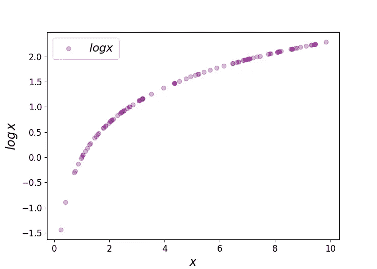
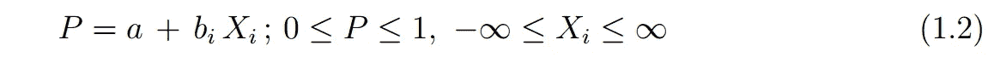
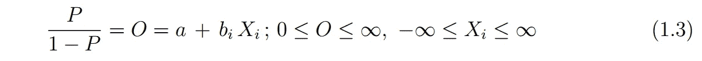
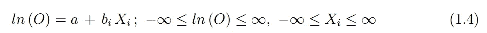
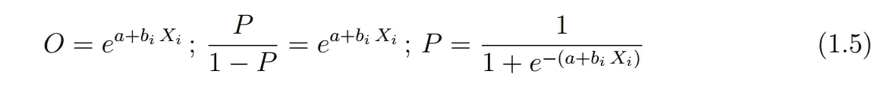
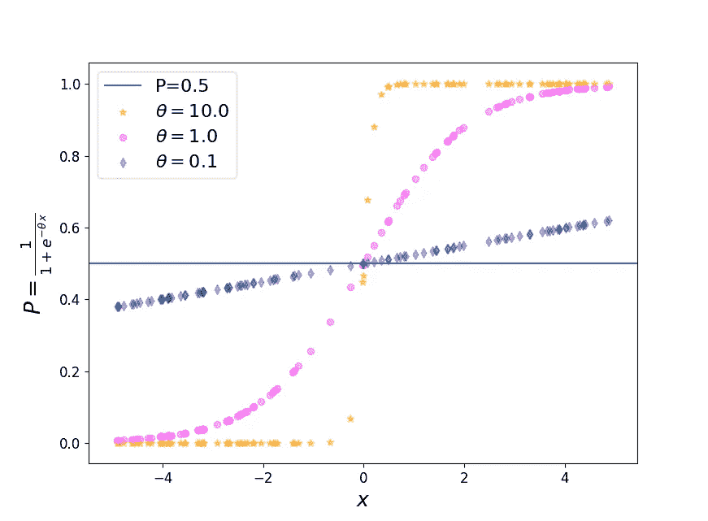
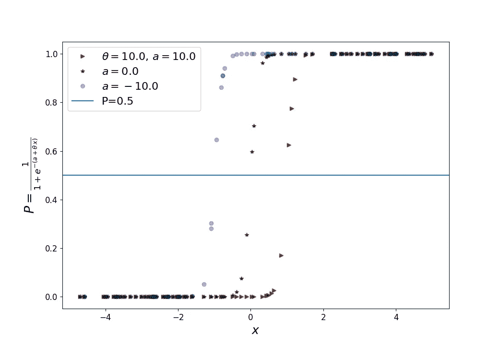
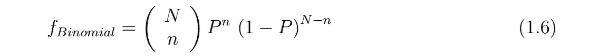
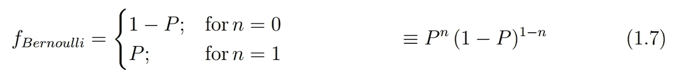
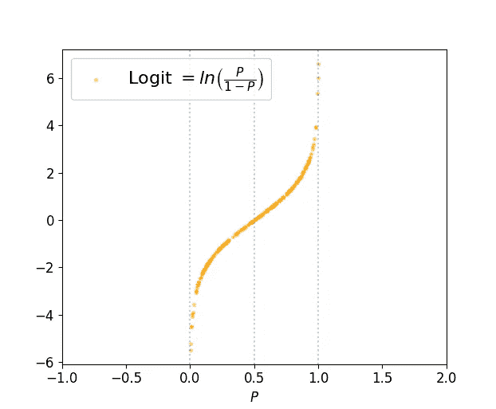

# 逻辑回归的“Logit ”;了解基本原理

> 原文：<https://towardsdatascience.com/logit-of-logistic-regression-understanding-the-fundamentals-f384152a33d1?source=collection_archive---------1----------------------->

在我学习机器学习基础的旅程的最开始，我记得花了很多时间来清楚地理解逻辑回归的基础。希望这个冥想会给你留下更多的答案和正确的概念，而不是与逻辑回归相关的困惑。

在这篇文章中，我将尝试涵盖—

*   *赔率和赔率比*
*   *理解逻辑回归，从线性回归开始。*
*   *逻辑函数作为分类器；用伯努利分布连接 Logit。*
*   *关于癌症数据集和设置概率阈值以对恶性和良性进行分类的示例。*

# 优势和优势比

在我们深入研究逻辑回归之前，我们需要弄清楚一些概率的基础知识。为简单起见，我们将考虑一个[数据集](https://github.com/suvoooo/Machine_Learning/blob/master/gender_purchase.csv)，它告诉我们，客户是否会购买产品取决于性别。我们导入并检查数据集

```
import pandas as pdgender_df = pd.read_csv('gender_purchase.csv')print gender_df.head(3)>>> Gender Purchase
0  Female      Yes
1  Female      Yes
2  Female       No
```

我们将使用`pandas`的`crosstab`功能，根据性别创建一个“是”和“否”的频率表。这张表对理解以后的优势和优势比有很大的用处。

```
table = pd.crosstab(gender_df['Gender'], gender_df['Purchase'])
print table>>> Purchase   No  Yes
Gender            
Female    106  159
Male      125  121
```

我们现在准备定义**几率、** *几率，它描述了成功与失败的比率*。考虑到女性群体，我们看到女性购买(成功)产品的概率= 159/265(是/女性总数)。女性失败(不购买)的概率为 106/265。在这种情况下，赔率定义为(159/265)/(106/265) = 1.5。可能性越大，成功的机会就越大。*赔率范围可以是*【0，∞】*之间的任意数字。*如果我们对这些数字取自然对数，范围会发生什么变化？log(x)定义为 x≥0，但范围从[-∞，∞]变化。您可以使用一段代码进行检查

```
random=[]
xlist = []
for i in range(100):
 x = uniform(0,10)# choose numbers between 0 and 10 
 xlist.append(x)
 random.append(math.log(x))plt.scatter(xlist, random, c='purple',alpha=0.3,label=r'$log x$')
plt.ylabel(r'$log \, x$', fontsize=17)
plt.xlabel(r'$x$',fontsize=17)
plt.legend(fontsize=16)
plt.show()
```



Figure 1: log x vs x; for all +’ve’ values of x, log x can vary between -∞ to + ∞.

到目前为止，我们已经理解了概率。我们来描述一下**赔率**，顾名思义就是赔率的比值。考虑到上面的例子，**比值比**，代表哪一组(男性/女性)有更好的成功几率，它是通过计算每一组的比值比给出的。所以女性成功购买的几率=女性成功购买的几率/男性成功购买的几率= (159/106)/(121/125)。男性的优势比是上述数字的倒数。

我们可以清楚地认识到，虽然比值比可以在 0 到正无穷大之间变化，但 log(比值比)将在[-∞，∞]之间变化。特别是当比值比位于[0，1]之间时，log(比值比)为负。

# 线性到逻辑回归

由于“回归”一词在逻辑回归中容易引起混淆，我们可以花几秒钟来回顾一下回归。回归通常指连续性，即预测连续变量(药品价格、出租车费等。)取决于特性。然而，**逻辑回归是关于预测二元变量，即当目标变量是分类变量时。** *逻辑回归可能是一个初露头角的数据科学家应该尝试掌握分类问题的第一件事。*我们将从线性回归模型开始，逐步理解实现 logistic 模型。

在线性回归中，特征变量可以取任何值，因此输出(标签)可以从负到正无穷大连续。


Range of label and feature in linear regression case

因为逻辑回归是关于分类的，即 *Y* 是分类变量。很明显，用线性回归模型(方程式)不可能获得这样的输出。1.1)，因为两侧量程不匹配。我们的目标是以这样的方式变换 LHS，使得它匹配 RHS 的范围，RHS 的范围由特征变量的范围[-∞，∞]来控制。

我们将遵循一些直观的步骤来探索如何可能达到这样的结果。



*   对于线性回归， *X* 和 *Y* 的范围都是从负无穷大到正无穷大。*逻辑中的 Y* 是绝对的，或者对于上面的问题，它取两个不同值 0，1 中的一个。首先，我们尝试使用回归模型预测概率。现在 LHS 可以取从 0 到 1 的任何值，而不是两个不同的值，但是范围仍然不同于 RHS。



*   我上面讨论过，赔率和赔率比从[0，∞]不等。这比概率(限制在 0 和 1 之间)更好，并且更接近匹配 RHS 的范围。
*   你们中的许多人已经明白，如果我们现在考虑(等式)的 LHS 的自然对数。1.3)那么两侧的范围匹配。



这样，**我们实现了一个回归模型，其中输出是概率的自然对数，也称为 logit** 。对数的底数并不重要，但取赔率的对数才重要。

我们可以从 eq 中检索成功的概率。1.4 如下。



From odds to probability where probability distribution resembles a sigmoid function

如果我们知道自变量的系数 *X* s 和截距 a，我们就可以预测概率。我们将使用软件(`sklearn`)进行优化。根据问题，我们可以从概率值中选择输出属于 A 类还是 b 类。当我们通过一个示例时，这将更加清楚。

# 逻辑函数

如果你看到等式 1.5 的 RHS。也称为逻辑函数，与 sigmoid 函数非常相似。我们可以用一小段 python 代码来检查这个函数的行为。

```
random1=[]
random2=[]random3=[]xlist = []
theta=[10, 1,0.1]
for i in range(100):
 x = uniform(-5,5)
 xlist.append(x)
 logreg1 = 1/(1+math.exp(-(theta[0]*x)))
 logreg2 = 1/(1+math.exp(-(theta[1]*x)))
 logreg3 = 1/(1+math.exp(-(theta[2]*x)))
 random1.append(logreg1)
 random2.append(logreg2)
 random3.append(logreg3)plt.scatter(xlist, random1, marker='*',s=40, c='orange',alpha=0.5,label=r'$\theta = %3.1f$'%(theta[0]))
plt.scatter(xlist, random2, c='magenta',alpha=0.3,label=r'$\theta = %3.1f$'%(theta[1]))
plt.scatter(xlist, random3, c='navy',marker='d', alpha=0.3,label=r'$\theta = %3.1f$'%(theta[2]))plt.axhline(y=0.5, label='P=0.5')
plt.ylabel(r'$P=\frac{1}{1+e^{-\theta \, x}}$', fontsize=19)
plt.xlabel(r'$x$',fontsize=18)
plt.legend(fontsize=16)
plt.show()
```



Figure 2: Probability vs independent variable **x**; resembles sigmoid function plot.

从上面的图中，注意自变量(这里是 *X* )的系数(橙色星星)值越高，它就能更好地表示两个不同的概率 0 和 1。对于较低的系数值，它基本上是一条直线，类似于一个简单的线性回归函数。对比等式(1.5)，图 2 中固定项 *a* 取为 0。固定项对逻辑函数的影响也可以通过下图来理解



Figure 3: Sigmoid function for different values of intercept (**a**).

就像线性回归中的常数项表示 Y 轴上的截距(因此沿 Y 轴移动)，这里对于逻辑函数，常数项沿 X 轴移动 *s* 曲线。上面的数字(图 2，3)应该让你相信，使用可以分类数据的逻辑回归来优化模型确实是可能的，例如预测 0 或 1。

# 伯努利和罗吉特

逻辑回归的目的是针对独立变量(特征)的任何给定线性组合，预测成功事件的某个未知概率 *P* 。那么如题所示，logit 和 Bernoulli 函数是如何联系的呢？回想一下二项式分布，它是在 *N 次*试验中有 *n 次*成功的概率分布，假设



Binomial distribution

每个试验以概率 *P* 为真，以概率 *Q=1-P 为假。*伯努利分布另一方面是一个离散分布，有两种可能的结果，标记为 *n=0* 和 *n=1* ，其中 *n=1* (成功事件)以概率 *P* 发生，而失败即 *n=0* 以概率*发生*



Bernoulli distribution as a special case of binomial distribution

可以理解的是，伯努利分布是单次试验的二项分布的特例(等式 1.6 中 *N=1* )。**最重要的是，我们看到逻辑回归中的因变量遵循具有未知概率 p 的伯努利分布。因此，logit，即几率的对数，将自变量( *Xs* )与伯努利分布联系起来。**在 logit 情况下，P 是未知的，但是在伯努利分布(eq。1.6)我们知道。让我们画出 logit 函数。



Figure 4: Logit Function i.e. Natural logarithm of odds

我们看到函数的定义域位于 0 和 1 之间，函数的范围从负到正无穷大。我们需要逻辑回归的 y 轴上的概率 *P* ，这可以通过取 logit 函数的反函数来实现。如果你以前注意过 sigmoid 函数曲线(图 2 和图 3)，你可能已经找到了联系。的确， **sigmoid 函数是 logit 的逆(检查等式。1.5).**

# 癌症数据集和概率阈值的例子

不再拖延，让我们看看逻辑回归在癌症数据集上的应用。这里我们将集中讨论如何设置概率阈值来对我们的模型进行分类。为了简单起见，我将使用数据集的所有特征，但你可以阅读关于使用`RFE` 方法选择最佳特征的详细信息，我已经在[单独的帖子](/data-handling-using-pandas-machine-learning-in-real-life-be76a697418c)中描述了该方法。

```
from sklearn.datasets import load_breast_cancercancer = load_breast_cancer()
cancer_df=pd.DataFrame(cancer.data,columns=cancer.feature_names)X_trainc, X_testc, y_trainc, y_testc = train_test_split(cancer.data, cancer.target, test_size=0.3, stratify=cancer.target, random_state=30)cancerclf = LogisticRegression()
cancerclf.fit(X_trainc, y_trainc)#print "Logreg score on cancer data set", cancerclf.score(X_testc, y_testc) # you can check the score if you want, which is not the main purpose. 
```

我们将使用`predict_proba`方法进行逻辑回归，引用 scikit-learn 的话“返回按类别标签排序的所有类别的概率估计值”。我们在测试数据集上调用这个方法。

```
probac = cancerclf.predict_proba(X_testc)print probac[1:10] >>> [[5.86216203e-02 9.41378380e-01]
 [7.25210884e-03 9.92747891e-01]
 [9.99938102e-01 6.18983128e-05]
 [4.75502091e-02 9.52449791e-01]
 [9.66861480e-01 3.31385203e-02]
 [3.09660805e-01 6.90339195e-01]
 [9.99687981e-01 3.12018784e-04]
 [6.80759215e-04 9.99319241e-01]
 [9.99998223e-01 1.77682663e-06]]
```

由于我们的目标要么是 0，要么是 1，那么打印`predict_proba` 会给我们维数为(N，2)的概率矩阵，N 是实例的数量。第一个指标指的是数据属于类 0 的概率，第二个指标指的是数据属于类 1 的概率。默认情况下，如果该概率大于 0.5，则该预测被归类为正面结果。对于每一行，两列相加应该等于 1，因为成功的概率 *(P)* 和失败的概率 *(1-P)* 应该等于 1。

我们现在可以转向`predict`方法，它预测类别标签，在默认情况下，对于二元分类，它将小于 0.5 的概率归类为 0，反之亦然。

```
predict = cancerclf.predict(X_testc)print predict >>> [1 1 1 0 1 0 1 0 1 0 1 1 1 1 .....]# didn't show the complete list
```

现在我们考虑`probac=cancerclf.predict_proba(X_testc)`数组的第一列，它由 0 类概率组成(在癌症数据集中，这是恶性类)。我们用这个数组做了一个迷你数据框。

```
probability = probac[:,0]
prob_df = pd.DataFrame(probability)
print prob_df.head(10) # this should match the probac 1st column >>>    0
0  0.005366
1  0.058622
2  0.007252
3  0.999938
4  0.047550
5  0.966861
6  0.309661
7  0.999688
8  0.000681
9  0.999998
```

我们进一步修改这个数据帧，以理解改变阈值的影响。

```
prob_df['predict'] = np.where(prob_df[0]>=0.90, 1, 0)# create a new column
print prob_df.head(10)>>>    0        predict
0  0.005366        0
1  0.058622        0
2  0.007252        0
3  0.999938        1
4  0.047550        0
5  **0.966861        1**
6  0.309661        0
7  0.999688        1
8  0.000681        0
9  0.999998        1
```

我们设定≥ 90%作为恶性分类选择的阈值。在打印出的示例中，我们看到值为 0.96，因此将阈值更改为 97%会将该样本从恶性类别中排除。

```
prob_df['predict'] = np.where(prob_df[0]>=0.97, 1, 0)
print prob_df.head(10)>>>    0       predict
0  0.005366        0
1  0.058622        0
2  0.007252        0
3  0.999938        1
4  0.047550        0
5  **0.966861        0 # here is the change**
6  0.309661        0
7  0.999688        1
8  0.000681        0
9  0.999998        1
```

还可以检查对测试样本总数的影响

```
prob_df['predict'] = np.where(prob_df[0]>=0.50 1, 0)
print len(prob_df[prob_df['predict']==1])>>> 56prob_df['predict'] = np.where(prob_df[0]>=0.97 1, 0)
print len(prob_df[prob_df['predict']==1])>>> 45
```

我们已经看到如何改变概率阈值来选择或拒绝来自特定类别的样本。

*逻辑回归默认使用 L2 正则化*，可以检查改变正则化参数的结果，并与线性回归进行比较。我之前和[岭回归](/ridge-and-lasso-regression-a-complete-guide-with-python-scikit-learn-e20e34bcbf0b)讨论过这个问题，感兴趣的可以去看看。使用`RFE`选择最佳参数是逻辑回归的一个重要部分，因为最好有很少或没有多重共线性，这是确保选择少量可以描述模型的相关参数的方法之一。

总而言之，**我们已经学习了一些关于开发可用于分类的回归模型的基本思想**。

*我推荐你去看看吴恩达的课堂笔记或者 YouTube 上的讲座。本帖的基本思想受到了 Kumar，a .的《用 Python 学习预测分析》一书的影响，该书明确描述了线性和逻辑回归的联系。将伯努利函数和 logit 函数之间的联系联系起来是受 B. Larget (UoW，麦迪森)的演示幻灯片的启发，该幻灯片可公开获得。*

保持坚强，干杯！

***如果你对更深入的基础机器学习概念感兴趣，可以考虑加盟 Medium 使用*** [***我的链接***](https://saptashwa.medium.com/membership) ***。你不用额外付钱，但我会得到一点佣金。感谢大家！！***