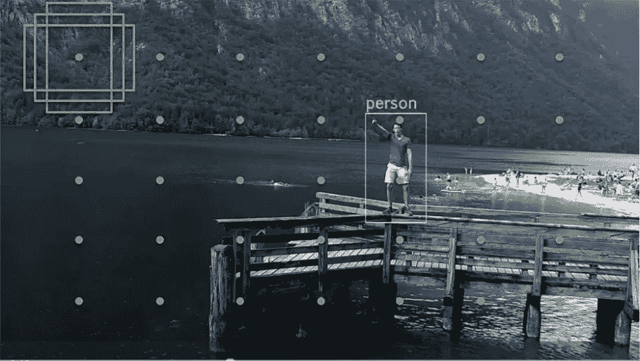
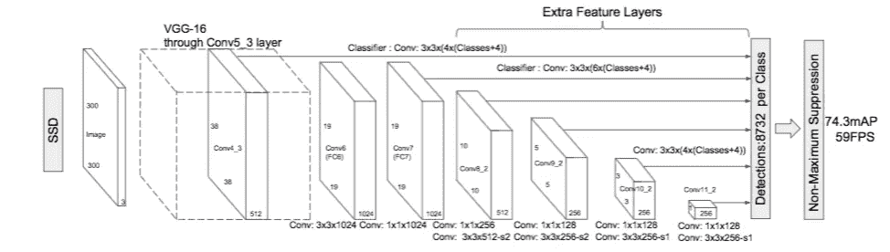
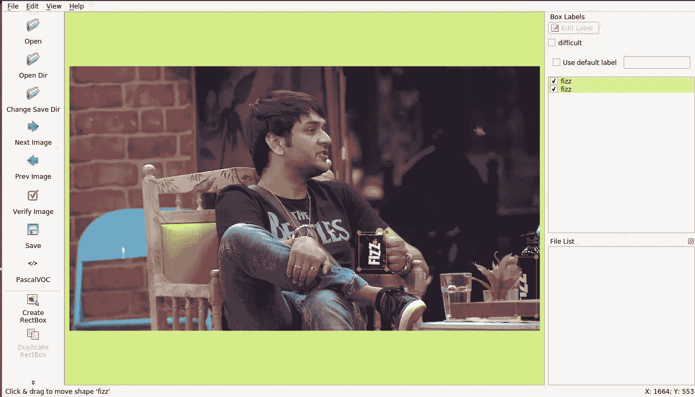
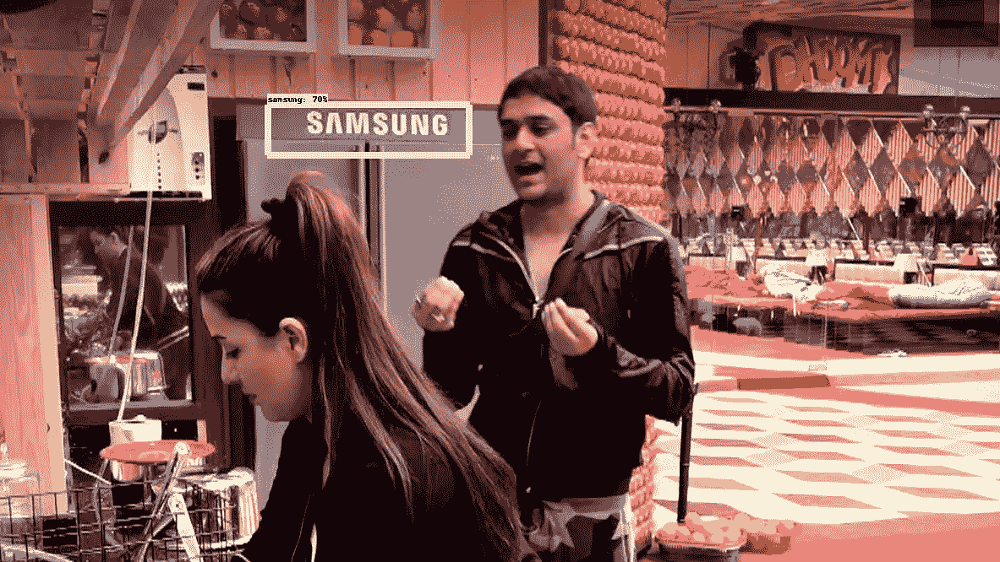
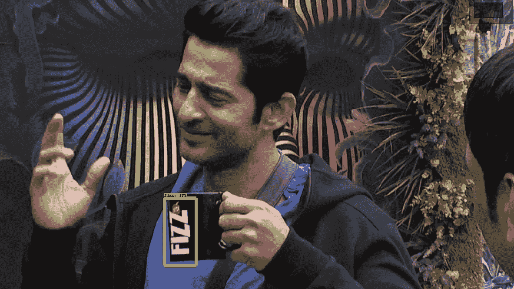
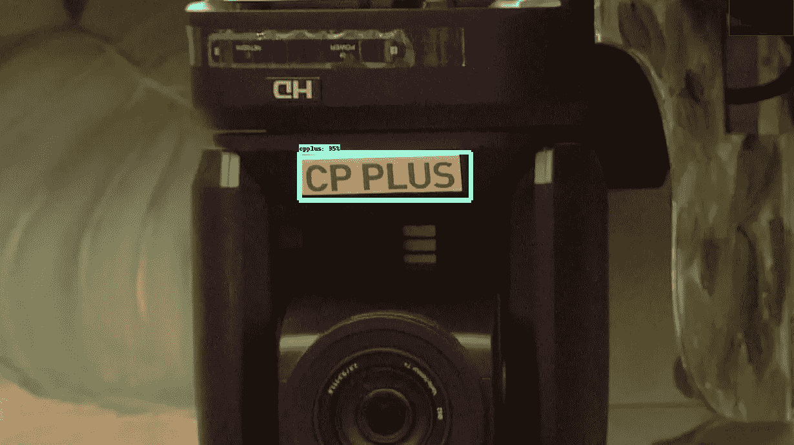

# 使用 SSD 的图像中的徽标检测

> 原文：<https://towardsdatascience.com/logo-detection-in-images-using-ssd-bcd3732e1776?source=collection_archive---------2----------------------->


徽标有时也称为商标，在当今的营销世界中非常重要。产品、公司和不同的游戏联盟通常由它们各自的标志来识别。图像和视频中的徽标识别是许多应用中的关键问题，例如版权侵权检测、智能交通控制系统的车辆徽标、增强现实、上下文广告投放等。在本帖中，我们将探讨如何使用 Tensorflow API 的 SSD 来检测和定位电视节目(Big Boss India)图像中的品牌徽标。任务是从展会的图像中检测和定位六个品牌标志: **fizz，oppo，samsung，garnier，faber，cpplus** 。

## 什么是固态硬盘，它是如何工作的？

根据[关于 SSD 的论文](https://arxiv.org/pdf/1512.02325.pdf)，SSD: Single Shot Multibox Detector 是一种使用单一深度神经网络检测图像中对象的方法。SSD 将边界框的输出空间离散化为一组默认框，每个要素地图位置具有不同的纵横比和比例。在预测时，网络为每个默认框中每个对象类别的存在生成分数，并对框进行调整以更好地匹配对象形状。此外，该网络结合了来自不同分辨率的多个特征地图的预测，以自然地处理各种尺寸的物体。在 PASCAL VOC、COCO 和 ILSVRC 数据集上的实验结果证实，SSD 具有与利用额外的对象提议步骤的方法竞争的准确性，并且速度快得多，同时为训练和推理提供了统一的框架。

**目标检测、定位和分类的任务在网络的单次前向传递中完成。**



Multi box concept in SSD(Source: Udemy A-Z Computer Vision)

**固态硬盘的架构**



**标志检测数据集**

这项任务的数据是通过从节目的视频剪辑中捕捉单个帧获得的。总共拍摄了 6267 张图像。我用了 600 张图片进行测试，剩下的用于训练部分。
现在，下一步是注释获得的图像。为此，我使用了 [LabelImg](https://github.com/tzutalin/labelImg) 。LabelImg 是一个图形化的图像注释工具。生成的注释以 PASCAL VOC 格式保存为 XML 文件。存储库中提供了安装说明。



Annotating Image using labelImg

类似地，我必须浏览数据集的所有图像，并逐个注释它们。

**TFRecords**

如果我们正在处理大型数据集，使用二进制文件格式存储数据会对导入管道的性能产生重大影响，从而缩短模型的训练时间。二进制数据占用的磁盘空间更少，复制时间更短，从磁盘读取的效率也更高。这就是 TFRecord 出现的地方。然而，纯粹的性能并不是 TFRecord 文件格式的唯一优势。它通过多种方式针对 Tensorflow 的使用进行了优化。首先，它可以轻松地组合多个数据集，并与库提供的数据导入和预处理功能无缝集成。特别是对于太大而无法完全存储在内存中的数据集，这是一个优势，因为只有当时需要的数据(例如一批)才会从磁盘加载，然后进行处理。因为我们将使用 Tensorflow API，所以我们将把 XML 文件转换成 TFRecords。

**将 XML 转换为 TFRecord**

为了将 XML 文件转换成 TFRecord，我们将首先使用 python 脚本将它们转换成 CSV，这要感谢这个[库](https://github.com/datitran/raccoon_dataset)。需要引入一些小的变化。下面是将 XML 文件转换成 CSV 文件的代码。

存储在**‘图像/训练’**和**‘图像/测试’**中的 XML 文件被转换成两个 CSV 文件，一个用于训练，一个用于测试，它们在文件夹【T8’‘数据’中生成。(如果您想要在自定义数据集上训练 SSD 模型，请注意这些细节)

一旦 XML 文件被转换成 CSV 文件，我们就可以使用 python 脚本从同一个[存储库](https://github.com/datitran/raccoon_dataset)中输出 TFRecords，并做一些修改。

对于自定义数据集的训练，请在 **class_text_to_int** 函数中更改类名。此外，确保您按照[这里的](https://github.com/tensorflow/models/blob/master/research/object_detection/g3doc/installation.md)中的安装说明来安装依赖项，以运行上面的代码。同样克隆 tensorflow 存储库。以后会有帮助的。

一旦完成安装，我们就可以使用上面的代码片段生成 tfrecords 了。在您的终端中键入这个命令，为训练数据生成 tfrecord。

```
python generate_tfrecord.py — csv_input=data/train_labels.csv — output_path=data/train.record
```

啊终于来了！！我们有我们的 train.record。同样地，对测试数据也这样做。

```
python generate_tfrecord.py — csv_input=data/test_labels.csv — output_path=data/test.record
```

**训练品牌标识检测器**

为了获得我们的品牌徽标检测器，我们可以使用预先训练的模型，然后使用迁移学习来学习新对象，或者我们可以完全从头开始学习新对象。迁移学习的好处是训练可以快得多，你可能需要的数据也少得多。出于这个原因，我们将在这里进行迁移学习。TensorFlow 有相当多的预训练模型，带有可用的检查点文件和配置文件。

对于这个任务，我使用了 **Inception** 。你可以使用其他型号。你可以从[这里](https://github.com/tensorflow/models/blob/master/research/object_detection/g3doc/detection_model_zoo.md)获得模型列表及其下载链接。点击[此处](https://github.com/tensorflow/models/tree/master/research/object_detection/samples/configs)，获取相应型号的配置文件。现在，我们已经完成了模型和配置文件的下载，我们需要根据数据集编辑配置文件。

在您的配置文件中搜索“ **PATH_TO_BE_CONFIGURED** ，并将其更改为类似于上面代码片段中所示的内容。此外，更改配置文件中的类的数量。

在我们开始训练之前，还有最后一件事要做，就是创建标签图。标签映射基本上是一个字典，包含我们想要检测的类的 id 和名称。

detection.pbtxt

就是这样。就是这样。我们现在可以开始训练了。啊终于来了！
将您的所有数据复制到系统上克隆的 tensorflow 存储库(如果您之前没有，请克隆它)。并从'**models/object _ detection '**中在您的终端中键入此命令。

```
python3 train.py --logtostderr --train_dir=training/ --pipeline_config_path=training/ssd_inception_v2_coco_2017_11_17.config
```

**可以等到总损失达到 1 左右。**

**测试品牌标志检测器**

为了测试我们的模型做得有多好，我们需要导出推理图。在'**models/object _ detection**'目录中，有一个脚本为我们完成了这项工作:'**export _ inference _ graph . py**'
要运行它，您只需要传入您的检查点和您的管道配置。你的检查点文件应该在' **training** '目录下。只要找一个步长最大的(破折号后最大的数字)，那就是你要用的。接下来，确保将 **pipeline_config_path** 设置为您选择的任何配置文件，然后最后选择输出目录的名称。例如:

```
python3 export_inference_graph.py \
    --input_type image_tensor \
    --pipeline_config_path training/ssd_inception_v2_coco_2017_11_17.config \
    --trained_checkpoint_prefix training/model.ckpt-7051 \
    --output_directory logos_inference_graph
```

一旦成功运行，您应该有一个名为' **logos_inference_graph** '的新目录。在此之后，打开'**object _ detection _ tutorial . ipynb**，将' **MODEL_NAME** 更改为' **logos_inference_graph** ，并更改变量部分中的类的数量。接下来，我们可以删除笔记本中的整个下载模型部分，因为我们不再需要下载我们的模型。在' **Test_Images_Path** '中，您可以输入存储测试图像的目录。

**结果**

以下是我的一些结果:



Samsung logo detected



Fizz logo detected



Cpplus logo detected

**总结**

为了检测图像中的徽标，我遵循了以下步骤:

1.  获取数据集
2.  使用 LabelImg 创建 XML 文件
3.  将 XML 文件转换为 TFRecords
4.  下载模型并编辑相应的配置文件
5.  创建标注地图
6.  开始训练

**参考文献**

1.  [https://arxiv.org/pdf/1512.02325.pdf](https://arxiv.org/pdf/1512.02325.pdf)
2.  [https://github.com/tensorflow/tensorflow](https://github.com/tensorflow/tensorflow)
3.  [https://python programming . net/introduction-use-tensor flow-object-detection-API-tutorial/](https://pythonprogramming.net/introduction-use-tensorflow-object-detection-api-tutorial/)
4.  [https://github.com/tzutalin/labelImg](https://github.com/tzutalin/labelImg)
5.  [https://github.com/datitran/raccoon_dataset](https://github.com/datitran/raccoon_dataset)
6.  [https://medium . com/mosely-ai/tensor flow-records-what-them-and-how-to-use-them-c 46 BC 4 BBB 564](https://medium.com/mostly-ai/tensorflow-records-what-they-are-and-how-to-use-them-c46bc4bbb564)
7.  [https://towards data science . com/understanding-SSD-multi box-real-time-object-detection-in-deep-learning-495 ef 744 fab](/understanding-ssd-multibox-real-time-object-detection-in-deep-learning-495ef744fab)

如果你喜欢，请随意评论你的观点并鼓掌。