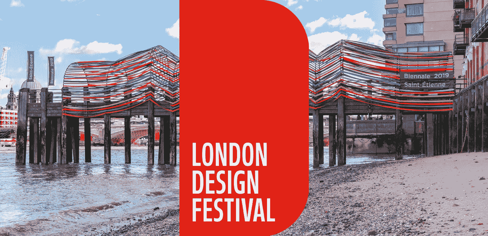
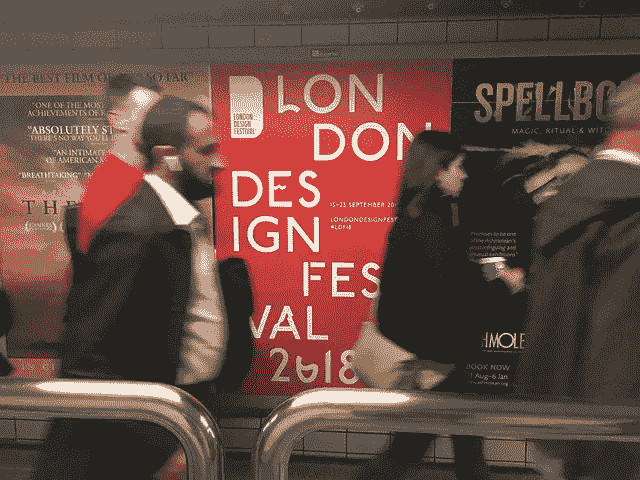
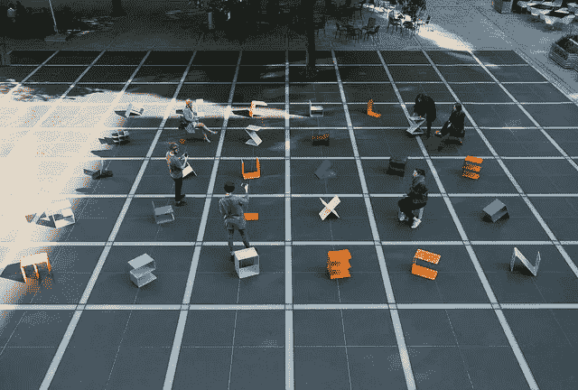
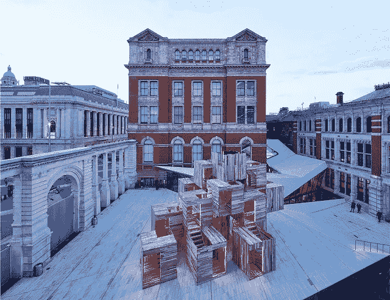

# 2018 伦敦设计节(第二部分):自然语言处理

> 原文：<https://towardsdatascience.com/london-design-festival-2018-part-2-natural-language-processing-595f3c2dc24f?source=collection_archive---------16----------------------->

## 第二部分:11，000 条推文的自然语言处理

## 介绍

[在本系列的第 1 部分](/analyzing-the-lumiere-london-2018-light-festival-part-1-eb0284d317c7)中，我对 2018 年伦敦设计节的 11，000 条推文进行了探索性的数据分析，这是一个为期七天的设计节，发生在 2018 年 9 月 15 日周六至 23 日周日之间。

伦敦设计节 2018 (LDF18)有一个非常活跃的活动计划，横跨伦敦 11 个不同的“设计区”、5 个“设计目的地”和 3 条“设计路线”。这是伦敦作为一个建筑环境的灵活性的另一个极好的例子，作为一个画布来展示创造性的想法。

本文的目的是介绍我的**自然语言处理分析**对这 11，000 条推文的研究结果，以了解情绪以及人们对 LDF18 的看法。

请向下滚动，通过交互式数据可视化查看我的分析！

Image by Ben Terrett [on Flickr](https://www.flickr.com/photos/benterrett/43922188854/in/photolist-2ba7p8K-MpcTVF-28pcpDJ-2ba7p22-29YiDie-29LPT7P-29LPSe6-28pcq1q-2ba7pai-MpcTY6-P2qP1b-28pcoaw-MpcTSK-29Le68C-2ba7p4B-28pcpTb-M9xkZX-29P5fQN-M9xktM-29VfGwb-NLU4dW-M9Ag12-NLXuM5-NLU4y5-NLSLQN-NLVEks-M9w5dP-28pcpRs-M9Dz8t-NLSKYY-29wbZgv-289LWDJ-2aUFRzr-29wbZyp-29wbZpX-M9AfzT-2ba7p6a-29waYxZ-29waYun)

## 数据和方法

这一事件的官方标签是#LDF18。在通过 Twitter API 在[事件发生时收集了 11000 条包含这个标签的推文之后，我首先在 Python 笔记本中预处理和清理了文本数据。](/access-data-from-twitter-api-using-r-and-or-python-b8ac342d3efe)

然后，我使用谷歌的 [*langdetect 库*](https://code.google.com/archive/p/language-detection/) 过滤掉非英语推文，并从 NLP 分析中删除所有转发，这样就不会出现重复。经过这些步骤，我剩下了 5700 条独特的推文。接下来，我使用[谷歌云自然语言 API](https://cloud.google.com/natural-language/) 来获取每条推文的情感。

最后，我使用 [gensim 库的 Word2Vec 模型](https://radimrehurek.com/gensim/models/word2vec.html)来获取整个 tweets 语料库中与单词“LDF18”相关的每个单词的单词嵌入向量。Word2Vec 用于从大型文本语料库中计算单词之间的相似度— [Kavita Ganesan](https://medium.com/u/cd869a6dee38?source=post_page-----595f3c2dc24f--------------------------------) 的[文章](https://medium.freecodecamp.org/how-to-get-started-with-word2vec-and-then-how-to-make-it-work-d0a2fca9dad3)是一个很好的解释。

一旦我有了每个单词的向量，我就使用 [scikitlearn 库](https://scikit-learn.org/stable/modules/generated/sklearn.decomposition.PCA.html)来执行主成分分析(PCA)以进行降维，并绘制出与“LDF18”最相似的单词(最近邻)。

你可以在这里查看[我的 Kaggle 内核对这篇文章的所有分析。](https://www.kaggle.com/vishalkumarlondon/london-design-festival-2018-nlp-analysis?scriptVersionId=7862472)

## 分析推文

在这一节中，我将展示我的自然语言处理(NLP)分析的发现。下面，我报告以下三个指标:

1.  每日推文的情感分析；
2.  词频和标签频率分析；
3.  Word2Vec 模型的输出:主成分分析(PCA)和最近邻分析。

Alphabet by Kellenberger White Photography by @leemawdsley 3— [Taken from Flickr](https://www.flickr.com/photos/londondesignfestival/43303036510/in/dateposted/)

## 情感分析

每条推文的情绪是使用谷歌的云 NLP API 计算的。下面的条形图显示了每天推文的平均情绪，其中-1 表示非常消极的情绪，+1 表示非常积极的情绪。

我们看到，LDF18 开始时的平均情绪相对较低，随着时间的推移逐渐上升。9 月 18 日星期二，也就是奖牌获得者晚宴后的第二天，出现了 0.53 的峰值——人们显然对此很高兴！

Figure 1: Line chart showing the average sentiment of the tweets per day

下表显示了按情感分类的前五条(绿色)和后五条(红色)推文。你可以通过左边的推文清楚地看到，积极的语言被云 NLP API 检测到，类似地，负面的推文在右边。

许多积极的推文是关于设计奖的奖牌获得者，还有那周举行的晚宴…小吃很棒，我会让你知道的！

LDF18 上展示的一些装置是关于塑料垃圾和气候变化的，不幸的是，NLP API 将提到这些装置的推文归类为“负面”；这凸显了情绪分析 API 的一些问题。

Table 1: Tabel showing the top five (left) and bottom five (right) tweets by sentiment score

## 文本频率分析

下面的条形图显示了一个词出现的次数，还有一个标签出现在所有推文中，分别在左边和右边。不出所料，“ldf18”出现的次数最多。

然而，这些结果在告诉我们人们对该事件的看法方面并不十分有用，因为标签的频率显然是单词频率的一个[混淆变量](https://en.wikipedia.org/wiki/Confounding)。在未来的分析中，我将从文本频率分析中删除 hashtag 单词。

Figure 2: Bar graphs showing the count of words and hashtags appearing in all the tweets

## 最近的邻居

[Word2Vec](https://en.wikipedia.org/wiki/Word2vec) 是神经语言机器学习模型。它将大量文本(在本例中，来自 11，000 条推文的文本)作为输入，并产生一个向量空间，通常有数百个维度，每个唯一的单词对应于空间中的一个向量——单词嵌入。然后使用主成分分析将 Word2Vec 空间的维度降低到 *x* 和 *y* 坐标。

重要的是，Word2Vec 用于从 11，000 条推文中捕捉单词之间的相似性和关系。具体来说，空间中距离较近的对象意味着它们是相似的。“最近邻”是来自 Word2Vec 模型的少数几个基于余弦度量相似性得分与“LDF18”最相似的单词。

Figure 3: PCA output of the nearest neighbours of #LumiereLDN from the Word2Vec model

散点图显示了“LDF18”的最近邻。我们看到诸如“建筑”、“工艺”、“纺织品”和“设计”等名词是密切相关的。

但重要的是，形容词“漂亮”、“创新”、“灵感”也是密切相关的。一个非常积极的结果！统计表明，这些词最能代表人们在推特上谈论 LDF18 时的感受。

Waugh Thistleton Architects: MultiPly —[Taken from Flickr](https://www.flickr.com/photos/londondesignfestival/43303034160/in/dateposted/) — All rights reserved by the London Design Festival

## 结论

所以你有它！我在 11，000 条关于 2018 年伦敦设计节的推文中展示了我的 NLP 的调查结果。Word2Vec 模型的输出显示，人们对该事件持积极态度。

如果你有任何想法或建议，请在下面或在[我的 Kaggle 内核](https://www.kaggle.com/vishalkumarlondon/london-design-festival-2018-nlp-analysis?scriptVersionId=7862472)上留下评论——如果能给 Kaggle 投票，我将不胜感激:)

有这么多的 NLP 库，我很可能会在未来使用 [GloVe](https://nlp.stanford.edu/projects/glove/) 、 [Tensorflow](https://www.tensorflow.org/tutorials/representation/word2vec) 或 [Bert](https://ai.googleblog.com/2018/11/open-sourcing-bert-state-of-art-pre.html) 重新审视这个分析。

## 下次…

在我的下一篇文章(第 3 部分)中，我将展示我的计算机视觉分析的发现。期待看到哪些艺术品出现的次数最多。敬请关注。

感谢阅读！

Vishal

# 在你离开之前…

如果你觉得这篇文章有帮助或有趣，请在 Twitter、脸书或 LinkedIn 上分享这篇文章，这样每个人都能从中受益。

Vishal 是一名文化数据科学家，也是伦敦 UCL 学院**的研究生。他对城市文化的经济和社会影响感兴趣。你可以在*[*Twitter*](https://twitter.com/vishalkumarldn)*或者*[*LinkedIn*](https://www.linkedin.com/in/vishalkumarlondon/)*上与他取得联系。在*[*insta gram*](https://www.instagram.com/vishalkumar.london/)*或他的* [*网站*](https://vishalkumar.london/) *上看到更多 Vishal 的作品。**