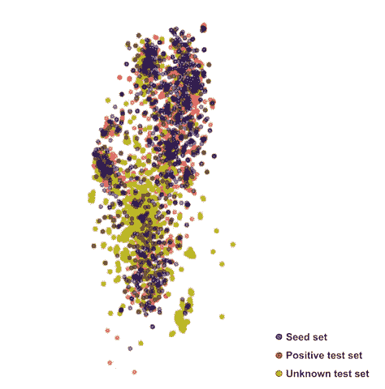
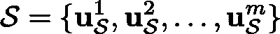
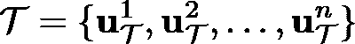
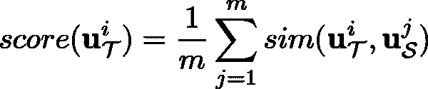
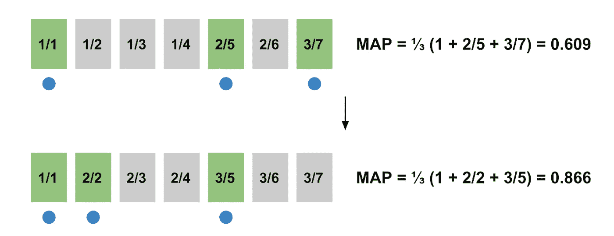
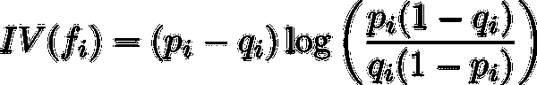
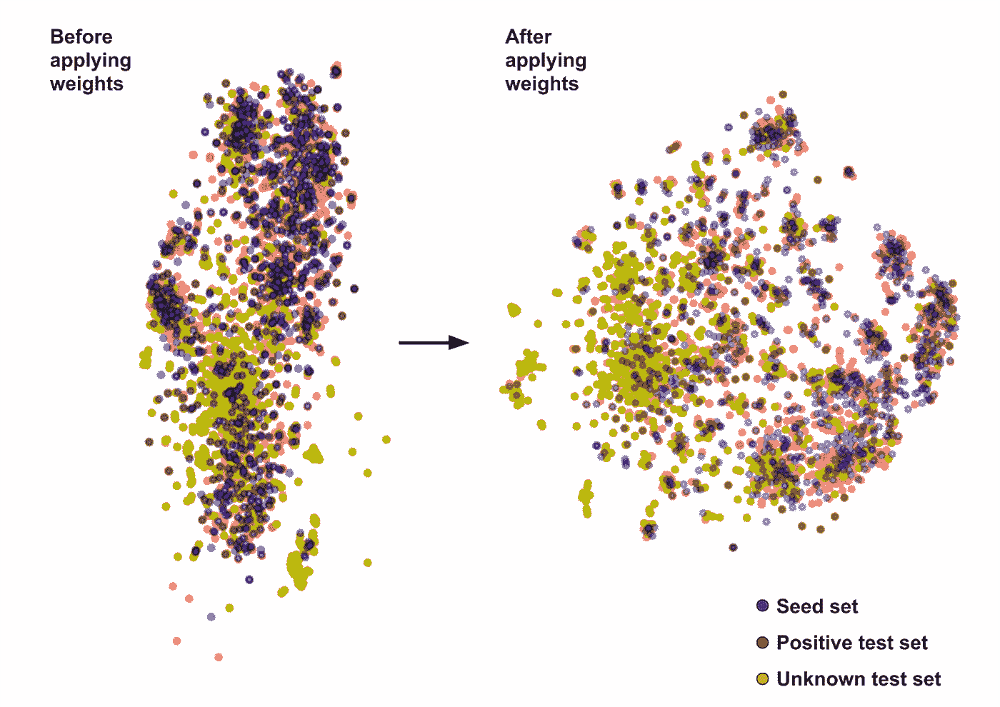
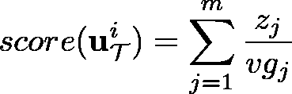
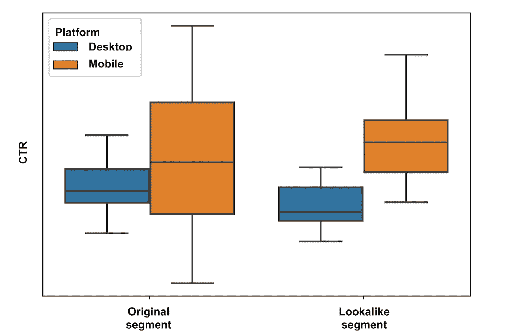

# 相似之处:大海捞针

> 原文：<https://towardsdatascience.com/lookalikes-finding-needles-in-a-haystack-683bae8fdfff?source=collection_archive---------3----------------------->

## 合著者:[康斯坦丁诺·博萨斯](https://www.linkedin.com/in/kbozas)和[斯特凡诺·科斯坦蒂尼](https://www.linkedin.com/in/stefanocostantini)

*合作者:***[*弗拉迪斯拉夫·索尔达托夫*](http://www.linkedin.com/in/vladislav-soldatov)*[*迈克尔·戴维*](https://uk.linkedin.com/in/michaeldavy)***

**在 Schibsted，我们使用数据科学来构建聚合用户行为和偏好的模型。广告商可以将这些结合起来，将用户分组，称为目标细分市场。**

**取决于它们是如何定义的，其中一些细分市场可能相当小众，限制了它们的覆盖范围。然而，广告商总是在寻找进一步扩大潜在受众的方法。**

**有什么比找到行为与他们已经瞄准的潜在客户相似的用户更好的呢？可以肯定的是，这些用户会比普通用户更容易接受他们的信息，从而提供了目标明确的受众。我们称这些额外的用户为*长相相似的*用户。**

**这听起来很棒，但是我们怎样才能找到他们呢？**

**我们的出发点是关于用户浏览行为的信息。例如，我们收集他们访问我们网站的不同方面的数据，如他们浏览的页面，他们访问这些页面的时间以及他们使用的设备。这可以帮助我们识别长相相似的用户。**

**然而，如此丰富的信息是福也是祸。这是一件幸事，因为它为我们提供了以各种方式模拟用户行为的灵活性，并选择最能描述用户活动的特性集。但这也是一个诅咒，因为考虑到数据的高维数，找到正确的特征集是一个挑战。如果选择了错误的功能集，就很难在浩瀚的用户大海中找到珍贵的针。**

**下图是根据已经标记的数据构建的，说明了这个问题。图像中的每个点都是每个用户原始特征的 2D t-SNE 投影。蓝点代表一组初始用户——在这种情况下是一组报纸订户——我们需要为他们寻找相似者。红点是真正的相似者(即初始集合中不包括的其他订户)，而黄点是没有订阅报纸的普通用户。**

****

**t-SNE project of the feature space**

**我们的目标是挑选真正的订户(“红色”)，排除普通用户(“黄色”)。正如我们在图中看到的，这似乎是一个棘手的问题。**

**在这篇文章中，我们展示了我们是如何解决这个问题的。这是一个实用的解决方案，允许我们充分利用原始种子集中包含的信息，充分利用我们可用的多种功能。**

# **长相相似的问题**

**我们可以将我们的目标定义如下:**

*   **假设 **u** 是在 *d* 维空间*中的特征向量形式的用户表示。***
*   **让**

****

**the initial set of users, called the ‘seed set’**

****

**a second set of users, where typically n >> m**

*   **根据某些标准返回 *L* ⊆ *T* ，其中包括看起来像 *S* 中的用户的用户。在我们的例子中，用户在 Schibsted 网站上的在线活动。**

**在我们的实验中，用户表示向量 **u** 是二进制的，对用户在线行为的特定特征的存在或不存在进行编码。**

**如何实现这一点？我们在下面讨论它，但是首先我们从一个难题开始:我们应该使用监督的还是无监督的学习方法？这两种方法都旨在找到 L，但是每种方法都以完全不同的方式实现**

**在无人监督的情况下，该模型逐个检查 *S* 中的所有用户，并且对于每个用户，它从 *T* 中检索其活动看起来与给定用户的活动最相似的用户。在这种方法下,“长相相似”用户的集合将包含与初始集合中包含的用户相似的用户。但是，结果集可能与初始集一样异构。**

**在受监督的情况下，我们使用集合 *S* 和 *T* 中的用户信息来训练受监督的机器学习算法，该算法将识别与初始集合中的用户相似的用户。该模型将尝试学习使初始种子集中的用户在一般人群中脱颖而出的隐含特征，并使用它们来寻找长相相似的用户。这种方法的主要优点是，假设初始集合中的用户共享一些共同的潜在特征，它可以非常有效地识别相似的用户。然而，由于缺乏明确的反例，寻找相似者不是一个普通的监督学习问题。有一些方法可以解决这些问题，比如积极未知学习，或者一类分类。**

**从工程的角度来看，无监督的方法更容易实现和维护，因为不需要模型的训练、参数调整、存储和服务。**

# **简单明了**

**我们从我们可以使用的最简单的方法开始: *K 近邻法* (KNN)。**

**在这种方法下，针对输入种子集 *S* 对群体 *T* 中的每个用户进行评分。我们通过计算 *T* 中每个用户与 *S* 中每个用户的相似度来给每个用户打分，然后取平均值。因此，对于每个用户，最终的相似性得分由下式给出:**

****

**user score**

**在计算了 *T* 中每个用户的相似性得分之后，我们可以按照与初始种子集的“接近程度”对他们进行排序，然后挑选得分最高的前 *K* 个用户作为相似集。**

**但是，这种方法有效吗？这个问题把我们带回了我们在引言中讨论过的数据维度问题。具体来说，我们的数据具有大约 30，000–40，000 的维度(取决于我们选择的特性集)。这让我们直面[维度诅咒](https://en.wikipedia.org/wiki/Curse_of_dimensionality)。**

**当特征空间如此巨大时，可用数据变得稀疏。因此，区分每个用户的活动和其他人的活动变得更加困难，因为每个人在某些方面看起来都与其他人不同。**

**尽管面临这一挑战，我们还是用我们的数据集评估了传统的 KNN 方法，以建立一个基线。余弦距离用于所有实验，因为我们发现它比我们数据中的其他度量产生更好的结果。**

**相似模型的评估不像典型的二进制分类问题那样简单，因为缺乏否定的基本事实。在早期的原型制作阶段，我们通过混淆完全已知的数据集中的部分标签来克服这个障碍。在这种情况下，我们使用传统的分类指标，如精确度和召回率。但是这种方法只能带我们走这么远。**

**在现实生活中，比如我们在这篇文章中考虑的情况，阴性样本是不可用的。因此，我们需要一个替代的性能指标。在这种情况下，我们选择使用*Mean Average Precision*(MAP)，它测量模型将正面类排在 lookalike 排名顶部的程度。下图显示了地图计算是如何工作的，以及地图的改进意味着什么。首先，假设我们有一个 lookalike 算法，它提供了下图顶部所示的排名。我们知道阳性样本应该排在前面。在这种情况下，我们发现它们位于位置 1、5 和 7。相应的，这个排名的映射是 0.609。现在，假设我们发现了一项改进，改变了排名，如图底部所示。在这种情况下，随着阳性样本越来越向顶部聚集(在位置 1、2 和 5)，MAP 上升到 0.866。**

****

**Mean Average Precision (MAP) explained**

**在我们的例子中，普通 KNN 方法的 MAP 得分是 0.704 **。**这个可以和一个随机排名的图比较，0.196。还不错，但是我们可以做得更好。是时候寻求更好地处理高维数据的方法了。**

# **利用你所知道的**

**虽然天真的方法似乎能够在某种程度上识别长相相似的用户，但原始的特征空间可能并不能很好地服务于我们的目的。我们需要一种方法来降低数据的维数。**

**用于降维的标准技术是 PCA，然而当我们应用它时，我们没有得到任何对 MAP 分数的改进。这可以被解释为因为 PCA 试图仅保持具有最高可变性的正交分量，并且对于种子用户活动和大用户池之间出现的不同趋势是不可知的。**

**如果我们确定了哪些特征对问题最有价值，即有助于区分种子集用户和其他用户的特征，而不是使用 PCA 或其他降维方法，也许我们可以进一步提高性能。如果我们知道这一点，我们就可以更多地依靠最相关的特征来计算用户相似性。**

**我们从这样的假设开始，即输入种子集包含表现出我们想要在整个群体中识别的特定行为的用户，而群体中的大多数个体表现出一般行为。通过比较这两个集合，我们可以突出它们之间的差异，并使用该信息来识别应该给予更多重视的特征。**

**更正式地说，为了度量每个特征的重要性，我们可以使用信息论度量，比如互信息。具体来说，马等人(T3)发现，信息值(T5)(IV)工作良好:我们对我们的问题采用了类似的方法。信息值常用于变量选择，定义如下:**

****

**Information Value score**

**其中 **p** _i 和 **q** _i 分别是在种子集 *S* 和种群集 *T* 中激活特征 i (f_i)的用户比例。**

**由于我们的特征向量是二进制的，我们可以通过将计算的 IV 权重 **w** 乘以向量 **u** 来生成新的加权特征向量。这个过程产生一个新的特征空间，具有更高的鉴别潜力。**

**我们通过在新的特征空间中生成相同样本的 2D t-SNE 投影来直观地演示这一点。**

****

**t-SNE projection of the of the original features space and the weighted one**

**正如我们可以看到的，当我们使用 IV 加权特征时，用户的类别看起来更加分离:正面测试集现在与未知测试集明显区分开来。此外，我们可以看到属于阳性集合的样本与种子集合中的样本被分组在一起。正如所料，这对 lookalike 算法的性能有积极的影响:加权特征空间上的 MAP 是 0.791，比我们的基线好 12%以上。**

# **扩大规模**

**每天大约有 2 亿用户访问 Schibsted 的媒体和市场网站。扩展加权 KNN 原型是一项严峻的挑战，也是成功交付产品的关键部分。**

**我们算法的简化复杂度分析如下:**

**两个向量之间的余弦相似度大约需要 *3d* 次运算(点积 1 次，每个向量范数 1 次)，其中 *d* 是向量维数。**

*   **对于参考集样本，我们需要|S| x 3d +|S|操作(一次计算距离，一次对所有距离求和)。**
*   **我们已经注意到，如果种子集大小很大，那么对单个样本进行评分会非常昂贵。**
*   **最后，为了对整个参考集|T| x (|S|x3d + |S|)进行排序，需要进行运算。**

**即使我们的特征的稀疏特性意味着每次距离计算可以在比 3d 运算少得多的运算中解决，当处理几百万个用户时，总的计算工作量也是巨大的。**

**幸运的是，这个任务可以并行化。**

**在我们的生产设置中，我们使用 Spark 和 Scala。我们发现，利用我们的特征的稀疏性，通过实施稀疏矩阵乘法方法并结合在 Spark 中广播种子集稀疏矩阵和种子集范数，我们可以显著地加速该过程。如果 **u_T^i** 是待排序的特征向量， *W* 种子集稀疏矩阵， **g** 是保存种子集范数的向量， *v* 是 **u_T^i** 的范数，那么将特征向量乘以种子集矩阵**z**=**u_t^i**^*t w*就可以得到余弦距离的分子**

****

**alternative user score formula**

**下面是实现过程:**

**我们也知道近似最近邻搜索技术，如本地敏感哈希(LSH)，但上面介绍的精确搜索的实施可以处理我们的用户群，并在中等规模的集群中在不到一个小时的时间内生成结果。**

# **有用吗？**

**当机器学习算法在现实世界中表现良好时，它就会显示出真正的价值。为了验证这一点，我们设立了两个在线活动:第一个向属于已知细分市场的用户展示定向广告，第二个由第一个细分市场的相似用户制作。我们通过应用上述算法，使用已知片段作为种子集来构建第二片段。**

**长相相似的细分市场旨在扩大第一个细分市场的受众范围。然而，只有当该段的性能与原始段的性能相当时，这才是可实现的。下图比较了展示给原始细分市场(左)和相似细分市场(右)用户的广告的[点击率](https://en.wikipedia.org/wiki/Click-through_rate) (CTRs)。图表显示，基于长相相似的广告活动的表现与最初的广告活动不相上下。**

****

**原始部分在桌面上表现更好，而长相相似的部分在移动设备上表现出更高的点击率。不过，在这两种情况下，差异都在误差范围内。最重要的是，相似片段的性能并不比原始片段的性能差很多。该结果表明，相似算法可以用于其预期的受众扩展目标。具体来说，在上面的案例中，我们能够在保持 CTR 性能的同时，将段的大小翻倍。总而言之，成功的第一次在线测试。我们目前正在对不同的广告活动和广告客户进行更多的测试，初步结果很有希望。**