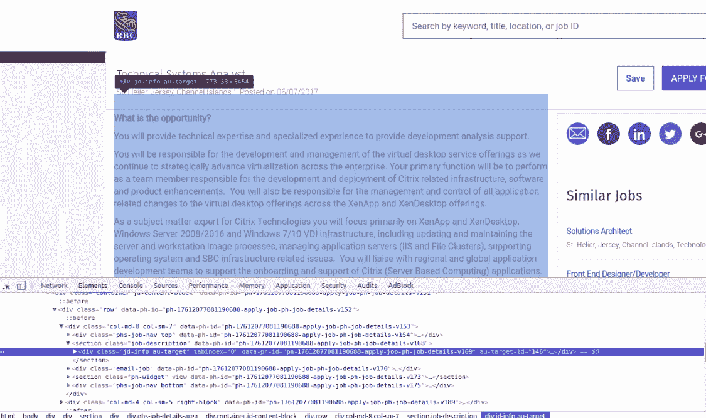
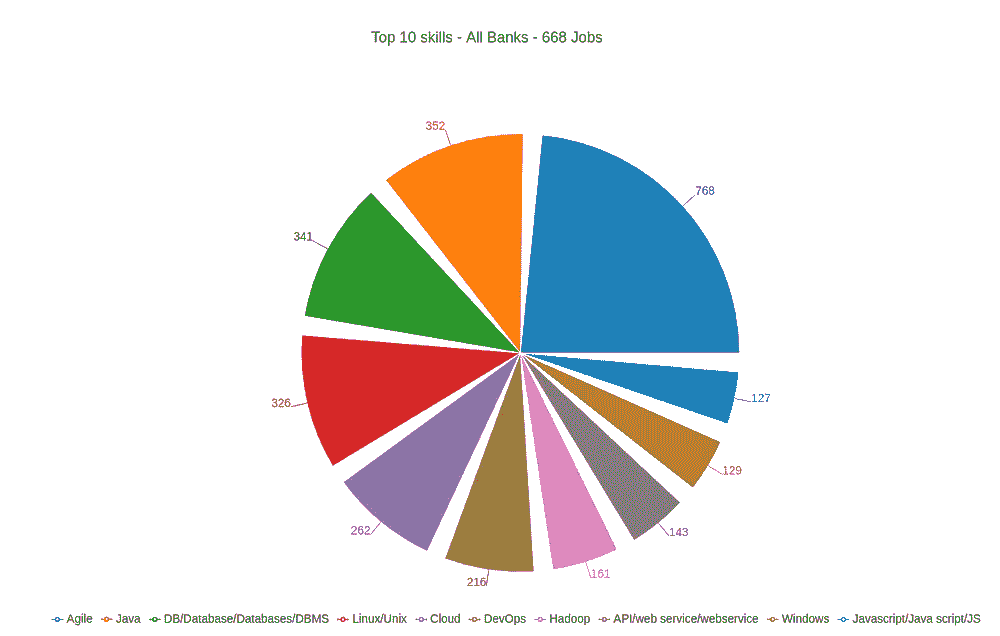
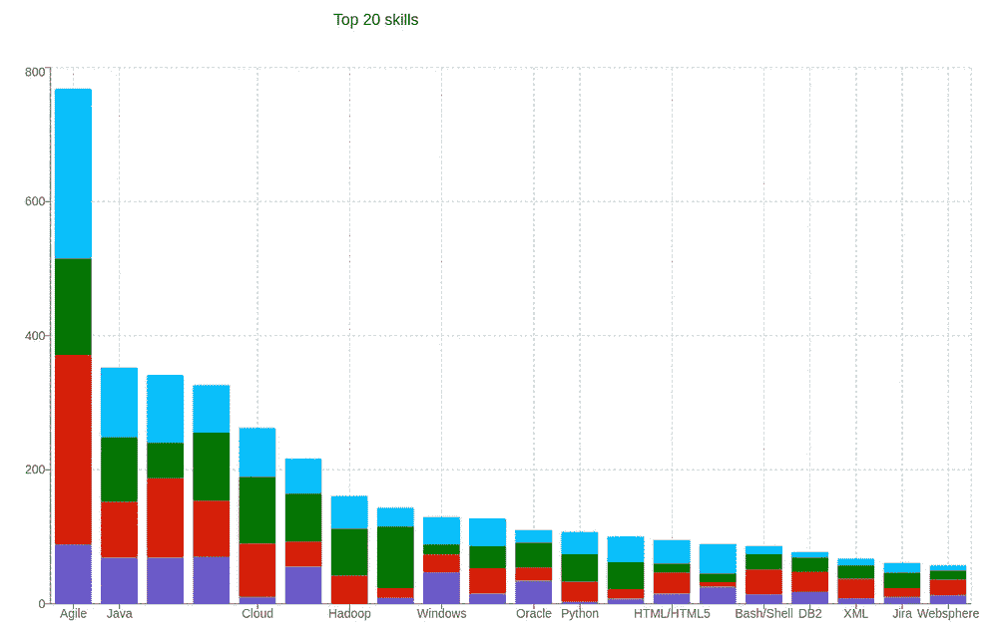
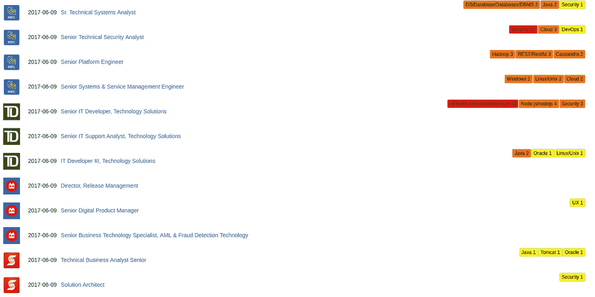

# 加拿大各大银行找工作？银行求职俱乐部给你洞察热门的 IT 技能

> 原文：<https://towardsdatascience.com/looking-for-jobs-in-canada-major-banks-bank-job-club-give-you-insight-hot-it-skills-there-3ded1b24426d?source=collection_archive---------6----------------------->


image credit [https://upload.wikimedia.org/wikipedia/commons/3/39/NYC_Top_of_the_Rock_Pano.jpg](https://upload.wikimedia.org/wikipedia/commons/3/39/NYC_Top_of_the_Rock_Pano.jpg)

学习是对你职业生涯的专业投资。对技术学习的投资和对金融领域的投资一样有风险。是因为科技太快了，每天都有太多的流行语出现。许多技术来来去去，只有少数技术在特定领域占据主导地位。

三个月前，我正从一家大型传统科技公司转行到金融机构。我开始分析在我们加拿大的主要银行里什么样的 IT 技能是热门的。快速浏览几个招聘职位让我了解到哪些技能在银行很热门。因此，我决定发起一个项目——[银行求职俱乐部](http://bank-jobs.club)，来分析。

# 我参与这个项目的旅程

## 收集数据

数据作为软件中的自然资源，是我首先需要的。没有这种正式的数据来源。所以我开始从银行的公开网站上搜集数据。我早就听说 python 有一套工具来完成这种工作，所以我尝试了一下。利用 [dryscrape](https://dryscrape.readthedocs.io/en/latest/) 和 [BeautifulSoup](https://www.crummy.com/software/BeautifulSoup/) ，我可以轻松地从内容由 JavaScript 代码动态创建的网站中提取基本信息。这是可能的，因为 dryscape 利用一个 headless webkit 服务器来获得 HTML 呈现。

这里有一个如何找到工作内容的例子。在这个站点中，内容的 div 有唯一的类名，我们可以用这个属性来标识内容。



```
**import** dryscrape
**from** bs4 **import** BeautifulSoupsession = dryscrape.Session()
session.set_attribute(**'auto_load_images'**, **False**)
session.visit(url)
time.sleep(2)
response = session.body()
soup = BeautifulSoup(response, **"lxml"**)
tags = soup.findAll(**'div'**, {**'class'**: **'jd-info au-target'**})
```

## 存储数据

我选择了 [mongodb](https://www.mongodb.com/) 作为我的持久存储，因为我的数据模型很简单。一个简单的 json 文档就足够了。不需要为表定义多个模式，也不需要通过创建桥表来处理关系。为了让我的 python 程序执行 db 操作，我利用了 [pymongo](https://api.mongodb.com/python/current/tools.html) 。

```
**from** pymongo **import** MongoClientclient = MongoClient(**'localhost'**, 27017)
db = client.job_bank_db
all_jobs = db.jobs
**for** job **in** jobs:
    **try**
        all_jobs.insert_one(job.__dict__)
    **except** Exception **as** ex:
        print(**"Found exception: "**)
        print(job)
        **continue**
```

## Cron 作业

在我们的世界里，能自动化的事情就应该自动化。所以我有一个程序来提取银行工作的信息。我需要它每天至少执行一次，以保持我的应用程序显示最新的数据。在 Linux 的世界里，这很简单:

```
crontab -e
# than edit the file in specific format
# For example, you can run a backup of all your user accounts
# at 5 a.m every week with:
# 0 5 * * 1 tar -zcf /var/backups/home.tgz /home/
```

## 服务

我用 Express.js 在 Node.js 中创建了一组 Restful web 服务，该服务的职责就像从 mongo 提供数据并进行过滤和排序一样简单。

即 GET /jobs 端点

```
*// GET jobs* router.**route**(**'/jobs'**)
  .get(**function** (req, res) {
    res.setHeader(**'Content-Type'**, **'application/json'**);
    **query_object** = {};
    **var** bank_name = req.**query**.bank;
    **if** (bank_name) {
      **query_object**.**company** = bank_name;
    }
    **var** skill = req.**query**.skill;
    **if** (skill) {
      skill = skill.replace(/\./g, **'-'**);
      **query_object**[**'stats.'** + skill] = {**$gt**: 0};
    }
    **var** page = req.query.page;
    **if** (page) {
      page = parseInt(page);
    } **else** {
      page = 0;
    }
    **var** page_size = req.query.page_size;
    **if** (page_size) {
      page_size = parseInt(page_size);
    } **else** {
      page_size = 20;
    }
    **var** skip = page_size * page;

    Job.find(query_object)
      .sort(**'-post_date'**)
      .limit(page_size)
      .skip(skip)
      .exec(**function** (err, jobs) {
        **if** (err) {
          res.send(err);
        } **else** {
          Job.count(query_object, **function** (err, c) {
            result = {count: c, jobs: jobs};
            res.json(result);
          });
        }
      });
  });
```

## 用户界面

UI 层在应用中越来越受到重视。越来越多的逻辑被转移到这一层。现在有一些不错的框架和库。React.js + Redux 成为我的选择，因为我喜欢它们如何处理应用程序中的状态和数据流的概念。有 [react.js 教程](https://facebook.github.io/react/tutorial/tutorial.html)和 [redux 官方 doc](http://redux.js.org/docs/introduction/) 这样的好教程。另外， [create-react-app](https://github.com/facebookincubator/create-react-app) 是一个方便的工具，可以帮助我快速创建一个可运行的结构项目。

从 UI 到 webservice 的通信并不简单。在开发过程中，我将它们作为两个不同的存储库，它们在开发过程中运行在不同的服务器上。react.js 应用运行在自己的嵌入式开发服务器上。当 web 服务在 express 服务器上运行时。向另一个服务器发出请求被认为是浏览器不允许的[跨源资源共享](https://en.wikipedia.org/wiki/Cross-origin_resource_sharing)。所以我需要在我的 react.js 应用程序的 package.json 中指定代理。

```
"proxy": "[http://localhost:8080](http://localhost:8080)" 
```

通过这样做，应用程序内部发出的 http 请求将被路由到 localhost:8080 上托管的 webservice。解决这个问题不需要代码。

***注意*** 此代理仅用于开发。

在**生产**中，您可以在同一个服务器上运行两者，因此不需要代理。这样，您可以通过覆盖一个目录来热更新 UI。

首先，生成生产缩小包。在 react.js 项目中运行下面的命令。

```
npm run build
```

将构建目录移动到 webservice 项目中。

```
cp build $service_project_dir
```

在 webservice 中，告诉服务器构建目录包含静态资源。

```
app.use(express.static(__dirname + '/build'));
```

启动服务器`PORT=80 npm start`

## 来自数据的初步见解

**敏捷——这个行话**

令人惊讶的是，敏捷是银行招聘信息中排名第一的关键词。这表明几乎所有的银行都在采用敏捷方法。因此，如果你有敏捷的经验，你有很大的优势。但是你应该预料到痛苦，因为在开始采用敏捷的大公司中可能会有许多冲突。

**Java——广泛使用的语言**

不管你讨厌它还是喜欢它，Java 仍然是银行就业市场上最需要的编程语言。有了这个，我们可以假设 SSH (Spring、Structs 和 Hibernate)可能是银行坚持使用的技术栈。

**数据库**

关系数据库仍然占主导地位。Oracle 是最常被提及的数据库，其次是 SQL server 和 DB2。NoSQL 目前不太出现在工作岗位上。

## 终于第一次发布完成了。随时欢迎反馈。

 [## 加拿大银行的技术技能

### 该平台提供加拿大银行 IT 工作的热门 IT 技能分析。

银行-工作.俱乐部](http://bank-jobs.club/) 

我的帖子:

[我关于金融和科技的帖子](https://medium.com/@fin.techology/my-posts-about-finance-and-tech-7b7e6b2e57f4?source=your_stories_page---------------------------)

[我关于 FAANG 访谈的帖子](https://medium.com/@fin.techology/my-posts-about-faang-interview-20e529c5f13f?source=your_stories_page---------------------------)

[从 CRUD web 应用开发到语音助手中的 SDE——我正在进行的机器学习之旅](https://medium.com/@fin.techology/from-crud-app-dev-to-sde-in-voice-assistant-my-ongoing-journey-to-ml-4ea11ec4966e?)

[全栈开发教程:将 AWS Lambda 无服务器服务集成到 Angular SPA 中](/full-stack-development-tutorial-integrate-aws-lambda-serverless-service-into-angular-spa-abb70bcf417f)

[全栈开发教程:用运行在 AWS Lambda 上的无服务器 REST API 提供交易数据](/full-stack-development-tutorial-serverless-rest-api-running-on-aws-lambda-a9a501f54405)

[全栈开发教程:在 Angular SPA 上可视化交易数据(1)](/full-stack-development-tutorial-visualize-trading-data-on-angular-spa-7ec2a5749a38)

[强化学习:Q 学习简介](https://medium.com/@kyle.jinhai.li/reinforcement-learning-introduction-to-q-learning-444c951e292c)