# 无损三重损耗

> 原文：<https://towardsdatascience.com/lossless-triplet-loss-7e932f990b24?source=collection_archive---------1----------------------->

pexels.com

## 一种更有效的暹罗神经网络损失函数

在工作中，我们与暹罗神经网络(NN)合作，对电信数据进行一次性训练。我们的目标是创建一个可以轻松检测电信运营商网络故障的神经网络。为此，我们构建了 N 维编码来描述网络的实际状态。通过这种编码，我们可以评估网络的状态并检测故障。这种编码与单词编码( [Word2Vec](https://en.wikipedia.org/wiki/Word2vec) 或其他)的目标相同。为了训练这种编码，我们使用一个[暹罗网络](https://www.cs.cmu.edu/~rsalakhu/papers/oneshot1.pdf)【科赫等人】来创建一个一次性编码，这样它就可以在任何网络上工作。暹罗网络的简单描述可以在[这里](https://hackernoon.com/one-shot-learning-with-siamese-networks-in-pytorch-8ddaab10340e)找到。关于我们实验的更多细节，你可以阅读我的同事的博客[，他是这个想法背后的主脑。](https://thelonenutblog.wordpress.com/2017/12/14/do-telecom-networks-dreams-of-siamese-memories/)

在 [coffeeanddata.ca](http://coffeeanddata.ca) 上的原始帖子

目前的实验，到目前为止效果很好。这个网络可以分割不同的交通场景。正如您在这张图片上看到的，良好的流量(绿色)很容易从错误类型 1(红色)和错误类型 2(橙色)中分离出来

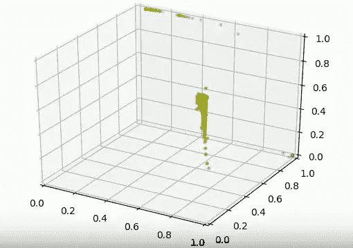

Current Model

# 问题是

那么问题是什么，它似乎工作得很好，不是吗？经过一番思考，我意识到损失函数有一个很大的缺陷。

首先是我们模型的代码。(不必阅读所有代码，我会指出问题。)

我的问题是这条损失函数线。

> *loss = K.maximum(basic_loss，0.0)*

这里有一个主要问题，每次你的损失低于 0，你就失去了信息，大量的信息。首先让我们看看这个函数。

它基本上是这样的:

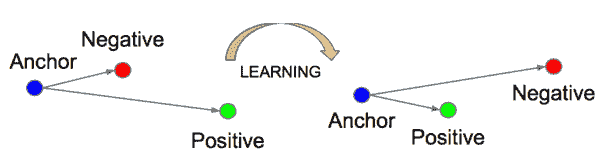

Schroff et al.

它试图使锚(当前记录)与正(理论上与锚相似的记录)尽可能接近负(与锚不同的记录)。

这一损失的实际公式为:

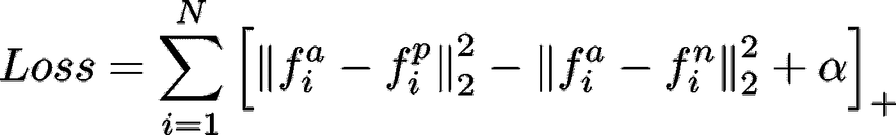

Schroff et al.

这个过程在论文 [*FaceNet 中有详细介绍:一个统一嵌入用于人脸识别和聚类的*](https://arxiv.org/abs/1503.03832)*by*[*Florian Schroff*](https://arxiv.org/find/cs/1/au:+Schroff_F/0/1/0/all/0/1)*，*[*Dmitry Kalenichenko*](https://arxiv.org/find/cs/1/au:+Kalenichenko_D/0/1/0/all/0/1)*和*[*James Philbin*](https://arxiv.org/find/cs/1/au:+Philbin_J/0/1/0/all/0/1)*。*

因此，只要负值比正值+α更大，算法就不会有增益来压缩正值和锚点。我的意思是:

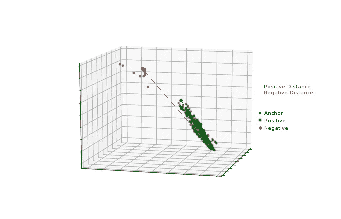

Distance costs

让我们假设:

*   阿尔法是 0.2
*   负距离是 2.4
*   正距离是 1.2

损失函数结果将是 1.2–2.4+0.2 =**-1**。然后，当我们查看 Max(-1，0)时，我们最终得到 0 作为损失。正距离可以是大于 1 的任何值，损失也是一样的。在这种情况下，算法将很难减少锚和正值之间的距离。

作为一个更直观的例子，这里有两个场景 A 和 b。它们都代表了损失函数为我们测量的内容。

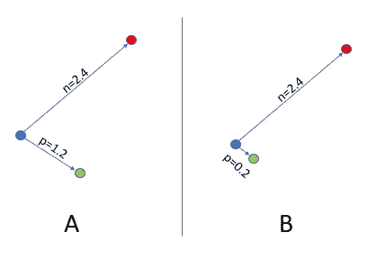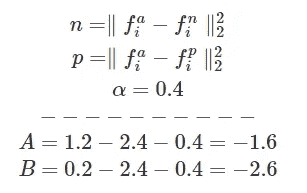

在 Max 函数之后，A 和 B 现在都返回 0 作为它们的损失，这是明显的信息损失。单纯看，可以说 B 比 a 好。

换句话说，你不能相信损失函数的结果，例如 50 年前后的结果。损失(训练和开发)为 0，但显然结果并不完美。

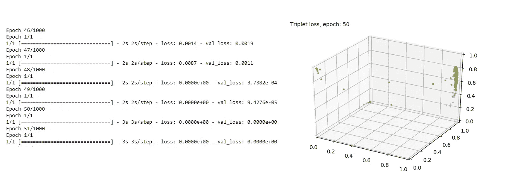

# 其他损失

另一个著名的损失函数是严乐存和他的团队在他们的论文[中描述的对比损失，通过学习不变映射](http://yann.lecun.com/exdb/publis/pdf/hadsell-chopra-lecun-06.pdf)进行降维，也最大化了负面结果，这产生了相同的问题。

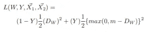

The Contrastive Loss Function, (LeCun)

# 解决办法

有了标题，你很容易猜到我的计划是什么…做一个损失函数，它将捕捉 0 以下的“丢失”信息。在一些基本的几何学之后，我意识到如果你包含了计算损失的 N 维空间，你可以更有效地控制它。所以第一步是修改模型。最后一层(嵌入层)需要控制大小。通过使用 Sigmoï de 激活函数而不是线性函数，我们可以保证每个维度都在 0 和 1 之间。

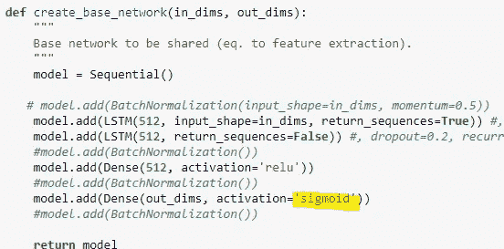

Sigmoïde activation

那么我们可以假设距离的最大值是 N，N 是维数。举个例子，如果我的锚点在 0，0，0，我的负点在 1，1，1。基于 Schroff 公式的距离将是 1 +1 +1 = **3** 。所以如果我们考虑维度的数量，我们可以推导出最大距离。这是我提出的公式。

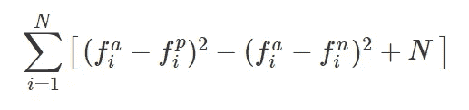

Linear loss function

其中 N 是嵌入向量的维数。这看起来非常相似，但通过使用 sigmode 和适当的 N 设置，我们可以保证该值保持在 0 以上。

# 初步结果

经过一些初步测试，我们最终有了这个模型。

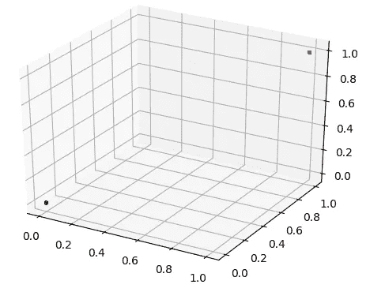

Merge results

好的一面是，我们可以看到来自同一个集群的所有点都变得非常紧密，甚至到了它们变得相同的程度。但不利的一面是，这两种错误情况(橙色和红色)重叠了。

这样做的原因是，当红色和橙色分开时，这样的损失较小。所以我们需要找到打破成本线性的方法；换句话说，随着错误越来越多，成本越来越高。

# 非线性

代替线性成本，我们提出了非线性成本函数:

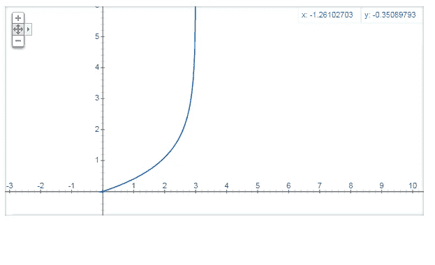

From Google Graph

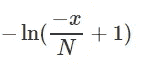

curve function

其中当 N = 3 时，曲线由 ln 函数表示

有了这个新的非线性，我们的成本函数现在看起来像:

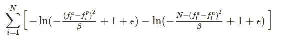

Lossless triplet loss

其中 N 是维数(网络的输出数；用于嵌入的特征数量),β是比例因子。我们建议将其设置为 N，但也可以使用其他值来修改非线性成本。

如您所见，结果不言自明:

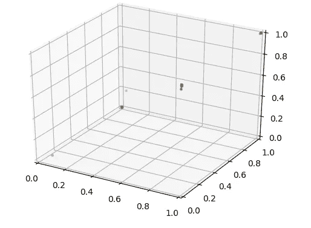

Result of classification with lossless triplet loss

我们现在有非常浓缩的点群，比标准的三元组函数结果要多得多。

作为参考，损失函数的代码如下:

记住，为了使它工作，你需要你的 NN 最后一层使用 Sigmoï de 激活函数。

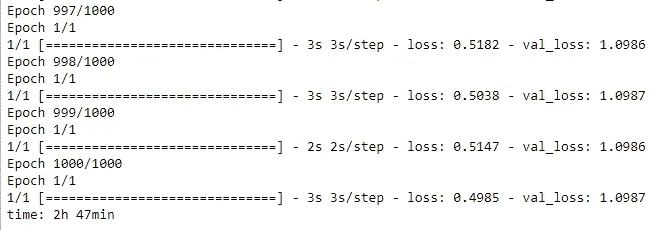

即使在 1000 个历元之后，无损三重损耗也不会像标准三重损耗那样产生 0 损耗。

# 差异

基于我的同事[做的他的模型的很酷的动画，我决定做同样的事情，但是用两个损失函数的现场比较。这是现场结果，左边是标准三重损耗(来自 Schroff paper ),右边是无损三重损耗:](https://thelonenutblog.wordpress.com/)

# 结论

这个损失函数看起来不错，现在我需要在更多的数据、不同的用例上测试它，看看它是否真的是一个稳健的损失函数。让我知道你对这个损失函数的看法。

# 想要阅读更多内容

关注我的博客: [coffeeanddata.ca](http://coffeeanddata.ca)

# 参考

*   科赫、格雷戈里、理查德·泽梅尔和鲁斯兰·萨拉胡季诺夫。“用于一次性图像识别的连体神经网络。” *ICML 深度学习工场*。第二卷。2015.
*   《向量空间中单词表征的有效估计》 *arXiv 预印本 arXiv:1301.3781* (2013)。
*   施洛夫、弗洛里安、德米特里·卡列尼琴科和詹姆斯·菲尔宾。" Facenet:人脸识别和聚类的统一嵌入."IEEE 计算机视觉和模式识别会议论文集。2015.
*   哈德塞尔、拉亚、苏米特·乔普拉和扬·勒昆。"通过学习不变映射来降低维数."*计算机视觉与模式识别，2006 年 IEEE 计算机学会会议于*。第二卷。IEEE，2006 年。
*   【https://thelonenutblog.wordpress.com/ 
*   https://hacker noon . com/one-shot-learning-with-siamese-networks-in-py torch-8d daab 10340 e