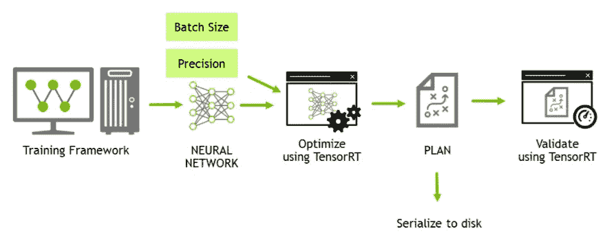
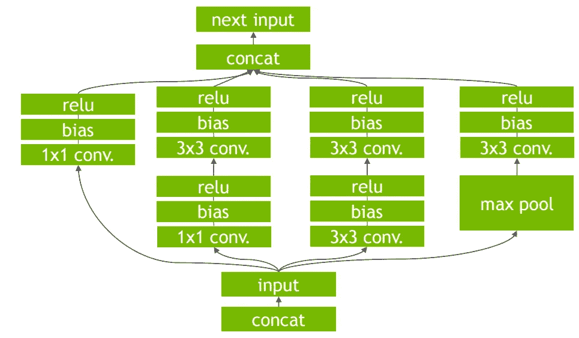
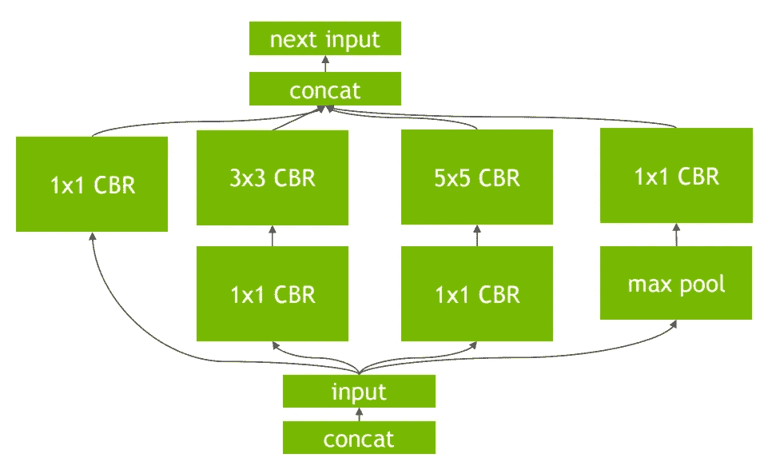
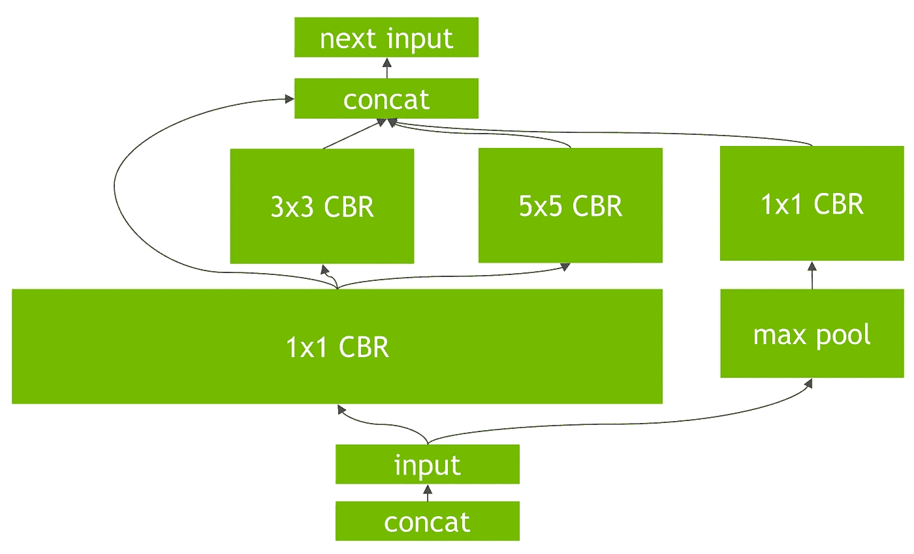
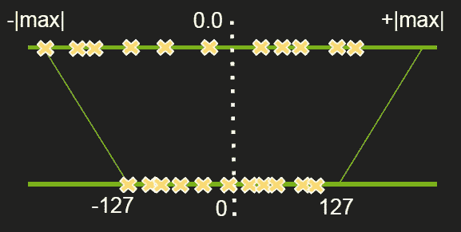
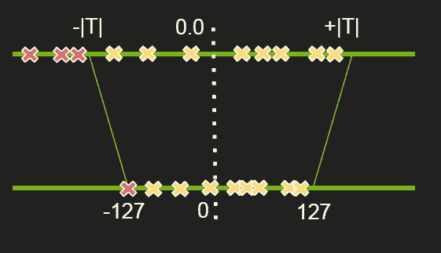
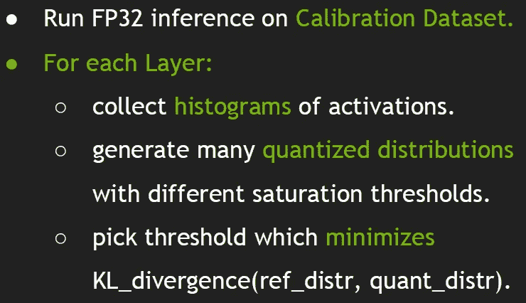
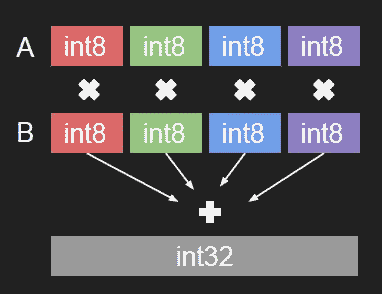

# TensorRT 低精度推理

> 原文：<https://towardsdatascience.com/low-precision-inference-with-tensorrt-6eb3cda0730b?source=collection_archive---------2----------------------->

声明:这是**而不是**一个 NVIDIA 的官方帖子。只是总结一下我从演讲、听的演讲和与人的互动中学到的和收集到的东西。Post 假设对深度学习(DL)有一些基本的了解。

深度学习程序通常有两个阶段，即,

1.  训练，利用一堆数据和某些优化技术，机器学习归纳(嗯，这是它能得到的最简单的)。通常离线完成。
2.  推理，机器将学习到的概括应用于看不见的数据。通常在生产环境中使用。

训练是对大量数据的迭代过程。它的计算量非常大。根据问题定义、数据等，可以使用从单个 GPU 到一群 GPU 的任何东西。

另一方面，推理在计算上相对容易(由于较小的批量和没有反向传递)，但是在大多数 DNN(深度神经网络)应用中实现实时推理仍然是一个困难的问题。

注意，训练过程一般没有“*实时*的约束。另一方面，实际推理是受时间和力量(尤其是嵌入式)约束的。TensorRT 是 Nvidia 软件解决方案，用于为深度学习模型的生产部署生成优化模型。这篇 [parallel forall](https://devblogs.nvidia.com/parallelforall/production-deep-learning-nvidia-gpu-inference-engine/) 博客文章对 TensorRT，以前被称为 GPU 推理引擎(GIE ),博客使用旧行话)做了很好的介绍。

这篇博客将主要集中在一个重要的优化技术上:**低精度推理(LPI)** 。

在开始理解 LPI 之前，我将快速总结一下所有博文的相似之处。

Fig. 1: TensortRT in one picture

上图很好地概括了 TRT 的工作。它基本上是作为一个 [SDK](https://developer.nvidia.com/tensorrt) 公开的。你输入你已经训练好的网络(这将意味着模型定义和学习参数)和其他参数，如推理批量大小和精度，TRT 做优化，并建立一个执行计划，可以使用或序列化，并保存到磁盘上，供以后使用。推理时不需要深度学习框架。只要使用 TRT 输出的执行计划，就可以了。在服务器、台式机甚至嵌入式设备上使用它。此外，对于给定的模型，这是一次性的事情。没有附加条件:)

## 优化引擎

这就是奇迹发生的地方(嗯，不完全是，这只是科学)。TRT 做了一些优化。

*   图形优化:

Fig.2: Vertical Fusion — Input

Fig.3: Vertical Fusion — Optimized graph

上图解释了 TRT 所做的垂直融合优化。卷积(C)、偏置(B)和激活(本例中为 R、ReLU)都被合并到一个节点中(就实现而言，这意味着 C、B 和 R 只启动一个 CUDA 内核)。

Fig.4: Horizontal Fusion

是的。还有一种水平融合，其中如果具有相同操作的多个节点正在向多个节点馈送，则它被转换为一个单个节点向多个节点馈送。三个 1x1 CBRs 被融合成一个，并且它们的输出被定向到适当的节点。

## 其他优化

除了图形优化之外，TRT 还通过实验并基于诸如批量大小、卷积核(过滤器)大小等参数，为网络中的操作选择高效的算法和核(CUDA 核)。

# 低精度推理

## 那么，为什么我们真的需要低精度的推理呢？

正如已经提到的，执行时间和功率并不便宜，在实时应用中是至关重要的。考虑到所需的计算量，我们希望在不影响准确性的情况下，优化我们的推理，以利于时间和能力。因此，我们转移到参数的 8 位表示和推理时的激活。与 32 位相比，8 位需要更少周期来获取存储器。还有一个新的硬件指令(DP4A)形式的优势，我将在本文稍后介绍。

## 这有用吗？

是的，当然。如果不是这样的话，这个博客就是浪费时间了:)。在训练过程中，参数和激活在 [FP32](https://en.wikipedia.org/wiki/Single-precision_floating-point_format) 中显示。FP32 的高精度有利于训练，因为每个训练步骤都会对参数进行少量修正。DL 算法通常对噪声有弹性。在学习模型的过程中，通常会尝试选择性地保留预测所需的特征。所以，扔掉不必要的东西是这个过程的一部分。所以我们希望低精度表示引入的噪声被模型扔掉(这里也是非常外行的术语)。据我所知，没有严格的数学证明说低精度应该在推理过程中像 FP32 一样好。

## 将 FP32 映射到 8 位

这是 TensorRT 为应用程序/客户端做的事情。应用程序/客户端只需要实现一个提供校准信息和一些缓存相关代码的接口。很快会有更多的报道。在此之前，让我们看看 TRT 进行 32 位到 8 位映射的步骤。

映射的候选对象是每一层的输入(将输入到第一层，并激活其余层)和学习参数。最简单的映射/量化形式是线性量化。

*FP32 张量(T) = scale_factor(sf) * 8 位张量(t)* *+ FP32_bias (b)*

很简单，不是吗？让我们把它变得简单些。(从实验中)发现偏差项并没有真正增加任何价值。所以，摆脱它。

*T = sf * t*

注意这里的 *sf* 是每个层中每个张量的比例因子。现在，下一个问题是找到比例因子。一个简单的方法是如下图所示:

Fig.5: A simple max-max mapping

我们简单地将张量中的-|max|和|max| FP32 值分别映射到-127 和 127。其余的值相应地线性缩放。但是，这里有一个问题。实验表明，这种映射会导致显著的精度损失。因此，TRT 采取了以下措施:

Fig.6: Threshold instead of max

而不是看|max|值。固定一个阈值(如何？我们稍后会看到)。然后像前面一样进行映射。阈值范围内的任何值都调整为-127 或 127。例如，在上图中，三个“红叉”被映射到-127。

那么接下来的问题就是阈值 *T* 的最优值是多少？这里有两种分布。我们有 FP32 张量，它在 FP32 分布中表现得最好。但是，我们希望用不同的分布(8 位)来表示它们，这不是最好的分布。我们希望看到这些分布有多大的不同，并希望将差异最小化。TRT 使用 Kullback-Leibler 散度( [KL-divergence](https://en.wikipedia.org/wiki/Kullback%E2%80%93Leibler_divergence) )来衡量差异，并旨在将其最小化。

**可选:什么是 KL-divergence？为什么是 KL-divergence？一些直觉:<可选开头>** 让我们在这里稍微进入编码理论。假设我有一系列符号，我知道它们出现的概率。如果我要对符号进行最佳编码，我会使用比如说“T3”T 比特。注意 *T* 是最佳位数。让我们称这个代码为代码' *A* '。现在，我有了同样的一组符号，但是它们出现的概率变了。现在，对于具有新概率的符号，如果我使用代码' *A* '来编码符号，则用于编码的比特数将是次优的，并且大于' *T* '。KL-divergence 精确地测量这种差异，即最优和次优之间的差异(由于选择了错误的代码)。在我们的例子中，张量值的正确代码是 FP32，但我们选择用 8 位错误代码来表示(嗯，不是错误，但你明白了)。所以有一个惩罚，用 KL 散度来衡量。我们的工作是尽量减少处罚。如果你已经用 DL 解决了一些问题，你可能会用交叉熵作为一个代价函数。KL 散度与交叉熵密切相关。虽然 KL-divergence 表示由于在错误代码中编码而导致的比特数(或所需的额外比特数)的差异，但是交叉熵表示在该错误代码中编码符号所需的确切比特数。所以， *KL-divergence =(交叉熵)——(最优码所需比特数)*。 **<可选结束>**

因此，我们需要最小化 FP32 值和相应的 8 位值之间的 KL 偏差。TRT 使用简单的迭代搜索最小散度，而不是基于梯度下降的方法。步骤如下:

Fig.7: Threshold finding process

## 校准

TRT 采用基于实验的阈值迭代搜索。校准是其中的主要部分。应用程序/客户向 TRT 提供了一个样本数据集(理想情况下是验证集的子集)，称为“校准数据集”，用于执行所谓的校准。TRT 在校准数据集上运行 **FP32** 推理。收集激活直方图并生成具有不同阈值的 8 位表示的集合**并选择具有最小 KL 散度的一个。KL 散度在参考分布(FP32 激活)和量化分布(8 位量化激活)之间。TRT 2.1 提供了`IInt8EntropyCalibrator`接口，客户端需要实现该接口来提供校准数据集和一些用于缓存校准结果的样板代码。**

## DP4A

这就是 TRT 如何进行优化的简要介绍。还有一件事不完全相关，但 TRT 依赖于 8 位快速推理。从 Pascal 一代 GPU(选定的 SKU)开始，有一种称为 DP4A 的新硬件指令。

Fig.8: DP4A (**D**ot **P**roduct of **4** 8-bits **A**ccumulated to a 32-bit)

它基本上是一条指令，执行 4 次 8 位乘法，并累加成一个 32 位整数。点积构成了卷积运算的数学基础，该指令通过最小化执行时间和功耗，提供了非常好的提升。[这篇关于 CUDA 8 的](https://devblogs.nvidia.com/parallelforall/mixed-precision-programming-cuda-8/)博客更详细地讨论了 DP4A。如果有兴趣，一定要去看看。

因此，总的来说，优化的空间很大。考虑到 TRT 的优化和正确的硬件(支持 DP4A 的 GPU)，您不仅可以将 GPU 推向极限，同时还可以保持其效率。所以去做一些有效的推断，直到你推断出生命的意义:D

**一些参考:**我无耻地从博客和演示文稿中抄袭数据:)

图 1 至图 4:[tensort](https://devblogs.nvidia.com/parallelforall/deploying-deep-learning-nvidia-tensorrt/)

图 5 至图 8 : [GTC PPT](http://on-demand.gputechconf.com/gtc/2017/presentation/s7310-8-bit-inference-with-tensorrt.pdf)

这大部分是基于在 2017 年 GTC 上的这个出色的[展示](http://on-demand.gputechconf.com/gtc/2017/video/s7310-szymon-migacz-8-bit-inference-with-tensorrt.mp4)。

PS:请随意评论/批评/ ♥这篇文章。