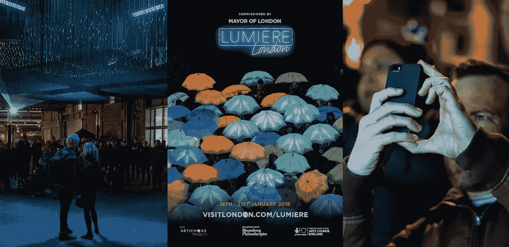
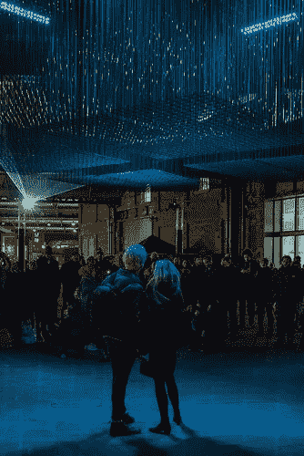
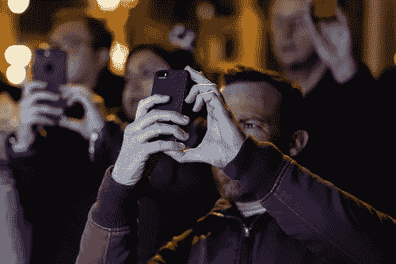
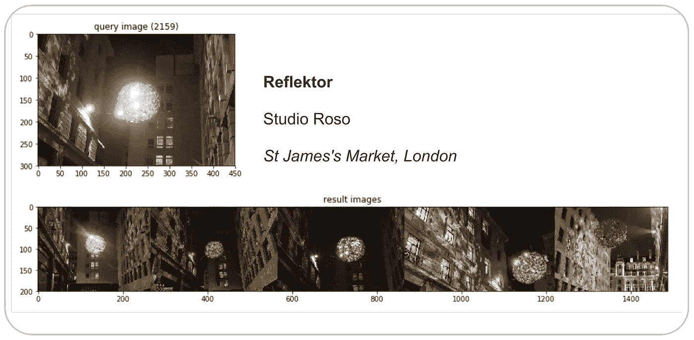
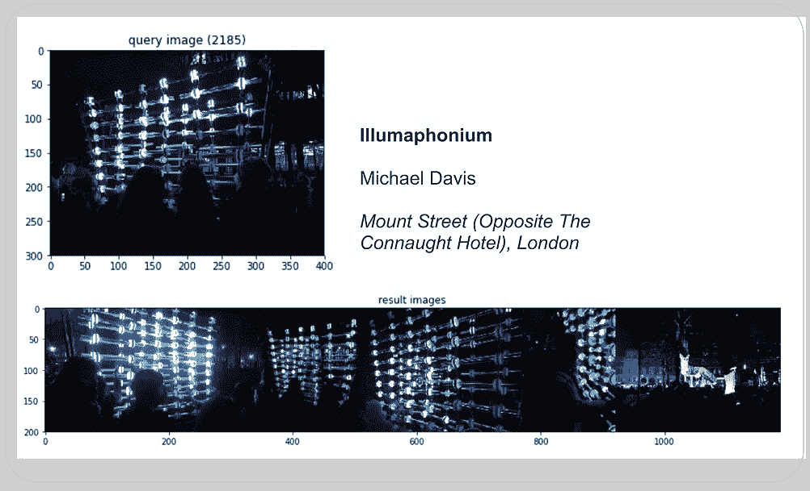
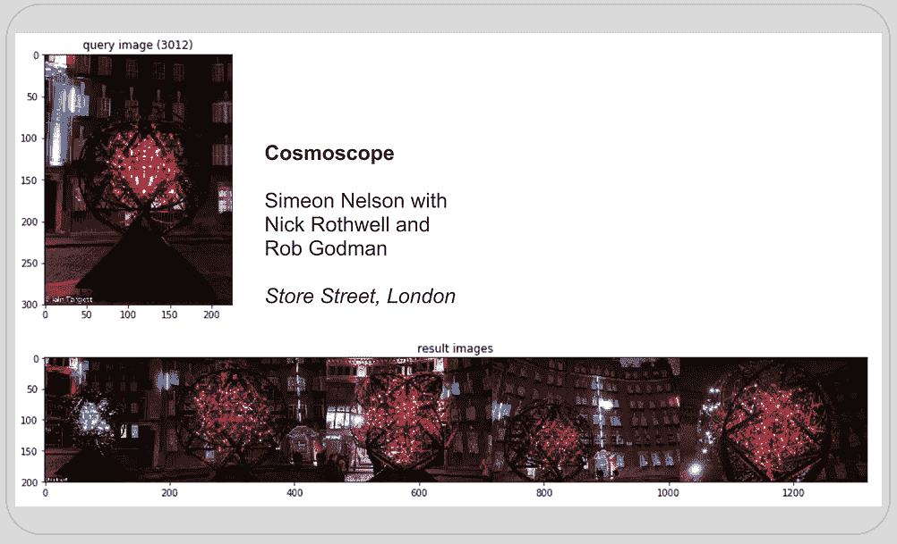
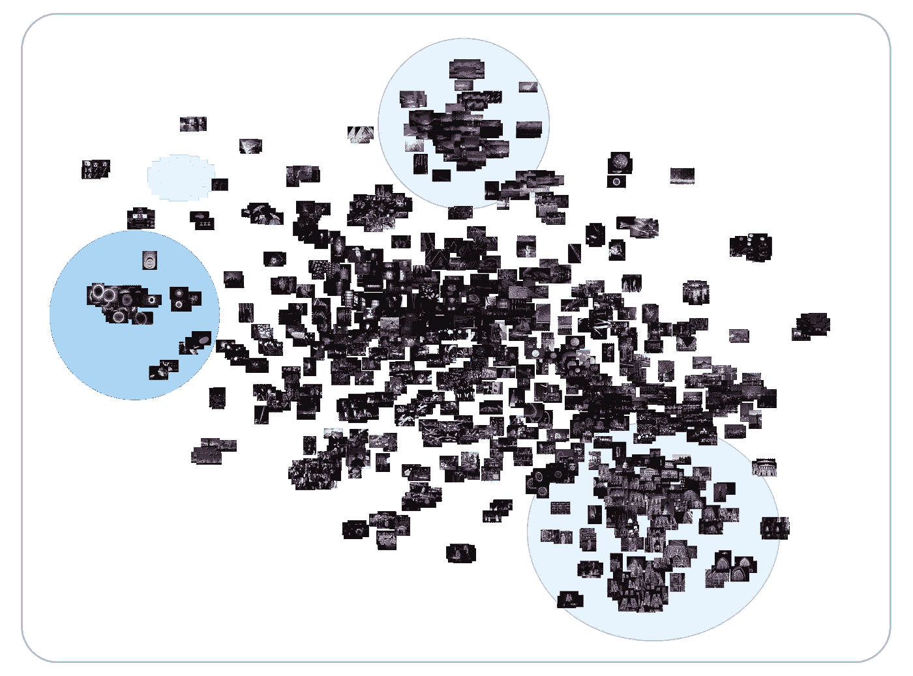
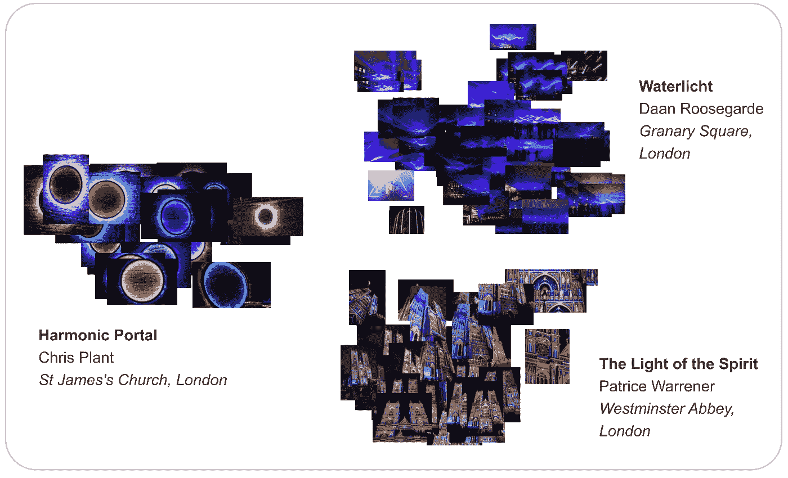
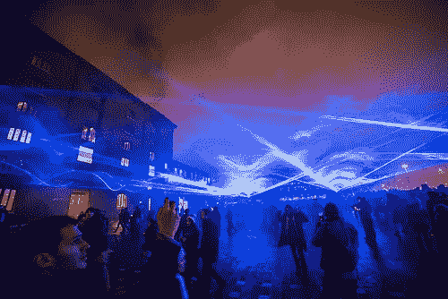

# 琉米爱尔伦敦 2018(第三部分):计算机视觉

> 原文：<https://towardsdatascience.com/lumiere-london-2018-part-3-computer-vision-d4918effff4?source=collection_archive---------18----------------------->

## 第三部分:用计算机视觉分析 5000 张 Flickr 图片

## 介绍

在这一系列的最后一篇博客文章中，我应用计算机视觉技术来理解 5000 张关于琉米爱尔伦敦 2018 的 Flickr 图像，这是今年 1 月初在伦敦举行的一场大型灯光节。

在 2018 年伦敦琉米爱尔展期间，53 位艺术家的 50 多件公共艺术品在伦敦的六个区展出，为期四天，从 1 月 18 日星期四到 1 月 21 日星期日，超过 100 万人参加了这个节日！

在本系列的[第二部分](/analyzing-the-lumiere-london-2018-light-festival-part-2-98eb3769e267?source=friends_link&sk=f4e161cc63042e8128658700163f4bbd)和[第一部分](/analyzing-the-lumiere-london-2018-light-festival-part-1-eb0284d317c7?source=friends_link&sk=6636c299230848b95d4c4fc43c7d5ba4)中，我展示了自然语言处理和对 11000 条关于这个节日的推文的探索性数据分析。

本文的目的是使用计算机视觉分析来理解我从 Flickr 上传的 5000 张图片，并把它们放在上下文中。

请向下滚动查看分析！

An image of Lumiere London 2018\. Source: Flickr

## 数据和方法

使用 [Flickr API](https://www.flickr.com/services/api/) ，它使用起来相当简单，我收集了包含文本“琉米爱尔伦敦”的图像，这些图像是在 2018 年 1 月 1 日至 4 月 1 日之间上传到 Flickr 上的。总共有 5047 张图片。

然后，使用[谷歌云的视觉 API](https://cloud.google.com/vision/docs/) 提取每张图像的标签。Cloud Vision API 利用“谷歌庞大的机器学习专业知识网络”(g [reat article](https://medium.com/@srobtweets/exploring-the-cloud-vision-api-1af9bcf080b8) 作者 [Sara Robinson](https://medium.com/u/7f2ab73b39f8?source=post_page-----d4918effff4--------------------------------) )来检测图像的特征和标签。总共，5047 张图片被赋予了 487 个不同的标签。

被称为**特征提取**和**反向图像搜索**的机器学习技术然后使用[基因科岗的代码](http://ml4a.github.io/ml4a/)来基于视觉相似性找到图像。首先，使用预训练的卷积神经网络来提取每幅图像的“特征”，然后，计算这些特征的[余弦相似度](https://en.wikipedia.org/wiki/Cosine_similarity)，以“搜索”少量与查询图像相似的图像。

特征在计算机视觉中的主要作用是“[将视觉信息转换到向量空间](https://medium.com/machine-learning-world/feature-extraction-and-similar-image-search-with-opencv-for-newbies-3c59796bf774)”。相似的图像应该产生相似的特征，我们可以利用这些特征进行信息检索。基于这些特征，我们还可以通过使用[一种叫做 t-SNE](https://medium.com/@luckylwk/visualising-high-dimensional-datasets-using-pca-and-t-sne-in-python-8ef87e7915b) 的方法来对图像进行相似性聚类。

An image of Lumiere London 2018\. Source: Flickr

## 图像分析

在这一节中，我将展示我的计算机视觉分析的结果。下面，我报告以下三个指标:

1.  图像的标签检测；
2.  基于视觉相似性的图像搜索:
3.  基于视觉相似性的图像聚类。

## **标签检测**

每张照片的标签都是使用[谷歌云视觉 API](https://cloud.google.com/vision/) 生成的。这背后的想法是将图片分类，这样我就可以识别相似的图片。下面的条形图显示了 5，000 幅图像的前 10 个标签。

我们看到“夜”和“光”出现的次数最多。这些标签很有意义，因为这是一个灯光装置的夜晚节日！然而，它们没有明确描述艺术品本身，这突出了一些标签检测技术的缺点。

Figure 1: label count of 5,000 images of Lumiere London 2018\. Source: Flickr

为图像生成标签在各种其他应用程序中非常有用，例如训练机器学习模型或构建推荐系统，但对于这篇文章来说，它们没有那么有用。

不可否认，我没有最大限度地使用 vision API 这篇由 Sara Robinson 撰写的文章突出了 API 的许多伟大特性——这可能是因为调用 API 是有成本的！

## **图像搜索—视觉相似度**

我们可以通过编程让计算机学习图像之间的视觉相似性，而不是使用标签来理解图像。一种叫做**特征提取**和**反向图像搜索**的技术就是这样做的。

使用在 [TensorFlow 后端](https://www.tensorflow.org/guide/keras)上运行的 [Keras VGG16](https://keras.io/applications/#vgg16) 神经网络模型，我首先为数据集中的每张图像提取了一个特征。一个特征是每个图像的 4096 元素的数字数组。我们的期望是“该特征形成图像的非常好的表示，使得相似的图像将具有相似的特征”([吉恩·科岗，2018](http://ml4a.github.io/ml4a/convnets/) )。

然后使用主成分分析(PCA)降低特征的维度，以创建一个[嵌入](https://developers.google.com/machine-learning/crash-course/embeddings/video-lecture)，然后计算一个图像的 PCA 嵌入到另一个图像的距离[余弦距离](https://en.wikipedia.org/wiki/Cosine_similarity)。我终于能够向计算机发送随机查询图像，它选择并返回数据集中具有相似特征向量的五个其他图像。

下面是三个例子:

A reverse image search for Reflecktor by Studio Roso at Lumiere London 2018

A reverse image search for Illumaphanium by Michael David and Cosmoscope by Simeon Nelson at Lumiere London 2018

当试图从一个有一百万张图片的相册中找到相似的图片时，这种技术非常有用！

## 图像聚类—相似性

既然我们在向量空间中嵌入了每个图像，我们可以使用一种流行的叫做 t-SNE 的机器学习可视化算法来聚类，然后在二维空间中可视化向量空间。

> “tSNE 的目标是聚集相似数据点的小“邻域”,同时减少数据的整体维度，以便更容易可视化”(谷歌人工智能博客，2018 年)

下面我们看到基于视觉相似性的聚类形成。

The clustering of images of Lumiere London 2018\. Source: Flickr

在下图中，我重点展示了三件艺术品——圣詹姆斯教堂的克里斯·普兰特的 *Harmonic Portal，粮仓广场的金奎大·鲁斯加德*的 *Waterlicht，威斯敏斯特教堂的帕特里斯·沃伦纳*的*The Light of The Spirit*——以及它们的集群剖面。

The clustering of images of three art installations at Lumiere London 2018\. Source: Flickr

## 结论

所以你有它！我只是刚刚涉足计算机视觉的奇妙世界。还有很多东西需要我去学习，但这对我来说是很好的第一步。

我的发现表明，使用机器学习和计算机视觉技术来理解和联系琉米爱尔伦敦 2018 灯光节的图像是可能的。

对我来说，下一步显然是计算在数据集中出现了多少艺术装置，以衡量“受欢迎程度”。我将继续研究这个数据集。

An image of Lumiere London 2018\. Source: Flickr

## 结束了！

这是我关于琉米爱尔伦敦 2018 系列博客的结尾！这个系列是我正在进行的关于使用数据科学来理解和衡量城市文化影响的长期讨论的一部分。

明年，我将开始新的项目，在那里我将主要使用 JavaScript。敬请期待！

感谢阅读！

Vishal

[*Vishal*](https://vishalkumar.london/) *是伦敦 UCL*[*The Bartlett*](https://www.ucl.ac.uk/bartlett/)*的文化数据科学家和研究生。他对城市文化的经济和社会影响感兴趣。*