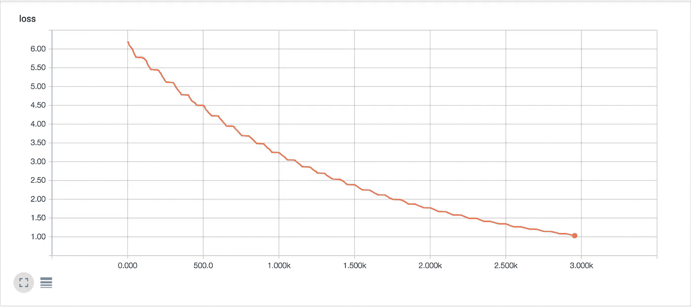
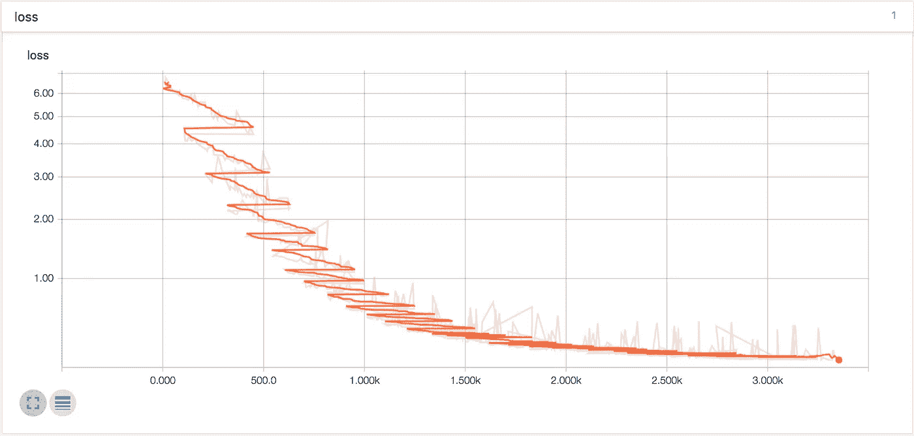
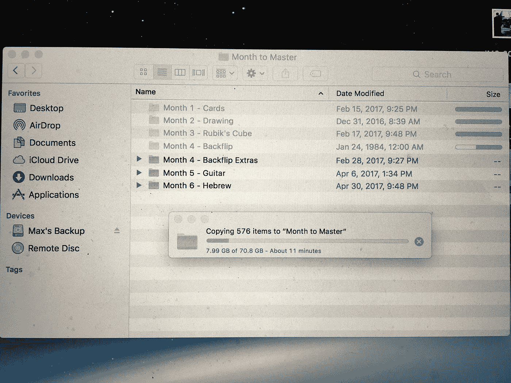
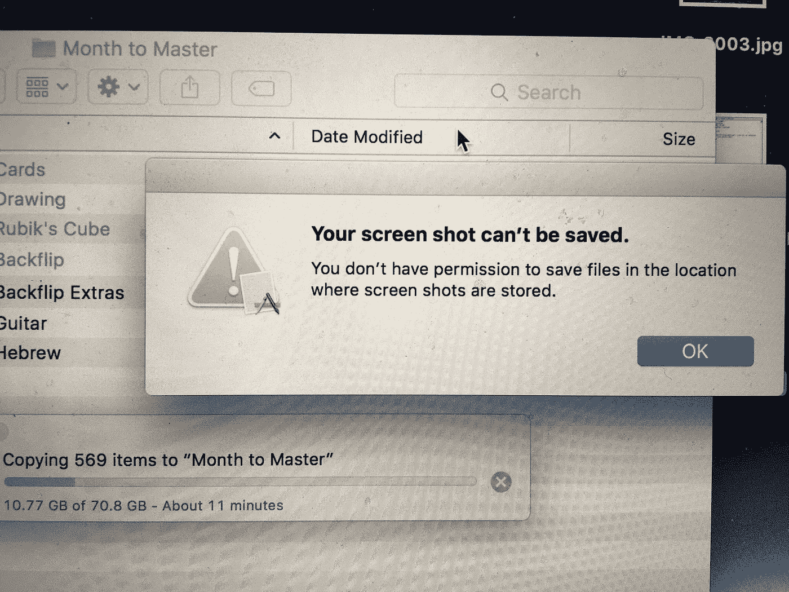
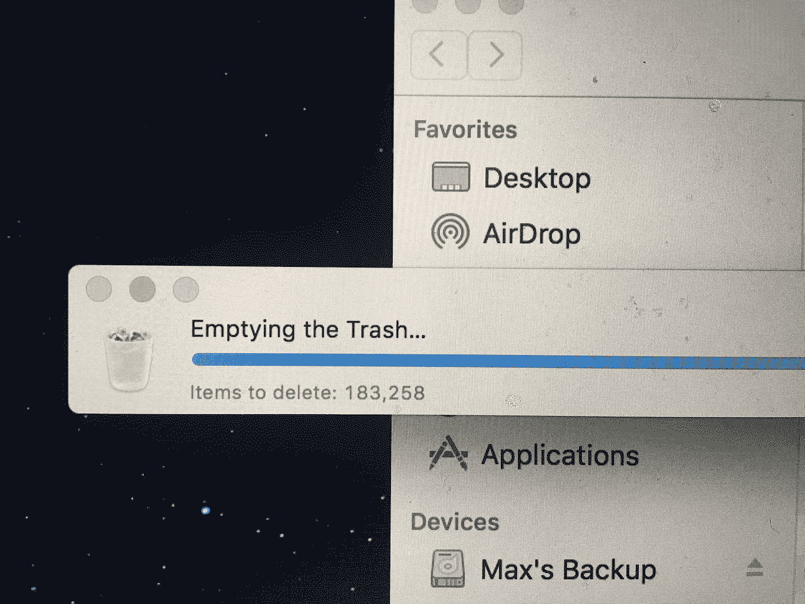
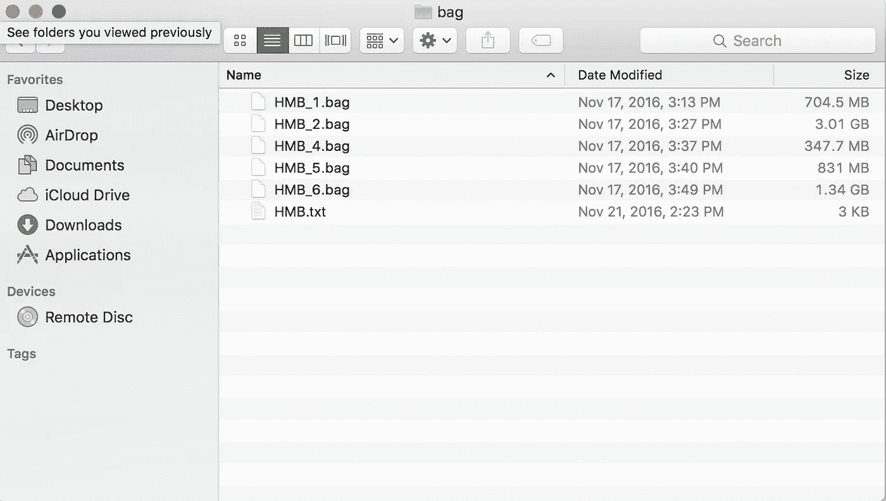
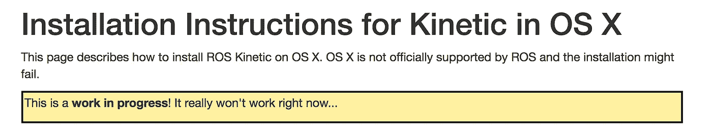
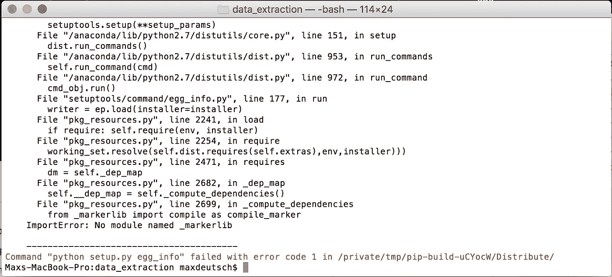

# M2M 第 197 天:掉进兔子洞的悲伤旅程…

> 原文：<https://towardsdatascience.com/m2m-day-197-a-sad-journey-down-the-rabbit-hole-325d48a515ee?source=collection_archive---------6----------------------->

> 这篇文章是为期 12 个月的加速学习项目[月掌握](https://medium.com/@maxdeutsch/m2m-day-1-completing-12-ridiculously-hard-challenges-in-12-months-9843700c741f)的一部分。今年五月，[我的目标是打造无人驾驶汽车的软件部分](https://medium.com/@maxdeutsch/m2m-day-182-attempting-to-build-a-self-driving-car-809fab9e4723)。

今天是一个错误和障碍的可悲集合(没有快乐的结局)。当我试图挽回自己时，我在兔子洞里越陷越深。

昨天[开始](https://medium.com/@maxdeutsch/m2m-day-196-debugging-and-self-driving-cars-in-real-life-6b8c376c83a8)——我成功地重新格式化了 Udacity 数据，并开始训练自动驾驶汽车模型。

在模型完成训练后，我快速看了一下损失图(*损失衡量模型的“准确性”——损失越低，模型越好……在大多数情况下)。*

经过 30 个时期的训练，损失甚至没有下降到 1.00 以下，而当我根据英伟达的数据训练模型时，损失大幅下降到 1.00 以下，一直到大约 0.16。

我不确定为什么我期望发生一些不同的事情——我使用的 Udacity 数据集只有 NVIDIA 数据集的 1/8 大小。

这是我的第一个错误:我不小心使用了*测试数据集*来训练模型。相反，我应该使用大得多的*训练数据集*，然后在*测试数据集*上测试训练好的模型。

问题不大:我去了 Udacity Github 页面，下载了更大的数据集用于训练。或者，至少我尝试过。

下载到一半，我的电脑完全崩溃了。

原来我电脑的本地存储/启动盘*完全满了*。太满了，以至于我的电脑拒绝运行任何程序。甚至 Finder 也意外崩溃。

我插上我的外部硬盘，开始把我一个月的主文档从我的本地机器上转移出去。

*顺便说一句，我不得不用手机给我的电脑屏幕拍照，因为我的电脑没有足够的空间来截图……*

总之，前六个月的 M2M 文档超过了 132GB，其中 70.8 GB 在我的本地机器上，所以，一旦传输完成，我就可以将 70 GB 的本地文件转移到垃圾桶。

然后，在试图清空我的垃圾时，我的电脑死机了…

重启电脑几次后，我的垃圾终于清空了，30 分钟后，我又开始工作了。

现在我的电脑上有了空间，我回到 Udacity Github 页面下载*训练数据集*。

训练数据集实际上是在 torrent 中压缩的，所以我需要安装 BitTorrent 来下载数据集。

种子下载后，我解压文件。我期望看到一堆 JPEG 图像和一个 data.txt 文件，就像我们之前看到的一样，但是相反，我看到了这个…

显然，Udacity 认为将数据打包在*中是个好主意。包*文件。我实际上从未听说过。之前的包文件，但似乎是自动驾驶汽车(或者其他“机器人”保存数据的原生方式。

因此，我需要找出如何从个人中提取 JPEGs 和 CSV。袋装文件。

有一个叫做 ROS(机器人操作系统)的库需要使用。包文件，所以我试图安装它。

但是，这是我在 ROS 安装页面上发现的…

换句话说，制作 ROS 的人基本上是在说*“这是行不通的。会失败的。不好意思。”*

他们是对的，它确实失败了。

然而，我花了更多的时间试图解决这个错误，最终看起来我已经成功地安装了我需要的所有东西。但是，后来我尝试运行*提取脚本*，仍然失败。

此时，我不得不停下来过夜。

明天，希望我能取得一些进步。

> 阅读[下一篇](https://medium.com/@maxdeutsch/m2m-day-198-whoa-its-even-better-than-i-hoped-44f0467a599e)。阅读[上一篇文章](https://medium.com/@maxdeutsch/m2m-day-196-debugging-and-self-driving-cars-in-real-life-6b8c376c83a8)。

## [Max Deutsch](http://max.xyz) 是一名痴迷的学习者、产品建造者、为期[个月以掌握](http://MonthToMaster.com)的试验品，以及 [Openmind](http://OpenmindLearning.com) 的创始人。

## 如果你想跟随 Max 长达一年的速成学习项目，请确保跟随[这个媒介账户](https://medium.com/@maxdeutsch)。