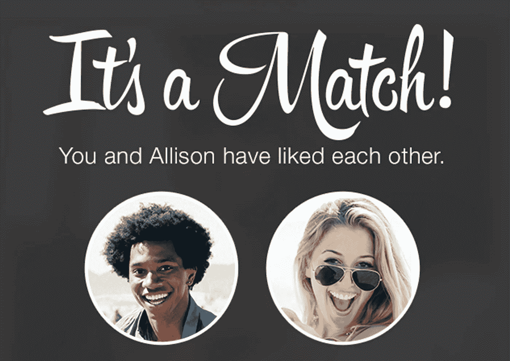
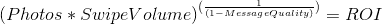
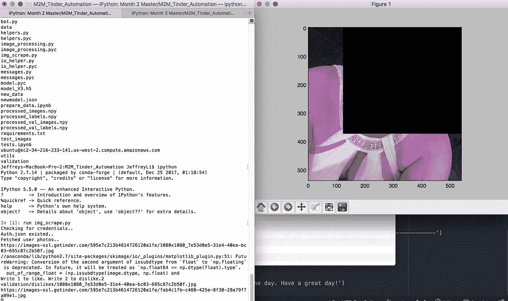
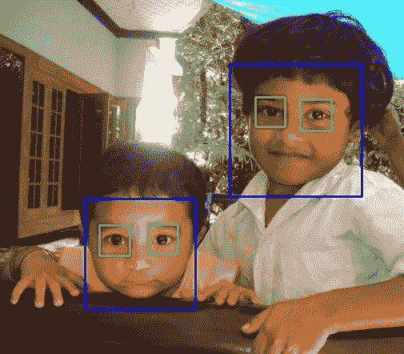
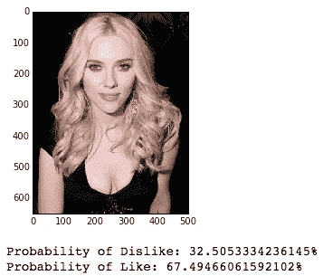
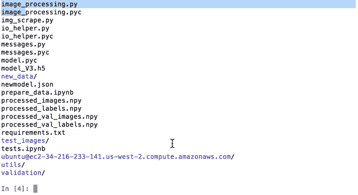

# M2M 第 90 天——我如何使用人工智能来自动化 Tinder

> 原文：<https://towardsdatascience.com/m2m-day-89-how-i-used-artificial-intelligence-to-automate-tinder-ced91b947e53?source=collection_archive---------2----------------------->

> 这篇文章是杰夫为期 12 个月的加速学习项目“掌握的一个月”的一部分对于 March，他正在下载构建人工智能的能力。



*如果你有兴趣了解更多关于我的信息，请查看我的* [*网站*](http://www.jefflichronicles.com) *。*

# 介绍

前几天，当我坐在马桶上拉屎时，我拿出手机，打开了所有马桶应用之王:Tinder。我点击打开应用程序，开始无意识滑动。*左* *右* *左* *右* *左*。

现在我们有了约会应用程序，与应用程序出现之前的时代相比，每个人突然都有机会与更多的人约会。湾区倾向于男性多于女性。湾区也吸引了来自世界各地的超级成功的聪明男人。作为一个额头很大、身高 5 英尺 9 英寸、不怎么拍照的亚洲男人，旧金山约会领域的竞争非常激烈。

通过使用约会应用程序与女性朋友交谈，旧金山的女性几乎每刷一次就能匹配到一次。假设女性在一小时内有 20 场比赛，她们没有时间去和每个给她们发信息的男人约会。显然，他们会根据个人资料+最初的信息来挑选他们最喜欢的男人。

我是一个相貌出众的人。然而，在亚洲男人的海洋中，纯粹基于长相，我的脸不会出现在页面上。在股票交易所，我们有买家和卖家。顶级投资者通过信息优势赚取利润。在牌桌上，如果你比牌桌上的其他人有技能优势，你就变得有利可图。如果我们认为约会是一个“竞争市场”，你如何给自己竞争优势？竞争优势可能是:惊人的外表、事业成功、社交魅力、冒险精神、接近、巨大的社交圈等等。

在约会应用上，在照片和短信技能上具有竞争优势的男性和女性将从应用中获得最高的投资回报率。因此，我将约会应用的奖励系统分解为一个公式，假设我们将消息质量从 0 到 1 标准化:



Credit: Me

你的照片越漂亮，你就越不需要写高质量的信息。如果你有糟糕的照片，不管你的信息有多好，没有人会回应。如果你有很棒的照片，一条机智的信息会显著提高你的投资回报率。如果你不刷卡，你的投资回报率为零。

虽然我没有最好的照片，但我的主要瓶颈是我没有足够高的点击量。我只是认为这种无意识的刷卡是在浪费我的时间，我更喜欢亲自去见人。然而，这样做的问题是，这种策略严重限制了我可以约会的人的范围。为了解决这个刷卡量问题，我决定建立一个自动化 tinder 的人工智能，名为:THE DATE-A MINER。

日期-矿工是一个人工智能，它学习我喜欢的约会配置文件。一旦它学习完我喜欢什么，约会矿工就会自动在我的 Tinder 应用程序上的每个个人资料上向左或向右滑动。因此，这将显著增加刷卡量，从而增加我的预计 Tinder 投资回报率。一旦我找到匹配，人工智能会自动给匹配者发送信息。

虽然这并没有给我照片方面的竞争优势，但这确实给了我点击量和初始信息方面的优势。让我们深入研究一下我的方法:

# 数据收集

为了建立一个日期-一个矿工，我需要喂她很多图像。结果，我使用 [pynder](https://github.com/charliewolf/pynder) 访问了 Tinder API。这个 API 允许我通过我的终端界面而不是应用程序来使用 Tinder:



我写了一个脚本，我可以在每个配置文件中滑动，并将每个图像保存到“喜欢”或“不喜欢”的文件夹中。我花了几个小时刷，收集了大约 10，000 张图片。

我注意到的一个问题是，我向左滑动了大约 80%的个人资料。结果，我有大约 8000 个不喜欢的文件夹和 2000 个喜欢的文件夹。这是一个严重不平衡的数据集。因为我的“喜欢”文件夹中的图片很少，所以约会达人不会训练有素地知道我喜欢什么。它只会知道我不喜欢什么。

为了解决这个问题，我在谷歌上找到了一些我觉得有吸引力的人的图片。然后我收集了这些图像，并在我的数据集中使用它们。

# 数据预处理

现在我有了图像，但还有一些问题。Tinder 上有各种各样的图片。有些个人资料有多位朋友的照片。一些图像被缩小。有些图像质量很差。很难从如此多种多样的图像中提取信息。

为了解决这个问题，我使用了一个 [Haars 级联分类器算法](https://docs.opencv.org/3.4.1/d7/d8b/tutorial_py_face_detection.html)从图像中提取人脸，然后保存下来。分类器本质上使用多个正/负矩形。让它通过预先训练的 AdaBoost 模型来检测可能的面部尺寸:



Credit: OpenCV

该算法在大约 70%的数据中未能检测到人脸。这使我的数据集缩减到 3000 张图片。

# 建模

为了对这些数据进行建模，我使用了一个[卷积神经网络](http://cs231n.github.io/convolutional-networks/)。因为我的分类问题非常详细&主观，所以我需要一种算法来提取足够多的特征，以检测我喜欢和不喜欢的简档之间的差异。cNN 也是为图像分类问题而建立的。

为了对这些数据建模，我使用了两种方法:

**三层模型**:我没想到三层模型会表现得很好。每当我构建任何模型时，我的目标都是让一个笨模型先工作起来。这是我的笨模型。我使用了一个非常基本的架构:

```
 model = Sequential()
model.add(Convolution2D(32, 3, 3, activation=’relu’, input_shape=(img_size, img_size, 3)))
model.add(MaxPooling2D(pool_size=(2,2)))model.add(Convolution2D(32, 3, 3, activation=’relu’))
model.add(MaxPooling2D(pool_size=(2,2)))model.add(Convolution2D(64, 3, 3, activation=’relu’))
model.add(MaxPooling2D(pool_size=(2,2)))

model.add(Flatten())
model.add(Dense(128, activation=’relu’))
model.add(Dropout(0.5))
model.add(Dense(2, activation=’softmax’))adam = optimizers.SGD(lr=1e-4, decay=1e-6, momentum=0.9, nesterov=True)
model.compile(loss=’categorical_crossentropy’,
 optimizer= adam,
 metrics=[‘accuracy’])
```

最终的准确度约为 67%。

**使用 VGG19 进行迁移学习:**三层模型的问题是，我正在一个超小的数据集上训练 cNN:3000 张图像。在数百万张图片上表现最好的 cNN 列车。

因此，我使用了一种叫做“迁移学习”的技术迁移学习，基本上就是把别人建立的模型用在你自己的数据上。当你有一个非常小的数据集时，这通常是可行的方法。我在 VGG19 上冻结了前 21 层，只训练了后两层。然后，我展平并在它上面拍了一个分类器。下面是代码的样子:

```
model = applications.VGG19(weights = “imagenet”, include_top=False, input_shape = (img_size, img_size, 3))top_model = Sequential()top_model.add(Flatten(input_shape=model.output_shape[1:]))
top_model.add(Dense(128, activation='relu'))
top_model.add(Dropout(0.5))
top_model.add(Dense(2, activation='softmax'))new_model = Sequential() #new model
for layer in model.layers: 
    new_model.add(layer)

new_model.add(top_model) # now this worksfor layer in model.layers[:21]:
    layer.trainable = Falseadam = optimizers.SGD(lr=1e-4, decay=1e-6, momentum=0.9, nesterov=True)
new_model.compile(loss='categorical_crossentropy',
              optimizer= adam,
              metrics=['accuracy'])new_model.fit(X_train, Y_train, 
          batch_size=64, nb_epoch=10, verbose=2 )new_model.save('model_V3.h5')
```

结果是:

**准确度** : 73%

**精度:** 59%

**召回率:** 44.61%

准确性只是正确地预测我是喜欢还是不喜欢这张图片。

Precision 告诉我们“在我的算法预测为真的所有配置文件中，我真正喜欢的有多少？”低精度分数意味着我的算法没有用，因为我得到的大多数匹配都是我不喜欢的简档。

回忆，告诉我们“在所有我实际上喜欢的配置文件中，算法正确预测了多少？”如果这个分数很低，这意味着算法过于挑剔。

你可以看到斯嘉丽·约翰逊的算法预测:



# 运行机器人

现在我已经建立了算法，我需要把它连接到机器人上。制造这个机器人并不太难。在这里，你可以看到机器人的动作:



我故意在每次滑动时添加了 3 到 15 秒的延迟，这样 Tinder 就不会发现这是一个在我的个人资料上运行的机器人。不幸的是，我没有时间给这个程序添加 GUI。

# **未来工作**

我只给自己一个月的兼职来完成这个项目。事实上，我还可以做无数其他的事情:

**对个人资料文本/兴趣的自然语言处理:**我可以提取个人资料描述和 facebook 兴趣，并将其纳入评分标准，以开发更准确的点击。

**创建一个“总个人资料得分”:**我可以让算法查看每张照片，并将累积的滑动决策汇编成一个得分指标，以决定她应该向右还是向左滑动，而不是从第一张有效照片中做出滑动决策。

**更多数据:**我只对 3000 张图片进行了训练。如果我可以在 150，000 张 Tinder 图片上训练，我相信我会有 80–90%的算法执行率。此外，我还可以改进面部提取程序，这样我就不会丢失 70%的数据。

**适应铰链，咖啡遇上百吉饼，邦布尔:**为了拓宽我的量，适应算法击中多个频道。

**A/B 测试:**有一个框架来 AB 测试不同的消息，剖析图片，并有分析支持这些不同的决策。

**谷歌的 Inception，VGG16:** 这些都是不同的预先训练好的 cNN 的。我想试试这些，但是我没有时间了。

**添加 GUI/Turn 成为一个用户友好的应用:**这将允许非技术人员使用它。

现在，该刷卡了！

如果您有兴趣查看代码或为自己重新创建这个项目，请单击此处的。如果你有兴趣了解更多关于我的信息，请查看我的网站。

*演职员表:*

*   [*奥斯卡·阿尔辛*](https://www.youtube.com/user/oscaralsing) 为解释框架。
*   [*危害德弗里斯论文*](https://arxiv.org/abs/1505.00359) *关于他的火绒实验。*
*   [*菲利普·雷米*](http://philipperemy.github.io/tinder-deep-learning/) *的想法来自他的火绒实验。*

> 看下一个帖子。

## 杰夫·李正在通过将矩阵技术下载到他的大脑中来拯救世界。他是……"超级收入者"

## 如果你爱我和这个项目，[关注这个媒介账号](https://medium.com/@dj.jeffmli)或者查看我的[网站](http://www.jefflichronicles.com)。讨厌我，你还是应该[关注这个中等账号](https://medium.com/@dj.jeffmli)。这里有一个选择……