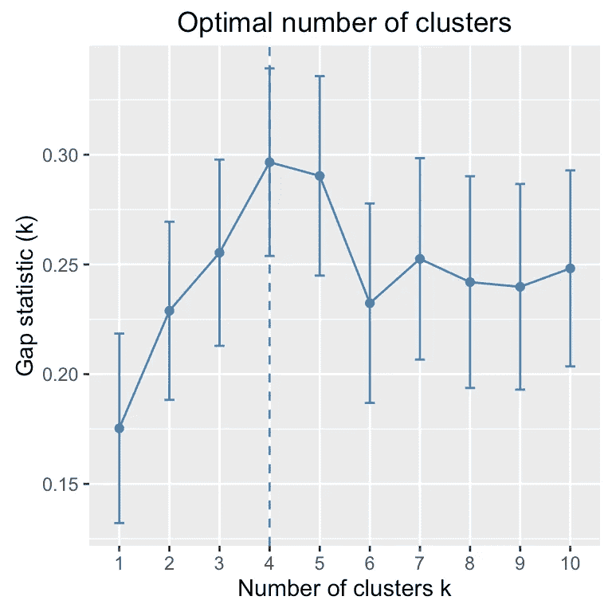
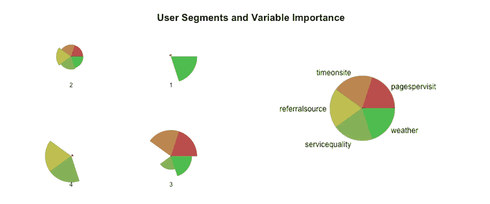

# 机器共情:机器学习如何给 UX 设计带来真正的洞察力

> 原文：<https://towardsdatascience.com/machine-empathy-how-machine-learning-can-bring-real-insight-to-ux-design-f5fee5cb5e10?source=collection_archive---------7----------------------->

Created on iPhone6s with Prisma

# 将同理心和数据挖掘结合起来，打造更好的 UX

移情已经理所当然地成为良好用户体验(UX)设计的前提。但是设计师用来达到共鸣的手段——比如人物角色——并没有达到他们的预期目的。

虽然使用人物角色的动机是高尚的，但是他们经常是建立在人口统计资料上的理想化用户的产品，而不是来源于真实用户行为的原始洞察力。

人物角色的局限性是众所周知的。[这个最近的视频](https://www.linkedin.com/pulse/personas-need-serious-update-tara-hunt?trk=v-feed&lipi=urn%3Ali%3Apage%3Ad_flagship3_feed%3BgXWgYDjKeE7APRXw3rQ2Vg%3D%3D)很好地分析了局限性[，而 2010 年的这篇论文](http://www.devoil.com/papers/PersonasConsideredHarmful.pdf)描述了开发人物角色的各种陷阱，从过程不科学到倾向于群体思维和确认偏差。

但是人物角色应该被完全抛弃吗？如果没有确定要服务的群体，通过什么方法可以确定设计的优先级？如果不知道也不考虑用户的动机或心态，那么 [UX 的设计怎么能像](https://www.paulolyslager.com/empathy-in-ux-design/)[经常被引用的那样](https://uxplanet.org/user-research-empathy-is-the-best-ux-policy-5f966ba5bbdc)具有同理心呢？

移情的另一种方法——渐进主义——使用行为数据来渐进地改变设计，以达到优化的 UX。但是这种注重转换而非体验质量的方法，通过渐进式改进而不是整体解决方案来抑制创新。

我们相信，通过将设计师的需求与正确的数据和分析工具相匹配，有一种更好的方法来应对 UX 的挑战。

# 问题的根源

在我们深入研究解决方案之前，有必要了解一下我们为什么会走到这一步:

1.  过度依赖一个工具，谷歌分析
2.  UX 网站只使用网络数据的孤岛式思维
3.  对可用数据的肤浅分析使[河马效应](http://whatusersdo.com/blog/hippos/)成为可能，并导致人物角色的主观创造

第一点是其他两点的根本原因。谷歌分析的专业知识被错误地认为是网站分析的专业知识。当其他来源和分析工具可用时，对于网站数据来说，这是马兹洛的锤子。简而言之，错误的工具和不充分的信息导致设计的任意起点。

让我们举一个交通信息网站的简单例子，其中一个关键的性能指标——在网站上的时间——可能与相反的动机和对体验的错误理解有关。有一次，一条火车线路瘫痪，通勤者需要使用该网站寻找替代路线。长时间在网站上与用户在寻找相关信息时的摩擦和挫折有关。相反，在旅游旺季规划城市路线的游客需要更多的时间来考虑如何最好地游览景点。

如果不了解不同用户想要达到的目标，善意的网站目标可能会成为性能的错误标志。

# 理解用户行为的更好方法

在 UX 设计中，对用户进行分组仍然是开发优先级的关键，但是如何进行呢？其实就是收集更有意义的用户数据，使用正确的分析工具和方法这么简单。

下面是我们发展丰富而有意义的用户群的 4 个步骤:

# 1.掌控您的网络用户数据

早在 2005 年，当[谷歌收购顽童软件](http://www.nytimes.com/2005/03/29/technology/google-acquires-urchin-software.html)时，网络分析的选择有点有限，而且都是付费的或者非常简单。很难想象无处不在的顽童一旦免费并更名为谷歌分析会变得怎样。值得称赞的是(也是有益的),谷歌给了每个运营网站的人一个以简单有效的方式衡量其表现的机会，但除非你支付 10 万美元购买高级版本，否则你无法获得原始数据用于外部分析。

你也不需要投资像 Adobe 或 Webtrends 这样的商业级系统。虽然这些系统很强大，但你只是用不必要的花费和时间，把一个围墙花园换成另一个。

相反，有一些低成本或免费的系统可以提供丰富的访问者数据，这些数据可以导出供外部分析。我们使用的系统有:

*   [Piwik](https://piwik.org/) —开源免费分析软件
*   [Opentracker](http://www.opentracker.net/) —提供访客身份识别的低成本软件

这些可以很容易地作为代码片段安装在网站主页模板或标签管理器中，与 Google Analytics 并行运行。

所有权超越了由一个公司实体控制您的信息的陈腐概念。虽然随着时间的推移，数字媒体的双头垄断可能会使这种担忧更加主流，但主要的威胁是，分析工具与谷歌和/或脸书认为对他们最有利可图的功能优先级相关联，而不是对你。

# 2.考虑所有影响用户对你的网站的动机和心态的外部因素

通常情况下，我们会举办客户研讨会，在用户到达网站之前绘制他们的旅程，并对所有可用的相关数据进行分类，包括网络分析之外的来源。例如，在上面引用的旅行示例中，我们收集了与天气异常和服务中断相关的数据集。

发现的场景和用户旅程越多，可以利用的外部数据就越多。

# 3.收集所有数据并进行分析

这就是事情开始变得有趣的地方。分析需要正确的工具和技能。幸运的是，这两者都相当丰富。

我们的选择通常是:

*   [MySQL](https://www.mysql.com/) 、 [PostgreSQL](https://www.postgresql.org/) 或 [SQLite](https://www.sqlite.org/) 用于整理关系数据库中的数据
*   统计编程语言 [R](https://www.r-project.org/about.html) 及其开发环境 [R Studio](https://www.rstudio.com/)
*   [AWS](https://aws.amazon.com/) 进行大规模分析

要分析的数据应该尽可能的[平坦和整洁](http://vita.had.co.nz/papers/tidy-data.html)，这意味着每一行都是一次访问(观察)，每一列都是一个描述符(变量)。如果您来自关系数据库领域，当用于分析的数据可能有数百万行和数十列时，这看起来可能是浪费。r 是为大规模工作而设计的；在笔记本电脑上分析几十万行可能需要几秒钟。对于大型数据集，可以在个人电脑上使用数据样本开发原型，然后相同的分析代码可以在整个数据集上运行。

一旦数据整理好，我们就可以通过 r 中的“Cluster”包使用[无监督机器学习](http://machinelearningmastery.com/supervised-and-unsupervised-machine-learning-algorithms/)，这种类型的分析被用于从医学研究到手机套餐定价等各种领域。这听起来可能真的很复杂，有点吓人，但事实并非如此。数学很复杂，但原理和实际执行很简单:机器学习算法通过同时最大化和最小化描述访问的所有变量之间的距离，将每次访问分配到一个组(集群)中。

首先，我们需要知道聚类的最佳数量。试错法可以在视觉上评估得到的聚类是过于相似、过于不同还是恰到好处。或者，factoextra 包中的 fviz_nbclust 函数可以给出最佳数字:

k 统计峰值在 4 左右，因此我们将针对 4 个集群的目标运行函数。

有许多可视化输出；一种流行的方法是使用雷达图来了解每个星团的变量大小。

该图的每个雷达段显示了每个聚类中每个变量的相对重要性。数字输出还将告诉我们每个聚类代表整个样本的多少比例，从而给出客观的优先级。

# 4.将集群应用于用户组

从上面的雷达图中，我们可以将星团解释成有意义的部分。即使只有两个外部因素，天气和服务，也给三个网络分析指标带来了更大的背景。

对于上面的示例，分段可能是:

1.  *千夫所指* —恶劣天气和现场低时段；他们急需信息
2.  *通才*——不太确定他们需要什么信息，但会在网站上逛逛
3.  *考虑者* —高参与度
4.  *恐慌者* —从另一个站点转介来检查服务

上述示例仅使用了五个变量，变量越多，最终用户的信息就越多，但是从可用的集群中，我们可以直观地了解设计的一些优先事项:

*   如何最好地标示出*恐慌者*和*管理者*所需的特定旅行和服务状态内容？
*   我们能否为多面手提供一个逻辑导航结构，让他们更高效地到达需要的地方？
*   什么样的行动号召最能满足考虑者渴望的参与度？

由于每次访问都被分配到一个集群中，如果我们服务于这些优先事项，那么就没有什么需要解决的了。

重申一下，我们从每次用户访问中获取的变量越有意义，集群的描述性就越强，关于细分和设计简报的结论就越好。

Created on iPhone6s with Prisma

# 合成创造力还是机器共情？

机器学习的数学可以通过将用户数据与上下文因素结合起来，消除对网络分析意味着什么的任意概念。但是仍然需要人类的解释和创造力来为数字之间的巨大空白着色。为了取得成功，设计师和数据科学家需要合作开发有意义的见解和目的驱动的细分市场。

人工智能能够弥合分析和创造力之间的差距吗？还没有，但随着每一天和每一个改进的算法，我们朝着真正的*机器移情*又迈进了一步。

*最初发表于*[T5【www.deducive.com】](https://www.deducive.com/blog/2017/6/20/machine-empathy-how-machine-learning-can-bring-real-insight-to-ux-design)*。*