# 机器学习 101:梯度下降的直观介绍

> 原文：<https://towardsdatascience.com/machine-learning-101-an-intuitive-introduction-to-gradient-descent-366b77b52645?source=collection_archive---------2----------------------->

毫无疑问，梯度下降是大多数机器学习(ML)算法的核心和灵魂。我绝对相信你应该花时间去理解它。因为一旦你这样做了，首先，你会更好地理解大多数最大似然算法是如何工作的。此外，理解基本概念是发展对更复杂主题的直觉的关键。

为了理解梯度下降的核心，让我们有一个运行的例子。这个任务是这个领域中的一个老任务——使用一些历史数据作为先验知识来预测房价。

但我们的目标是讨论梯度下降。为了做到这一点，让我们的例子足够简单，这样我们就可以集中在好的部分。

但是，在我们继续之前，你可以在这里得到代码。

# 基本概念

假设你想爬一座很高的山。你的目标是最快到达山顶。你环顾四周，意识到你有不止一条路可以开始。因为你在底部，所有这些选项似乎都让你更接近顶峰。

但是你想以最快的方式到达顶峰。那么，你如何做到这一点呢？你如何迈出一步让你尽可能接近顶峰？

到目前为止，还不清楚如何迈出这一步。这就是梯度可以帮助你的地方。

正如汗学院[的视频](https://www.khanacademy.org/math/multivariable-calculus/multivariable-derivatives/modal/v/gradient)中所说，梯度捕捉了一个多变量函数的所有偏导数。

我们一步一步来，看看效果如何。

简单来说，导数是函数在给定点的变化率或斜率。

以 *f(x) = x* 函数为例。 *f(x)* 的导数是另一个函数*f’(x)*，它计算 *f(x)* 在给定点 *x* 的斜率。这种情况下，对于 *x = 2* ， *f(x) = x* 的斜率为 *2x* 或 *2*2 = 4* 。

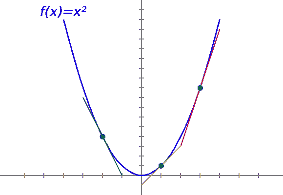

The slope of f(x)=x² at different points.

简单来说，导数指向**最陡上坡**的方向。好的一面是，梯度是完全一样的。除了一个例外，梯度是存储偏导数的向量值函数。换句话说，梯度是一个向量，它的每个分量都是一个特定变量的偏导数。

再以函数， *f(x，y) = 2x + y* 为例。

这里， *f(x，y)* 是一个多元函数。它的梯度是一个向量，包含 *f(x，y)* 的偏导数。第一个相对于 x，第二个相对于 y。

如果我们计算 *f(x，y)* 的偏导数，我们得到。

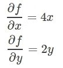

所以梯度是下面的向量:

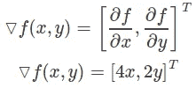

请注意，每个分量表示每个函数变量的最陡上升方向。换个说法，梯度指向函数增加最多的方向。

回到爬山的例子，坡度把你指向最快到达山顶的方向。换句话说，梯度指向表面的较高高度。

同样，如果我们得到一个有 4 个变量的函数，我们将得到一个有 4 个偏导数的梯度向量。一般来说， *n 变量*函数会产生一个 *n 维*梯度向量。

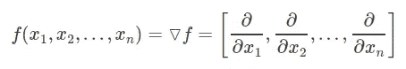

然而，对于梯度下降，我们不想尽可能快地最大化 *f* ，我们想要**最小化**f。

但是，让我们先定义我们的任务，事情会看起来干净得多。

# 预测房价

我们要解决根据历史数据预测房价的问题。为了建立一个机器学习模型，我们通常至少需要 3 样东西。一个问题 *T* ，一个性能度量 *P* ，以及一个经验 *E* ，我们的模型将从这些地方学习模式。

为了解决任务 *T* ，我们将使用一个简单的线性回归模型。这个模型将从经验中学习，经过训练后，它将能够将其知识推广到看不见的数据中。

线性模型是一个很好的学习模型。它是许多其他 ML 算法的基础，如神经网络和支持向量机。

对于这个例子，体验 *E* ，是房屋数据集。房屋数据集包含圣路易斯奥比斯波县及其周边地区最近的房地产列表。

该集合包含 781 条数据记录，可在此处以 CSV 格式下载。在 8 个可用特性中，为了简单起见，我们将只关注其中的两个:尺寸和价格。对于 781 条记录中的每一条，以平方英尺为单位的大小将是我们的输入特征，价格将是我们的目标值。

此外，为了检查我们的模型是否恰当地从经验中学习，我们需要一种机制来衡量它的性能。为此，我们采用均方误差(MSE)作为性能指标。

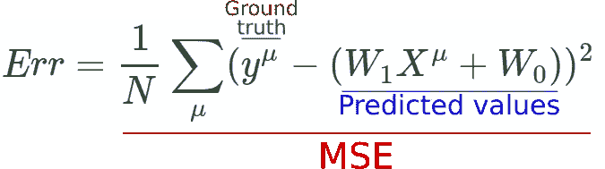

多年来，MSE 一直是线性回归的标准。但是从理论上讲，任何其他的误差度量，比如绝对误差，都是可行的。MSE 的一些好处是它对较大误差的惩罚大于绝对误差。

既然我们已经形式化了我们的学习算法，让我们深入代码。

首先，我们使用 Pandas 加载 python 中的数据，并分离大小和价格特性。之后，我们将数据标准化，以防止一些特征的价值超过其他一些特征。此外，梯度下降与归一化数据相比收敛速度更快。

下图，你可以通过它的面积以平方米为单位看到房价的分布。

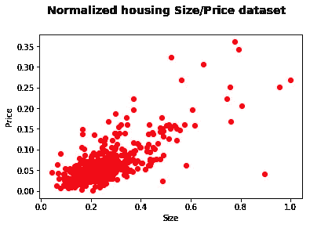

Distribution of house prices by Size. The data is normalized to the [0,1] interval.

线性回归模型的工作原理是在数据上画一条线。因此，我们的模型由一个简单的直线方程表示。

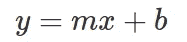

Line equation. m and b are the slope and the y-intercept respectively. The x variable is the placeholder for the input values.

对于线性模型，两个自由参数是斜率 *m* 和 y 截距 *y* 。这两个变量是我们要改变的旋钮，为了找到最好的线方程。

迭代地，我们将对它们进行细微的改变，这样它就可以沿着误差面上最陡下降的方向。在每次迭代之后，这些权重变化将改进我们的模型，以便它能够代表数据集的趋势。

在继续之前，请记住，对于梯度下降，我们希望采取与梯度相反的方向。

你可以把梯度下降想象成一个球滚下山谷。我们希望它坐落在大山的最深处，然而，很容易看出事情可能会出错。

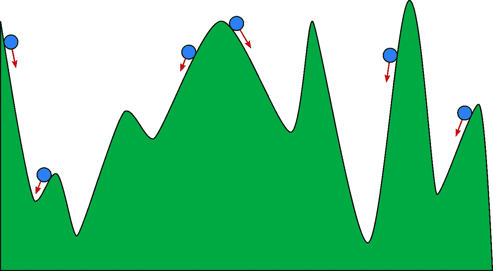

In analogy, we can think of Gradient Descent as being a ball rolling down on a valley. The deepest valley is the optimal global minimum and that is the place we aim for.

根据球开始滚动的位置，它可能会停在谷底。但不是在最低的一个。这被称为局部最小值，在我们的模型中，谷是误差面。

注意，在类比中，并不是所有的局部最小值都是不好的。有些其实和最低(全局)的差不多低(好)。事实上，对于高维误差曲面，最常见的是采用这些局部最小值中的一个(不算太坏)。

类似地，我们初始化模型权重的方式可能导致它停留在局部最小值。为了避免这种情况，我们用来自具有零均值和低方差的随机正态分布的值来初始化两个权重向量。

在每次迭代中，我们将随机选取数据集的一个子集，并将其与权重进行线性组合。这个子集被称为*小批量*。线性组合后，我们将结果向量输入 MSE 函数，以计算当前误差。

有了这个误差信号，我们就可以计算误差的偏导数，得到梯度。

首先，我们得到关于 *W0* 的偏导数。

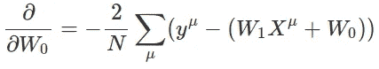

Partial with respect to *W0*

第二，我们做同样的事情，但是把 *W1* 作为演员。

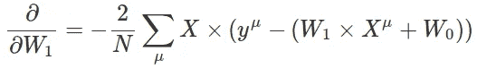

Partial with respect to *W1*

有了这两个分音，我们就有了梯度向量:

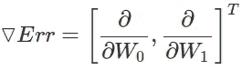

The Gradient

其中 *Err* 是 MSE 误差函数。

这样，我们的下一步是使用梯度更新权重向量 *W0* 和 *W1* ，以最小化误差。

我们希望更新权重，以便它们可以在下一次迭代中降低误差。我们需要使它们遵循每个梯度信号的相反方向。为了做到这一点，我们要在那个方向上迈出η大小的小步。

步长η是学习速率，它控制学习速率。根据经验，一个好的起点是 0.1。最后，更新步骤规则被设置为:

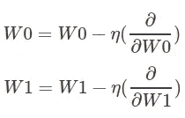

在代码中，完整的模型如下所示。看两个梯度 *DW0* 和 *DW1* 前面的**负号**。这保证了我们将采取与梯度方向相反的步骤。

更新重量后，我们用另一个随机小批量重复该过程。就是这样。

一步一步地，每一次权重更新都会导致线条向其最佳表现方向发生微小的移动。最后，当误差方差足够小时，我们可以停止学习。

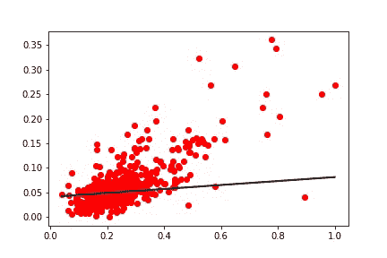

Linear model conversion over time. The first weight updates cause the line to rapidly reach an ideal representation.

这个版本的梯度下降被称为小批量随机梯度下降。在这个版本中，我们使用训练数据的一个小子集来计算梯度。每个小批量梯度提供了最佳方向的近似值。即使梯度没有指向准确的方向，但实际上它收敛到非常好的解。

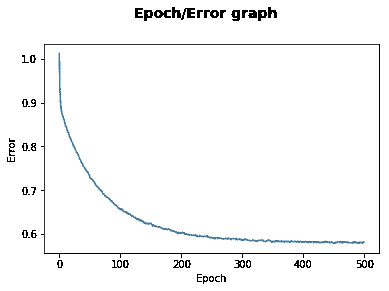

Error signal by epoch. Note that after decreasing the error signal very fast the model slows down and converges.

如果你仔细观察错误/事件图表，你会发现在开始时，学习的速度更快。

然而，经过一段时间后，它开始减速并趋于平稳。发生这种情况是因为，在开始时，指向最陡下降的梯度向量的幅度很大。结果，两个权重变量 *W0* 和 *W1* 遭受更剧烈的变化。

然而，随着它们越来越接近误差表面的顶点，梯度慢慢变得越来越小，这导致权重的变化非常小。

最后，学习曲线稳定下来，这个过程就完成了。

尽情享受吧！

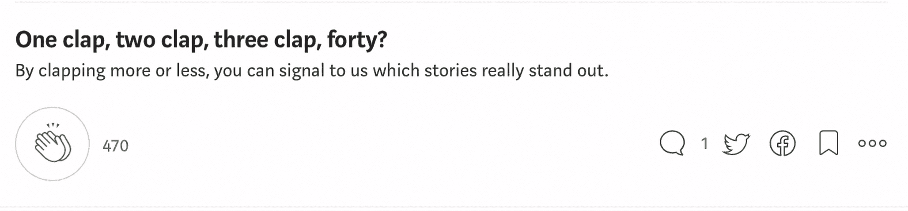