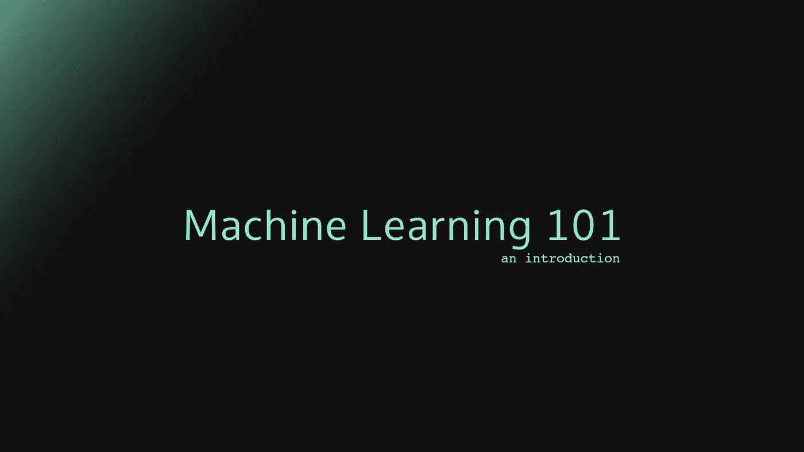

# 机器学习 101 -简介

> 原文：<https://towardsdatascience.com/machine-learning-101-part-1-an-introduction-494cb654d50b?source=collection_archive---------10----------------------->

如果你是一名软件工程师，我敢肯定在某个时候你想做“一些机器学习”，破解宇宙的秘密，找到生命、宇宙和一切的最终答案。

然而，机器学习可能是一个相当大且令人生畏的话题:一种与你日常所做/使用的非常不同的范式，由大数据、数学模型驱动……简而言之:它超出了你通常的舒适区。

不过没关系——事实上，这是我将尝试向您介绍机器学习的主要概念的系列文章的第一部分。

**© Michele Preziuso**

其核心是，在机器学习中，一边是**大数据**，一边是**你认为大数据可以解决或提供答案的问题**。

# 大数据

一般来说，大数据是一组具有[以下特征](https://en.wikipedia.org/wiki/Big_data#Characteristics)的数据:

Big data characteristics — **© Michele Preziuso**

**Volume**
生成和存储数据的数量。数据的大小决定了价值和潜在的洞察力，以及是否能被认为是大数据。

**Variety**数据的类型和性质。这有助于分析它的人有效地使用由此产生的洞察力。大数据来自文本、图像、音频、视频；此外，它通过数据融合完成缺失的部分。

**速度**
在这种情况下，生成和处理数据以满足增长和发展道路上的需求和挑战的速度。大数据通常是实时可用的。与小数据相比，大数据的产生更加持续。与大数据相关的两种速度是生成的频率以及处理、记录和发布的频率。

**准确性**
是对大数据的扩展定义，指的是数据质量和数据价值。捕获数据的数据质量可能会有很大差异，从而影响准确的分析。

# 如何使用机器学习解决大数据问题？

在你可以开始考虑你的机器学习解决方案之前，你必须从问题开始:你必须完全理解它并描述它。

1.  有什么问题？
2.  为什么需要解决？
3.  你会怎么解决？

## 1.有什么问题？

**a .非正式地描述一下**
软启动:像向朋友描述问题一样描述问题

**b .正式描述它**
我发现用正式语言描述问题非常有用，这是[汤姆·米切尔](https://amzn.to/2AoMXRJ)在他的书[机器学习](https://amzn.to/2GJ8zh9)中描述的(我非常推荐阅读这本书，因为这是机器学习的一个很好的起点):

> 机器学习领域关注的是如何构造能随着经验自动改进的计算机程序的问题。
> [...
> 如果计算机在 T 中的任务上的性能(由 P 测量)随着经验 E 而提高，则称其从关于某类任务 T 和性能测量 P 的经验 E 中学习。

我们应该能够用 E、T 和 P 写出问题的正式描述，或者更好的是，用标题 E、T 和 P 列出我们的问题

**c .研究并列出相似的问题** 研究并列出任何你认为与你正在试图解决的问题相似的问题。这可以帮助你找到解决方案，在你旅途中遇到问题和潜在问题之前限制它们的范围。

**d .列出所有假设和额外信息** 列出所有对你的问题的表述很重要但在描述中没有提到的假设。它们可能很微妙，但能帮助你更快达到预期的结果。

以分析点击流来预测流量峰值的经典示例为例，您可以说:

*   响应大小和用户代理无关紧要
*   推荐可能与模型相关
*   日期和时间是一个基本维度

## 2.为什么需要解决问题？

简单地考虑一下解决方案:你为什么需要构建它，你(或你的客户)将从解决这个问题中获得什么好处，…最后，你还应该考虑一下解决方案在短期内和长期内将如何使用。

通过自己的方式找到解决方案是可以的，但是您应该始终牢记长期目标，构建一个可以在未来的验证服务中轻松转换的解决方案——当然，除非您将此作为学习练习。

## 3.你会如何解决这个问题？

对你的数据进行取样并观察它。思考你的问题，从原始数据出发，探索你将如何获得最终结果。

编写一个高级算法，只需列出从数据收集开始执行的所有手动步骤，如何处理数据以及如何最终解决问题。

接下来就是自动化这些步骤:[如果有必要的话，添加](https://www.leadingagile.com/2016/09/whats-a-spike-who-should-enter-it-how-to-word-it/)这些步骤，并构建你的解决方案的原型。容器、Jupyter 笔记本和许多其他工具是你的朋友，不要害怕使用它们，失败后再尝试。

一旦你定义了问题，你实际上可以开始构建你的机器学习解决方案——你会在这个系列的第二部分的[中找到更多关于这个的内容。](https://medium.com/@mpreziuso/machine-learning-101-problem-solving-workflow-c1ba6b4e0e30)