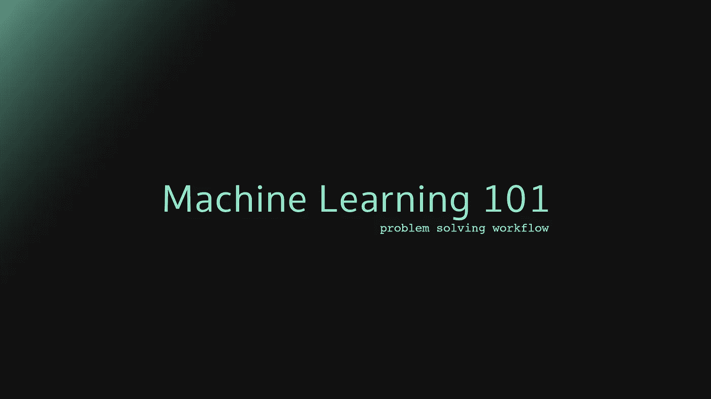

# 机器学习 101 -解决问题的工作流程

> 原文：<https://towardsdatascience.com/machine-learning-101-problem-solving-workflow-c1ba6b4e0e30?source=collection_archive---------16----------------------->

## 你如何从原始数据到一个完全工作的机器学习解决方案？

如果你是一名软件工程师，我敢肯定在某个时候你想做“一些机器学习”，破解宇宙的秘密，找到生命、宇宙和一切的最终答案。

然而，机器学习可能是一个相当大且令人生畏的话题:一种与你日常所做/使用的非常不同的范式，由大数据、数学模型驱动……简而言之:它超出了你通常的舒适区。

不过没关系——事实上，这是我将尝试向您介绍机器学习的主要概念的系列文章的第二部分。

你可以在这里找到第一部分。

**© Michele Preziuso**

一旦你遵循了[简介文章](https://medium.com/@mpreziuso/machine-learning-101-part-1-an-introduction-494cb654d50b)中强调的步骤，你就应该有一个非常清晰明确的问题，以及一堆高速、大容量、高度多样化和高度准确的数据，我们称之为[大数据](https://medium.com/@mpreziuso/machine-learning-101-part-1-an-introduction-494cb654d50b)。

你如何从零到英雄？

1.  准备您的数据
2.  抽查机器学习算法
3.  优化您的结果

一旦你有了想要的结果，是时候把数据可视化，成为一个英雄了！