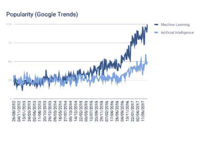
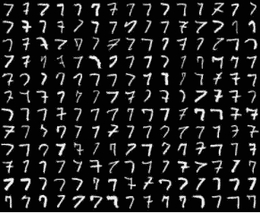

# 机器学习 101 | TELUS 的数据科学家解释道

> 原文：<https://towardsdatascience.com/machine-learning-101-telus-data-scientist-explains-32aa61995b24?source=collection_archive---------10----------------------->

如果你在技术领域工作，或者甚至正在考虑这个问题，你可能会遇到“机器学习”这个术语。在 Indeed.com 上的快速搜索显示，在撰写本文时，仅在温哥华就有超过 300 个包含“机器学习”一词的工作职位，这些工作的估计中值年薪超过 11 万美元。谷歌趋势显示，搜索词“机器学习”的受欢迎程度在最近三年增长了约 400%。显然，对具有机器学习知识的人有很高的需求——但它到底是什么？在这篇文章中，我将描述术语“机器学习”的确切含义，并解释为什么它对现代企业如此重要。

# 机器学习的概念定义

计算机科学家汤姆·M·米切尔有一个著名的定义，这个定义经常被使用，我将在这里改写一下。我们说一个计算机程序正在*学习*如何执行某项任务，如果它随着积累*经验*而在执行任务方面变得更好的话。因此，以这种方式学习的计算机程序被称为属于机器学习的范畴。

通过考虑*不*满足这个定义的程序可能有助于理解这个定义。在数学和计算机科学的一些领域中，一个重要的问题是寻找一个数的质因数。如果您将数字 1081 输入到解决这个问题的程序中，它将返回数字 23 和 47 作为输出，因为 1081 = 23 * 47。想出如何编写一个简单的程序来解决这个问题并不太难——一个显而易见的方法就是尝试将 1081 除以所有小于 1081 的数。这个程序完成了任务，但是它没有*学习*:它没有随着经验变得更好。你可以在一百万个输入上运行这个程序，它永远不会比你第一次运行它时更快或更好地分解数字 1081。

现在让我们考虑一种不同的任务:识别笔迹。假设我们想写一个程序，它输入一个手写数字的图像，输出一个从 0 到 9 的数字。想出一个简单的方法来解决这个问题并不像上面的整数分解问题那样简单，但是我们可能会有一些想法。你可能会写一个类似这样的程序:

*   如果图像是椭圆形，则返回 0。
*   如果图像是垂直线，则返回 1。
*   如果图像是上下两个圆，返回 8。
*   …

也许这种方法注定失败的原因显而易见。不同的人写的不一样。用这些规则来捕捉每一个可接受的变化，哪怕是一个数字，都是不可行的，更不用说所有的 10 个数字了。但无论如何，即使你可以，这种类型的解决方案也不能算作机器学习:规则不会随着经验的增长而改变或适应。

机器学习方法以完全不同的方式解决这个问题。机器学习程序不是试图从一开始就强加规则，而是试图通过查看示例来*发现*规则。在机器学习解决方案中，我们不是试图提出规则，而是试图提出数据。我们将尽可能多的预先标记的数字图像收集到所谓的*训练集*中，用于训练计算机程序。我们把所有的 1 的图像拿出来，给计算机看，告诉它它们是 1。然后我们对 2 的图像做同样的处理，以此类推。对于每一个数字，计算机试图自己找出这个数字的图像有什么共同之处。

我在细节上挥了一下手，但是你可以看到这种方法将如何根据我们对机器学习的工作定义随着经验而改进。有些人在他们的 7 上画十字。如果我开始的图像集不包含任何画十字的 7，我的程序可能无法识别画十字的 7 应该被标记为 7。但是随着我增加它需要看的例子的数量，最终它会以一些交叉的 7 结束，并且会知道有时 7 是交叉的。类似地，任何其他可能发生的普通变化也是如此。

*Images of 7’s from the MNIST dataset. Original source:* [*http://cs.nyu.edu/~roweis/data.html*](http://cs.nyu.edu/~roweis/data.html)

事实证明，设计巧妙的机器学习程序可以变得非常擅长这种任务。学习如何进行机器学习的一个常见的入门项目是在一个名为[的著名图像数据集 MNIST 数据库](http://yann.lecun.com/exdb/mnist/)上执行这项任务。非常简单的机器学习算法可以学习以优于 90%的准确率对这些图像进行正确分类，研究人员已经使用更先进的机器学习工具达到了优于 99.7%的准确率。

# 机器学习什么时候起作用？

为什么手写识别问题非常适合机器学习解决方案，而整数因式分解问题却不适合？有几个关键的区别。

一个是控制投入和产出之间关系的规则的复杂性。整数因式分解问题在某种技术意义上非常困难，但因式分解问题的输入和输出之间的关系非常简单:如果程序输出的数字是质数，并且相乘得到输入，那么你就得到正确的答案。将笔迹图像与它们所代表的数字联系起来的规则要复杂、模糊得多，也难以捕捉。

一个相关的区别是，在因式分解问题中，我们正在寻找一个精确的解决方案，而在手写识别问题中，我们对一个非常好的近似解决方案感到满意。事实上，手写识别问题的精确解决方案即使在理论上也是不可行的。一些 3 看起来像 5，一些 4 看起来像 9，唯一能确定正确标签的方法是询问第一个写下数字的人。对于手写识别的解决方案，我们所能合理期望的是它在大多数情况下是正确的。

最后，手写识别似乎天生就是一项*统计*或*概率*任务。作为人类，我们实际上从来不确定我们看到的是 9 还是 4。我们认为一个数字可能是 9，因为它看起来更像我们过去见过的 9，而不是我们过去见过的 4。大多数时候，我们对自己的猜测很有把握，但我们仍在猜测。我们也不应该期望计算机能做得比这更好。

# 为什么机器学习适用于商业问题

机器学习非常适合具有手写识别问题特征的问题，即高度复杂的问题，近似解决方案就足够的问题，以及固有的统计或概率问题。企业越来越发现他们的许多问题都有这些特征。例如，考虑标记欺诈性信用卡交易的问题。

*   **复杂性:**识别欺诈性信用卡交易的规则非常复杂，而且不断变化。
*   **近似值就足够了:**我们正在*标记*事务以供进一步审查，所以如果程序有时出错也没关系。
*   **解决方案是概率性的:**在我们通过联系客户进行核实之前，我们永远不能确定交易是欺诈性的。

对于这样的商业问题，我们需要什么来实现机器学习解决方案呢？数据——现代企业大量供应的一种商品。由于这些原因，企业正在发现机器学习的工具非常自然地符合他们的活动和目标，这就是为什么我们看到机器学习工具和技术在商业领域的应用如此引人注目。

自从研究人员在大约 20 世纪 60 年代开始考虑这些想法以来，机器学习作为一个领域已经成熟了很多，现在有一些基本的工具和想法被认为是机器学习的基础。除了抽象的概念定义，还有一种任何开始学习机器的人都应该理解的语言。在我的下一篇关于机器学习的文章中，我将更仔细地看看这些工具和想法，并更详细地回顾现代机器学习的语言。

有兴趣了解机器学习背后的科学吗？看看我们即将推出的[数据科学](http://www.brainstation.io/course/data-science)课程。

这篇文章最初出现在 [BrainStation 博客](https://blog.brainstation.io/machine-learning-telus-data-scientist-explains/)上。