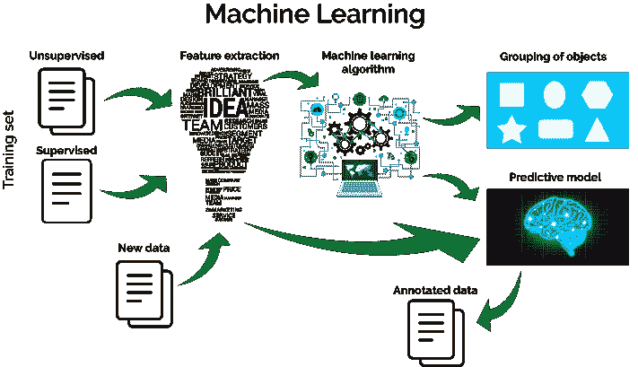
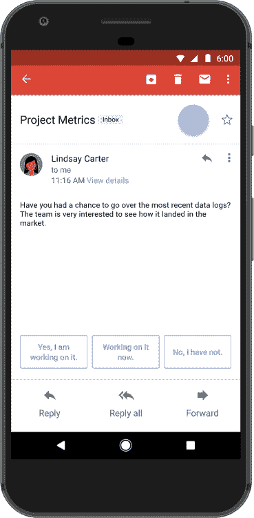
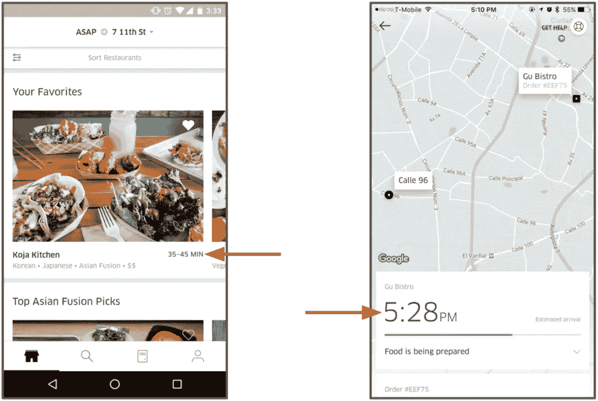

# 机器学习介绍#1

> 原文：<https://towardsdatascience.com/machine-learning-65dbd95f1603?source=collection_archive---------10----------------------->

机器学习是在没有明确编程的情况下赋予计算机学习能力的研究领域。

简单来说，机器学习就是根据数据进行预测。

Architecture of Machine Learning

机器学习现在正被广泛使用。我们日常使用的一些例子:

*脸书已经使用机器学习对新闻提要故事进行排名和个性化，过滤掉攻击性内容，突出趋势话题，对搜索结果进行排名，以及识别图像和视频内容。*

*脸书正在使用**深度学习**算法来读取图像和视频内容，并用于为业务做广告。假设如果照片中有养猫的人，那么他/她一定是爱猫人士，那么脸书可以向该用户宣传猫产品。*

****谷歌*** 几乎在每个产品中都使用机器学习:*

*   ***照片** -:使用机器学习来识别人脸、位置、情绪等。*
*   ***Gmail** -:分析电子邮件的内容并提供智能回复。*

**

*reference : [http://mashable.com/2017/05/17/gmail-smart-replies/#YQTo1XeWYOqR](http://mashable.com/2017/05/17/gmail-smart-replies/#YQTo1XeWYOqR)*

*   *Google now -:单词 person 的发音在世界不同的地方可能因人而异。“玩”这个词在各自的语言中发音不同。谷歌现在从不同的样本数据中学习，并在此基础上提供最佳搜索结果。*
*   ***Youtube** : Youtube 使用机器学习来改善搜索结果。以前，它用于根据内容创建者提供的元标签和文本进行搜索，但现在它分析视频内容，并向用户提供最佳内容。*

****亚马逊*** 利用机器学习进行商品推荐。*

****优步*** 使用 UberEATS 中的机器学习来计算配送食物的预计时间。*

**

*The UberEATS app hosts an estimated delivery time feature powered by machine learning models built on Michelangelo reference :- [https://eng.uber.com/michelangelo/](https://eng.uber.com/michelangelo/)*

*开发者可以使用**谷歌**、**亚马逊**、**微软**和 **IBM** 提供的服务来存储数据——为了机器学习的目的训练他们自己的模型。*

*有很多公司投资机器学习。Udacity 在[博客](http://blog.udacity.com/this-week-machine-learning)上提供了关于日常使用机器学习的项目的信息。*

*有用的链接*

*   *[http://blog.udacity.com/this-week-machine-learning](http://blog.udacity.com/this-week-machine-learning)*