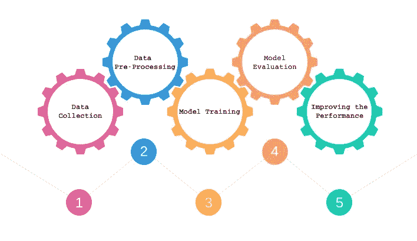
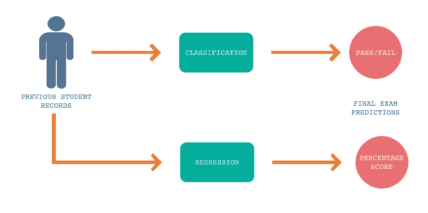
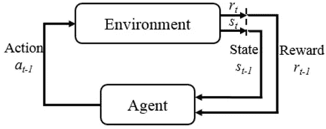
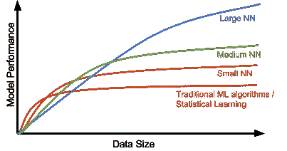

# 机器学习:温和的介绍。

> 原文：<https://towardsdatascience.com/machine-learning-a-gentle-introduction-17e96d8143fc?source=collection_archive---------8----------------------->

在过去十年左右的时间里，机器学习和广义的数据科学席卷了技术前沿。几乎每个科技发烧友都有或想拥有一份。2012 年，《哈佛商业评论》称数据科学家的工作为“[21 世纪最性感的工作](https://hbr.org/2012/10/data-scientist-the-sexiest-job-of-the-21st-century)”，六年后，它仍然保持着这个标签。

**但是是什么让它如此吸引人呢？**让我们仔细看看。

机器学习指的是机器或计算机**学习**执行某项任务并在没有明确编程的情况下做得更好的各种技术和方法。

更正式地说，

> 如果由 *P* 测量的计算机程序在 *T* 中的任务的性能随着经验 *E* 而提高，则称该计算机程序相对于某类任务 *T* 和性能测量 *P* 从经验 *E* 中学习。
> 
> —汤姆·米契尔([机器学习](https://www.amazon.com/dp/0070428077?tag=inspiredalgor-20))

仅仅是机器能够自己学习执行任务的想法，就已经成为今天围绕人工智能(AI)这个子领域的广泛兴奋和热情的最大驱动力之一。

最近几项令人兴奋的发展，如自动驾驶汽车和虚拟游戏机器人，更加点燃了这一领域的好奇心，而网飞和亚马逊使用的推荐系统、谷歌翻译、语音助手 Siri、Alexa 和谷歌助手等机器学习的应用和实现，已经使我们的日常生活比几年前更加方便。

# 机器学习工作流

机器学习大致包括以下步骤，

Machine Learning Work-flow

1.  **数据收集**:第一步也是最重要的一步是收集与我们的问题陈述相对应的相关数据。准确的数据收集对于维护我们机器学习项目的完整性至关重要。
2.  **数据预处理**:上一步收集的数据很可能还不适合我们的机器学习算法使用，因为这些数据可能是*不完整*、*不一致*，并且很可能包含许多*错误*和*缺失* *值*。在处理完数据集中的所有不一致、错误和缺失数据后，我们继续进行**特征工程**。特征是所有独立单元共享的属性或特性，将对其进行分析或预测。特征工程是使用数据的**领域知识**来创建**相关**特征，使机器学习算法表现良好的过程。
3.  **模型训练**:预处理后的数据首先主要分为两个部分，即训练/测试比通常为 70/30 或 80/20 的训练/测试数据集，对于较小的数据集，随着我们的原始数据集大小的增加，测试数据集的大小通常会减小，即使对于非常大的数据集，训练/测试比也应达到 99/1。模型训练是一个过程，机器学习算法通过该过程从训练数据集中获取见解，并且*在训练期间学习*特定参数，这些参数将最小化**损失**或者它在训练数据集中的表现有多差。
4.  **模型评估**:在模型被训练之后，使用一些评估标准，在测试数据集上对它进行评估，这是它以前从未见过的。“以前从未见过”意味着模型没有从这个特定的数据集中获得任何洞察力来学习上面提到的那些参数。因此，该模型尝试仅使用从训练数据集获得的知识在测试数据集上执行。一些最常见的评估指标是准确度分数、F1 分数、平均绝对误差(MAE)和均方误差(MSE)。
5.  **性能改进**:通过使用各种技术，如**交叉验证**、**超参数调整**，或者通过尝试多种机器学习算法并使用表现最佳甚至更好的算法，通过使用组合多种算法结果的**集成**方法，可以进一步改进模型在训练和测试数据集上的性能。

# 机器学习的类型

1.  监督学习
2.  无监督学习
3.  强化学习

## 监督学习

监督学习是一种机器学习任务，其中使用训练数据集在给定的一组输入特征和输出特征之间建立关系，或者更具体地说是*学习*一个函数。然后，这个学习的函数进一步用于*预测来自测试数据集的一组新输入的*输出。监督学习对标记为的**训练数据进行操作，即对于每组输入特征，我们都有相应的*正确的*输出到*学习*功能映射。**

监督学习主要分为两个具体任务:分类和回归。

1.  **分类**:将每组输入变量分类或分离到可能的*类*之一作为输出的监督学习任务，即输出将只由某个**离散**值表示。

例如，给定一个班级的学生在一年中以前的考试中的表现，我们希望预测某个特定的学生是否会通过期末考试。这种类型的问题通常被称为**二进制分类**问题，因为我们试图预测两类形式的输出，即“通过”或“失败”。具有两个以上类别进行预测的问题被称为**多类别分类**问题。

Supervised Learning Example

2.**回归**:它是一种监督学习任务，对于每一组输入变量，输出由**连续的**值表示。

修改前面的例子，给定一个班级的学生在一年中以前的考试中的表现，我们希望预测学生在期末考试中的分数百分比。分数表示为连续值，例如，百分比分数为 96.75/100 或 59.25/100。

**无监督学习**

与监督学习相反，无监督学习是一种机器学习任务，其中从由没有标记响应的输入数据组成的数据集得出推论，手头的主要工作是学习给定数据的结构和模式。由于我们没有标记数据，评估模型的性能不再像监督学习那样简单。最重要的无监督学习算法之一是*聚类*。

**聚类**:它的任务是将一组对象分组，使得同一组中的对象(称为**聚类**)彼此之间比其他组(聚类)中的对象更相似(在某种意义上)。

Clustering (grouping) the given unlabelled data into 3 clusters.

**强化学习**

强化学习(RL)是一项机器学习任务，涉及软件**代理**如何在**环境**中采取*行动*，以最大化某种累积**回报**的概念。它遵循击中和试验方法的概念。代理人的正确或错误答案会得到一分奖励或惩罚，基于获得的正奖励分，模型会训练自己。并且一旦被训练，它就准备好预测呈现给它的新数据。

举个例子，

一个孩子正在学习如何走路。在他真正能够行走之前，他有相当多的任务要完成，比如站立、保持平衡和迈出第一步。假设他的母亲拿着巧克力站在他身边，如果他成功地完成了这些任务的一部分，这将是孩子的奖励，如果他没有完成，他也不会得到奖励。所以，孩子一步一步地学习，去做那些能给他带来回报的事情，而不去做那些不会给他带来回报的事情。

Basic Reinforcement Learning Process

在这里，在这个类比中，孩子是**代理人，**地板和奖励系统(母亲)组成了**环境**他通过采取**行动**与之互动，即从一个**状态**改变到另一个**状态，即从一个子任务到另一个子任务，以最大化他的积极奖励，其中，得到巧克力是积极奖励**，没有得到巧克力是消极奖励**。**

**这里有一个很棒的视频让你兴奋。它展示了一个代理如何在没有任何事先指导的情况下自学行走、奔跑、跳跃和攀爬。这个人工智能是由谷歌的 DeepMind 开发的。**

# **深度学习**

**深度学习一直是人工智能像今天这样快速前进的最大贡献者之一。深度学习是机器学习的一个子领域，它利用了一种被称为人工神经网络(ANNs)的机器学习算法，这种算法是由人脑模糊地启发的。神经网络的主要吸引力在于其学习输入数据的复杂非线性表示的能力。**

****

**Different Model Performance Trends**

**如上图所示，深度学习模型往往在处理大量数据时表现良好，而旧的机器学习模型在达到某个饱和点后就会停止改善。还可以看出，更大(更深)的神经网络往往表现得更好，但它们招致更大的计算成本。那么为什么深度学习现在正在兴起呢？**

**正是因为这三大原因:**

1.  **开发更好的算法技术和方法。**
2.  **多亏了互联网，今天有了大量的数据。**
3.  **GPU 的出现增强了计算能力。**

# **最后的想法**

**机器学习发展得如此之快、如此之好，以至于它几乎可以应用于所有其他研究领域。大公司越来越多地投资于基于 ML 的解决方案，以解决人类难以解决或耗时的问题。现在有大量的资源可以用来开始机器学习，这些资源在五年前甚至都不存在，在无数的平台上以如此多不同的形式存在。**

**现在是进入机器学习和人工智能领域的最佳时机。**