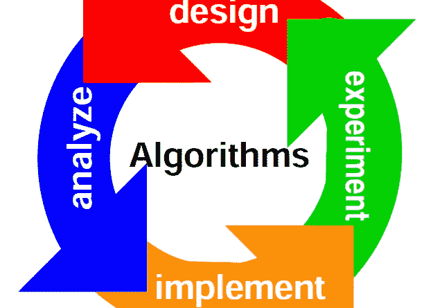

# 机器学习算法 vs 精算……谁会赢？

> 原文：<https://towardsdatascience.com/machine-learning-algorithm-vs-actuarial-science-who-will-win-b203f31145ce?source=collection_archive---------0----------------------->

# 机器学习算法 vs 精算……保险行业谁会赢？

# 机器学习算法与精算科学:

在当今快节奏的技术世界中，保险业高管或有抱负的领导者必须考虑未来、投资者预期、扩展和利用技术，以及这个新问题 ***“机器学习算法与精算科学？”***

## ML 与 AS——有什么区别？

**机器学习(ML)** 是一种人工智能(AI)，它为计算机提供了学习的能力，而无需显式编程。机器学习专注于开发计算机程序，这些程序可以在接触到新数据时教会自己成长和变化。

**精算学(AS)** 是应用数学和统计方法评估保险、金融等行业和职业风险的学科。**精算师**是通过密集的教育和丰富的经验在该领域获得资格的专业人士。精算师使用统计推断来帮助预测未来。精算师帮助保险商理解数据中的“为什么”,他们为试图通过统计数据理解风险的保险商和组织带来巨大的价值。

机器学习算法与精算科学是保险行业领导者持续争论的话题。最终，一名精算师将与一名数据科学家合作，构建一种可以做到这两点的算法和工具。在此之前，我们将关注这两个领域相互竞争的观点。

## 承销商需要知道原因吗？如果他们能通过 ML 算法得到结果呢？

你或你的股东会为了增加规模、相关性和速度而牺牲风险或股本的最佳回报吗？这一代保险公司/再保险人的问题。

如果你可以使用 ML 算法获得 8–9%的净资产收益率，同时降低你的费用和规模，那么使用传统精算学获得 10%的净资产收益率是否是可持续的？如果 ML 算法产生了同样的 ROE ~10%会怎样？

这些例子强调了一个基本问题——精算过程是否提供了足够的价值来支持时间、成本和约束？或者，行业高管是否应该专注于使用 ML 算法来构建类似的回报&利用该技术来扩大规模，提高与客户/经纪人/市场的相关性。

如果不是，您是否愿意使用算法返回承保结果的 Beta 值，而不是使用精算师生成 alpha 值？

## 机器学习算法方法的优势

*费用节省*

如果需要更少的精算师，速度会提高，承销商可以更容易地调整他们的投资组合，从而节省更多的费用。

如果这些节省下来的钱被用来雇佣更多的理赔人员。用于评估风险价格(精算工资)的购置费用中节省的资金可以重新分配给索赔人员/资源。正如这里讨论的**，我们认为索赔是分配资源以改善结果的最佳方式之一——重点应放在损失成本方面。这应该是被保险人**和**保险公司的重点——以及我们如何随着时间的推移为客户增加价值。**

**通过雇佣额外的索赔专家，保险公司可以节省成本。例如，节省 250 万美元对损失率的影响相当于承保 1000 万至 2500 万美元的保费——取决于产品线损失率。当您看到对底线的影响时，增加理赔人员会对您有所帮助。**

***时间分析速度***

**如果算法正在处理提交信息，则可以提高事务和分析的速度。因此，为承保人提供了改进的覆盖范围和风险分析的周转时间。**

***刻度***

**ML 算法的性质将允许保险公司/再保险公司扩大规模和增长。这种规模提供了许多好处——如前所述，有助于降低费用和费用比率。这种规模还将帮助你维持与核心客户的首选关系，以及吸收冲击损失的能力。**

**从 1 亿美元的投资组合中赚取 3000 万美元的利润，与从 1.5 亿美元的投资组合中赚取 5000 万美元的利润一样好还是更好？**

## **结果**

**我们预计这场辩论将持续相当长一段时间，因为该行业历来不愿接受变革。但是，我们预测会发生以下情况:**

*   **保险业将需要数据工程师**
*   **保险业将需要数据科学家**
*   **保险业将需要更少的“纯精算师”资源**
*   **软件开发人员将构建平台，为非数据科学家提供易于使用的输出**
*   **保险公司和再保险公司拥有的数据和员工将成为他们创造 Alpha 的最有价值的资产**
*   **我们预测这些新工具将产生不同类型的未来保险公司/再保险公司，以及来自投资者的不同期望。**
*   **承销商将继续销售产品，评估风险，并改变覆盖范围，但必须精通数据科学领域**
*   ****两种不同类型的保险公司****
*   **快速报价和小行——这将产生市场的 beta 回报**
*   **慢速报价较大的行使用精算科学—生成 alpha**
*   ****两种不同类型的再保险人****
*   **快速报价和小行——这将产生市场的 beta 回报**
*   **慢速报价较大行使用精算科学-生成 alpha**

**更多关于保险行业的信息可以在[www.myinsuranceshark.com](http://www.myinsuranceshark.com)找到**