# Python 中的层次凝聚聚类算法实例

> 原文：<https://towardsdatascience.com/machine-learning-algorithms-part-12-hierarchical-agglomerative-clustering-example-in-python-1e18e0075019?source=collection_archive---------1----------------------->


分层聚类算法将相似的对象分组为称为**簇**的组。有两种类型的分层聚类算法:

*   凝聚—自下而上的方法。从许多小集群开始，将它们合并在一起以创建更大的集群。
*   分裂——自上而下的方法。从单个集群开始，然后将它分成更小的集群。

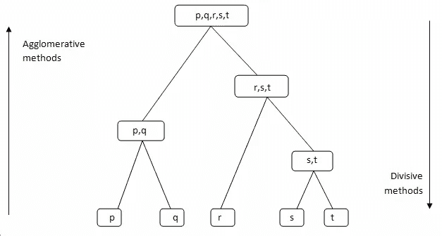

# 分层聚类的一些优点和缺点

## 赞成的意见

*   不假设特定数量的聚类(即 k 均值)
*   可能对应有意义的分类法

## 骗局

*   一旦决定合并两个集群，就无法撤销
*   对于大型数据集太慢，O(𝑛2 log(𝑛))

# 它是如何工作的

1.  使每个数据点成为一个群集

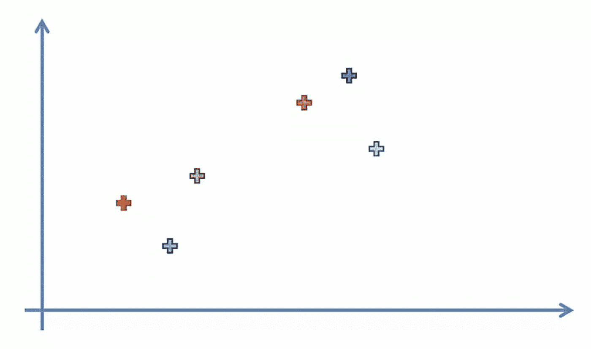

2.取两个最近的集群，并使它们成为一个集群

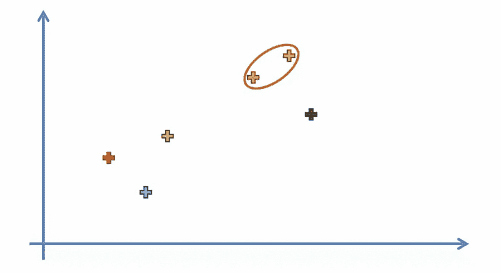

3.重复步骤 2，直到只有一个集群

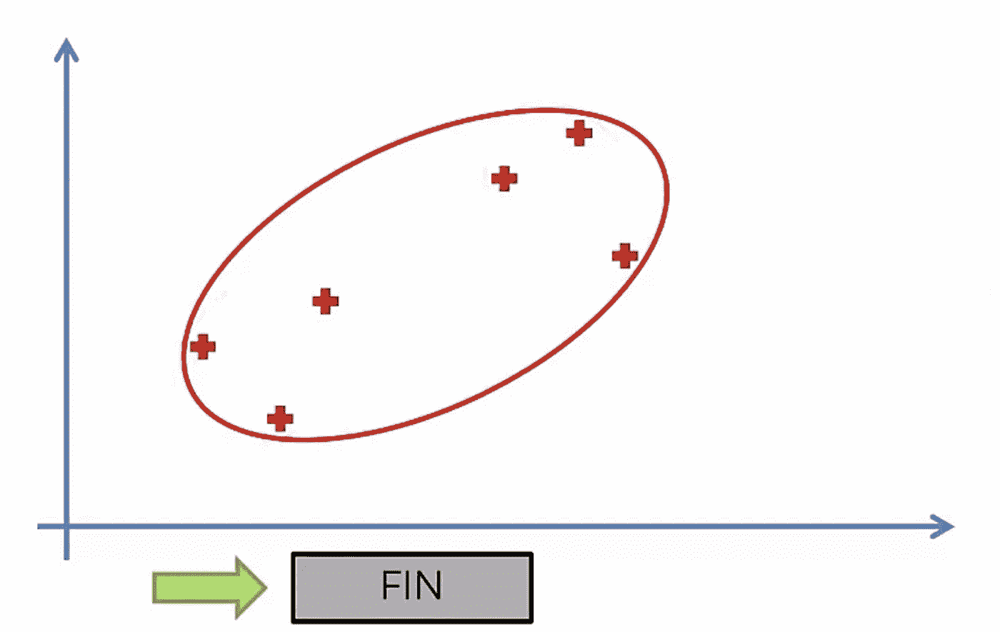

# 系统树图

我们可以使用树状图来可视化分组的历史，并计算出最佳的聚类数。

1.  确定不与任何其他聚类相交的最大垂直距离
2.  在两端画一条水平线
3.  聚类的最佳数量等于穿过水平线的垂直线的数量

例如，在下面的情况中，集群数量的最佳选择将是 ***4*** 。

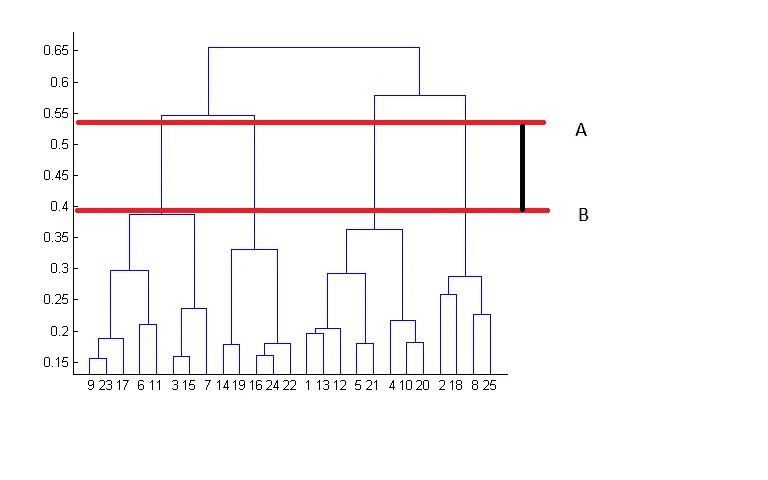

# 链接标准

类似于梯度下降，您可以调整某些参数，以获得截然不同的结果。

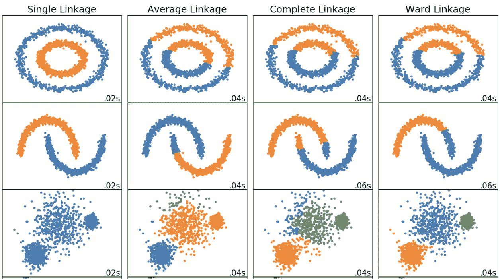

链接标准指的是如何计算聚类之间的距离。


## 单键

两个聚类之间的距离是每个聚类中两点之间的最短距离

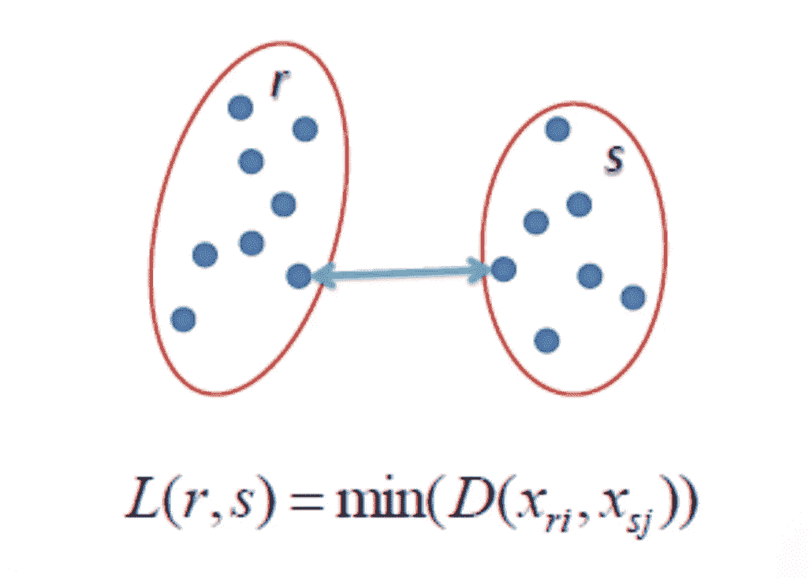

## 完全连锁

两个聚类之间的距离是每个聚类中两点之间的最长距离

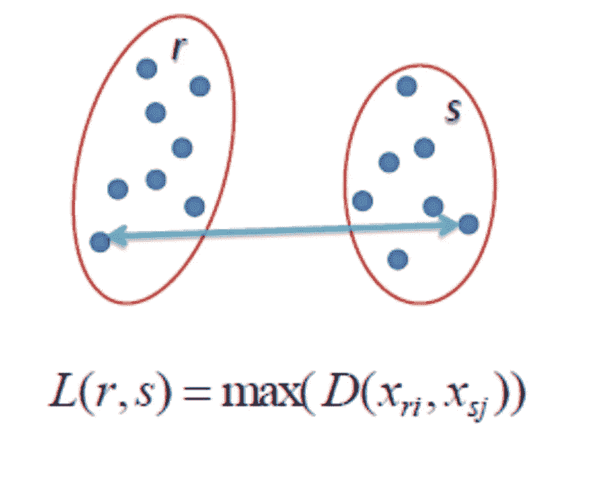

## 平均连锁

聚类之间的距离是一个聚类中的每个点到另一个聚类中的每个点的平均距离

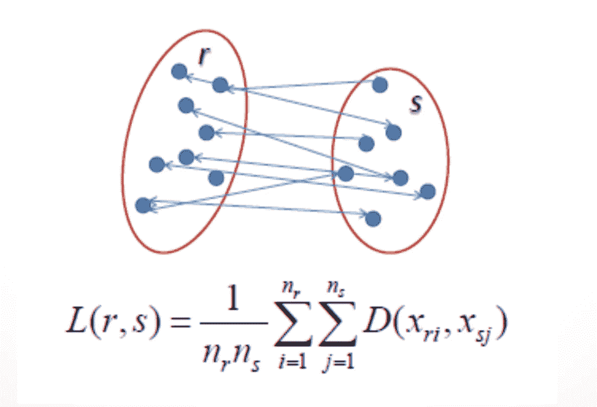

## **病房**联动

聚类之间的距离是所有聚类内的平方差之和

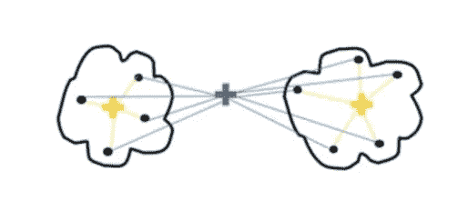

# 距离度量

您用来计算数据点之间距离的方法将影响最终结果。

## 欧几里得距离

两点之间的最短距离。例如，如果 x=(a，b)且 y=(c，d)，则 x 和 y 之间的欧几里德距离为√(a c)+(b d)

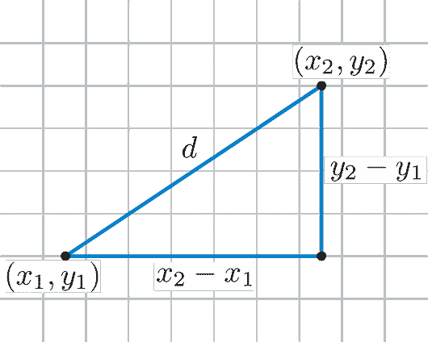

## 曼哈顿距离

想象一下，你在一个大城市的市中心，你想从 A 点到 b 点。你不能穿过建筑物，而是必须沿着不同的街道行走。例如，如果 x=(a，b)且 y=(c，d)，则 x 和 y 之间的曼哈顿距离为| a c |+| b d |


# python 中的示例

让我们看一个具体的例子，看看我们如何使用层次凝聚聚类来标记数据。

```
import pandas as pd
import numpy as np
from matplotlib import pyplot as plt
from sklearn.cluster import AgglomerativeClustering
import scipy.cluster.hierarchy as sch
```

在本教程中，我们使用 csv 文件，其中包含一个客户列表，包括他们的性别、年龄、年收入和支出分数。

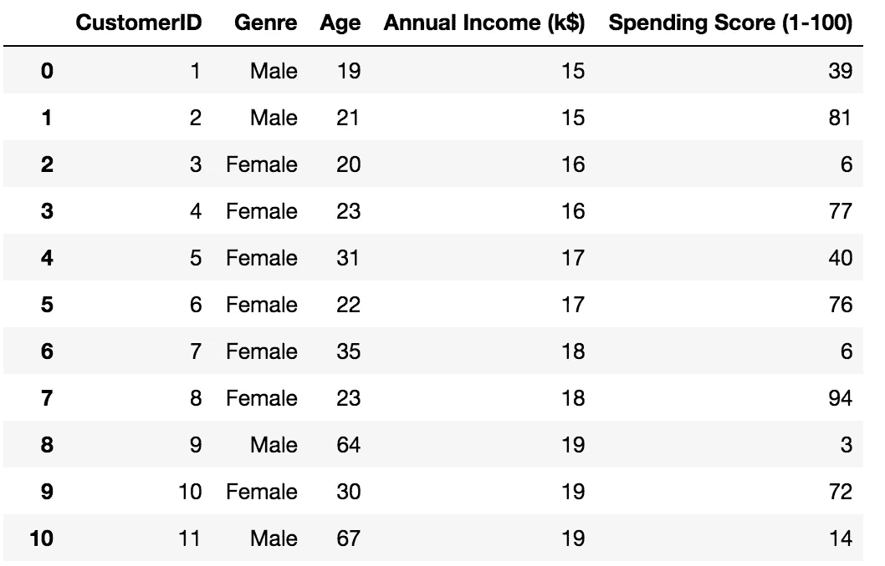

如果你想跟进，你可以从 *superdatascience* 网站获得数据集。

[](https://www.superdatascience.com/machine-learning/) [## 机器学习 A-Z:下载实践数据集-超级数据科学-大数据|分析职业生涯…

### 欢迎来到机器学习课程的数据仓库，作者是基里尔·叶列缅科和哈德琳·德·庞特维斯…

www.superdatascience.com](https://www.superdatascience.com/machine-learning/) 

为了稍后在图表上显示我们的数据，我们只能取两个变量(年收入和支出分数)。

```
dataset = pd.read_csv('./data.csv')

X = dataset.iloc[:, [3, 4]].values
```

查看树状图，不与任何集群相交的最高垂直距离是中间的绿色。假设有 5 条垂直线穿过阈值，则最佳聚类数是 5。

```
dendrogram = sch.dendrogram(sch.linkage(X, method='ward'))
```

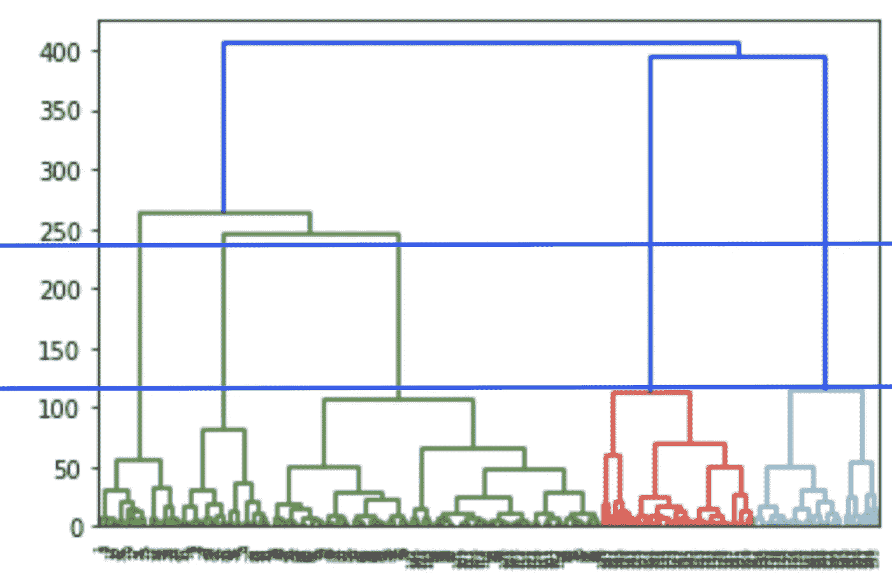

我们创建了一个实例`AgglomerativeClustering`,使用欧几里得距离作为点之间距离的度量，并使用 ward 连接来计算聚类的邻近度。

```
model = AgglomerativeClustering(n_clusters=5, affinity='euclidean', linkage='ward')
model.fit(X)
labels = model.labels_
```

属性返回一个整数数组，其中的值对应于不同的类别。

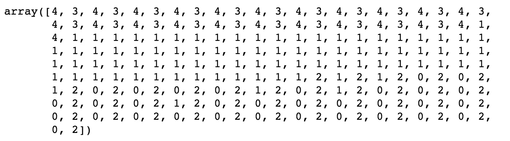

我们可以使用简写符号将属于某一类别的所有样本显示为特定的颜色。

```
plt.scatter(X[labels==0, 0], X[labels==0, 1], s=50, marker='o', color='red')
plt.scatter(X[labels==1, 0], X[labels==1, 1], s=50, marker='o', color='blue')
plt.scatter(X[labels==2, 0], X[labels==2, 1], s=50, marker='o', color='green')
plt.scatter(X[labels==3, 0], X[labels==3, 1], s=50, marker='o', color='purple')
plt.scatter(X[labels==4, 0], X[labels==4, 1], s=50, marker='o', color='orange')
plt.show()
```

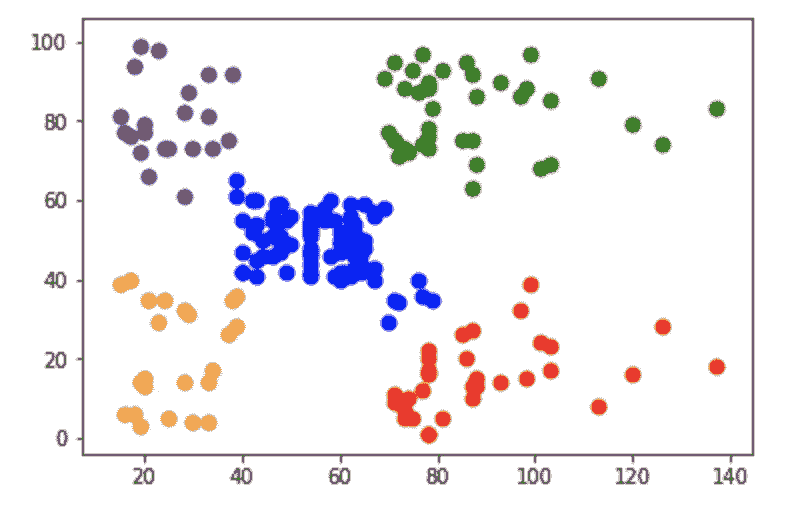