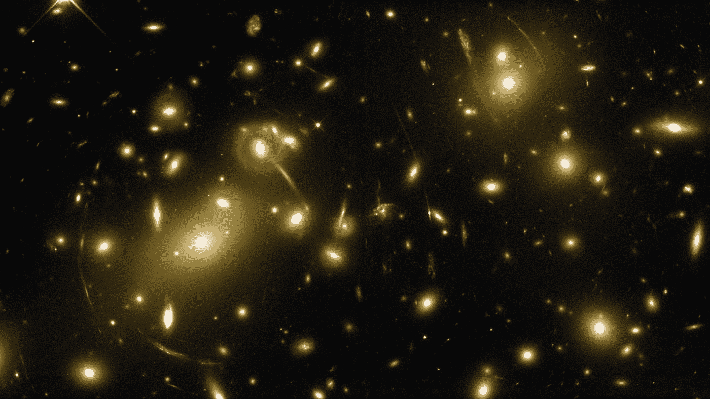
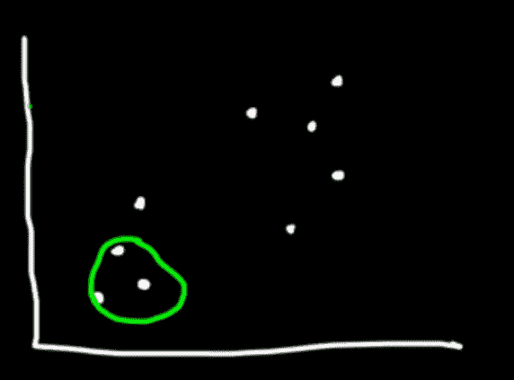
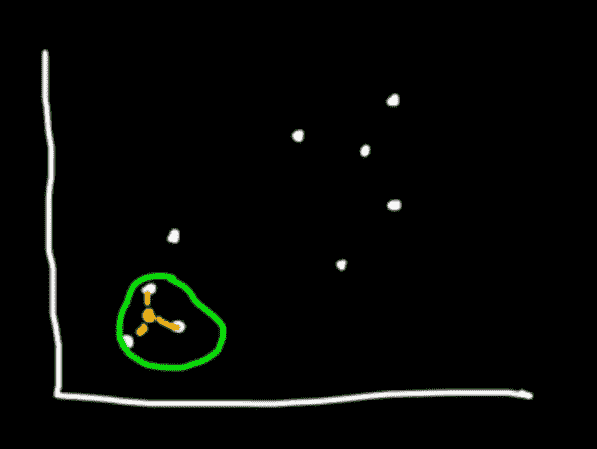
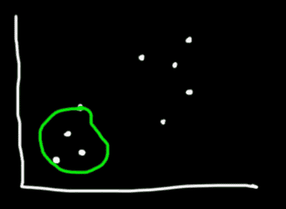
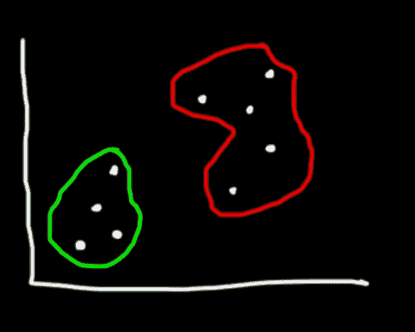
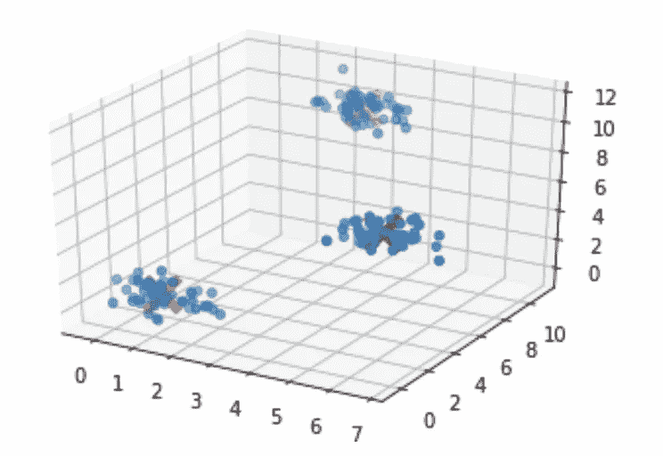

# Python 中的均值漂移聚类算法示例

> 原文：<https://towardsdatascience.com/machine-learning-algorithms-part-13-mean-shift-clustering-example-in-python-4d6452720b00?source=collection_archive---------12----------------------->



均值漂移是一种分层聚类算法。与有监督的机器学习算法相比，聚类试图在没有首先对标记数据进行训练的情况下对数据进行分组。聚类被广泛应用于搜索引擎、学术排名和医学等领域。与 K-Means 相反，当使用 Mean Shift 时，您不需要事先知道类别(聚类)的数量。均值漂移的缺点是计算量很大——O(n)。

# 它是如何工作的

1.  定义一个窗口(内核的带宽)并将该窗口放置在一个数据点上



2.计算窗口中所有点的平均值



3.将窗口的中心移动到平均值的位置



4.重复步骤 2 和 3，直到收敛



# python 中的示例

让我们看看如何使用 python 中的均值漂移算法来标注数据。

```
import numpy as np
import pandas as pd
from sklearn.cluster import MeanShift
from sklearn.datasets.samples_generator import make_blobs
from matplotlib import pyplot as plt
from mpl_toolkits.mplot3d import Axes3D
```

我们使用`make_blobs`方法生成自己的数据。

```
clusters = [[1,1,1],[5,5,5],[3,10,10]]
X, _ = make_blobs(n_samples = 150, centers = clusters, cluster_std = 0.60)
```

在训练模型之后，我们存储聚类中心的坐标。

```
ms = MeanShift()
ms.fit(X)
cluster_centers = ms.cluster_centers_
```

最后，我们在 3D 图形中绘制数据点和质心。

```
fig = plt.figure()
ax = fig.add_subplot(111, projection='3d')ax.scatter(X[:,0], X[:,1], X[:,2], marker='o')ax.scatter(cluster_centers[:,0], cluster_centers[:,1], cluster_centers[:,2], marker='x', color='red', s=300, linewidth=5, zorder=10)plt.show()
```

