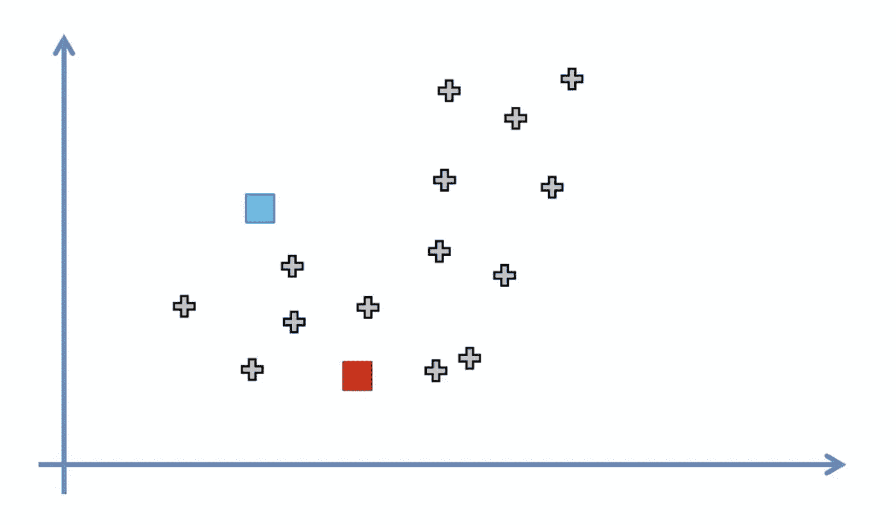
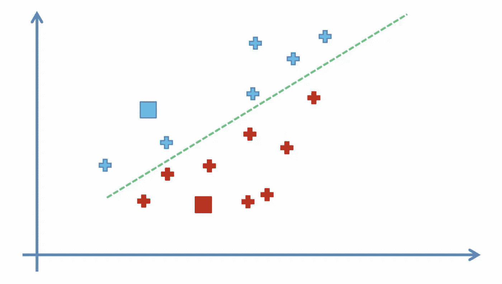
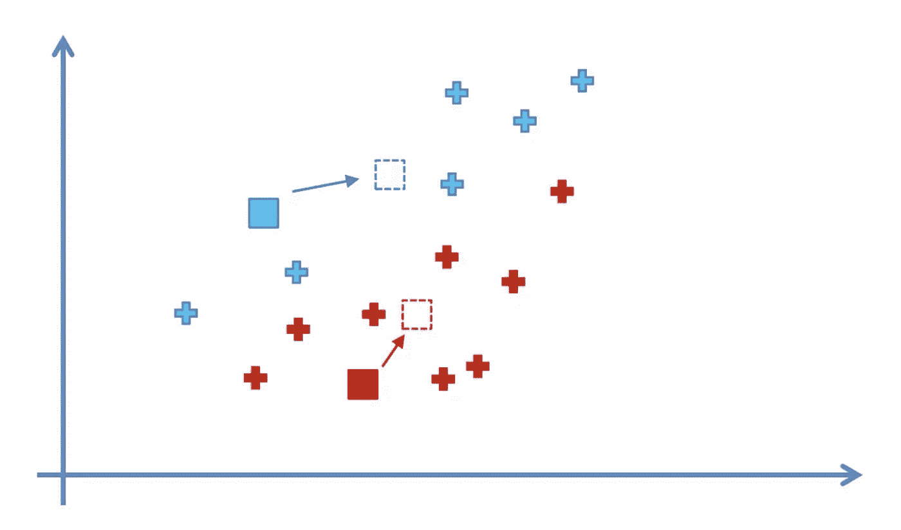
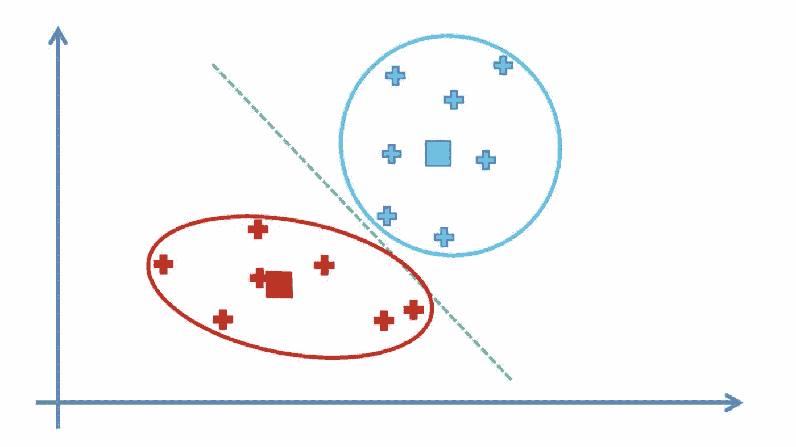
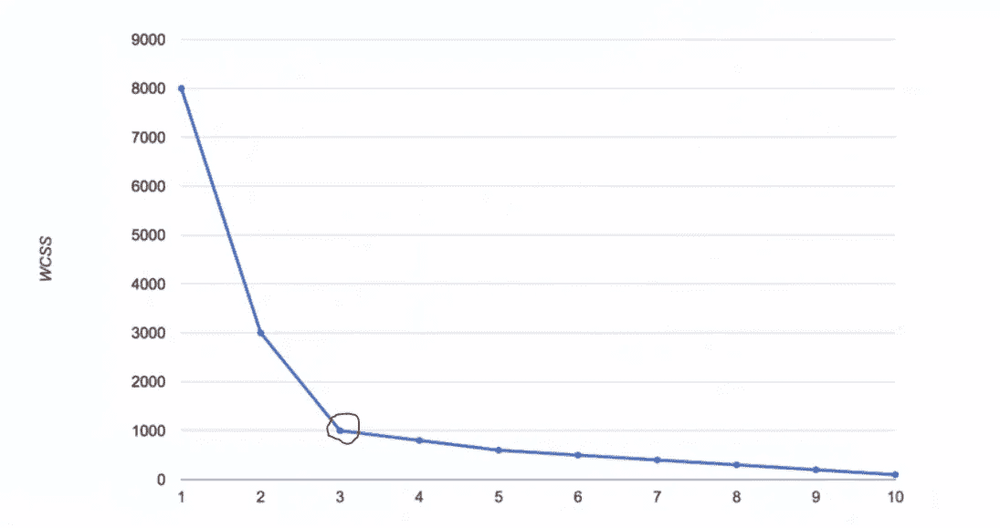
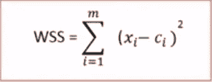
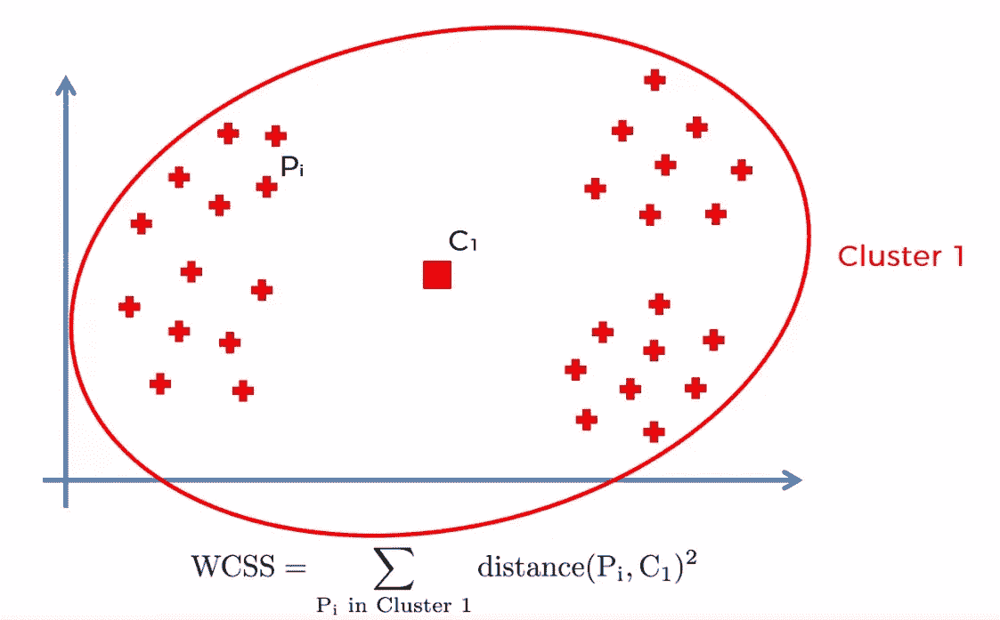
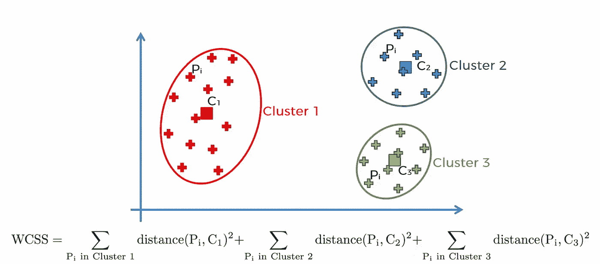
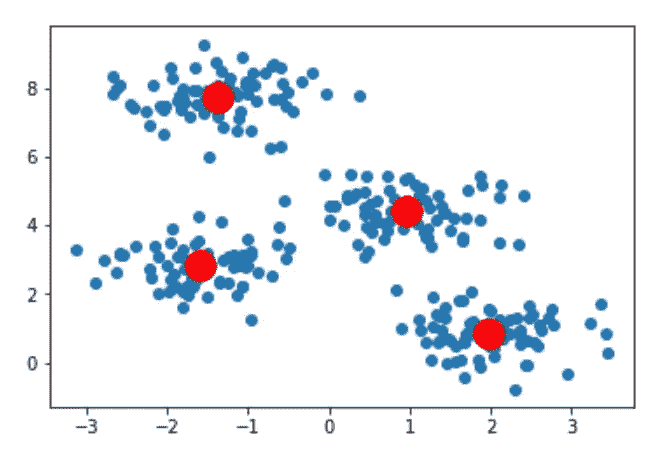

# K-means 聚类 Python 示例

> 原文：<https://towardsdatascience.com/machine-learning-algorithms-part-9-k-means-example-in-python-f2ad05ed5203?source=collection_archive---------0----------------------->


K-Means 聚类是一种无监督的机器学习算法。与传统的监督机器学习算法相比，K-Means 试图在没有首先用标记数据训练的情况下对数据进行分类。一旦运行了算法并定义了组，任何新数据都可以很容易地分配到最相关的组。

K-Means 的实际应用包括:

*   客户特征分析
*   市场分割
*   计算机视觉
*   搜索引擎
*   天文学

# 它是如何工作的

1.  选择 **K** (即 2) 个随机点作为称为质心的聚类中心



2.通过计算每个数据点相对于每个质心的距离，将每个数据点分配给最近的聚类



3.通过计算指定点的平均值来确定新的聚类中心



4.重复第 2 步和第 3 步，直到集群分配没有任何变化



# 选择正确的集群数量

通常情况下，您要处理的数据会有多个维度，因此很难可视化。因此，最佳聚类数不再明显。幸运的是，我们有办法从数学上确定这一点。

我们绘制了聚类数和聚类平方和(WCSS)之间的关系，然后我们选择了 WCSS 变化开始变平的聚类数(肘形法)。



WCSS 被定义为集群的每个成员与其质心之间的平方距离之和。



例如，为图 1 的*计算的 WCSS 将大于为图 2* 的*计算的 WCSS。*



Figure 1



Figure 2

# 密码

让我们看看如何使用 python 的 K-Means 算法对数据进行分类。和往常一样，我们需要从导入所需的库开始。

```
import numpy as np
import pandas as pd
from matplotlib import pyplot as plt
from sklearn.datasets.samples_generator import make_blobs
from sklearn.cluster import KMeans
```

在本教程中，我们将使用来自`sklearn.datasets`模块的`make_blobs`函数生成我们自己的数据。`centers`参数指定了集群的数量。

```
X, y = make_blobs(n_samples=300, centers=4, cluster_std=0.60, random_state=0)plt.scatter(X[:,0], X[:,1])
```


即使我们已经知道了最佳的集群数量，我认为我们仍然可以从使用**肘方法**来确定它中获益。为了获得图表中使用的值，我们使用不同数量的分类来训练多个模型，并且每次都存储`intertia_`属性(WCSS)的值。

```
wcss = []for i in range(1, 11):
    kmeans = KMeans(n_clusters=i, init='k-means++', max_iter=300, n_init=10, random_state=0)
    kmeans.fit(X)
    wcss.append(kmeans.inertia_)
plt.plot(range(1, 11), wcss)
plt.title('Elbow Method')
plt.xlabel('Number of clusters')
plt.ylabel('WCSS')
plt.show()
```


接下来，我们将使用上一步中确定的最佳聚类数(4)对数据进行分类。`k-means++`确保你得到的东西不会落入随机初始化陷阱。

```
kmeans = KMeans(n_clusters=4, init='k-means++', max_iter=300, n_init=10, random_state=0)
pred_y = kmeans.fit_predict(X)plt.scatter(X[:,0], X[:,1])
plt.scatter(kmeans.cluster_centers_[:, 0], kmeans.cluster_centers_[:, 1], s=300, c='red')
plt.show()
```

