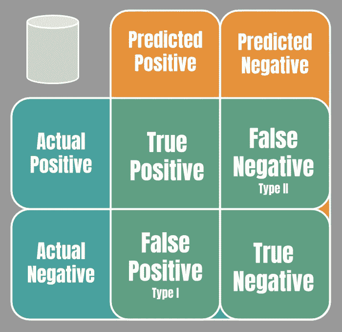
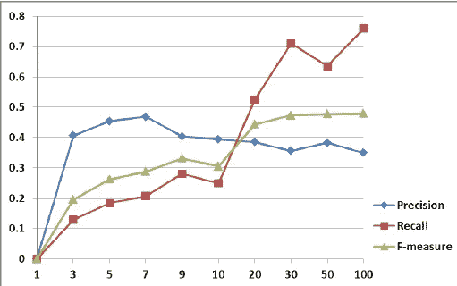

# 机器学习——一个错误，不管它叫什么名字…

> 原文：<https://towardsdatascience.com/machine-learning-an-error-by-any-other-name-a7760a702c4d?source=collection_archive---------1----------------------->

在计算机科学和人工智能取得巨大进步的时代，人们很容易忘记模型本身并不完美。最令人头疼的问题之一是如何衡量一个模型相对于已知事实的准确性。

第一步是理解错误的代价。你宁愿错误地猜测某事是真的，而事实并非如此，还是根本不去猜测。有时，失去一个客户比花时间留住他们更便宜，或者相反，那些可能没有得病的人接种疫苗的成本比疾病的潜在传播成本更便宜。这种成本/收益分析将告知用于确定出错概率的方法。

## 假设的重要性

建模最重要的部分是从一个有意义的问题开始。出于本能，我们会提出一个问题，作为对某事的肯定，比如“飞机座位之间的空间正在缩小。”然而，最好的统计实践是创建一个像“座位之间的距离保持不变”这样的无效假设(也经常被称为 H0)，然后试图证明它是错误的。

这提供了无罪推定的统计版本，有助于消除随机性的影响。如果零假设在统计学上被证明是不成立的，那么另一个假设(被称为 H1)将被重新审视，航空公司的萎缩趋势现在被认为是一个可能但不确定的解释。

重要的是要注意，零假设并不完全与替代假设相反，而是验证观察结果的原因不仅仅是随机的。

# 概率和 P 值

概率提供了一种解释模型统计强度的通用方法。称为 p 值，范围从 0 到 1，表示如果零假设(H1)为真，得到结果的可能性有多大。这意味着值越低，替代假设(H1)实际上是正确的指示就越好。

p 值的阈值称为显著性水平。如果概率等于或小于 0.05(尽管取决于可能改变的用例)，那么结果通常被认为是显著的。更简单地说，我们很可能 100 次中有 5 次证实了零假设(或者相反，100 次中有 95 次证实了另一个假设)。p 值越高，越接近随机机会，越有可能出现零假设。

# 分类问题中的误差度量

分类问题通常是二元识别，确定一个观察值是否是某个条件。任何分类模型都有四种类型的结果。

**真阳性(TP)**-真阳性测试结果是指当条件存在时检测到该条件。

**假阳性(FP)**-也称为**I 型错误**，假阳性测试结果是在条件不存在时检测到的条件。

**假阴性(FN)**-也称为**II 型错误**，假阴性测试结果是指当条件存在时没有检测到条件。

**真阴性(TN)** -真阴性测试结果是指当条件不存在时，没有检测到条件。

根据这四种状态，用不同的比率和公式计算误差。很容易看出，根据类型 I 或类型 II 的成本，测量误差的方法可以调整。

# 测量误差

为了理解模型是如何执行的，有多种方法来衡量各种条件的相互作用。一个[**混淆矩阵**](https://en.wikipedia.org/wiki/Confusion_matrix) (是的，确实是这么叫的)用于呈现多种类型的误差测量，以便数据科学家可以确定模型是否表现良好。下面我们将介绍以下类型的误差测量:

*   特异性或真阴性率(TNR)
*   精确度，阳性预测值(PPV)
*   回忆、敏感度、命中率或真阳性率(TPR)
*   f 测量(F1，F0.5，F2)
*   马修相关系数
*   ROC 面积(ROC AUC)
*   辐射、假阳性率(FPR)
*   决定系数
*   均方根误差(RMSE)
*   平均绝对误差

# 特异性或真阴性率(TNR)

TNR(范围从 0 到 1，越高越好)测量被正确识别为阴性的比例(例如，被正确识别为没有该状况的健康人的百分比)。

> TNR = TN/(TN+FP)

如果缺失负值的成本很高，这是一个很好的衡量标准。

# 精确度，阳性预测值(PPV)

PPV(范围从 0 到 1，越高越好)是真阳性与所有真阳性和假阳性的比率:

> PPV = TP/(TP+FP)

高精度意味着算法返回的相关结果比不相关的结果多得多，换句话说，它返回的所有结果越有可能是正确的，但这并不意味着它可能会得到所有正确的结果。

同样，这也可以用负预测值(NPV)来完成，将正预测值转换为负预测值，并进行计算以确定负预测值的精度。NPV 的补充是错误遗漏率(FOR)。

# 回忆、敏感度、命中率或真阳性率(TPR)

TPR(范围从 0 到 1，越高越好)是真阳性与真阳性和假阴性之和的比率:

> TPR = TP / (TP+FN)

高召回率意味着一个算法返回了大部分相关结果，但它可能会有一堆错误的返回，就像一张拖网，它肯定会抓住你想要的鱼，但也会抓住一堆你不想要的鱼。

# f 测度

F Measure(范围从 0 到 1)是描述精确度(PPV)和召回率(TPR)之间平衡的比率。使用调和平均值，它可以描述一个模型向某个方向倾斜的程度。

> F = (PPV*TPR)/(PPV+TPR)
> 
> 或者
> 
> F = 2TP/(2TP+FP+FN)

最常见的称为 F1，而另外两种常用的 F 度量是 F2 度量和 F0.5 度量，F2 度量的权重召回率高于召回率，F 0.5 度量的权重召回率高于召回率。

# **马修相关系数(MCC)**

MCC(范围从-1 到 1)是生物化学家 Brian W. Matthews 在 1975 年提出的。MCC 本质上是观察到的和预测的二元分类之间的相关系数。系数+1 代表完美的预测，0 等于不比随机预测好，1 表示预测和观察完全不一致。这通常被表示为关联热图，就像这里一样，并允许快速观察哪些功能是有用的(进一步深入阅读[这里](https://www.datascience.com/blog/introduction-to-correlation-learn-data-science-tutorials)关于所有类型的关联)。

> MCC =(TP * TN—FP * FN)/Sqr(FT+FP)(TN+FP)(TN+FN)

0.05+的值可用作模型的特征，在某些情况下，负相关也是有用的。

# **ROC 面积(ROC** AUC **)**

ROC 或“接收机工作特性”(范围从 0 到 1，越高越好)最初用于第二次世界大战中的雷达目标探测。ROC 面积是通过绘制 TPR 和 FPR 之间的比率而产生的曲线下面积的度量，值范围从 1-.8 是很好，0.8-. 6 是一般差，低于 0.8 不是好于随机机会。

最近，由于结果的嘈杂和不一致，使用 ROC 的有效性受到质疑(几篇论文的一个例子是[这里是](https://www.ncbi.nlm.nih.gov/pmc/articles/PMC4356897/))。

# 辐射、假阳性率(FPR)

FPR(范围从 0 到 1，越低越好)是被错误分类为阳性(假阳性)的阴性事件数与实际阴性事件总数之间的比率。

> FDR = FP/(FP+TN)

与上面的许多错误率不同，值越高越糟糕，因为这意味着识别出的假阴性越多。

# 精确度(ACC)

精确度(范围从 0 到 1，越高越好)就是正确预测的观测值与总观测值的比率。

ACC = (TP+TN)/(TP+FP+FN+TN)

人们本能地认为准确性是一个很好的衡量标准，但它实际上很少告诉你什么是假阳性和假阴性。

# 回归和误差方法

与上面的分类问题不同，回归不产生二进制绝对值，而是产生一个数值范围。理想情况下，算法应该是稳定的，尽管这意味着很大程度上取决于具体情况。

# r，决定系数

决定系数(范围从 0 到 1，越大越好)，通常也称为 R 或 R，是使用普通最小二乘回归时数据与回归拟合程度的比例。

根据具体情况，有多个优化版本的 R 可供使用。R 的性质意味着变量的加入，不管有用与否，总会增加它的值。在这些情况下，可以使用调整后的 R。

# 均方根误差(RMSE)

RMSE(范围从 0 到无穷大，越低越好)，也称为均方根偏差(RMSD)，是一种基于平方的规则，用于测量误差的绝对平均幅度。从技术上来说，它是通过取残差(回归模型和实际数据之间的差异)，平方它，平均所有结果，然后取平均值的平方根而产生的。因此，乘积总是正数。

因为值是在平均值之前平方的，较大误差的影响(想想 3 对 8 的结果)被极大地放大了，并且应该被用来识别那些类型的误差是很重要的([这](https://medium.com/human-in-a-machine-world/mae-and-rmse-which-metric-is-better-e60ac3bde13d)是一篇很好的文章，详细解释了很多)。

为了在不同尺度的模型之间进行比较，RMSD 可以通过平均值或范围进行归一化。它通常用百分数来表示，并用 NRMSD 或 NRMSE 来表示。

# 平均绝对误差

MAE(范围从 0 到无穷大，越低越好)与 RMSE 非常相似，但它不是对残差的差求平方并取结果的平方根，而是对残差的绝对差求平均值。这只会产生正数，对较大的误差反应较小，但可以更好地显示细微差别。随着时间的推移，它也失宠了。

# 摘要

了解如何衡量误差可以帮助你判断什么时候事情好得不像真的，或者它是否真的有效。在将这些放在一起时，我个人意识到我需要探索的下一件事是规范化以及它如何影响错误识别。记住，在创建识别错误的方法之前，要考虑错误的代价，否则它会让你追逐蝴蝶，而不是识别正确的优化。

考虑到任何模型都是针对其接受训练的数据进行高度优化的。预计新数据的错误率将*总是*高于训练集的错误率。

这远不是全面的误差测量列表，去探索吧！

其他链接:

 [## 模型精度

### 模型精度通常通过测量拟合质量(通常是均方误差)来评估。

medium.com](https://medium.com/@FranklynZhu/model-accuracy-3f374f242d93)  [## 混淆矩阵术语简单指南

### 混淆矩阵是一个表格，通常用于描述分类模型(或“分类器”)的性能

www.dataschool.io](http://www.dataschool.io/simple-guide-to-confusion-matrix-terminology/)  [## 精确测量模型预测误差

### 在评估模型的质量时，能够准确测量其预测误差是非常重要的…

scott.fortmann-roe.com](http://scott.fortmann-roe.com/docs/MeasuringError.html)  [## 评估机器学习中的模型性能

### 本文演示了如何在 Azure Machine Learning Studio 中评估模型的性能，并提供了一个

docs.microsoft.com](https://docs.microsoft.com/en-us/azure/machine-learning/studio/evaluate-model-performance)  [## 什么是假设检验？- Minitab

### 假设检验检验关于总体的两种相反的假设:零假设和备择假设。

support.minitab.com](https://support.minitab.com/en-us/minitab/18/help-and-how-to/statistics/basic-statistics/supporting-topics/basics/what-is-a-hypothesis-test/)